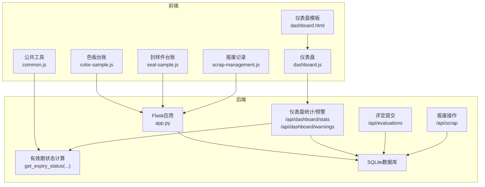
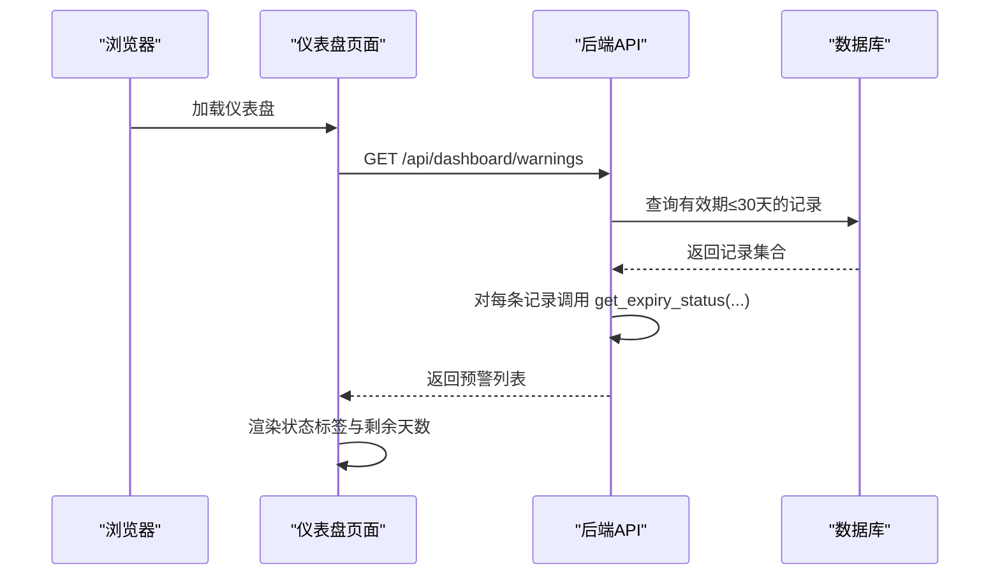
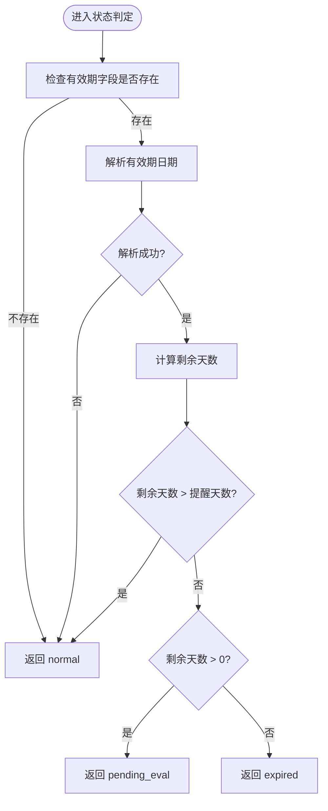
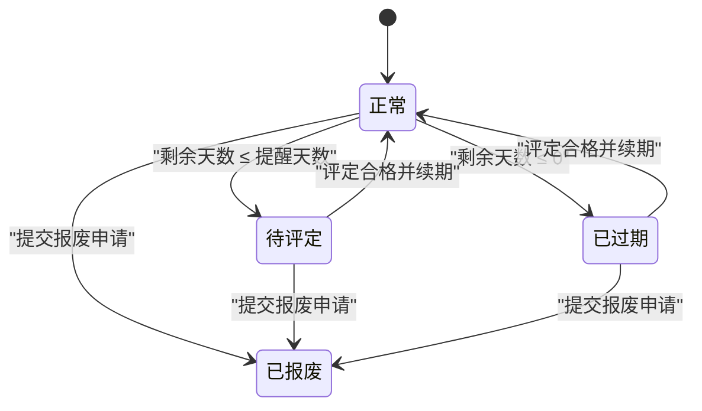
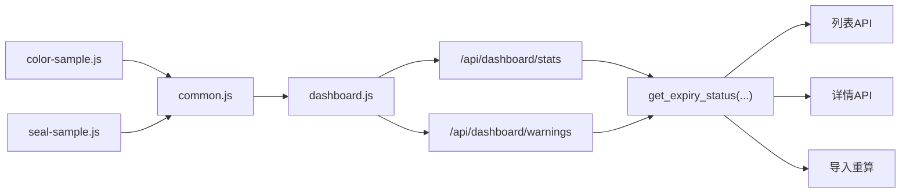

# 状态管理机制

<cite>
**本文引用的文件**
- [app.py](file://app.py)
- [dashboard.js](file://static/js/dashboard.js)
- [common.js](file://static/js/common.js)
- [color-sample.js](file://static/js/color-sample.js)
- [seal-sample.js](file://static/js/seal-sample.js)
- [scrap-management.js](file://static/js/scrap-management.js)
- [dashboard.html](file://templates/dashboard.html)
</cite>

## 目录
1. [简介](#简介)
2. [项目结构](#项目结构)
3. [核心组件](#核心组件)
4. [架构总览](#架构总览)
5. [详细组件分析](#详细组件分析)
6. [依赖分析](#依赖分析)
7. [性能考虑](#性能考虑)
8. [故障排查指南](#故障排查指南)
9. [结论](#结论)
10. [附录](#附录)

## 简介
本文件系统性阐述封样件及色板接收登记管理系统的“有效期状态”管理机制，覆盖以下要点：
- 有效期状态的四种类型及其判定逻辑：正常(normal)、待评定(pending_eval)、已过期(expired)、已报废(scrapped)
- get_expiry_status 函数的实现细节：到期前提醒天数配置、日期计算逻辑、异常处理
- 状态转换的触发条件与流转路径：有效期临近自动从正常转为待评定，过期后自动转为已过期，报废申请通过后转为已报废
- 状态在各模块中的作用：仪表盘预警展示、报表统计、库存控制等
- 最佳实践与扩展建议：如何自定义状态规则与添加新的状态类型

## 项目结构
系统采用前后端分离的Flask架构，前端通过静态JS模块调用后端REST API，后端负责业务逻辑与状态计算。

图表来源
- [app.py](file://app.py)
- [dashboard.js](file://static/js/dashboard.js)
- [common.js](file://static/js/common.js)
- [color-sample.js](file://static/js/color-sample.js)
- [seal-sample.js](file://static/js/seal-sample.js)
- [scrap-management.js](file://static/js/scrap-management.js)
- [dashboard.html](file://templates/dashboard.html)

章节来源
- [app.py](file://app.py)
- [dashboard.js](file://static/js/dashboard.js)
- [common.js](file://static/js/common.js)
- [color-sample.js](file://static/js/color-sample.js)
- [seal-sample.js](file://static/js/seal-sample.js)
- [scrap-management.js](file://static/js/scrap-management.js)
- [dashboard.html](file://templates/dashboard.html)

## 核心组件
- 状态计算函数：get_expiry_status(expiry_date_str, remind_days=30)，用于动态判定有效期状态
- 仪表盘统计与预警：/api/dashboard/stats 与 /api/dashboard/warnings
- 业务API：
  - 评定提交：/api/evaluations（合格续期后状态归为normal）
  - 报废操作：/api/scrap（状态归为scrapped）
- 前端状态展示：common.js 的状态标签映射与仪表盘的预警渲染

章节来源
- [app.py](file://app.py)
- [common.js](file://static/js/common.js)
- [dashboard.js](file://static/js/dashboard.js)

## 架构总览
状态管理贯穿“数据层-业务层-展示层”：
- 数据层：seal_samples、seal_color_samples、seal_evaluation_records、seal_scrapped_samples
- 业务层：get_expiry_status、仪表盘统计/预警、评定/报废流程
- 展示层：前端表格、仪表盘、状态标签

图表来源
- [app.py](file://app.py)
- [dashboard.js](file://static/js/dashboard.js)
- [common.js](file://static/js/common.js)

## 详细组件分析

### 状态类型与判定逻辑
- 正常(normal)：有效期剩余天数大于提醒天数（默认30天）
- 待评定(pending_eval)：有效期剩余天数在(0, 提醒天数]区间
- 已过期(expired)：有效期剩余天数≤0
- 已报废(scrapped)：通过报废流程将状态强制置为已报废

图表来源
- [app.py](file://app.py)

章节来源
- [app.py](file://app.py)

### get_expiry_status 函数实现与配置
- 输入参数
  - expiry_date_str：有效期字符串或日期对象
  - remind_days：到期前提醒天数，默认30天
- 关键行为
  - 类型安全：将提醒天数转换为整数，异常时回退为30
  - 有效性校验：若有效期为空，直接返回 normal
  - 日期解析：支持字符串或日期对象；异常时返回 normal
  - 状态判定：基于剩余天数与提醒天数的比较
- 异常处理：捕获所有异常并记录告警日志，最终返回 normal

章节来源
- [app.py](file://app.py)

### 状态转换规则与触发条件
- 正常 → 待评定：有效期剩余天数≤提醒天数（默认30天）
- 正常 → 已过期：有效期剩余天数≤0
- 待评定/已过期 → 正常：通过“评定提交”且结果为合格，更新有效期后状态归为 normal
- 已报废：通过“报废操作”将状态置为 scrapped；管理员可恢复或永久删除

图表来源
- [app.py](file://app.py)

章节来源
- [app.py](file://app.py)

### 仪表盘的预警与统计
- 统计接口：/api/dashboard/stats
  - 计算封样件总数、色板总数、已报废总数
  - 待评定数：有效期剩余天数≤30天（含已过期）且未报废
- 预警接口：/api/dashboard/warnings
  - 返回有效期剩余天数≤30天的记录列表，按剩余天数升序排列
  - 前端根据剩余天数与状态进行样式区分（如“已过期”“待评定”）

章节来源
- [app.py](file://app.py)
- [dashboard.js](file://static/js/dashboard.js)
- [dashboard.html](file://templates/dashboard.html)

### 前端状态展示与交互
- 状态标签映射：common.js 的 getStatusTag 将内部状态映射为中文标签与样式
- 仪表盘渲染：dashboard.js 根据预警数据渲染状态标签、剩余天数与操作按钮
- 台账页面：色板/封样件页面在表格中展示状态标签，并在特定状态下显示“评定”按钮

章节来源
- [common.js](file://static/js/common.js)
- [dashboard.js](file://static/js/dashboard.js)
- [color-sample.js](file://static/js/color-sample.js)
- [seal-sample.js](file://static/js/seal-sample.js)

### 报废与评定流程对状态的影响
- 评定提交
  - 合格：更新有效期并状态归为 normal
  - 不合格：不改变有效期，后续可通过报废流程处理
- 报废操作
  - 将状态置为 scrapped
  - 管理员可恢复（回滚旧状态）或永久删除（清理相关记录）

章节来源
- [app.py](file://app.py)

## 依赖分析
- 后端依赖
  - get_expiry_status 在多个API中被调用：列表查询、详情查询、导入重算等
  - 仪表盘统计/预警依赖 get_expiry_status 与数据库查询
- 前端依赖
  - dashboard.js 依赖 /api/dashboard/stats 与 /api/dashboard/warnings
  - common.js 提供状态标签映射与日期计算工具
  - 各台账页面依赖 common.js 的状态标签与工具函数

图表来源
- [app.py](file://app.py)
- [dashboard.js](file://static/js/dashboard.js)
- [common.js](file://static/js/common.js)
- [color-sample.js](file://static/js/color-sample.js)
- [seal-sample.js](file://static/js/seal-sample.js)

章节来源
- [app.py](file://app.py)
- [dashboard.js](file://static/js/dashboard.js)
- [common.js](file://static/js/common.js)
- [color-sample.js](file://static/js/color-sample.js)
- [seal-sample.js](file://static/js/seal-sample.js)

## 性能考虑
- 状态计算复杂度
  - get_expiry_status 为O(1)操作，涉及字符串解析与日期计算
  - 仪表盘统计对两类台账表进行扫描，复杂度为 O(N+M)，其中N、M分别为封样件与色板记录数
- 建议
  - 若记录规模扩大，可在有效期字段上建立索引以优化扫描
  - 对导入重算与批量更新，建议分批处理并异步执行，避免阻塞请求

## 故障排查指南
- 现象：状态始终显示为“正常”
  - 可能原因：有效期字段为空或格式异常；提醒天数解析失败回退为默认值
  - 排查步骤：检查数据库中有效期与提醒天数字段；确认前端传参
- 现象：仪表盘未显示预警
  - 可能原因：剩余天数计算异常；数据库查询条件未命中
  - 排查步骤：核对 /api/dashboard/warnings 的查询逻辑与 get_expiry_status 的判定边界
- 现象：报废后仍可进行寄出操作
  - 可能原因：寄出接口未严格校验状态
  - 排查步骤：检查 /api/send-records 的创建逻辑，确保对状态进行限制

章节来源
- [app.py](file://app.py)
- [dashboard.js](file://static/js/dashboard.js)

## 结论
本系统通过统一的 get_expiry_status 与明确的状态转换规则，实现了有效期状态的自动化管理。结合仪表盘预警、报表统计与台账控制，形成闭环的状态治理机制。通过合理的扩展点（如自定义提醒天数、新增状态类型），可进一步满足业务演进需求。

## 附录

### 状态在模块中的作用
- 仪表盘
  - 预警展示：按剩余天数排序，区分“待评定”“已过期”
  - 统计卡片：封样件/色板总数、待评定数、已报废数
- 报表统计
  - 仪表盘统计接口聚合各类状态指标
- 库存控制
  - 寄出接口对“正常”状态的色板进行数量校验与扣减

章节来源
- [app.py](file://app.py)
- [dashboard.js](file://static/js/dashboard.js)
- [color-sample.js](file://static/js/color-sample.js)
- [seal-sample.js](file://static/js/seal-sample.js)

### 最佳实践与扩展指导
- 自定义提醒天数
  - 在创建/更新封样件与色板时，合理设置“提醒天数”，以平衡预警及时性与误报率
- 添加新的状态类型
  - 在数据库表中增加状态字段枚举值，并在后端与前端同步扩展状态映射与渲染逻辑
- 扩展判定规则
  - 可在 get_expiry_status 中引入更多参数（如业务类型、历史记录等）以细化判定
- 审计与回滚
  - 评定与报废记录均保留旧值，便于审计与回滚；管理员可对处置记录进行软删除/恢复/永久删除

章节来源
- [app.py](file://app.py)
- [common.js](file://static/js/common.js)