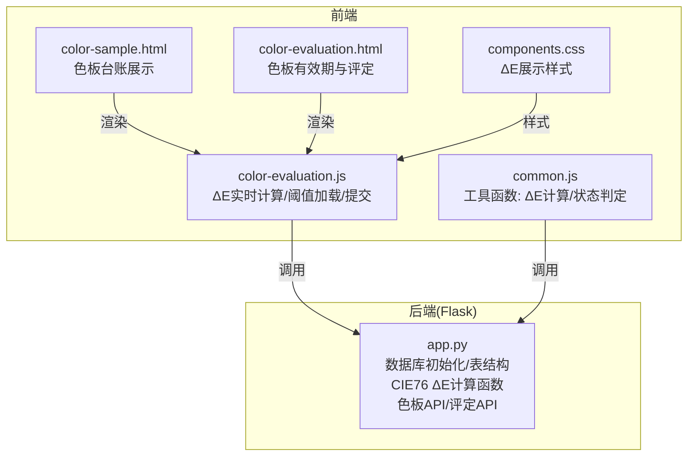
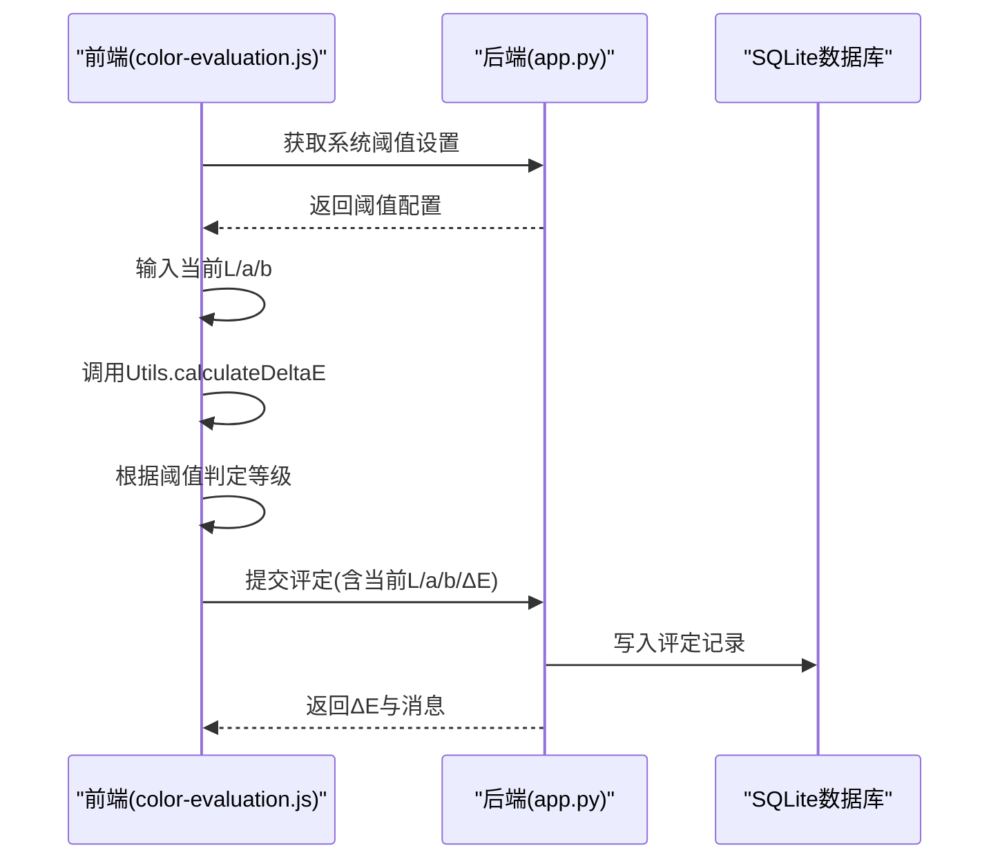
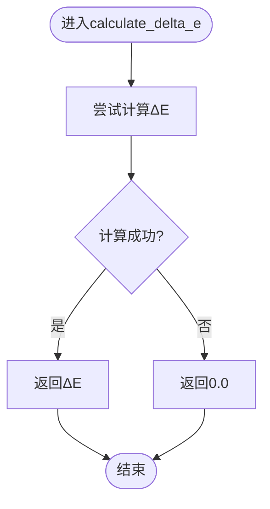
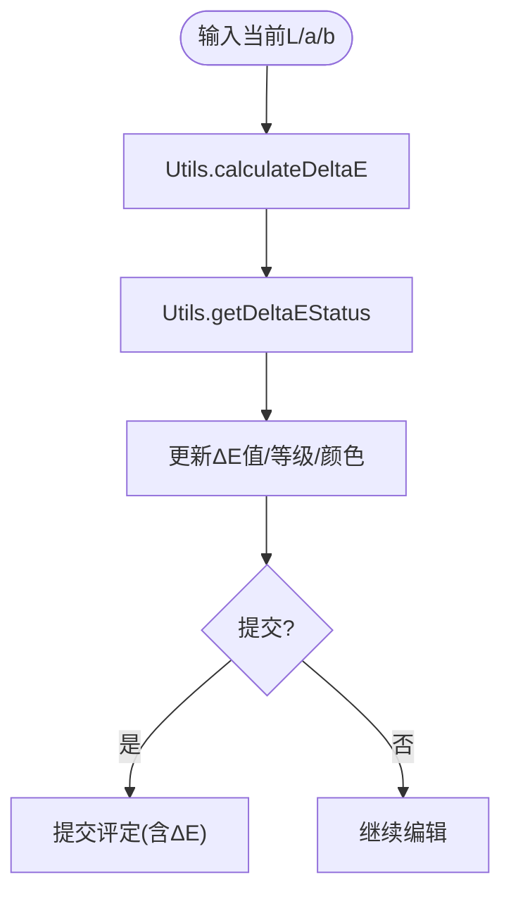
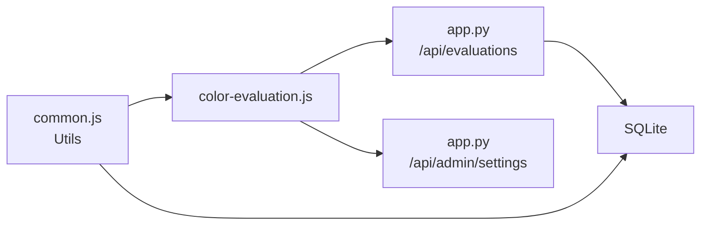

# 色差计算算法

<cite>
**本文引用的文件**
- [app.py](file://app.py)
- [common.js](file://static/js/common.js)
- [color-evaluation.js](file://static/js/color-evaluation.js)
- [color-sample.html](file://templates/color-sample.html)
- [color-evaluation.html](file://templates/color-evaluation.html)
- [components.css](file://static/css/components.css)
</cite>

## 目录
1. [简介](#简介)
2. [项目结构](#项目结构)
3. [核心组件](#核心组件)
4. [架构总览](#架构总览)
5. [详细组件分析](#详细组件分析)
6. [依赖关系分析](#依赖关系分析)
7. [性能考量](#性能考量)
8. [故障排查指南](#故障排查指南)
9. [结论](#结论)
10. [附录](#附录)

## 简介
本文件面向“封样件及色板接收登记管理系统”，聚焦其中的CIE76 ΔE色差计算算法与前端展示机制。文档将：
- 解释CIE76 ΔE色差公式与Lab色彩空间坐标系
- 深入分析后端calculate_delta_e函数的实现、输入校验与异常处理
- 说明色差阈值设置系统与等级判定逻辑
- 描述色差在色板管理中的典型应用场景
- 提供前端展示与交互示例，帮助开发者快速集成与优化

## 项目结构
系统采用Flask后端与纯前端JavaScript/CSS的轻量架构，色差计算涉及后端API与前端工具函数协同工作：
- 后端：提供色板台账、有效期管理、评定与报废等API；内置CIE76 ΔE计算函数
- 前端：提供色板评定页面与色板台账页面，实时计算ΔE并展示状态标签

图表来源
- [app.py](file://app.py)
- [color-evaluation.js](file://static/js/color-evaluation.js)
- [common.js](file://static/js/common.js)
- [color-sample.html](file://templates/color-sample.html)
- [color-evaluation.html](file://templates/color-evaluation.html)
- [components.css](file://static/css/components.css)

章节来源
- [app.py](file://app.py)
- [color-evaluation.js](file://static/js/color-evaluation.js)
- [common.js](file://static/js/common.js)
- [color-sample.html](file://templates/color-sample.html)
- [color-evaluation.html](file://templates/color-evaluation.html)
- [components.css](file://static/css/components.css)

## 核心组件
- 后端CIE76 ΔE计算函数：提供稳定的数学实现，支持异常兜底
- 前端工具函数：提供与后端一致的ΔE计算与阈值判定
- 前端页面：色板评定页面负责实时ΔE计算与提交；色板台账页面展示基准值与ΔE结果
- 样式层：通过CSS类名控制ΔE值的颜色与动画状态

章节来源
- [app.py](file://app.py)
- [common.js](file://static/js/common.js)
- [color-evaluation.js](file://static/js/color-evaluation.js)
- [components.css](file://static/css/components.css)

## 架构总览
后端负责：
- 数据模型：色板表包含基准Lab值与ΔE相关字段
- 计算：提供CIE76 ΔE计算函数
- API：色板CRUD、评定提交、系统设置（阈值）

前端负责：
- 页面：色板台账与评定页面
- 交互：实时ΔE计算、阈值加载、提交流程
- 展示：ΔE值与等级标签的视觉反馈

图表来源
- [color-evaluation.js](file://static/js/color-evaluation.js)
- [app.py](file://app.py)

章节来源
- [color-evaluation.js](file://static/js/color-evaluation.js)
- [app.py](file://app.py)

## 详细组件分析

### 数学原理：CIE76 ΔE与Lab色彩空间
- Lab色彩空间
  - L：明度轴，范围约0–100
  - a：从绿色到红色的横向轴
  - b：从蓝色到黄色的纵向轴
- ΔE（CIE76）
  - 公式：ΔE = sqrt[(ΔL)² + (Δa)² + (Δb)²]
  - 其中 ΔL = 当前L − 基准L，Δa = 当前a − 基准a，Δb = 当前b − 基准b
  - ΔE越小，色差越小，越接近基准

章节来源
- [app.py](file://app.py)
- [common.js](file://static/js/common.js)

### 后端实现：calculate_delta_e函数
- 函数位置与签名：位于后端主应用文件中，提供CIE76 ΔE计算
- 输入参数
  - 基准值：baseline_L, baseline_a, baseline_b
  - 当前值：current_L, current_a, current_b
- 实现要点
  - 平方和开方：直接套用CIE76公式
  - 异常处理：捕获异常并返回0.0，避免前端/流程中断
  - 精度控制：后端在写入评定记录时对ΔE保留4位小数
- 适用场景
  - 评定提交时自动计算ΔE并写入记录
  - 导入数据时按ΔL/Δa/Δb补算ΔE

图表来源
- [app.py](file://app.py)

章节来源
- [app.py](file://app.py)

### 前端实现：Utils.calculateDeltaE与阈值判定
- 工具函数
  - 与后端一致的ΔE计算逻辑
  - getDeltaEStatus：基于阈值返回等级、标签与CSS类名
- 阈值来源
  - 默认阈值：优秀(≤1.0)、合格(≤2.0)、需关注(>2.0)
  - 可通过系统设置接口动态加载，覆盖默认值
- 实时预览
  - 在色板评定页面，输入当前L/a/b后实时计算ΔE与等级
  - 展示ΔL/Δa/Δb差值与阈值说明

图表来源
- [common.js](file://static/js/common.js)
- [color-evaluation.js](file://static/js/color-evaluation.js)

章节来源
- [common.js](file://static/js/common.js)
- [color-evaluation.js](file://static/js/color-evaluation.js)

### 色差阈值设置系统
- 预置阈值
  - 优秀阈值：≤1.0
  - 合格阈值：≤2.0
  - 需关注阈值：>2.0
- 设置持久化
  - 存储于系统设置表，键分别为delta_e_excellent、delta_e_good、delta_e_warning
- 前端加载
  - 页面初始化时拉取系统设置，覆盖默认阈值
- 等级判定
  - 优秀：ΔE < 优秀阈值
  - 合格：ΔE < 合格阈值
  - 需关注：ΔE ≥ 合格阈值

章节来源
- [app.py](file://app.py)
- [color-evaluation.js](file://static/js/color-evaluation.js)

### 色差在色板管理中的应用场景
- 接收登记时的基准值计算
  - 录入色板时记录基准Lab值（L/a/b），作为后续对比基准
- 日常评估时的对比计算
  - 评定页面输入当前测量值，实时计算ΔE并与阈值对比，决定是否合格续期或报废
- 有效期状态判断中的色差影响
  - 导入时若ΔL/Δa/Δb存在但ΔE为空，则按ΔL/Δa/Δb补算ΔE
  - 有效期状态与ΔE共同影响色板的“待评定/已过期/已报废”状态展示

章节来源
- [app.py](file://app.py)
- [color-evaluation.js](file://static/js/color-evaluation.js)
- [color-sample.html](file://templates/color-sample.html)

### 前端展示与交互示例
- 色板台账页面
  - 展示基准Lab值与ΔE相关字段，便于核对与追溯
- 色板评定页面
  - 实时ΔE计算与等级标签
  - 合格路径：输入当前Lab值，自动计算ΔE并可续期
  - 不合格路径：填写报废原因与类型，执行报废流程
- 样式与动画
  - 优秀：绿色高亮
  - 合格：橙色高亮
  - 需关注：红色高亮并带脉冲动画
  - 阈值说明随阈值动态更新

章节来源
- [color-sample.html](file://templates/color-sample.html)
- [color-evaluation.html](file://templates/color-evaluation.html)
- [components.css](file://static/css/components.css)
- [color-evaluation.js](file://static/js/color-evaluation.js)

## 依赖关系分析
- 后端依赖
  - SQLite：存储色板、评定、报废、系统设置等数据
  - 数学库：用于ΔE计算与数值处理
- 前端依赖
  - utils：统一的ΔE计算与状态判定
  - 页面脚本：色板评定与台账页面
  - 样式：ΔE展示区域的视觉样式

图表来源
- [common.js](file://static/js/common.js)
- [color-evaluation.js](file://static/js/color-evaluation.js)
- [app.py](file://app.py)

章节来源
- [common.js](file://static/js/common.js)
- [color-evaluation.js](file://static/js/color-evaluation.js)
- [app.py](file://app.py)

## 性能考量
- 计算复杂度
  - ΔE计算为O(1)，单次调用开销极低
- 前端交互
  - 实时预览建议节流/防抖，避免频繁计算导致卡顿
- 数据库
  - 导入时批量补算ΔE，注意事务与分批处理以降低锁竞争

## 故障排查指南
- 前端ΔE始终为0或NaN
  - 检查输入是否为有效数字
  - 确认阈值加载成功
- 后端异常兜底
  - 若计算异常，后端返回0.0，检查输入参数类型与范围
- 阈值不生效
  - 确认系统设置接口返回的阈值已覆盖默认值
- 有效期状态异常
  - 导入后可能需要触发重算流程，确保ΔE补算与状态更新

章节来源
- [app.py](file://app.py)
- [common.js](file://static/js/common.js)
- [color-evaluation.js](file://static/js/color-evaluation.js)

## 结论
本系统以CIE76 ΔE为核心指标，结合前后端协同实现了从基准值录入、实时对比计算到有效期与报废管理的闭环。通过可配置的阈值体系与直观的前端展示，能够高效支撑色板的质量管控与生命周期管理。

## 附录
- 数学公式参考
  - ΔE = sqrt[(ΔL)² + (Δa)² + (Δb)²]
  - ΔL = 当前L − 基准L
  - Δa = 当前a − 基准a
  - Δb = 当前b − 基准b
- 前端关键函数
  - Utils.calculateDeltaE：ΔE计算
  - Utils.getDeltaEStatus：阈值判定与标签
- 后端关键函数
  - calculate_delta_e：CIE76 ΔE计算（异常兜底）
- 页面与样式
  - 色板评定页面：实时ΔE计算与提交
  - 色板台账页面：基准值与ΔE字段展示
  - 样式：ΔE展示区域的视觉反馈