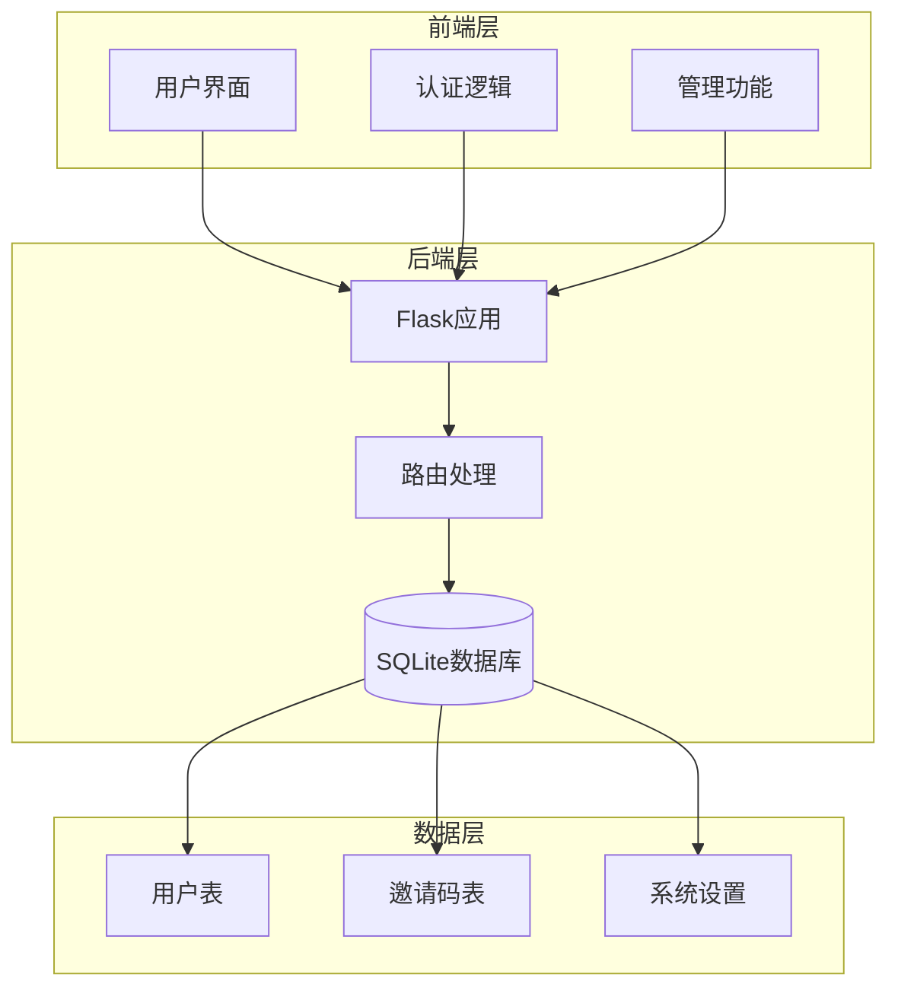
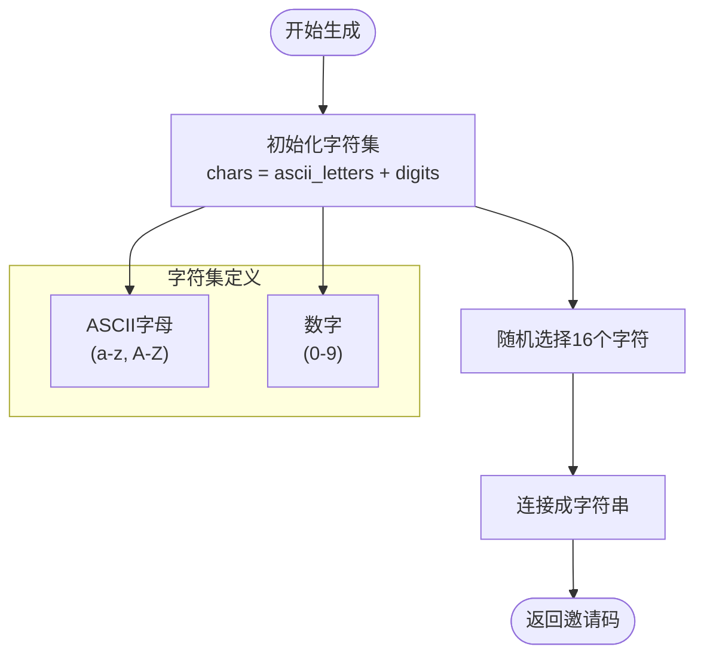
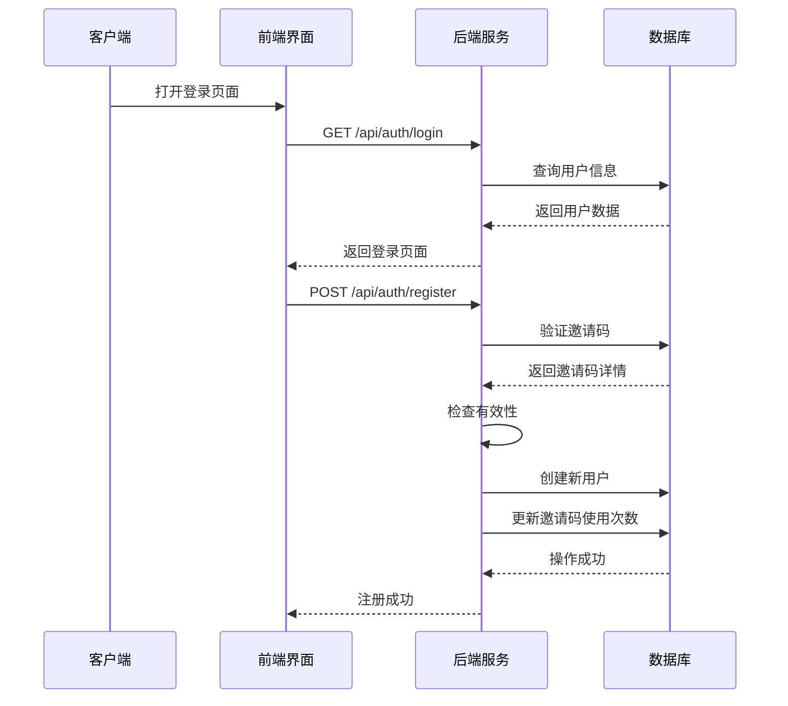
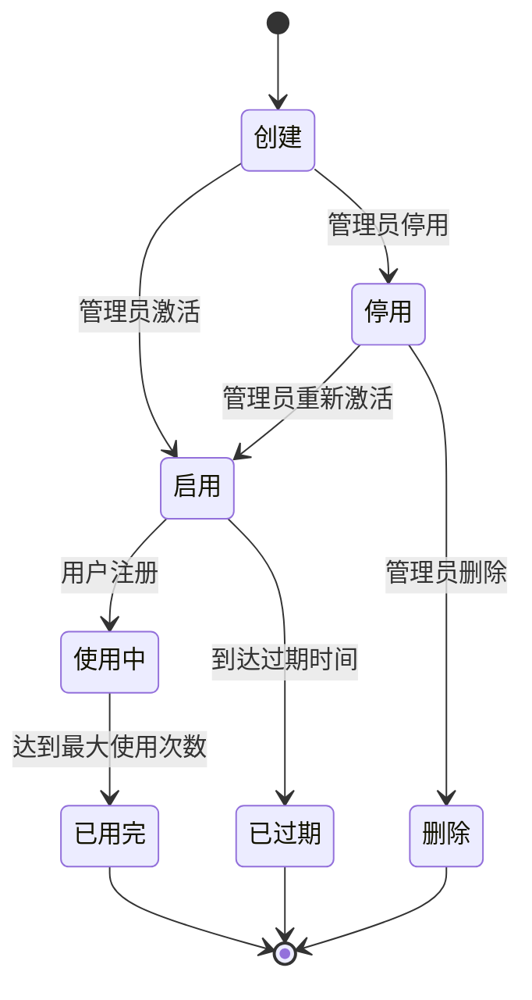
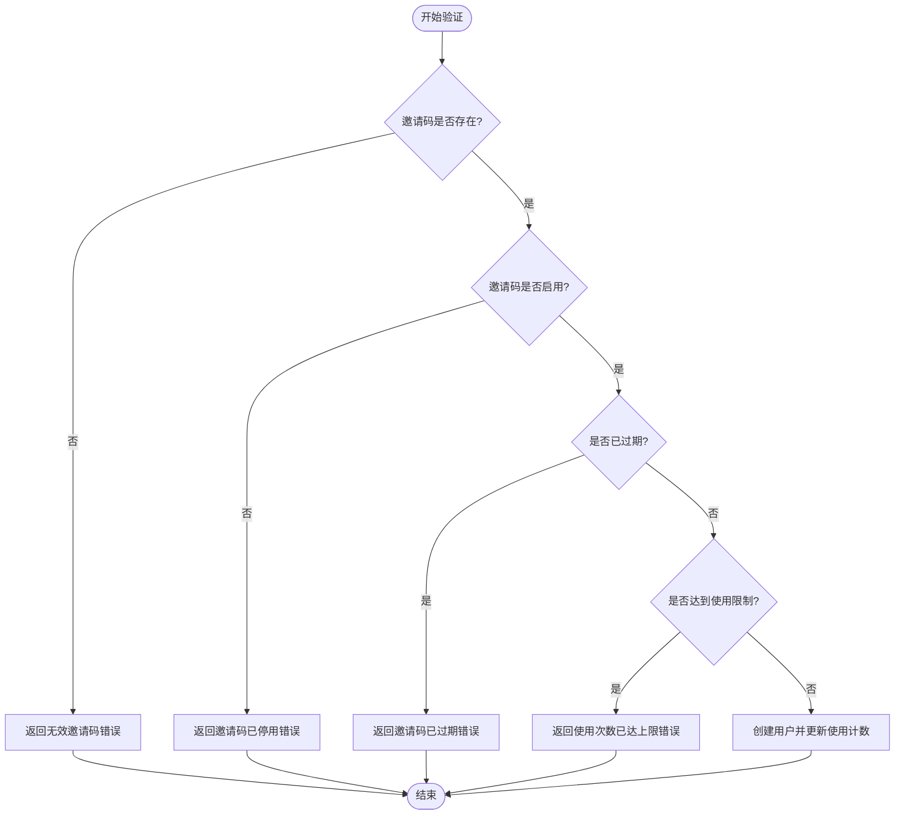
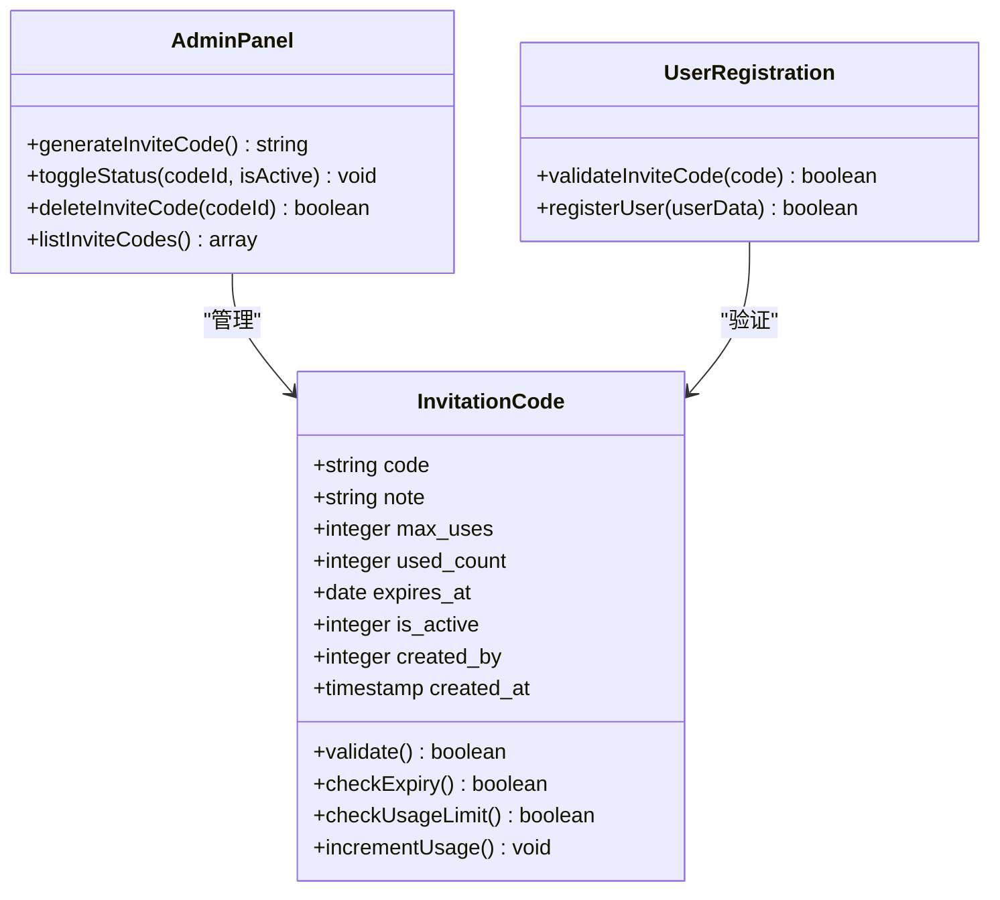
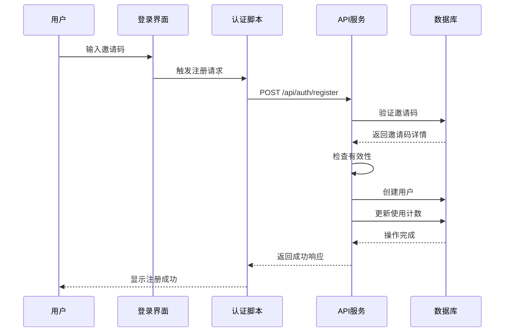
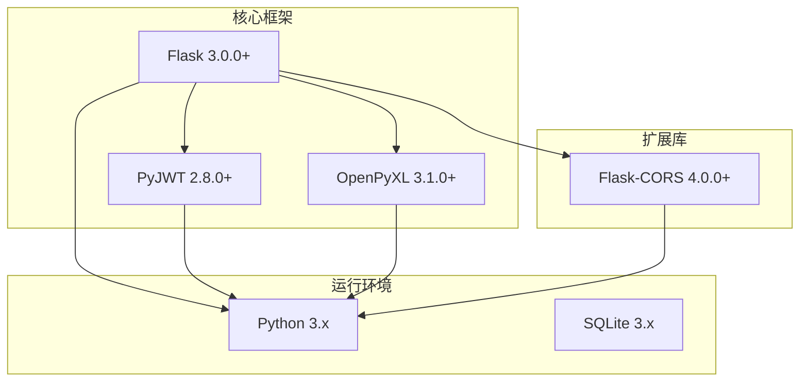
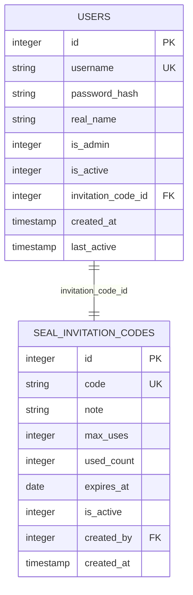

# 邀请码系统

<cite>
**本文档引用的文件**
- [app.py](file://app.py)
- [admin-management.js](file://static/js/admin-management.js)
- [auth.js](file://static/js/auth.js)
- [login.html](file://templates/login.html)
- [admin-panel.html](file://templates/admin-panel.html)
- [requirements.txt](file://requirements.txt)
</cite>

## 目录
1. [简介](#简介)
2. [项目结构](#项目结构)
3. [核心组件](#核心组件)
4. [架构概览](#架构概览)
5. [详细组件分析](#详细组件分析)
6. [依赖关系分析](#依赖关系分析)
7. [性能考虑](#性能考虑)
8. [故障排除指南](#故障排除指南)
9. [结论](#结论)

## 简介

封样件及色板接收登记管理系统的邀请码系统是一个基于Flask框架构建的用户注册控制机制。该系统通过唯一的16位邀请码来限制和管理用户的注册过程，确保只有获得授权的用户才能创建系统账户。

系统采用SQLite作为数据库存储，使用JWT进行身份认证，结合前后端分离的架构设计，提供了完整的邀请码生命周期管理功能。

## 项目结构

系统采用经典的三层架构设计：



**图表来源**
- [app.py:113-127](file://app.py#L113-L127)
- [app.py:94-107](file://app.py#L94-L107)

**章节来源**
- [app.py:88-335](file://app.py#L88-L335)

## 核心组件

### 数据库表结构

系统包含两个核心数据表，其中邀请码表是整个系统的关键组件：

#### 用户表 (users)
- 主键: id (自增)
- 唯一约束: username
- 外键: invitation_code_id → seal_invitation_codes.id
- 关键字段: username, password_hash, real_name, is_admin, is_active

#### 邀请码表 (seal_invitation_codes)
- 主键: id (自增)
- 唯一约束: code
- 外键: created_by → users.id
- 关键字段: code, note, max_uses, used_count, expires_at, is_active

**章节来源**
- [app.py:94-127](file://app.py#L94-L127)

### 随机字符生成算法

系统使用Python标准库的random模块实现16位随机邀请码生成：



**图表来源**
- [app.py:372-375](file://app.py#L372-L375)

**章节来源**
- [app.py:372-375](file://app.py#L372-L375)

## 架构概览

系统采用RESTful API架构，前后端分离的设计模式：



**图表来源**
- [app.py:495-542](file://app.py#L495-L542)
- [auth.js:94-106](file://static/js/auth.js#L94-L106)

## 详细组件分析

### 邀请码数据结构详解

#### 核心字段说明

| 字段名 | 类型 | 默认值 | 描述 | 约束 |
|--------|------|--------|------|------|
| code | TEXT | - | 16位唯一邀请码 | UNIQUE NOT NULL |
| note | TEXT | NULL | 备注说明 | 可为空 |
| max_uses | INTEGER | 1 | 最大使用次数 | DEFAULT 1 |
| used_count | INTEGER | 0 | 已使用次数 | DEFAULT 0 |
| expires_at | DATE | NULL | 过期时间 | 可为空 |
| is_active | INTEGER | 1 | 启用状态 | DEFAULT 1 (1=启用, 0=停用) |
| created_by | INTEGER | NULL | 创建者ID | 外键(users.id) |
| created_at | TIMESTAMP | CURRENT_TIMESTAMP | 创建时间 | 自动设置 |

#### 邀请码生命周期管理



**图表来源**
- [app.py:113-127](file://app.py#L113-L127)

### 邀请码验证逻辑

用户注册时的邀请码验证流程如下：



**图表来源**
- [app.py:517-540](file://app.py#L517-L540)

**章节来源**
- [app.py:517-540](file://app.py#L517-L540)

### 管理功能实现

#### 邀请码管理界面

管理员可以通过专门的管理面板进行邀请码的创建、编辑和删除操作：



**图表来源**
- [app.py:1507-1548](file://app.py#L1507-L1548)
- [admin-management.js:110-139](file://static/js/admin-management.js#L110-L139)

**章节来源**
- [app.py:1507-1548](file://app.py#L1507-L1548)
- [admin-management.js:74-139](file://static/js/admin-management.js#L74-L139)

### 前端交互流程

#### 用户注册流程



**图表来源**
- [auth.js:94-106](file://static/js/auth.js#L94-L106)
- [app.py:495-542](file://app.py#L495-L542)

**章节来源**
- [auth.js:84-106](file://static/js/auth.js#L84-L106)
- [login.html:119-124](file://templates/login.html#L119-L124)

## 依赖关系分析

### 技术栈依赖

系统使用以下核心技术栈：



**图表来源**
- [requirements.txt:1-5](file://requirements.txt#L1-L5)

**章节来源**
- [requirements.txt:1-5](file://requirements.txt#L1-L5)

### 数据库关系图



**图表来源**
- [app.py:94-127](file://app.py#L94-L127)

**章节来源**
- [app.py:94-127](file://app.py#L94-L127)

## 性能考虑

### 随机数生成安全性

当前实现使用Python标准库的`random`模块进行随机数生成。对于生产环境，建议考虑以下改进：

1. **使用更安全的随机数生成器**：
   ```python
   import secrets
   # 替代 random.choices(chars, k=16)
   return ''.join(secrets.choice(chars) for _ in range(16))
   ```

2. **字符集优化**：
   - 移除易混淆字符 (0, O, l, 1, I)
   - 考虑使用URL安全的字符集

3. **唯一性保证机制**：
   - 实现冲突检测和重试逻辑
   - 添加数据库层面的唯一性约束
   - 实现幂等性检查

### 数据库性能优化

1. **索引优化**：
   - 为`seal_invitation_codes.code`建立唯一索引
   - 为`seal_invitation_codes.expires_at`建立索引
   - 为`seal_invitation_codes.is_active`建立索引

2. **查询优化**：
   - 使用参数化查询防止SQL注入
   - 实现适当的分页机制
   - 优化JOIN查询性能

## 故障排除指南

### 常见问题及解决方案

#### 邀请码验证失败

**问题症状**：
- 注册时提示"无效的邀请码"
- 系统返回400状态码

**可能原因**：
1. 邀请码不存在或已被删除
2. 邀请码已被停用
3. 邀请码已过期
4. 邀请码使用次数已达上限

**解决步骤**：
1. 检查邀请码是否存在于数据库
2. 验证邀请码的`is_active`状态
3. 确认`expires_at`字段是否为空或未过期
4. 检查`used_count`是否小于`max_uses`

#### 数据库约束冲突

**问题症状**：
- 插入邀请码时报唯一约束冲突
- 更新邀请码时报重复错误

**解决方案**：
1. 实现邀请码生成后的冲突检测
2. 添加自动重试机制
3. 提供用户友好的错误提示

#### 前端交互问题

**问题症状**：
- 管理界面无法显示邀请码列表
- 生成邀请码按钮无响应

**排查步骤**：
1. 检查网络请求是否成功
2. 验证JWT令牌是否有效
3. 确认管理员权限
4. 检查浏览器控制台错误

**章节来源**
- [app.py:517-540](file://app.py#L517-L540)
- [admin-management.js:100-108](file://static/js/admin-management.js#L100-L108)

## 结论

封样件及色板接收登记管理系统的邀请码系统是一个设计合理、功能完整的用户注册控制机制。系统通过16位随机字符生成算法确保了邀请码的唯一性和安全性，结合严格的验证逻辑实现了有效的用户准入控制。

### 系统优势

1. **简洁高效**：核心功能集中在16位随机字符生成和基本验证逻辑上
2. **易于管理**：提供完整的管理员界面进行邀请码生命周期管理
3. **安全可靠**：通过数据库约束和业务逻辑双重保障数据完整性
4. **扩展性强**：模块化的架构设计便于后续功能扩展

### 改进建议

1. **增强安全性**：使用`secrets`模块替代`random`模块
2. **优化用户体验**：添加邀请码使用状态的实时显示
3. **完善监控**：增加邀请码使用统计和异常告警功能
4. **提升可维护性**：添加单元测试和集成测试覆盖

该系统为封样件及色板管理提供了可靠的用户准入控制，是整个系统安全架构的重要组成部分。