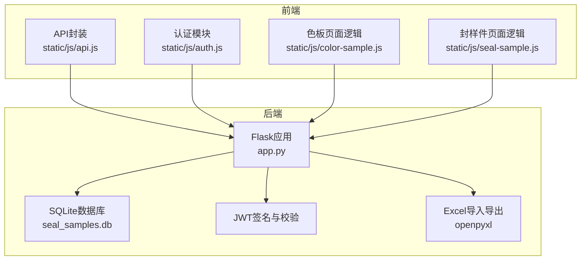
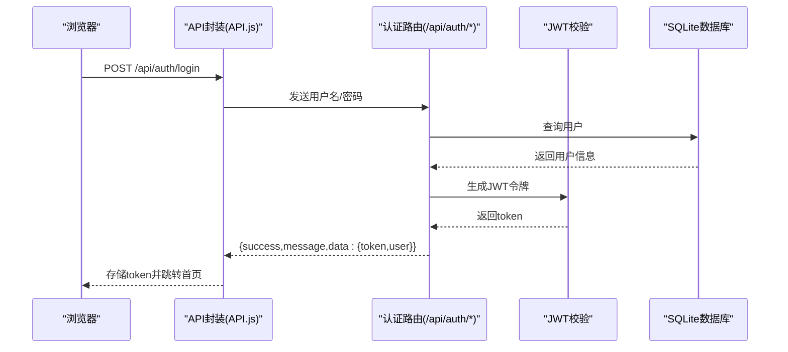
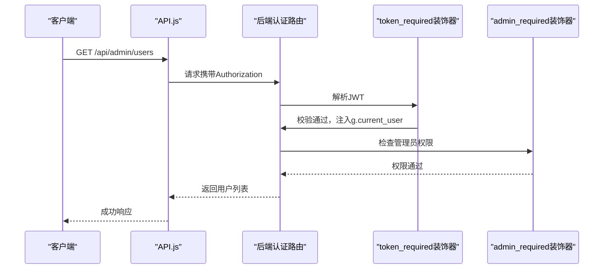
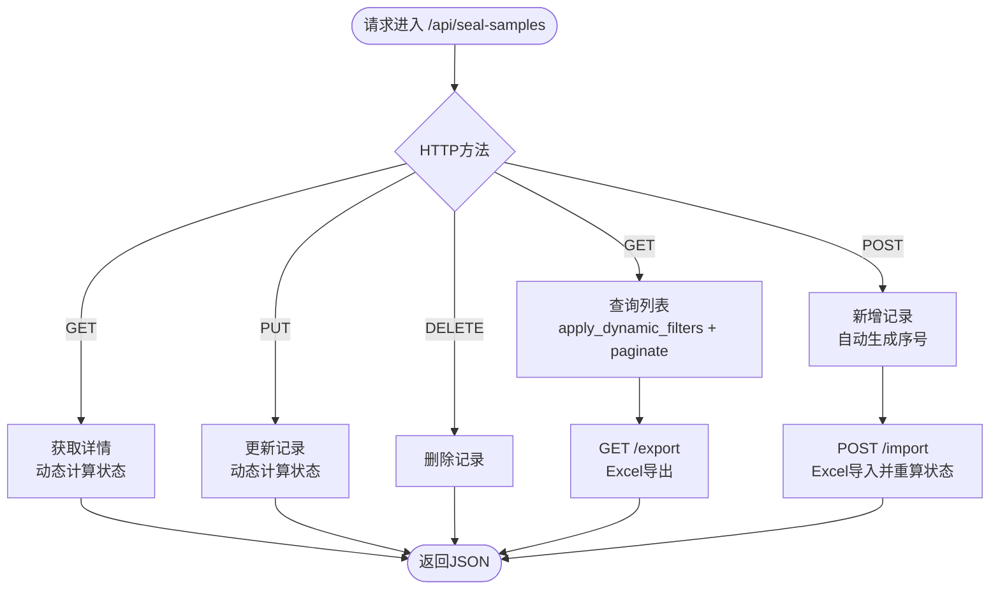
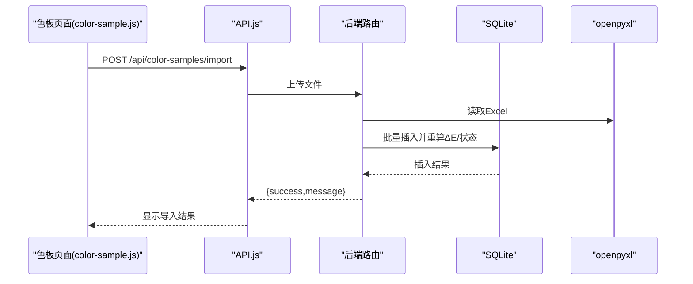
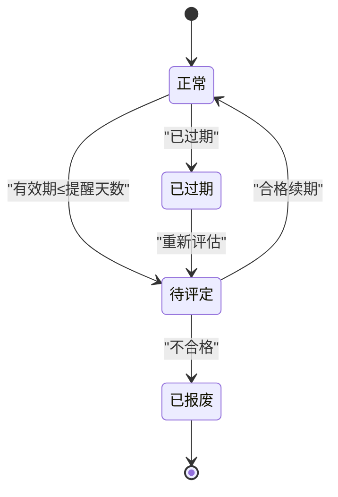
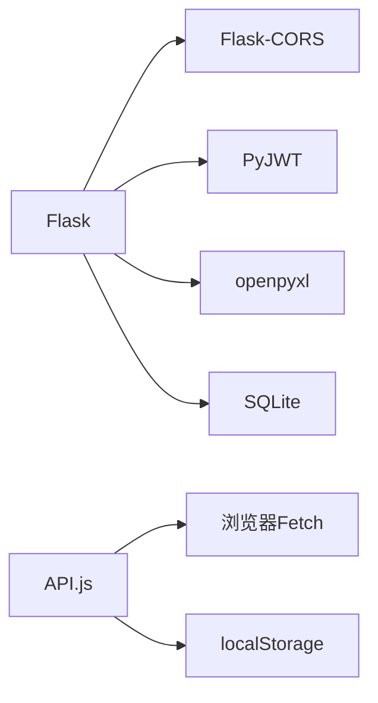

# API架构设计

<cite>
**本文引用的文件**
- [app.py](file://app.py)
- [requirements.txt](file://requirements.txt)
- [api.js](file://static/js/api.js)
- [auth.js](file://static/js/auth.js)
- [color-sample.js](file://static/js/color-sample.js)
- [seal-sample.js](file://static/js/seal-sample.js)
</cite>

## 目录
1. [简介](#简介)
2. [项目结构](#项目结构)
3. [核心组件](#核心组件)
4. [架构总览](#架构总览)
5. [详细组件分析](#详细组件分析)
6. [依赖分析](#依赖分析)
7. [性能考虑](#性能考虑)
8. [故障排查指南](#故障排查指南)
9. [结论](#结论)
10. [附录](#附录)

## 简介
本文件为“封样件及色板接收登记管理系统”的API架构设计文档，面向前后端开发者与运维人员，系统采用Flask作为后端框架，SQLite作为本地数据库，JWT进行认证，openpyxl实现Excel导入导出，前端通过静态JS封装统一的API调用与鉴权拦截。本文档覆盖RESTful API设计原则、URL与方法映射、状态码使用、版本控制策略与向后兼容、请求响应格式、认证授权、Excel导入导出、性能优化与监控日志等主题。

## 项目结构
后端采用单文件Flask应用，集中定义所有路由、认证中间件、工具函数与数据库初始化；前端通过静态资源目录提供页面与脚本，其中API.js封装统一的请求、鉴权拦截与错误处理，auth.js负责登录/注册/改密流程，color-sample.js与seal-sample.js分别承载色板与封样件的CRUD与Excel导入导出交互逻辑。

图表来源
- [app.py](file://app.py)
- [api.js](file://static/js/api.js)
- [auth.js](file://static/js/auth.js)
- [color-sample.js](file://static/js/color-sample.js)
- [seal-sample.js](file://static/js/seal-sample.js)

章节来源
- [app.py](file://app.py)
- [requirements.txt](file://requirements.txt)

## 核心组件
- 认证与授权
  - JWT令牌生成与校验，支持Header与Query两种传递方式
  - 装饰器token_required与admin_required实现权限控制
  - 在线状态维护与心跳接口
- 数据模型与业务域
  - 用户、封样件、色板、寄出、有效期、评定、报废、系统设置、用户表格配置等
- API路由与协议
  - RESTful风格，GET/POST/PUT/DELETE映射
  - 统一响应结构(success: bool, message: string, data?: any)，错误码与状态码
  - 分页与动态筛选参数
- Excel导入导出
  - 支持文件上传、下载与数据转换
  - 导入时自动重算状态与ΔE值，导出时中文状态映射
- 前端集成
  - API.js统一fetch封装、401自动跳转登录、上传处理
  - 页面脚本调用API并渲染表格、分页与操作

章节来源
- [app.py](file://app.py)
- [api.js](file://static/js/api.js)

## 架构总览
系统采用前后端分离的静态页面+后端API模式：
- 前端通过API.js发起HTTP请求，自动附加Authorization头
- 后端通过装饰器解析JWT，校验用户身份与权限
- 数据持久化基于SQLite，使用openpyxl进行Excel读写
- 统一响应体与错误处理，便于前端统一处理

图表来源
- [api.js](file://static/js/api.js)
- [app.py](file://app.py)

## 详细组件分析

### 认证与授权模块
- 登录/注册/改密/心跳/退出登录
- JWT令牌支持Header与Query两种传递方式
- 账户禁用检测与在线状态更新
- 管理员专用接口（用户管理、邀请码、系统设置）

图表来源
- [app.py](file://app.py)
- [api.js](file://static/js/api.js)

章节来源
- [app.py](file://app.py)
- [api.js](file://static/js/api.js)

### 封样件管理API
- 列表/新增/详情/更新/删除
- 动态筛选与分页
- 导入/导出Excel，自动重算状态

图表来源
- [app.py](file://app.py)

章节来源
- [app.py](file://app.py)
- [seal-sample.js](file://static/js/seal-sample.js)

### 色板管理API
- 列表/新增/详情/更新/删除
- 寄出管理与库存扣减
- 导入/导出Excel，自动重算ΔE值与状态

图表来源
- [app.py](file://app.py)
- [color-sample.js](file://static/js/color-sample.js)

章节来源
- [app.py](file://app.py)
- [color-sample.js](file://static/js/color-sample.js)

### 有效期与评定/报废流程
- 有效期规则管理
- 评定提交（含ΔE计算）
- 报废操作与处置记录合并视图
- 软删除/恢复/永久删除与台账回滚

图表来源
- [app.py](file://app.py)

章节来源
- [app.py](file://app.py)

### 管理员功能
- 用户管理（启用/禁用/删除）
- 邀请码管理（生成/启用/停用/删除）
- 系统设置（键值对）
- 处置记录回收站与管理操作

章节来源
- [app.py](file://app.py)

### 前端API封装与调用
- 统一fetch封装，自动附加Authorization头
- 401自动跳转登录，静默清理本地存储
- 上传接口支持FormData
- 页面脚本通过API.js调用后端路由，处理分页、筛选、导入导出

章节来源
- [api.js](file://static/js/api.js)
- [auth.js](file://static/js/auth.js)
- [color-sample.js](file://static/js/color-sample.js)
- [seal-sample.js](file://static/js/seal-sample.js)

## 依赖分析
- 后端依赖
  - Flask、Flask-CORS、PyJWT、openpyxl、SQLite
- 前端依赖
  - 通过静态资源引入，无包管理器，API.js独立封装

图表来源
- [requirements.txt](file://requirements.txt)
- [api.js](file://static/js/api.js)

章节来源
- [requirements.txt](file://requirements.txt)
- [app.py](file://app.py)

## 性能考虑
- 分页与筛选
  - 后端提供分页与动态筛选，前端传参f_field_i/f_op_i/f_val_i，兼容旧参数
  - 列表接口支持pageSize=0返回全量，避免不必要的分页
- 状态计算
  - 列表与详情均动态计算状态，避免冗余存储
- 导入导出
  - Excel批量写入，导入时一次性commit，减少事务开销
- 缓存与并发
  - 未实现专门缓存层，建议后续引入Redis或内存缓存热点数据
- 异步处理
  - 未实现后台任务队列，建议对大文件导入/导出增加异步处理与进度反馈

章节来源
- [app.py](file://app.py)

## 故障排查指南
- 认证相关
  - 401未提供Token或Token无效：检查Authorization头或Query参数token
  - 账户被停用：返回特定错误码，前端自动跳转登录
- 数据一致性
  - 寄出数量超出现有库存：后端校验并拒绝
  - 色板删除前需无寄出记录：后端校验并提示
- 导入异常
  - 文件格式不符或字段不匹配：后端捕获异常并返回错误消息
  - 导入后状态/ΔE未更新：检查导入批次ID范围与重算逻辑

章节来源
- [app.py](file://app.py)
- [api.js](file://static/js/api.js)

## 结论
本系统以Flask为核心，结合JWT与openpyxl，实现了封样件与色板的全生命周期管理，具备完善的导入导出、动态筛选、分页与权限控制能力。建议后续引入缓存与异步任务，完善API版本控制与监控日志体系，以提升性能与可观测性。

## 附录

### RESTful API设计原则与实现要点
- HTTP方法映射
  - GET：查询列表/详情
  - POST：新增
  - PUT：更新
  - DELETE：删除
- URL设计规范
  - 复数名词：/api/seal-samples、/api/color-samples
  - 资源标识：/api/seal-samples/{id}
  - 操作命名：/api/seal-samples/export、/api/seal-samples/import
- 状态码使用
  - 2xx：成功
  - 400：参数错误/业务错误
  - 401：未认证/Token无效
  - 403：权限不足
  - 404：资源不存在
  - 500：服务器内部错误
- 统一响应格式
  - {success: boolean, message: string, data?: any, code?: string}

章节来源
- [app.py](file://app.py)

### API版本控制与向后兼容
- 当前版本
  - 未使用URL路径版本号，通过语义化变更与兼容旧参数维持向后兼容
- 建议
  - 引入/v1前缀，逐步迁移参数与行为，保留过渡期兼容
  - 对破坏性变更提供明确迁移指引

章节来源
- [app.py](file://app.py)

### 请求与响应格式
- 请求
  - Content-Type: application/json
  - 认证：Authorization: Bearer <token> 或 Query: token=<token>
- 响应
  - 统一结构：success/message/data/code
  - 分页：items/total/page/page_size/total_pages

章节来源
- [app.py](file://app.py)
- [api.js](file://static/js/api.js)

### 认证与授权
- JWT
  - HS256算法，过期时间24小时
  - 支持Header与Query两种传递方式
- 权限
  - token_required：所有受保护接口
  - admin_required：管理员专属接口
- 在线状态
  - 心跳接口更新last_active，用于在线状态展示

章节来源
- [app.py](file://app.py)

### Excel导入导出
- 导入
  - 支持文件上传，自动识别表头，跳过ID列（若存在）
  - 导入后重算状态与ΔE值
- 导出
  - 下载Excel，中文状态映射
  - 色板导出包含全部字段，封样件导出包含关键字段

章节来源
- [app.py](file://app.py)
- [color-sample.js](file://static/js/color-sample.js)
- [seal-sample.js](file://static/js/seal-sample.js)

### 性能优化策略
- 缓存
  - 热点查询结果缓存（如统计、配置）
- 批量操作
  - 导入/导出采用批量写入
- 异步处理
  - 大文件导入/导出异步化，提供进度与结果通知
- 日志与监控
  - 建议接入日志系统与指标采集（如访问量、错误率、响应时间）

章节来源
- [app.py](file://app.py)