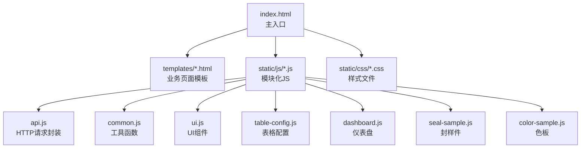
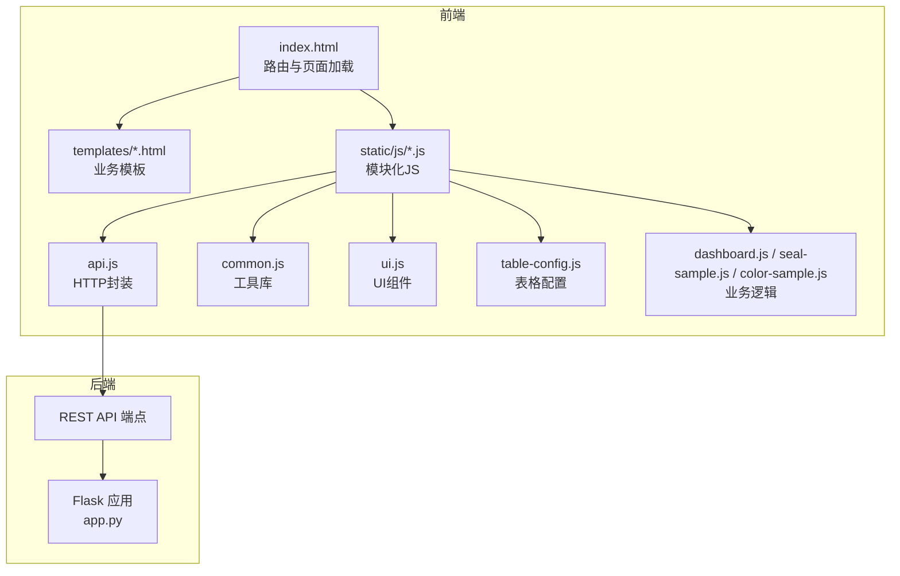
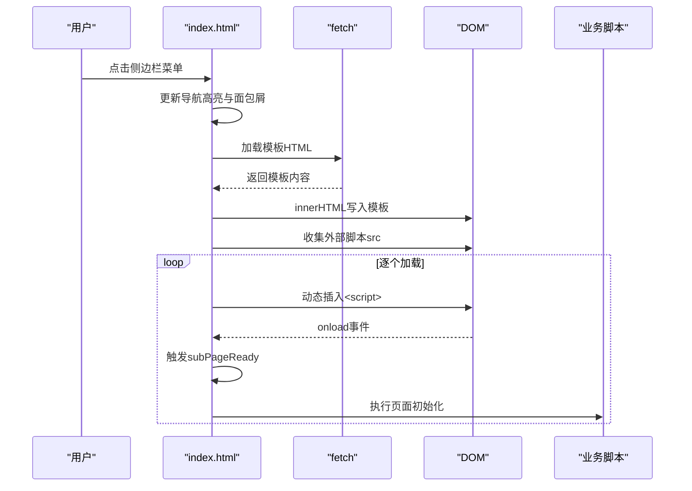
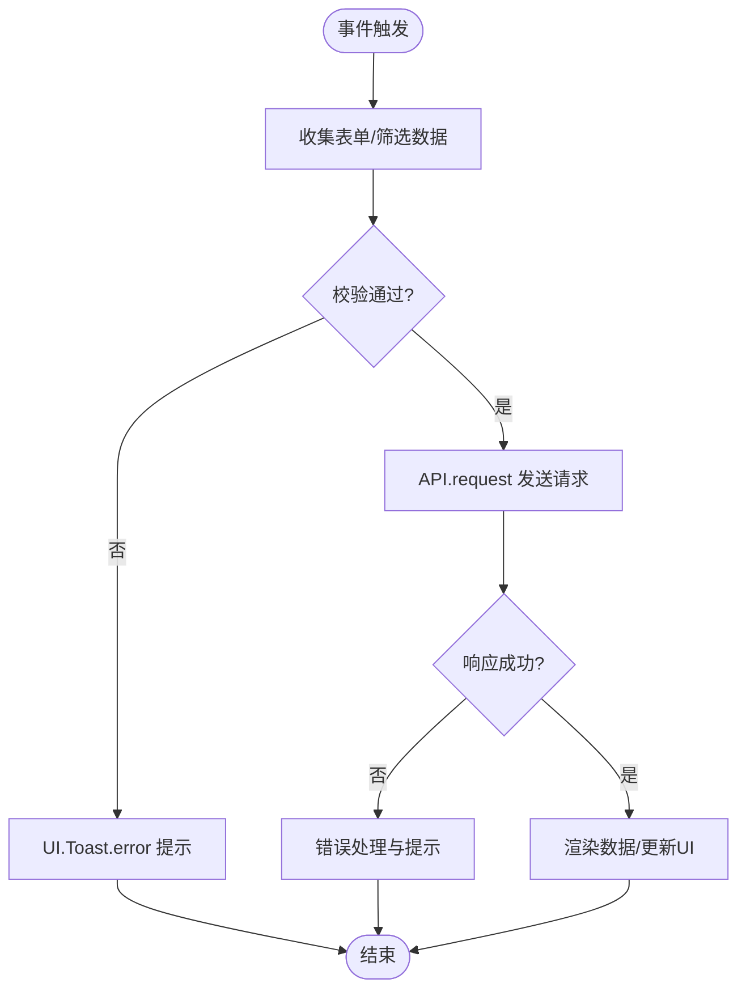
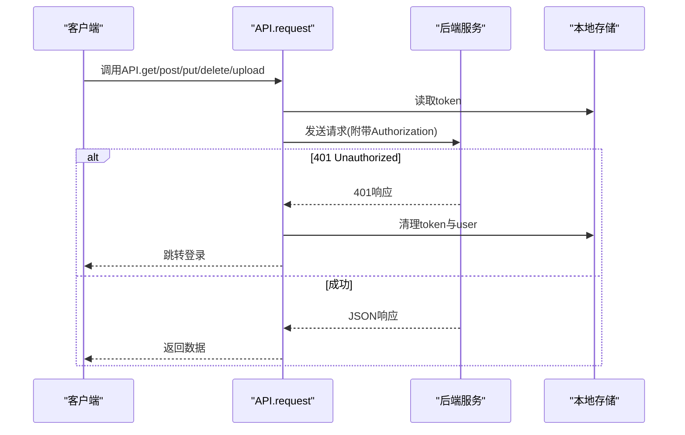
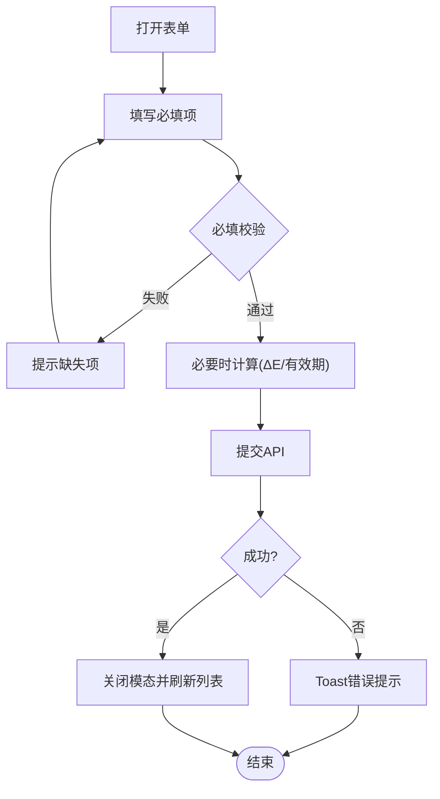
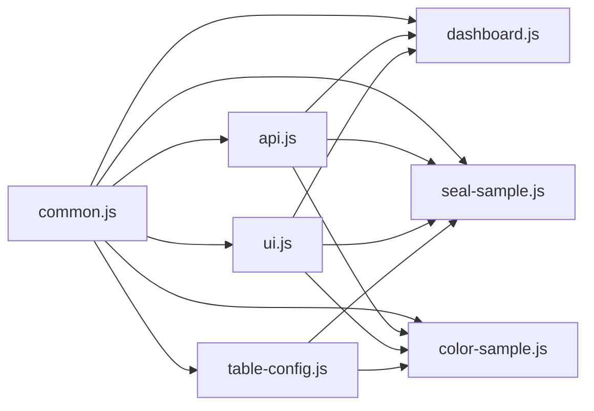
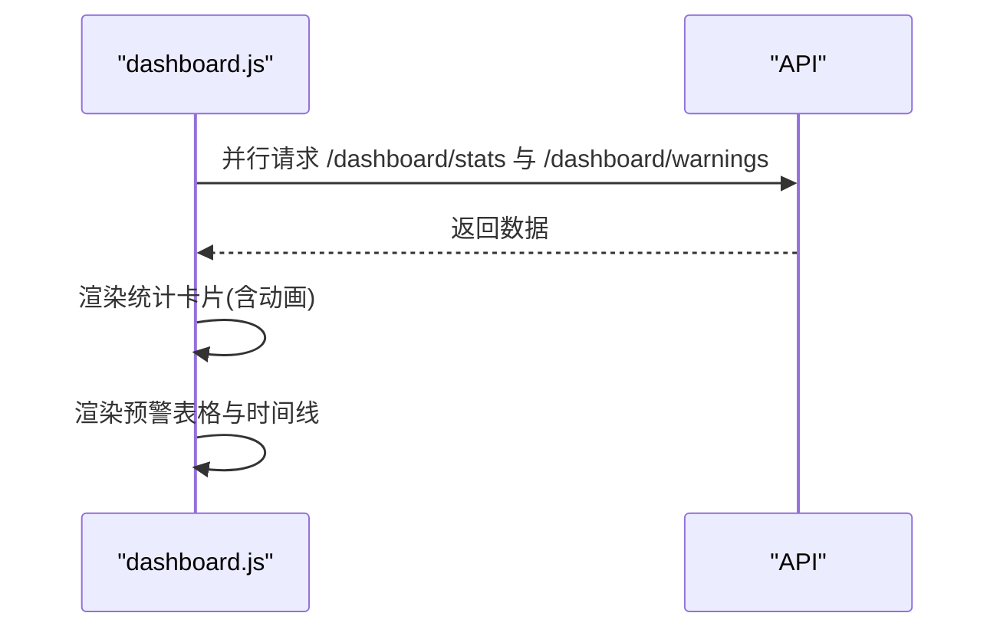
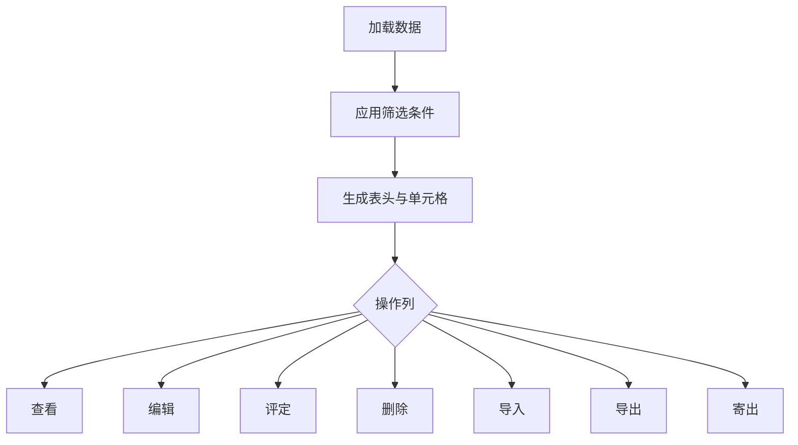
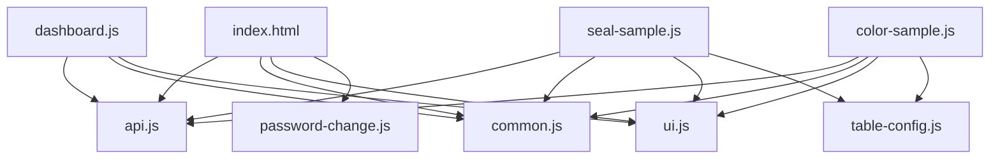

# 前端架构设计

<cite>
**本文档引用的文件**
- [app.py](file://app.py)
- [index.html](file://templates/index.html)
- [login.html](file://templates/login.html)
- [dashboard.html](file://templates/dashboard.html)
- [seal-sample.html](file://templates/seal-sample.html)
- [color-sample.html](file://templates/color-sample.html)
- [common.js](file://static/js/common.js)
- [api.js](file://static/js/api.js)
- [ui.js](file://static/js/ui.js)
- [dashboard.js](file://static/js/dashboard.js)
- [seal-sample.js](file://static/js/seal-sample.js)
- [color-sample.js](file://static/js/color-sample.js)
- [table-config.js](file://static/js/table-config.js)
- [style.css](file://static/css/style.css)
</cite>

## 目录
1. [引言](#引言)
2. [项目结构](#项目结构)
3. [核心组件](#核心组件)
4. [架构总览](#架构总览)
5. [详细组件分析](#详细组件分析)
6. [依赖关系分析](#依赖关系分析)
7. [性能考虑](#性能考虑)
8. [故障排查指南](#故障排查指南)
9. [结论](#结论)

## 引言

本项目为“封样件及色板接收登记管理系统”的前端架构设计文档，基于单页应用（SPA）模式实现。系统采用Flask作为后端服务，前端通过模板动态加载与模块化JavaScript组织实现页面路由管理、动态内容加载、状态管理、事件驱动与异步处理、前后端通信协议、数据验证与表单处理、性能优化以及调试测试策略。

## 项目结构

系统采用“模板 + 模块化JS”的前端架构，模板位于 `templates/` 目录，静态资源位于 `static/` 目录。入口页面为 `index.html`，登录页面为 `login.html`，各业务页面通过动态加载方式挂载到主容器中。

**图表来源**
- [index.html:114-185](file://templates/index.html#L114-L185)
- [style.css:1-200](file://static/css/style.css#L1-L200)

**章节来源**
- [index.html:1-239](file://templates/index.html#L1-L239)
- [login.html:1-144](file://templates/login.html#L1-L144)

## 核心组件

- **路由与页面加载**：通过 `index.html` 中的 `loadSubPage` 函数实现页面模板的动态加载与脚本执行链，支持面包屑导航与侧边栏高亮。
- **API通信层**：`api.js` 封装了基于 fetch 的请求方法，统一处理 JWT Token 注入、401 自动跳转登录、上传与错误提示。
- **公共工具库**：`common.js` 提供日期格式化、ΔE 计算、状态标签、分页、防抖、剪贴板等通用能力。
- **UI组件库**：`ui.js` 提供 Toast、Modal、Confirm、TabSwitch、Loading、Drawer 等基础 UI 组件。
- **表格配置模块**：`table-config.js` 实现筛选面板、列设置、动态表头与单元格渲染，支持多页面复用。
- **业务页面模块**：`dashboard.js`、`seal-sample.js`、`color-sample.js` 分别负责仪表盘统计、封样件台账与色板台账的CRUD与交互。

**章节来源**
- [api.js:1-88](file://static/js/api.js#L1-L88)
- [common.js:1-135](file://static/js/common.js#L1-L135)
- [ui.js:1-224](file://static/js/ui.js#L1-L224)
- [table-config.js:1-552](file://static/js/table-config.js#L1-L552)
- [dashboard.js:1-117](file://static/js/dashboard.js#L1-L117)
- [seal-sample.js:1-181](file://static/js/seal-sample.js#L1-L181)
- [color-sample.js:1-267](file://static/js/color-sample.js#L1-L267)

## 架构总览

系统采用“模板驱动 + 模块化JS”的SPA架构，页面切换通过模板加载与脚本执行完成；状态管理通过全局变量与本地存储结合；事件驱动通过DOM事件与回调注册实现；前后端通过REST API通信并统一处理认证与错误。

**图表来源**
- [index.html:114-185](file://templates/index.html#L114-L185)
- [api.js:1-88](file://static/js/api.js#L1-L88)
- [table-config.js:1-552](file://static/js/table-config.js#L1-L552)
- [app.py:452-795](file://app.py#L452-L795)

## 详细组件分析

### 页面路由与动态内容加载

- **路由机制**：`index.html` 中的 `loadSubPage` 负责：
  - 设置加载动画与容器清空
  - 更新导航高亮与面包屑
  - 通过 fetch 加载模板HTML
  - 解析模板中的外部脚本列表，按序加载并执行
  - 执行模板内的内联脚本
  - 触发 `subPageReady` 事件通知页面模块初始化

- **页面切换流程**：侧边栏点击 → 更新高亮 → 加载模板 → 动态注入脚本 → 执行业务初始化

**图表来源**
- [index.html:143-185](file://templates/index.html#L143-L185)

**章节来源**
- [index.html:143-185](file://templates/index.html#L143-L185)

### 事件驱动架构与异步处理

- **事件监听**：页面通过 DOM 事件绑定（如按钮点击、表单输入、文件选择）触发业务逻辑。
- **异步处理**：使用 Promise/async-await 管理 API 请求与并发加载（如仪表盘统计与预警并行请求）。
- **回调注册**：`table-config.js` 通过 `onSearch`、`onColumnChange` 注册回调，实现筛选与列变更后的页面刷新。
- **心跳与离线处理**：前端定时向后端发送心跳保持在线状态，API 层在 401 时自动清理本地状态并跳转登录。

**图表来源**
- [api.js:7-42](file://static/js/api.js#L7-L42)
- [table-config.js:512-518](file://static/js/table-config.js#L512-L518)

**章节来源**
- [table-config.js:512-518](file://static/js/table-config.js#L512-L518)
- [api.js:7-42](file://static/js/api.js#L7-L42)

### 前端与后端API通信协议

- **认证与Token**：所有请求自动附加 Authorization Bearer Token；401 时清理本地状态并跳转登录。
- **请求方法**：GET/POST/PUT/DELETE/上传，统一通过 `API.request` 封装，支持查询参数与JSON体。
- **错误处理**：网络异常统一提示；后端返回错误时展示消息；上传失败统一提示。
- **心跳与登出**：定时心跳保持在线；登出时尝试调用后端登出接口清理状态。

**图表来源**
- [api.js:7-42](file://static/js/api.js#L7-L42)
- [index.html:203-210](file://templates/index.html#L203-L210)

**章节来源**
- [api.js:1-88](file://static/js/api.js#L1-L88)
- [index.html:203-210](file://templates/index.html#L203-L210)

### 前端数据验证与表单处理

- **表单收集**：使用 FormData 收集表单数据，遍历填充到对象并进行必填项校验。
- **输入约束**：
  - 数字输入限制最小值与步进
  - 日期输入限制范围（如有效期=接收日期+1年）
  - 寄出数量不超过当前持有量
- **实时计算**：色板 ΔE 值根据 ΔL、Δa、Δb 实时计算；接收数量变化联动当前持有量。
- **安全处理**：使用 `Utils.escapeHtml` 防止XSS；剪贴板复制提供降级方案。

**图表来源**
- [seal-sample.js:124-139](file://static/js/seal-sample.js#L124-L139)
- [color-sample.js:190-199](file://static/js/color-sample.js#L190-L199)
- [color-sample.js:173-177](file://static/js/color-sample.js#L173-L177)

**章节来源**
- [seal-sample.js:124-139](file://static/js/seal-sample.js#L124-L139)
- [color-sample.js:173-177](file://static/js/color-sample.js#L173-L177)
- [color-sample.js:190-199](file://static/js/color-sample.js#L190-L199)

### 前端模块化设计与依赖关系

- **模块划分**：
  - `common.js`：通用工具（日期、ΔE、状态、分页、防抖、剪贴板）
  - `api.js`：HTTP请求封装与认证拦截
  - `ui.js`：Toast、Modal、Confirm、TabSwitch、Loading、Drawer
  - `table-config.js`：筛选面板、列设置、动态表头与渲染
  - 业务页面：`dashboard.js`、`seal-sample.js`、`color-sample.js`
- **依赖关系**：
  - 业务页面依赖 `api.js`、`common.js`、`ui.js`、`table-config.js`
  - `table-config.js` 依赖 `common.js` 的渲染器与工具
  - `index.html` 作为入口，动态加载业务页面脚本并触发初始化

**图表来源**
- [common.js:1-135](file://static/js/common.js#L1-L135)
- [api.js:1-88](file://static/js/api.js#L1-L88)
- [ui.js:1-224](file://static/js/ui.js#L1-L224)
- [table-config.js:1-552](file://static/js/table-config.js#L1-L552)
- [dashboard.js:1-117](file://static/js/dashboard.js#L1-L117)
- [seal-sample.js:1-181](file://static/js/seal-sample.js#L1-L181)
- [color-sample.js:1-267](file://static/js/color-sample.js#L1-L267)

**章节来源**
- [table-config.js:1-552](file://static/js/table-config.js#L1-L552)

### 仪表盘与统计渲染

- **并行请求**：仪表盘同时请求统计数据与预警列表，提升加载速度。
- **动画渲染**：统计数字采用缓动动画增长，提升视觉体验。
- **时间线与状态标签**：使用相对时间与状态标签美化展示。

**图表来源**
- [dashboard.js:5-13](file://static/js/dashboard.js#L5-L13)
- [dashboard.js:15-41](file://static/js/dashboard.js#L15-L41)
- [dashboard.js:66-103](file://static/js/dashboard.js#L66-L103)

**章节来源**
- [dashboard.js:1-117](file://static/js/dashboard.js#L1-L117)

### 封样件与色板台账管理

- **动态筛选与列配置**：通过 `table-config.js` 构建筛选面板与列设置，支持多字段、多操作符的组合查询。
- **分页与排序**：后端返回分页数据，前端生成分页控件并支持跳转。
- **CRUD操作**：新增、编辑、查看、删除、导入、导出、寄出等完整流程。
- **状态与有效期**：根据有效期与提醒天数动态计算状态，展示到期预警。

**图表来源**
- [table-config.js:469-492](file://static/js/table-config.js#L469-L492)
- [seal-sample.js:26-61](file://static/js/seal-sample.js#L26-L61)
- [color-sample.js:33-99](file://static/js/color-sample.js#L33-L99)

**章节来源**
- [seal-sample.js:1-181](file://static/js/seal-sample.js#L1-L181)
- [color-sample.js:1-267](file://static/js/color-sample.js#L1-L267)
- [table-config.js:1-552](file://static/js/table-config.js#L1-L552)

## 依赖关系分析

- **入口依赖**：`index.html` 依赖 `api.js`、`common.js`、`ui.js`、`password-change.js` 等全局脚本。
- **业务依赖**：各业务页面依赖 `api.js`、`common.js`、`ui.js`、`table-config.js`。
- **样式依赖**：`index.html` 引入全局样式与页面样式，保证布局与组件一致性。

**图表来源**
- [index.html:110-113](file://templates/index.html#L110-L113)
- [dashboard.js:1-117](file://static/js/dashboard.js#L1-L117)
- [seal-sample.js:1-181](file://static/js/seal-sample.js#L1-L181)
- [color-sample.js:1-267](file://static/js/color-sample.js#L1-L267)

**章节来源**
- [index.html:110-113](file://templates/index.html#L110-L113)

## 性能考虑

- **资源加载优化**：
  - 模板按需加载，避免一次性加载所有页面脚本。
  - 外部脚本按序加载并触发 `subPageReady`，确保初始化顺序。
- **渲染优化**：
  - 仪表盘统计数字使用 requestAnimationFrame 动画，避免重排重绘。
  - 表格渲染采用字符串拼接与批量更新，减少DOM操作。
- **缓存策略**：
  - `table-config.js` 使用 localStorage 缓存列配置与筛选条件，提升二次访问速度。
  - `common.js` 的分页与工具函数避免重复计算。
- **网络优化**：
  - 并行请求统计与预警，缩短首屏时间。
  - 上传使用 FormData，支持大文件分片上传（可扩展）。

[本节为通用指导，无需特定文件引用]

## 故障排查指南

- **登录状态异常**：
  - 检查本地是否存在 token 与 user；401 时会自动清理并跳转登录。
  - 确认后端心跳接口 `/api/auth/ping` 是否可用。
- **页面无法加载**：
  - 检查 `loadSubPage` 是否正确解析模板与脚本；查看控制台错误。
  - 确认模板路径与脚本 src 是否正确。
- **API 请求失败**：
  - 查看网络面板与控制台错误；确认后端 CORS 配置与路由。
  - 检查 `api.js` 的请求封装与错误提示。
- **表格筛选失效**：
  - 确认 `table-config.js` 的筛选面板是否正确渲染与回调是否注册。
  - 检查筛选参数是否正确传递到后端。

**章节来源**
- [index.html:187-194](file://templates/index.html#L187-L194)
- [api.js:20-33](file://static/js/api.js#L20-L33)
- [table-config.js:379-388](file://static/js/table-config.js#L379-L388)

## 结论

本系统通过“模板驱动 + 模块化JS”的SPA架构实现了清晰的页面路由、动态内容加载与事件驱动交互。前端模块职责明确、依赖关系清晰，配合统一的API封装与UI组件库，具备良好的可维护性与扩展性。建议后续在以下方面持续优化：
- 增加前端路由库（如 history API）以支持浏览器前进后退与深度链接。
- 引入状态管理库（如轻量状态机）统一管理复杂业务状态。
- 增加单元测试与端到端测试，覆盖关键交互与API调用。
- 对大表格进行虚拟滚动与懒加载优化，进一步提升性能。