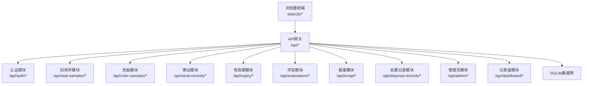
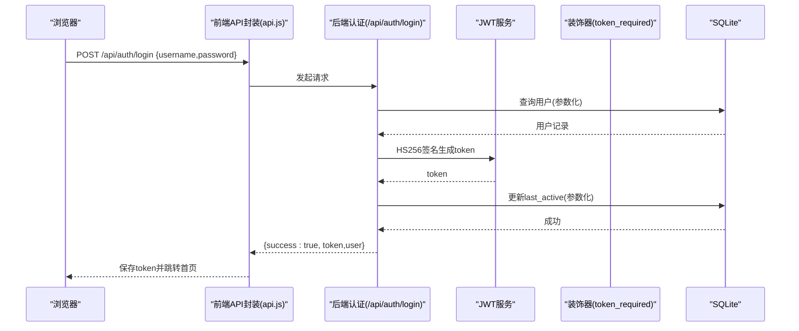
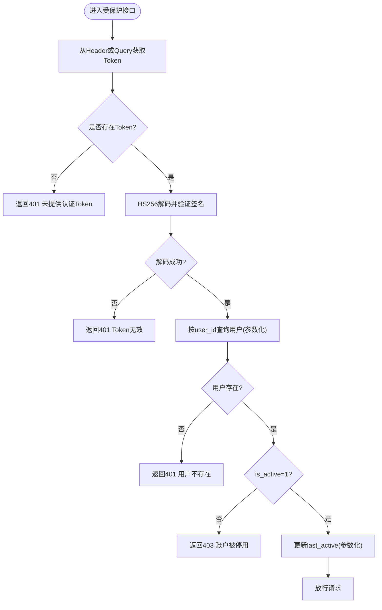
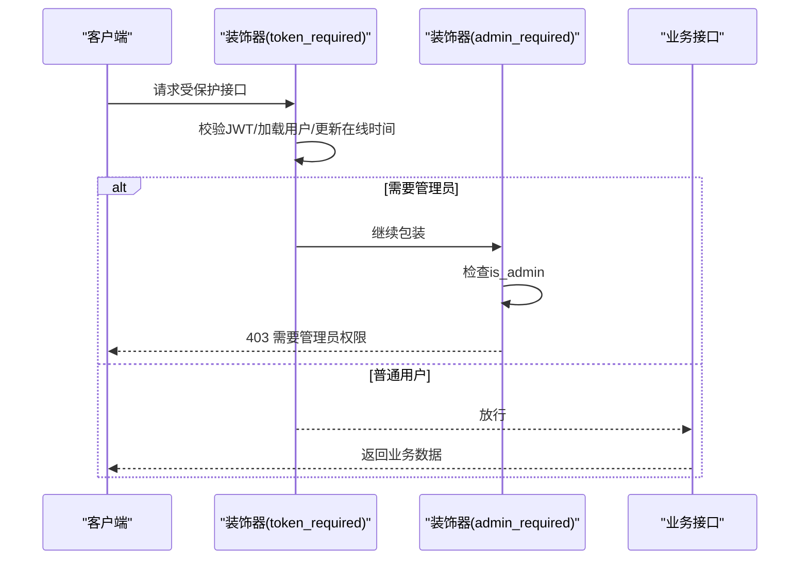
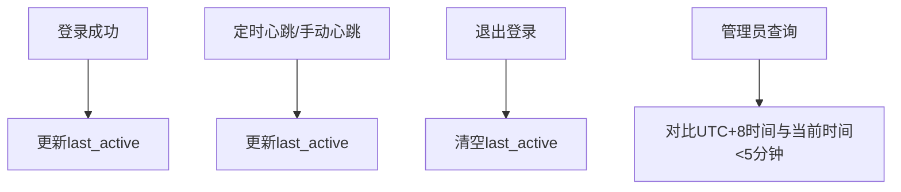
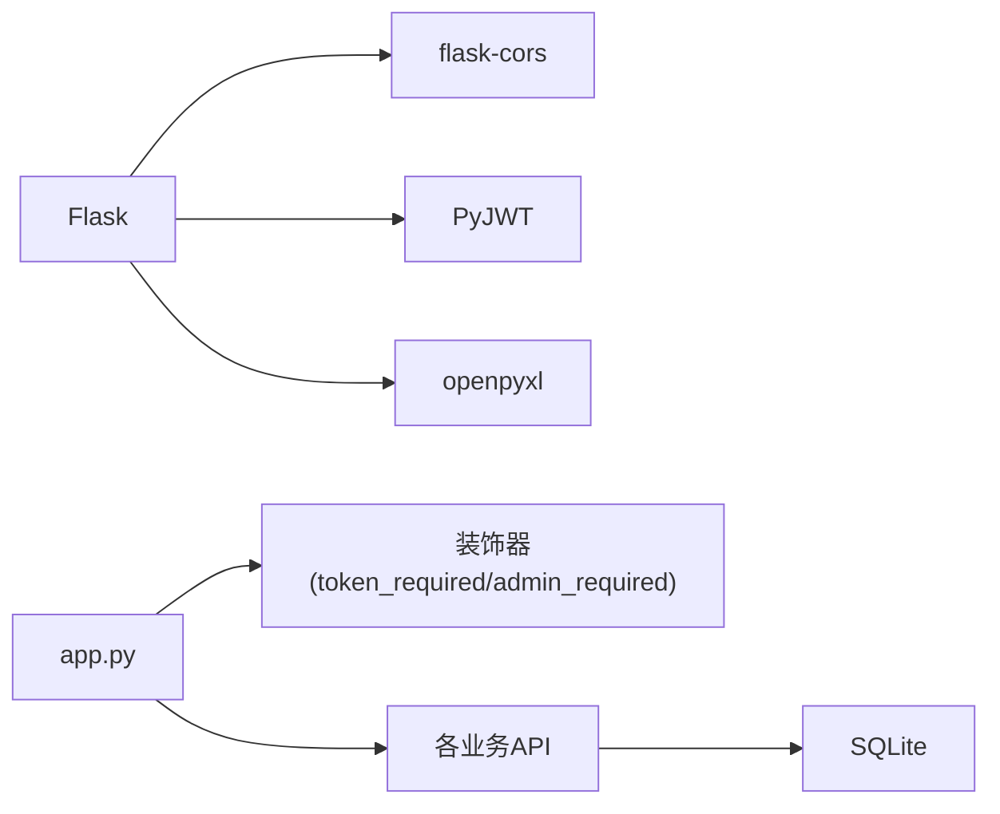

# 安全架构设计

<cite>
**本文引用的文件**
- [app.py](file://app.py)
- [requirements.txt](file://requirements.txt)
- [auth.js](file://static/js/auth.js)
- [api.js](file://static/js/api.js)
- [common.js](file://static/js/common.js)
- [ui.js](file://static/js/ui.js)
</cite>

## 目录
1. [简介](#简介)
2. [项目结构](#项目结构)
3. [核心组件](#核心组件)
4. [架构总览](#架构总览)
5. [详细组件分析](#详细组件分析)
6. [依赖分析](#依赖分析)
7. [性能考虑](#性能考虑)
8. [故障排查指南](#故障排查指南)
9. [结论](#结论)
10. [附录](#附录)

## 简介
本文件为“封样件及色板接收登记管理系统”的安全架构设计文档，聚焦于后端Flask应用的安全实现与前端交互安全策略。内容涵盖：
- JWT认证机制：令牌生成、验证、过期处理与刷新策略建议
- 权限控制：token_required与admin_required装饰器的访问控制逻辑
- 密码存储：SHA-256哈希与盐值处理现状与改进建议
- SQL注入防护：参数化查询与输入验证策略
- CORS跨域支持：当前配置与安全限制建议
- 威胁模型与缓解：常见攻击类型与防护措施
- 会话管理与在线状态：基于last_active的在线检测
- 数据传输与敏感信息保护：传输安全与最小暴露原则

## 项目结构
系统采用前后端分离架构：
- 后端：Flask + SQLite，提供REST API与模板渲染
- 前端：静态HTML/CSS/JS，通过Fetch API与后端交互
- 安全相关：后端JWT认证与装饰器、前端API拦截器与401自动跳转

图表来源
- [app.py:454-589](file://app.py#L454-L589)
- [app.py:593-795](file://app.py#L593-L795)
- [app.py:799-1041](file://app.py#L799-L1041)
- [app.py:1045-1171](file://app.py#L1045-L1171)
- [app.py:1175-1208](file://app.py#L1175-L1208)
- [app.py:1212-1287](file://app.py#L1212-L1287)
- [app.py:1291-1355](file://app.py#L1291-L1355)
- [app.py:1630-1807](file://app.py#L1630-L1807)
- [app.py:1426-1578](file://app.py#L1426-L1578)
- [app.py:2084-2155](file://app.py#L2084-L2155)

章节来源
- [app.py:21-33](file://app.py#L21-L33)
- [app.py:454-589](file://app.py#L454-L589)
- [app.py:593-1041](file://app.py#L593-L1041)
- [app.py:1045-1807](file://app.py#L1045-L1807)
- [app.py:1426-2155](file://app.py#L1426-L2155)

## 核心组件
- 认证装饰器
  - token_required：校验JWT、解析用户信息、检查账户状态、更新在线时间
  - admin_required：管理员权限校验
- 认证API
  - 登录：校验用户名/密码，签发JWT，更新在线时间
  - 注册：校验邀请码与密码强度，插入用户记录
  - 修改密码：校验旧密码，更新为新密码哈希
  - 心跳/登出：更新/清空在线时间
- 数据库与安全
  - 初始化：创建用户表与扩展字段（last_active）
  - 查询：统一使用参数化查询，避免SQL注入
  - 输入过滤：apply_dynamic_filters对字段名进行白名单清洗
- 前端安全
  - API封装：统一注入Authorization头，401自动跳转登录
  - 登录/注册：表单校验与提示
  - 在线状态：基于last_active的在线检测

章节来源
- [app.py:49-84](file://app.py#L49-L84)
- [app.py:454-589](file://app.py#L454-L589)
- [app.py:88-335](file://app.py#L88-L335)
- [app.py:403-449](file://app.py#L403-L449)
- [api.js:7-42](file://static/js/api.js#L7-L42)
- [auth.js:42-108](file://static/js/auth.js#L42-L108)

## 架构总览
系统安全围绕“认证-授权-审计”展开：
- 认证：用户名/密码登录，签发HS256 JWT，有效期24小时
- 授权：基于装饰器的细粒度权限控制
- 审计：处置记录（评定/报废）软删除与回滚能力
- 传输：前端通过Fetch携带Authorization头，后端CORS全局开启

图表来源
- [app.py:454-494](file://app.py#L454-L494)
- [api.js:7-42](file://static/js/api.js#L7-L42)

章节来源
- [app.py:21-26](file://app.py#L21-L26)
- [app.py:454-494](file://app.py#L454-L494)
- [api.js:7-42](file://static/js/api.js#L7-L42)

## 详细组件分析

### JWT认证机制
- 令牌生成
  - 登录成功后，后端构造payload（user_id、username、is_admin、must_change_password），使用HS256算法与SECRET_KEY签发token
  - 登录成功即更新用户last_active，确保在线状态即时性
- 令牌验证
  - token_required装饰器支持Header Authorization与Query token两种方式
  - 解码失败或过期均返回401；用户不存在或账户禁用同样拒绝
  - 验证通过后将用户信息注入g.current_user，并更新last_active
- 过期处理
  - SECRET_KEY固定，JWT_EXPIRATION_HOURS=24；当前未实现自动刷新
  - 建议：引入refresh token或短令牌+刷新接口，降低泄露风险

图表来源
- [app.py:49-84](file://app.py#L49-L84)
- [app.py:454-494](file://app.py#L454-L494)

章节来源
- [app.py:21-26](file://app.py#L21-L26)
- [app.py:49-84](file://app.py#L49-L84)
- [app.py:454-494](file://app.py#L454-L494)

### 权限控制：token_required与admin_required
- token_required
  - 校验JWT有效性与签名
  - 加载用户并检查is_active
  - 更新在线时间，便于在线状态展示
- admin_required
  - 在token_required基础上，进一步校验is_admin
  - 仅管理员可访问管理类接口

图表来源
- [app.py:49-84](file://app.py#L49-L84)
- [app.py:1426-1475](file://app.py#L1426-L1475)
- [app.py:1499-1549](file://app.py#L1499-L1549)

章节来源
- [app.py:49-84](file://app.py#L49-L84)
- [app.py:1426-1549](file://app.py#L1426-L1549)

### 密码加密存储机制
- 现状
  - 登录/注册/改密均使用SHA-256对明文密码求哈希
  - 未使用盐值，存在彩虹表与碰撞风险
- 建议
  - 引入bcrypt/scrypt/argon2，内置盐值与自适应成本参数
  - 逐步迁移：新增字段存储新哈希，兼容旧哈希并引导重置

章节来源
- [app.py:286-294](file://app.py#L286-L294)
- [app.py:466-468](file://app.py#L466-L468)
- [app.py:530-535](file://app.py#L530-L535)
- [app.py:559-568](file://app.py#L559-L568)

### SQL注入防护
- 参数化查询
  - 登录、注册、改密、CRUD等均使用占位符与参数元组，避免拼接
- 输入验证与清洗
  - apply_dynamic_filters对字段名进行白名单清洗（字母、数字、下划线、Δ、-）
  - 操作符映射到安全的SQL片段，LIKE值统一绑定
- 建议
  - 对外部可控字段增加长度与格式约束
  - 对日期/数值字段做显式类型转换与边界检查

章节来源
- [app.py:403-449](file://app.py#L403-L449)
- [app.py:460-468](file://app.py#L460-L468)
- [app.py:518-527](file://app.py#L518-L527)
- [app.py:560-568](file://app.py#L560-L568)

### CORS跨域支持与限制策略
- 当前配置
  - 后端全局启用flask-cors，默认接受任意源
- 风险与建议
  - 生产环境建议明确指定可信源、方法与头部
  - 限制credentials与暴露头，避免过度宽松

章节来源
- [app.py:21-23](file://app.py#L21-L23)
- [requirements.txt](file://requirements.txt#L2)

### 会话管理与在线状态跟踪
- 会话管理
  - 无服务端session；基于JWT无状态认证
- 在线状态
  - last_active字段记录最近活跃时间
  - 前端每5分钟调用/ping更新；管理员界面按UTC+8本地化对比5分钟阈值判定在线
  - 登录成功/心跳/退出登录均更新该字段

图表来源
- [app.py:477-479](file://app.py#L477-L479)
- [app.py:576-578](file://app.py#L576-L578)
- [app.py:584-588](file://app.py#L584-L588)
- [app.py:1441-1451](file://app.py#L1441-L1451)

章节来源
- [app.py:1426-1475](file://app.py#L1426-L1475)
- [app.py:1441-1451](file://app.py#L1441-L1451)

### 数据传输安全与敏感信息保护
- 传输安全
  - 建议启用HTTPS，防止中间人攻击与令牌窃听
- 敏感信息
  - 密码以哈希形式存储；token作为Authorization头传输
  - 前端localStorage存储token需配合HTTPS与安全策略
- 最小暴露
  - 接口返回数据按需裁剪，避免泄露内部字段

章节来源
- [api.js:9-12](file://static/js/api.js#L9-L12)
- [app.py:476-494](file://app.py#L476-L494)

## 依赖分析
- 外部依赖
  - flask、flask-cors、PyJWT、openpyxl
- 内部耦合
  - 认证装饰器贯穿各业务模块
  - API层统一使用参数化查询与输入清洗

图表来源
- [requirements.txt:1-5](file://requirements.txt#L1-L5)
- [app.py:49-84](file://app.py#L49-L84)
- [app.py:593-1041](file://app.py#L593-L1041)

章节来源
- [requirements.txt:1-5](file://requirements.txt#L1-L5)
- [app.py:49-84](file://app.py#L49-L84)

## 性能考虑
- JWT解码与数据库查询开销较小，适合当前规模
- 建议
  - 缓存热点用户信息（如轻量级内存缓存）
  - 对高频查询增加索引（如users.username、邀请码唯一索引）

## 故障排查指南
- 401未提供Token/Token无效
  - 检查前端是否正确注入Authorization头
  - 确认后端SECRET_KEY一致且未变更
- 401账户被停用
  - 管理员需先启用账户并重置密码
- 403需要管理员权限
  - 确认当前用户is_admin=1
- 密码问题
  - SHA-256无盐，建议尽快迁移至带盐哈希
- CORS跨域失败
  - 生产环境需配置可信源与方法

章节来源
- [api.js:20-33](file://static/js/api.js#L20-L33)
- [app.py:49-84](file://app.py#L49-L84)
- [app.py:464-468](file://app.py#L464-L468)
- [app.py:1458-1474](file://app.py#L1458-L1474)

## 结论
系统采用JWT无状态认证与装饰器授权，结合参数化查询与输入清洗，满足基本安全需求。建议在生产环境强化以下方面：
- 引入HTTPS与安全响应头
- 升级密码存储为带盐哈希
- 明确CORS策略与令牌刷新机制
- 增强日志与审计追踪

## 附录
- 安全最佳实践清单
  - 强制HTTPS
  - 最小权限原则
  - 输入验证与输出编码
  - 定期轮换密钥与令牌
  - 审计与监控