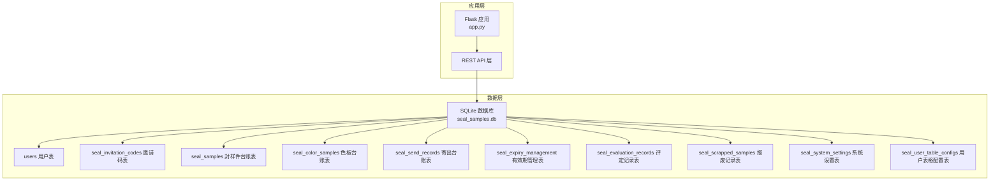
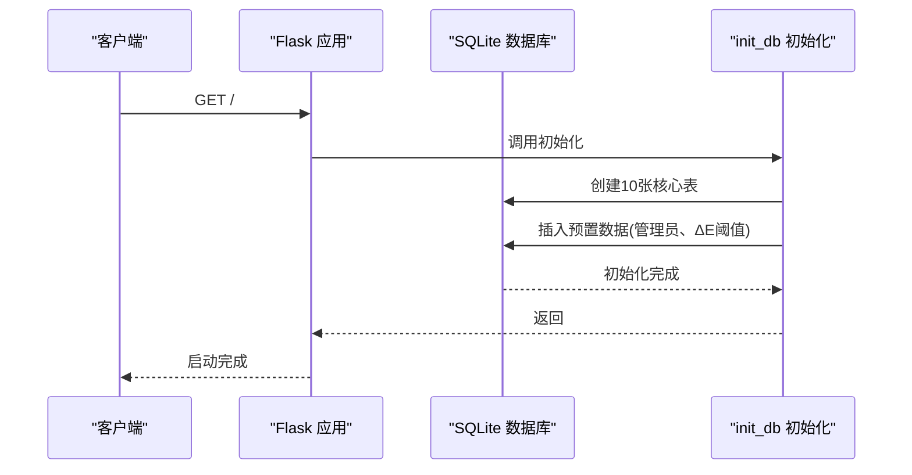

# 数据库架构设计

<cite>
**本文档引用的文件**
- [app.py](file://app.py)
- [requirements.txt](file://requirements.txt)
</cite>

## 目录
1. [简介](#简介)
2. [项目结构](#项目结构)
3. [核心组件](#核心组件)
4. [架构总览](#架构总览)
5. [详细组件分析](#详细组件分析)
6. [依赖关系分析](#依赖关系分析)
7. [性能考虑](#性能考虑)
8. [故障排查指南](#故障排查指南)
9. [结论](#结论)
10. [附录](#附录)

## 简介
本文件为“封样件及色板接收登记管理系统”的数据库架构设计文档，聚焦于系统运行所需的10张核心数据表，涵盖表结构、字段定义、主外键关系、约束条件、表间关联关系、初始化流程、索引设计建议以及SQLite选型的原因与性能考量。文档同时提供ER关系图与数据字典，帮助开发与运维人员快速理解与维护数据库。

## 项目结构
系统采用Flask + SQLite架构，数据库初始化在应用启动时自动执行，创建10张核心表并插入预置数据。前端通过REST API访问后端，后端通过SQLite连接池进行数据持久化。



**图表来源**
- [app.py:88-335](file://app.py#L88-L335)

**章节来源**
- [app.py:21-335](file://app.py#L21-L335)

## 核心组件
本系统围绕10张核心表构建，覆盖用户管理、邀请码、封样件台账、色板台账、寄出台账、有效期管理、评定记录、报废记录、系统设置与用户表格配置。每张表均具备明确的业务职责与约束，确保数据一致性与可追溯性。

- users 用户表：存储系统用户信息，支持管理员与普通用户角色，内置激活/停用状态与邀请码关联。
- seal_invitation_codes 邀请码表：管理注册邀请码，支持最大使用次数、过期时间与创建者关联。
- seal_samples 封样件台账表：记录封样件的编号、项目、签署人、有效期、状态与提醒天数等。
- seal_color_samples 色板台账表：记录色板的客户、车型、颜色名称、色值、ΔL/Δa/Δb/Δc/Δh/ΔE、有效期、状态等。
- seal_send_records 寄出台账表：记录色板寄出的客户、单位、数量、日期、经手人与备注。
- seal_expiry_management 有效期管理表：集中管理有效期类型、时长、单位、截止日期与提醒天数。
- seal_evaluation_records 评定记录表：记录封样件/色板的评定结果、ΔE值、新有效期截止日与旧有效期备份。
- seal_scrapped_samples 报废记录表：记录报废原因、类型、日期、审批人与旧状态备份。
- seal_system_settings 系统设置表：存储系统级配置，如ΔE阈值等。
- seal_user_table_configs 用户表格配置表：存储用户的页面筛选与列显示配置。

**章节来源**
- [app.py:88-335](file://app.py#L88-L335)

## 架构总览
系统采用单机SQLite数据库，通过Flask应用在启动时初始化所有表结构与预置数据。各API模块基于表间关系进行数据读写，支持导入导出、分页、动态筛选与软删除机制，保障业务连续性与审计可追溯。



**图表来源**
- [app.py:88-335](file://app.py#L88-L335)

## 详细组件分析

### users 用户表
- 主键：id（自增）
- 关键字段：
  - username（唯一，非空）
  - password_hash（非空）
  - real_name（非空）
  - is_admin（整型，0/1）
  - is_active（整型，0/1，默认1）
  - must_change_password（整型，0/1，默认0）
  - invitation_code_id（外键，引用邀请码表）
  - created_at（时间戳，默认当前时间）
  - last_active（时间戳，兼容字段）
- 约束与关系：
  - username唯一
  - invitation_code_id外键引用seal_invitation_codes(id)，级联删除风险需注意
- 业务规则：
  - 登录校验密码哈希
  - Token鉴权时检查is_active
  - 在线状态通过last_active字段维护

**章节来源**
- [app.py:93-107](file://app.py#L93-L107)
- [app.py:286-294](file://app.py#L286-L294)

### seal_invitation_codes 邀请码表
- 主键：id（自增）
- 关键字段：
  - code（唯一，非空）
  - note（文本）
  - max_uses（整型，默认1）
  - used_count（整型，默认0）
  - expires_at（日期）
  - is_active（整型，默认1）
  - created_by（外键，引用users.id）
  - created_at（时间戳，默认当前时间）
- 约束与关系：
  - code唯一
  - created_by外键引用users(id)
- 业务规则：
  - 注册时校验邀请码有效性、使用次数与过期时间
  - 每次注册成功后used_count+1

**章节来源**
- [app.py:113-127](file://app.py#L113-L127)
- [app.py:517-542](file://app.py#L517-L542)

### seal_samples 封样件台账表
- 主键：id（自增）
- 关键字段：
  - 序号（唯一，整型）
  - 项目（文本）
  - 封样件名称（文本）
  - 签署人（文本）
  - 签署人日期（日期）
  - 有效期（日期）
  - 状态（文本，默认normal）
  - 备注（文本）
  - created_at/updated_at（时间戳，默认当前时间）
  - 提醒天数（整型，默认30，兼容字段）
- 约束与关系：
  - 序号唯一
  - 状态受有效期与提醒天数影响，动态计算
- 业务规则：
  - 新增/更新时自动计算状态
  - 导入/导出支持Excel模板
  - 删除前检查是否已报废

**章节来源**
- [app.py:129-144](file://app.py#L129-L144)
- [app.py:625-690](file://app.py#L625-L690)
- [app.py:720-795](file://app.py#L720-L795)

### seal_color_samples 色板台账表
- 主键：id（自增）
- 关键字段：
  - 序号（整型）
  - 客户（文本）
  - 适用车型（文本）
  - 颜色名称（文本）
  - 样板供应商（文本）
  - 颜色色值转化码（文本）
  - 纹理代码（文本）
  - 光泽度（文本）
  - 供应商代码（文本）
  - 制作信息（文本）
  - 接收数量（整型）
  - 当前持有数量（整型，默认0）
  - 接收日期（日期）
  - 使用的光源角度（文本）
  - L/a/b/c/h值（浮点数）
  - ΔL/Δa/Δb/Δc/Δh/ΔE值（浮点数）
  - 备注（文本）
  - 有效期（日期）
  - 状态（文本，默认normal）
  - created_at/updated_at（时间戳，默认当前时间）
  - 提醒天数（整型，默认30，兼容字段）
- 约束与关系：
  - 状态受有效期与提醒天数影响，动态计算
- 业务规则：
  - 新增/更新时自动计算状态
  - 导入时若ΔE为空则根据ΔL/Δa/Δb计算
  - 删除前检查是否存在寄出记录

**章节来源**
- [app.py:152-187](file://app.py#L152-L187)
- [app.py:843-916](file://app.py#L843-L916)
- [app.py:953-1041](file://app.py#L953-L1041)

### seal_send_records 寄出台账表
- 主键：id（自增）
- 关键字段：
  - sample_id（外键，引用seal_color_samples.id）
  - 客户（文本）
  - 颜色名称（文本）
  - 对方单位（文本）
  - 寄出数量（整型）
  - 寄出日期（日期）
  - 经手人（文本）
  - 备注（文本）
  - created_at（时间戳，默认当前时间）
- 约束与关系：
  - sample_id外键引用seal_color_samples(id)
- 业务规则：
  - 新增时校验色板状态与当前持有数量
  - 删除时恢复库存
  - 支持与色板表进行LEFT JOIN查询

**章节来源**
- [app.py:202-217](file://app.py#L202-L217)
- [app.py:1045-1156](file://app.py#L1045-L1156)

### seal_expiry_management 有效期管理表
- 主键：id（自增）
- 关键字段：
  - item_type（文本）
  - item_id（整型）
  - 有效期类型（文本）
  - 有效期时长（整型）
  - 有效期单位（文本）
  - 有效期截止日期（日期）
  - 提醒天数（整型，默认30）
  - 备注（文本）
  - created_by（外键，引用users.id）
  - created_at/updated_at（时间戳，默认当前时间）
- 约束与关系：
  - created_by外键引用users(id)
- 业务规则：
  - 用于集中管理有效期策略，支持按item_type/item_id维度配置

**章节来源**
- [app.py:219-235](file://app.py#L219-L235)
- [app.py:1175-1208](file://app.py#L1175-L1208)

### seal_evaluation_records 评定记录表
- 主键：id（自增）
- 关键字段：
  - item_type（文本）
  - item_id（整型）
  - 评定结果（文本）
  - 评定人（文本）
  - 评定日期（日期）
  - 当前L/a/b值（浮点数）
  - 计算ΔE值（浮点数）
  - 评定说明（文本）
  - 新有效期截止日（日期）
  - 旧有效期（文本）
  - created_by（外键，引用users.id）
  - created_at（时间戳，默认当前时间）
  - is_deleted（整型，默认0，软删除）
- 约束与关系：
  - created_by外键引用users(id)
- 业务规则：
  - 合格续期时更新对应台账的有效期与状态
  - 支持软删除与恢复，回滚台账影响

**章节来源**
- [app.py:237-255](file://app.py#L237-L255)
- [app.py:1212-1287](file://app.py#L1212-L1287)
- [app.py:1628-1807](file://app.py#L1628-L1807)

### seal_scrapped_samples 报废记录表
- 主键：id（自增）
- 关键字段：
  - item_type（文本）
  - item_id（整型）
  - 报废原因（文本）
  - 报废类型（文本）
  - 报废日期（日期）
  - 报废审批人（文本）
  - created_by（外键，引用users.id）
  - created_at（时间戳，默认当前时间）
  - 备注（文本）
  - 旧状态（文本）
  - is_deleted（整型，默认0，软删除）
- 约束与关系：
  - created_by外键引用users(id)
- 业务规则：
  - 报废后锁定台账状态
  - 支持软删除与恢复，回滚台账状态

**章节来源**
- [app.py:257-271](file://app.py#L257-L271)
- [app.py:1289-1355](file://app.py#L1289-L1355)
- [app.py:1628-1807](file://app.py#L1628-L1807)

### seal_system_settings 系统设置表
- 主键：id（自增）
- 关键字段：
  - key（唯一，非空）
  - value（文本，非空）
  - description（文本）
  - updated_by（外键，引用users.id）
  - updated_at（时间戳，默认当前时间）
- 约束与关系：
  - key唯一
  - updated_by外键引用users(id)
- 业务规则：
  - 存储系统级配置，如ΔE阈值
  - 预置默认阈值

**章节来源**
- [app.py:273-284](file://app.py#L273-L284)
- [app.py:295-308](file://app.py#L295-L308)

### seal_user_table_configs 用户表格配置表
- 主键：id（自增）
- 关键字段：
  - user_id（整型，非空）
  - page_key（文本，非空）
  - config_type（文本，非空）
  - config_data（文本，默认{}）
  - updated_at（时间戳，默认当前时间）
  - 唯一约束：(user_id, page_key, config_type)
  - user_id外键引用users(id)
- 约束与关系：
  - 唯一约束保证每个用户在每个页面的每种配置类型唯一
- 业务规则：
  - 存储用户筛选与列显示配置，支持JSON序列化

**章节来源**
- [app.py:309-321](file://app.py#L309-L321)
- [app.py:1580-1626](file://app.py#L1580-L1626)

## 依赖关系分析

```mermaid
erDiagram
USERS {
integer id PK
text username UK
text password_hash
text real_name
integer is_admin
integer is_active
integer must_change_password
integer invitation_code_id FK
timestamp created_at
timestamp last_active
}
SEAL_INVITATION_CODES {
integer id PK
text code UK
text note
integer max_uses
integer used_count
date expires_at
integer is_active
integer created_by FK
timestamp created_at
}
SEAL_SAMPLES {
integer id PK
integer 序号 UK
text 项目
text 封样件名称
text 签署人
date 签署人日期
date 有效期
text 状态
text 备注
timestamp created_at
timestamp updated_at
integer 提醒天数
}
SEAL_COLOR_SAMPLES {
integer id PK
integer 序号
text 客户
text 适用车型
text 颜色名称
text 样板供应商
text 颜色色值转化码
text 纹理代码
text 光泽度
text 供应商代码
text 制作信息
integer 接收数量
integer 当前持有数量
date 接收日期
text 使用的光源角度
real L值
real a值
real b值
real c值
real h值
real ΔL值
real Δa值
real Δb值
real Δc值
real Δh值
real ΔE值
text 备注
date 有效期
text 状态
timestamp created_at
timestamp updated_at
integer 提醒天数
}
SEAL_SEND_RECORDS {
integer id PK
integer sample_id FK
text 客户
text 颜色名称
text 对方单位
integer 寄出数量
date 寄出日期
text 经手人
text 备注
timestamp created_at
}
SEAL_EXPIRY_MANAGEMENT {
integer id PK
text item_type
integer item_id
text 有效期类型
integer 有效期时长
text 有效期单位
date 有效期截止日期
integer 提醒天数
text 备注
integer created_by FK
timestamp created_at
timestamp updated_at
}
SEAL_EVALUATION_RECORDS {
integer id PK
text item_type
integer item_id
text 评定结果
text 评定人
date 评定日期
real 当前L值
real 当前a值
real 当前b值
real 计算ΔE值
text 评定说明
date 新有效期截止日
text 旧有效期
integer created_by FK
timestamp created_at
integer is_deleted
}
SEAL_SCRAPPED_SAMPLES {
integer id PK
text item_type
integer item_id
text 报废原因
text 报废类型
date 报废日期
text 报废审批人
integer created_by FK
timestamp created_at
text 备注
text 旧状态
integer is_deleted
}
SEAL_SYSTEM_SETTINGS {
integer id PK
text key UK
text value
text description
integer updated_by FK
timestamp updated_at
}
SEAL_USER_TABLE_CONFIGS {
integer id PK
integer user_id FK
text page_key
text config_type
text config_data
timestamp updated_at
unique(user_id, page_key, config_type)
}
USERS ||--o{ SEAL_INVITATION_CODES : "created_by"
USERS ||--o{ SEAL_EVALUATION_RECORDS : "created_by"
USERS ||--o{ SEAL_SCRAPPED_SAMPLES : "created_by"
USERS ||--o{ SEAL_SYSTEM_SETTINGS : "updated_by"
USERS ||--o{ SEAL_USER_TABLE_CONFIGS : "user_id"
SEAL_COLOR_SAMPLES ||--o{ SEAL_SEND_RECORDS : "id -> sample_id"
```

**图表来源**
- [app.py:88-335](file://app.py#L88-L335)

**章节来源**
- [app.py:88-335](file://app.py#L88-L335)

## 性能考虑
- 单机SQLite优势：
  - 部署简单，无需独立数据库实例
  - 事务ACID特性强，适合中小规模业务
  - 读写分离与高并发场景有限，适合单机部署
- 性能优化建议：
  - 为高频查询字段建立索引（如users.username、seal_color_samples.颜色名称、seal_send_records.sample_id）
  - 分页查询使用LIMIT/OFFSET，避免一次性加载大量数据
  - 导入导出使用批量写入，减少事务开销
  - 控制JSON配置字段大小，避免超大JSON导致查询变慢
- 可扩展性：
  - 若业务增长，可迁移至PostgreSQL/MySQL，利用分区、索引与连接池提升性能
  - 评估引入Redis缓存热点数据（如系统设置）

[本节为通用性能指导，不直接分析具体文件]

## 故障排查指南
- 初始化失败：
  - 检查数据库路径与权限
  - 确认init_db()执行成功，确认10张表均已创建
- 用户相关问题：
  - 登录失败：核对用户名/密码哈希是否匹配
  - Token过期/无效：检查SECRET_KEY与JWT签名算法
- 数据一致性问题：
  - 寄出数量超出现有库存：检查seal_color_samples.当前持有数量与seal_send_records.寄出数量
  - 删除失败：色板存在寄出记录或已报废
- 导入导出异常：
  - Excel模板字段顺序与数据库字段顺序一致
  - 导入时日期字段格式为YYYY-MM-DD
- 软删除与恢复：
  - 管理员可软删除处置记录并回滚台账
  - 永久删除会清理处置记录与关联寄出记录

**章节来源**
- [app.py:88-335](file://app.py#L88-L335)
- [app.py:1045-1156](file://app.py#L1045-L1156)
- [app.py:1289-1355](file://app.py#L1289-L1355)
- [app.py:1628-1807](file://app.py#L1628-L1807)

## 结论
本数据库架构围绕10张核心表构建，清晰划分用户、邀请码、封样件、色板、寄出、有效期、评定、报废、系统设置与用户配置等模块，通过外键约束与软删除机制保障数据一致性与可追溯性。SQLite选型满足当前业务规模，具备良好可维护性；随着业务增长，可平滑迁移到更强大的数据库引擎。

[本节为总结性内容，不直接分析具体文件]

## 附录

### 数据库初始化流程
- 创建10张核心表
- 插入预置数据：
  - admin用户（用户名admin，管理员）
  - ΔE阈值设置（优秀、合格、需关注）
- 兼容性增强：
  - 为现有表补充缺失列（如提醒天数、ΔE相关列、软删除字段）
- 连接与上下文：
  - 应用启动时调用init_db()
  - 使用Flask g对象管理数据库连接生命周期

**章节来源**
- [app.py:88-335](file://app.py#L88-L335)
- [app.py:2187-2197](file://app.py#L2187-L2197)

### SQLite选型与原因
- 优点：
  - 零配置部署，便于开发与测试
  - 文件式数据库，便于备份与迁移
  - 事务与ACID特性完善
- 适用场景：
  - 中小型业务系统
  - 单机部署，无需高并发
- 限制：
  - 并发写入受限
  - 缺少高级特性（如分区、复制）

**章节来源**
- [requirements.txt:1-5](file://requirements.txt#L1-L5)
- [app.py:21-335](file://app.py#L21-L335)