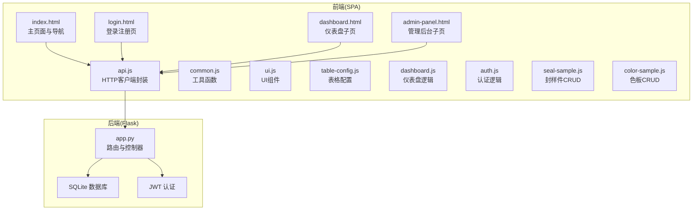
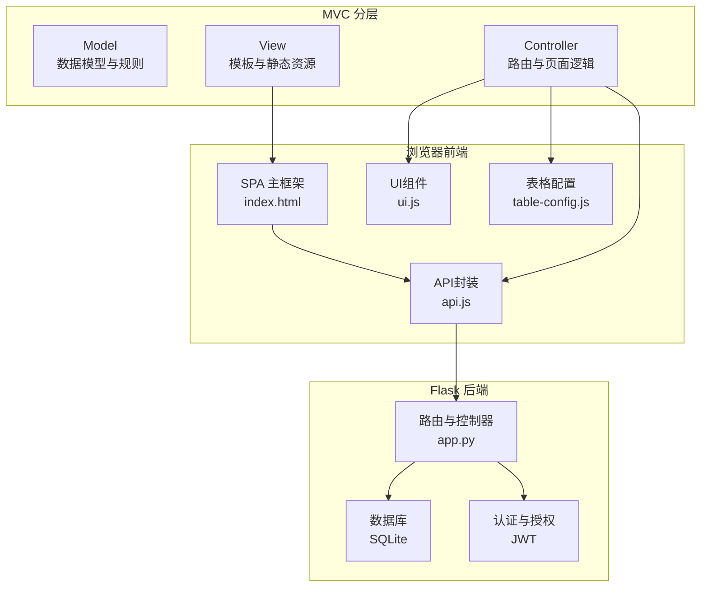
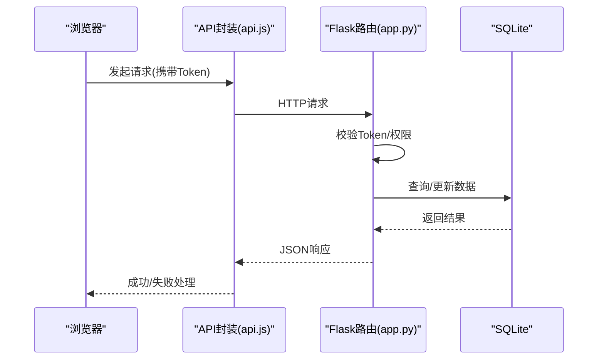
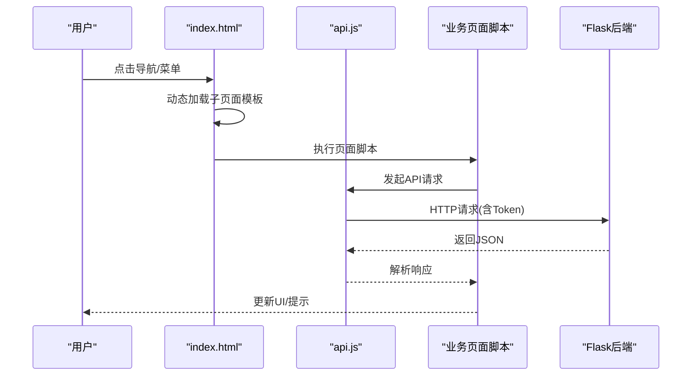
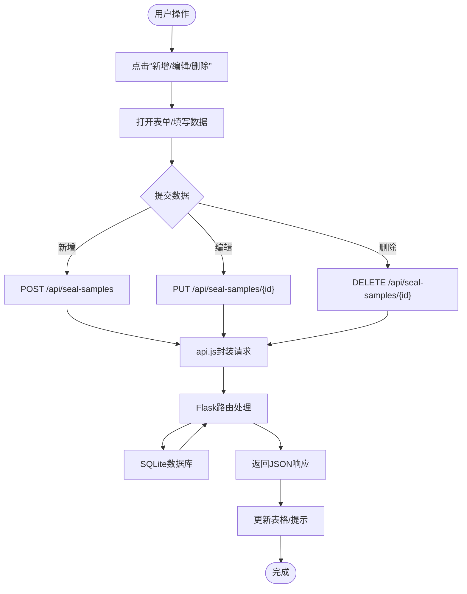
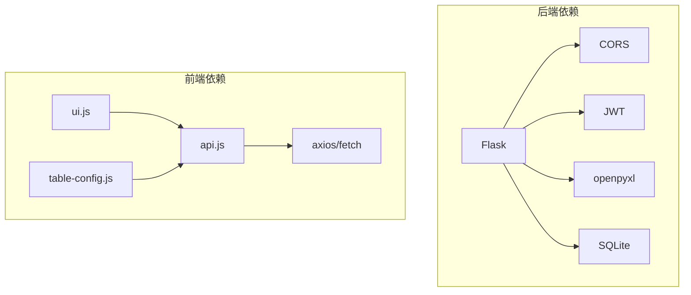

# 整体架构概览

<cite>
**本文档引用的文件**
- [app.py](file://app.py)
- [requirements.txt](file://requirements.txt)
- [index.html](file://templates/index.html)
- [login.html](file://templates/login.html)
- [dashboard.html](file://templates/dashboard.html)
- [admin-panel.html](file://templates/admin-panel.html)
- [api.js](file://static/js/api.js)
- [common.js](file://static/js/common.js)
- [ui.js](file://static/js/ui.js)
- [table-config.js](file://static/js/table-config.js)
- [dashboard.js](file://static/js/dashboard.js)
- [auth.js](file://static/js/auth.js)
- [seal-sample.js](file://static/js/seal-sample.js)
- [color-sample.js](file://static/js/color-sample.js)
</cite>

## 目录
1. [引言](#引言)
2. [项目结构](#项目结构)
3. [核心组件](#核心组件)
4. [架构总览](#架构总览)
5. [详细组件分析](#详细组件分析)
6. [依赖关系分析](#依赖关系分析)
7. [性能考量](#性能考量)
8. [故障排查指南](#故障排查指南)
9. [结论](#结论)
10. [附录](#附录)

## 引言
本系统为“封样件及色板接收登记管理系统”，采用前后端分离架构：后端使用Python Flask提供RESTful API与数据库访问；前端采用单页应用（SPA）模式，通过动态页面加载与异步数据交互实现用户体验优化。系统围绕MVC设计思想组织：后端控制器负责路由与业务编排，模型层负责数据持久化与规则计算，视图层通过模板与静态资源渲染页面。

## 项目结构
系统采用典型的Web工程目录划分：
- 后端入口与路由：app.py
- 前端模板：templates/*.html
- 前端静态资源：static/js/*.js、static/css/*.css
- 依赖声明：requirements.txt

图表来源
- [app.py:1-2197](file://app.py#L1-L2197)
- [index.html:1-239](file://templates/index.html#L1-L239)
- [login.html:1-144](file://templates/login.html#L1-L144)
- [dashboard.html:1-34](file://templates/dashboard.html#L1-L34)
- [admin-panel.html:1-107](file://templates/admin-panel.html#L1-L107)
- [api.js:1-88](file://static/js/api.js#L1-L88)
- [common.js:1-135](file://static/js/common.js#L1-L135)
- [ui.js:1-224](file://static/js/ui.js#L1-L224)
- [table-config.js:1-552](file://static/js/table-config.js#L1-L552)
- [dashboard.js:1-117](file://static/js/dashboard.js#L1-L117)
- [auth.js:1-204](file://static/js/auth.js#L1-L204)
- [seal-sample.js:1-181](file://static/js/seal-sample.js#L1-L181)
- [color-sample.js:1-267](file://static/js/color-sample.js#L1-L267)

章节来源
- [app.py:1-2197](file://app.py#L1-L2197)
- [requirements.txt:1-5](file://requirements.txt#L1-L5)

## 核心组件
- 后端核心
  - Flask应用与路由：统一在app.py中定义RESTful接口，包含认证、封样件、色板、寄出、处置等模块。
  - 数据库与模型：SQLite作为本地存储，内置多张业务表（用户、封样件、色板、寄出、有效期、评定、报废、系统设置、用户表格配置等），并提供初始化与兼容性迁移。
  - 认证与授权：基于JWT的Token机制，支持Header与Query两种传递方式；提供管理员权限校验。
  - 工具与算法：提供分页、动态筛选、有效期状态计算、ΔE色差计算等通用能力。
- 前端核心
  - SPA主框架：index.html负责侧边导航、面包屑、页面容器与全局状态（Token、用户信息）维护。
  - API封装：api.js统一处理请求、响应、401自动跳转与上传。
  - UI组件：ui.js提供Toast、Modal、Confirm、Loading、Drawer等基础组件。
  - 表格配置：table-config.js抽象各页面的字段定义、筛选面板、列设置与渲染器。
  - 页面逻辑：dashboard.js、auth.js、seal-sample.js、color-sample.js分别承载仪表盘、认证、封样件与色板的业务逻辑。

章节来源
- [app.py:47-584](file://app.py#L47-L584)
- [app.py:88-335](file://app.py#L88-L335)
- [app.py:337-450](file://app.py#L337-L450)
- [api.js:1-88](file://static/js/api.js#L1-L88)
- [ui.js:1-224](file://static/js/ui.js#L1-L224)
- [table-config.js:1-552](file://static/js/table-config.js#L1-L552)
- [dashboard.js:1-117](file://static/js/dashboard.js#L1-L117)
- [auth.js:1-204](file://static/js/auth.js#L1-L204)
- [seal-sample.js:1-181](file://static/js/seal-sample.js#L1-L181)
- [color-sample.js:1-267](file://static/js/color-sample.js#L1-L267)

## 架构总览
系统采用经典的MVC模式：
- Model（模型）：后端通过SQLite表结构与业务规则实现数据模型，提供数据访问与计算（如有效期状态、ΔE色差）。
- View（视图）：前端模板与静态资源构成页面视图，index.html作为SPA入口，动态加载子页面（dashboard、admin-panel等）。
- Controller（控制器）：后端路由函数承担控制器职责，解析请求、调用模型、返回响应；前端页面脚本承担视图控制器职责，处理用户交互、发起异步请求、更新DOM。

图表来源
- [app.py:1-2197](file://app.py#L1-L2197)
- [index.html:1-239](file://templates/index.html#L1-L239)
- [api.js:1-88](file://static/js/api.js#L1-L88)
- [ui.js:1-224](file://static/js/ui.js#L1-L224)
- [table-config.js:1-552](file://static/js/table-config.js#L1-L552)

## 详细组件分析

### 后端Flask应用（MVC中的Controller与Model）
- 路由与控制器
  - 认证模块：登录、注册、修改密码、心跳、退出登录，均受token_required装饰器保护。
  - 业务模块：封样件与色板的CRUD、导入导出、有效期管理、评定记录、寄出台账、报废记录、系统设置、用户表格配置等。
  - 工具函数：分页、动态筛选、有效期状态计算、ΔE色差计算、邀请码生成等。
- 数据模型与初始化
  - 10张核心业务表，包含用户、封样件、色板、寄出、有效期、评定、报废、系统设置、用户表格配置等。
  - 初始化时预置admin用户与ΔE阈值设置，并进行列兼容性迁移。
- 认证与授权
  - HS256签名的JWT Token，支持Header与Query两种传递方式；401时自动跳转登录。
  - 管理员权限校验，禁止禁用账户访问。

图表来源
- [api.js:1-88](file://static/js/api.js#L1-L88)
- [app.py:49-76](file://app.py#L49-L76)
- [app.py:454-584](file://app.py#L454-L584)

章节来源
- [app.py:49-76](file://app.py#L49-L76)
- [app.py:88-335](file://app.py#L88-L335)
- [app.py:337-450](file://app.py#L337-L450)
- [app.py:454-584](file://app.py#L454-L584)

### 前端SPA（MVC中的View与Controller）
- 主框架与导航
  - index.html作为SPA入口，负责侧边导航、面包屑、页面容器与全局状态（Token、用户信息）维护；支持动态加载子页面模板并按序执行脚本。
- API封装与认证
  - api.js统一处理请求头、Token附加、401自动跳转登录、上传处理等。
  - auth.js处理登录/注册表单、密码强度校验、强制改密流程。
- UI组件与表格配置
  - ui.js提供Toast、Modal、Confirm、Loading、Drawer等基础组件。
  - table-config.js抽象各页面字段定义、筛选面板、列设置与渲染器，支持本地缓存与后端同步。
- 业务页面
  - dashboard.js：仪表盘统计卡片与预警列表渲染。
  - seal-sample.js：封样件台账的CRUD、筛选、分页、导入导出。
  - color-sample.js：色板台账的CRUD、展开行、ΔE摘要、寄出流程。

图表来源
- [index.html:143-185](file://templates/index.html#L143-L185)
- [api.js:1-88](file://static/js/api.js#L1-L88)
- [dashboard.js:1-117](file://static/js/dashboard.js#L1-L117)
- [seal-sample.js:1-181](file://static/js/seal-sample.js#L1-L181)
- [color-sample.js:1-267](file://static/js/color-sample.js#L1-L267)

章节来源
- [index.html:143-185](file://templates/index.html#L143-L185)
- [api.js:1-88](file://static/js/api.js#L1-L88)
- [auth.js:1-204](file://static/js/auth.js#L1-L204)
- [ui.js:1-224](file://static/js/ui.js#L1-L224)
- [table-config.js:1-552](file://static/js/table-config.js#L1-L552)
- [dashboard.js:1-117](file://static/js/dashboard.js#L1-L117)
- [seal-sample.js:1-181](file://static/js/seal-sample.js#L1-L181)
- [color-sample.js:1-267](file://static/js/color-sample.js#L1-L267)

### 数据流与交互流程（以封样件CRUD为例）

图表来源
- [seal-sample.js:124-144](file://static/js/seal-sample.js#L124-L144)
- [api.js:1-88](file://static/js/api.js#L1-L88)
- [app.py:624-690](file://app.py#L624-L690)

章节来源
- [seal-sample.js:124-144](file://static/js/seal-sample.js#L124-L144)
- [api.js:1-88](file://static/js/api.js#L1-L88)
- [app.py:624-690](file://app.py#L624-L690)

## 依赖关系分析
- 技术栈与版本
  - Flask>=3.0.0：提供路由、模板渲染、跨域支持等。
  - flask-cors>=4.0.0：启用CORS，支持前端跨域请求。
  - PyJWT>=2.8.0：JWT签名与验证。
  - openpyxl>=3.1.0：Excel导入导出。
- 组件耦合
  - 前端各页面脚本通过api.js与后端解耦；ui.js与table-config.js提供通用能力复用。
  - 后端路由与数据库访问通过工具函数解耦，便于扩展与维护。

图表来源
- [requirements.txt:1-5](file://requirements.txt#L1-L5)
- [api.js:1-88](file://static/js/api.js#L1-L88)
- [ui.js:1-224](file://static/js/ui.js#L1-L224)
- [table-config.js:1-552](file://static/js/table-config.js#L1-L552)

章节来源
- [requirements.txt:1-5](file://requirements.txt#L1-L5)

## 性能考量
- 前端性能
  - 动态页面加载与脚本按序执行，避免一次性加载过多资源；表格分页与筛选减少一次性渲染压力。
  - 本地缓存策略：表格列配置与筛选条件优先使用localStorage，降低后端压力。
- 后端性能
  - SQLite适合中小规模数据与单机部署；对于大数据量建议评估分页与索引优化。
  - JWT Token校验与数据库查询应避免冗余操作，必要时增加缓存与批量处理。
- 交互体验
  - 401自动跳转登录与心跳保活提升用户体验；Toast与Loading反馈及时明确。

## 故障排查指南
- 登录失败
  - 检查用户名/密码是否正确；确认账户未被禁用；查看401响应与自动跳转逻辑。
- Token失效
  - 401时自动清除本地Token并跳转登录；检查JWT签名与过期时间配置。
- 数据加载异常
  - 检查api.js请求封装与响应解析；确认后端路由与数据库连接。
- 表格筛选/列设置异常
  - 检查table-config.js的本地缓存与后端同步逻辑；确认字段定义与渲染器映射。

章节来源
- [api.js:1-88](file://static/js/api.js#L1-L88)
- [table-config.js:165-226](file://static/js/table-config.js#L165-L226)
- [app.py:49-76](file://app.py#L49-L76)

## 结论
本系统通过Flask后端与前端SPA的前后端分离架构，实现了清晰的MVC分层与良好的用户体验。后端提供稳定可靠的RESTful服务与数据模型，前端通过统一的API封装与UI组件实现高效开发与一致交互。系统在功能完整性、可维护性与扩展性方面具备良好基础，适合持续迭代与功能拓展。

## 附录
- 系统边界
  - 后端边界：仅暴露RESTful API，内部通过SQLite存储与JWT鉴权；模板渲染仅用于登录页与管理后台。
  - 前端边界：index.html作为SPA入口，其余页面通过动态加载；所有业务交互通过api.js发起请求。
- 技术选型说明
  - Flask：轻量级Web框架，适合中小型项目与快速迭代。
  - SQLite：本地存储，部署简单，适合单机场景。
  - JWT：无状态认证，便于前后端分离与跨域。
  - openpyxl：Excel处理，满足导入导出需求。
  - 前端：原生JavaScript模块化，避免复杂构建工具，便于维护。