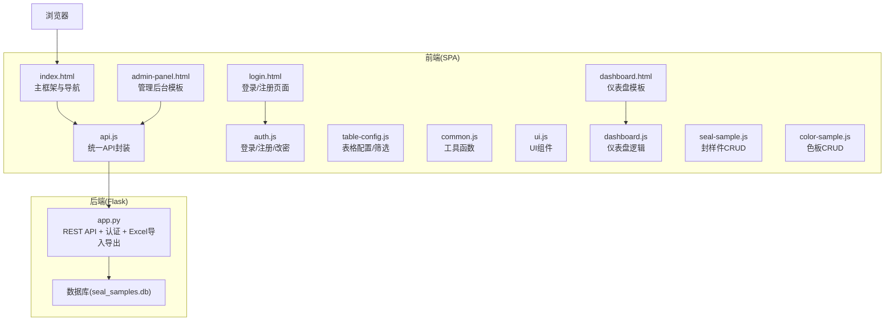
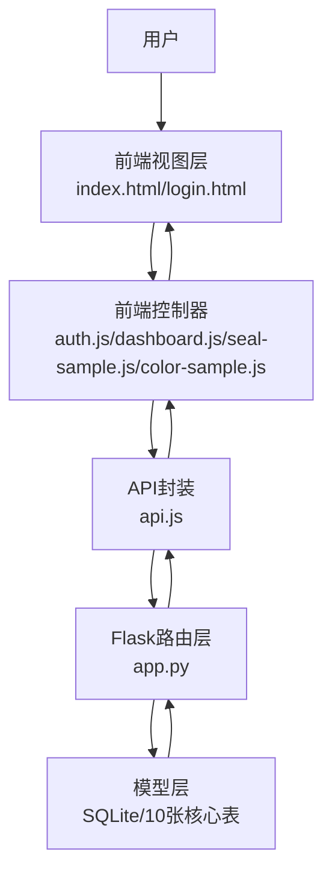
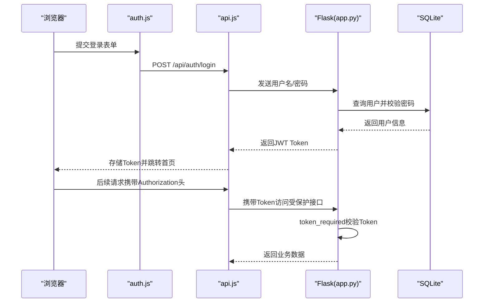
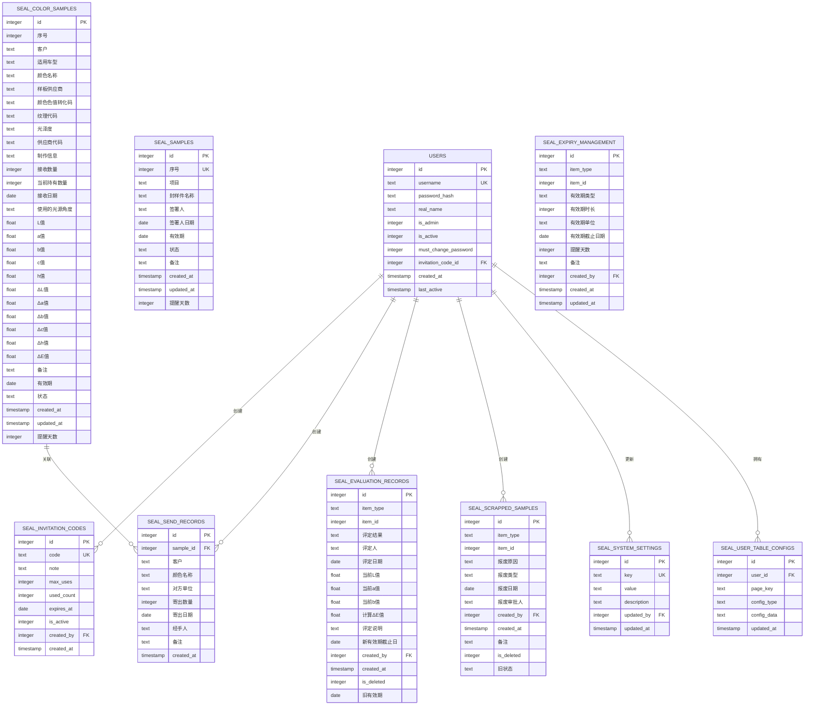
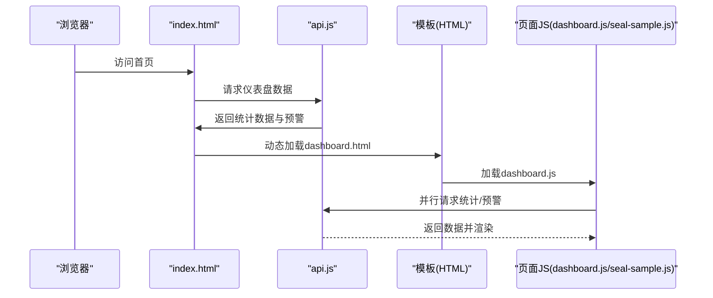
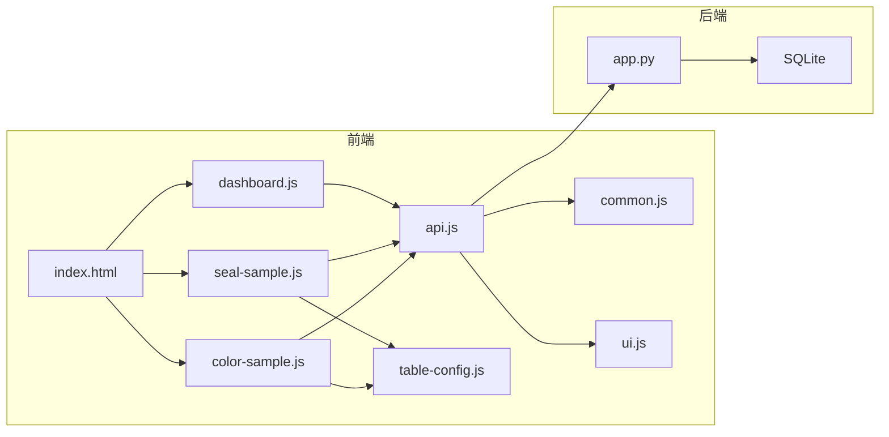

# 系统架构设计

<cite>
**本文档引用的文件**
- [app.py](file://app.py)
- [requirements.txt](file://requirements.txt)
- [api.js](file://static/js/api.js)
- [auth.js](file://static/js/auth.js)
- [common.js](file://static/js/common.js)
- [ui.js](file://static/js/ui.js)
- [table-config.js](file://static/js/table-config.js)
- [dashboard.js](file://static/js/dashboard.js)
- [seal-sample.js](file://static/js/seal-sample.js)
- [color-sample.js](file://static/js/color-sample.js)
- [index.html](file://templates/index.html)
- [login.html](file://templates/login.html)
- [dashboard.html](file://templates/dashboard.html)
- [admin-panel.html](file://templates/admin-panel.html)
- [start_server.bat](file://start_server.bat)
</cite>

## 目录
1. [引言](#引言)
2. [项目结构](#项目结构)
3. [核心组件](#核心组件)
4. [架构总览](#架构总览)
5. [详细组件分析](#详细组件分析)
6. [依赖关系分析](#依赖关系分析)
7. [性能考量](#性能考量)
8. [故障排查指南](#故障排查指南)
9. [结论](#结论)
10. [附录](#附录)

## 引言
本系统为“封样件及色板接收登记管理系统”，采用前后端分离架构：后端使用Flask提供RESTful API服务，前端使用纯JavaScript实现单页应用（SPA）。系统围绕10张核心数据表构建，涵盖用户管理、封样件台账、色板台账、寄出台账、有效期管理、评定记录、报废记录、系统设置以及用户表格配置等业务模块。系统通过JWT实现认证与授权，使用CORS支持跨域访问，并集成Excel导入导出功能。

## 项目结构
系统采用典型的前后端分离目录组织方式：
- 后端：Python Flask应用，集中于根目录的app.py，负责数据库初始化、路由定义、认证与业务逻辑。
- 前端：静态资源位于static目录，包含CSS样式与JS模块；页面模板位于templates目录，由后端渲染或SPA动态加载。
- 依赖：requirements.txt声明Flask、CORS、JWT、openpyxl等依赖。
- 启动：start_server.bat一键安装依赖并启动本地开发服务器。

**图表来源**
- [app.py](file://app.py)
- [index.html](file://templates/index.html)
- [login.html](file://templates/login.html)
- [dashboard.html](file://templates/dashboard.html)
- [admin-panel.html](file://templates/admin-panel.html)
- [api.js](file://static/js/api.js)
- [auth.js](file://static/js/auth.js)
- [table-config.js](file://static/js/table-config.js)
- [common.js](file://static/js/common.js)
- [ui.js](file://static/js/ui.js)
- [dashboard.js](file://static/js/dashboard.js)
- [seal-sample.js](file://static/js/seal-sample.js)
- [color-sample.js](file://static/js/color-sample.js)

**章节来源**
- [app.py](file://app.py)
- [requirements.txt](file://requirements.txt)
- [start_server.bat](file://start_server.bat)

## 核心组件
- Flask后端服务
  - 认证与授权：基于JWT的token_required/admin_required装饰器，支持Header与Query两种Token传递方式。
  - RESTful API：提供用户、封样件、色板、寄出、有效期管理、评定记录、报废记录、系统设置、表格配置等接口。
  - Excel集成：使用openpyxl进行导入导出，支持多字段映射与错误处理。
  - 数据库：SQLite，初始化10张核心表，包含兼容性迁移与字段补全。
- 前端SPA
  - 主框架：index.html负责侧边导航、面包屑、页面容器与全局事件。
  - 登录/注册：login.html配合auth.js实现双Tab切换、表单校验与API调用。
  - 通用模块：api.js封装fetch、401自动跳转；ui.js提供Toast、Modal、Confirm等UI；common.js提供日期、ΔE、分页等工具；table-config.js提供筛选与列配置。
  - 业务页面：dashboard.js、seal-sample.js、color-sample.js等分别承载仪表盘与各业务模块的交互逻辑。

**章节来源**
- [app.py](file://app.py)
- [api.js](file://static/js/api.js)
- [auth.js](file://static/js/auth.js)
- [common.js](file://static/js/common.js)
- [ui.js](file://static/js/ui.js)
- [table-config.js](file://static/js/table-config.js)
- [dashboard.js](file://static/js/dashboard.js)
- [seal-sample.js](file://static/js/seal-sample.js)
- [color-sample.js](file://static/js/color-sample.js)
- [index.html](file://templates/index.html)
- [login.html](file://templates/login.html)

## 架构总览
系统采用前后端分离的MVC风格：
- 视图层（View）：HTML模板与SPA页面，负责用户界面与交互。
- 控制器（Controller）：前端JS模块（如auth.js、dashboard.js、seal-sample.js、color-sample.js）处理用户输入与页面逻辑；后端Flask路由承担API控制器职责。
- 模型（Model）：SQLite数据库与10张核心表构成数据模型，后端提供ORM式查询与事务控制。
- 通信层：前端通过api.js封装的fetch与后端REST API通信，携带Authorization头或查询参数传递JWT Token。

**图表来源**
- [index.html](file://templates/index.html)
- [login.html](file://templates/login.html)
- [auth.js](file://static/js/auth.js)
- [dashboard.js](file://static/js/dashboard.js)
- [seal-sample.js](file://static/js/seal-sample.js)
- [color-sample.js](file://static/js/color-sample.js)
- [api.js](file://static/js/api.js)
- [app.py](file://app.py)

## 详细组件分析

### 认证与授权（JWT）
- Token生成与验证
  - 登录成功后，后端使用HS256算法生成JWT，包含user_id、username、is_admin、must_change_password等负载。
  - 前端将Token存储于localStorage并在后续请求中通过Authorization头或查询参数传递。
- 装饰器保护
  - token_required：校验Token有效性、用户存在性、账户启用状态，并更新用户最后活跃时间。
  - admin_required：管理员权限校验。
- 401处理
  - 前端api.js在收到401时自动清理本地Token与用户信息并跳转登录页，同时尝试调用/logout接口清理在线状态。

**图表来源**
- [auth.js](file://static/js/auth.js)
- [api.js](file://static/js/api.js)
- [app.py](file://app.py)

**章节来源**
- [app.py](file://app.py)
- [api.js](file://static/js/api.js)
- [auth.js](file://static/js/auth.js)

### 数据库架构设计（10张核心表）
系统初始化10张核心表，具备兼容性迁移与字段补全能力：

**图表来源**
- [app.py](file://app.py)

**章节来源**
- [app.py](file://app.py)

### RESTful API设计
- 认证相关
  - POST /api/auth/login：用户名/密码登录，返回JWT与用户信息。
  - POST /api/auth/register：邀请码注册，校验邀请码有效性与使用次数。
  - PUT /api/auth/change-password：修改密码，要求原密码正确。
  - GET/POST /api/auth/ping：心跳接口，刷新在线状态。
  - POST /api/auth/logout：退出登录，清理在线状态。
- 封样件管理
  - GET /api/seal-samples：分页查询，支持动态筛选与搜索。
  - POST /api/seal-samples：新增封样件，自动生成序号与状态。
  - GET/PUT/DELETE /api/seal-samples/:id：查看、更新、删除。
  - GET /api/seal-samples/export：导出Excel。
  - POST /api/seal-samples/import：导入Excel。
- 色板管理
  - GET /api/color-samples：分页查询，支持动态筛选与搜索。
  - POST /api/color-samples：新增色板，自动生成序号与状态。
  - GET/PUT/DELETE /api/color-samples/:id：查看、更新、删除。
  - GET /api/color-samples/export：导出Excel。
  - POST /api/color-samples/import：导入Excel。
- 其他模块
  - 寄出台账、有效期管理、评定记录、报废记录、系统设置、表格配置等均有对应的CRUD接口。

**章节来源**
- [app.py](file://app.py)

### 单页应用（SPA）结构
- 页面加载流程
  - index.html作为主框架，加载侧边导航、面包屑与页面容器。
  - 通过fetch动态加载模板（如dashboard.html、seal-sample.html等），并按顺序执行内联脚本与外部JS。
  - SPA页面切换时，按需加载对应JS模块（如dashboard.js、seal-sample.js、color-sample.js）。
- 交互与状态管理
  - 通过localStorage存储Token与用户信息，实现会话持久化。
  - 心跳机制：每2分钟发送一次/ping保持在线状态。
  - 401自动跳转：api.js统一拦截401并跳转登录页。

**图表来源**
- [index.html](file://templates/index.html)
- [dashboard.html](file://templates/dashboard.html)
- [dashboard.js](file://static/js/dashboard.js)
- [api.js](file://static/js/api.js)

**章节来源**
- [index.html](file://templates/index.html)
- [dashboard.html](file://templates/dashboard.html)
- [dashboard.js](file://static/js/dashboard.js)
- [api.js](file://static/js/api.js)

### 前后端分离设计理念
- 分层清晰：后端专注数据与业务逻辑，前端专注用户体验与交互。
- 无模板引擎：后端仅提供API，前端通过SPA渲染页面，提升交互体验与可维护性。
- 统一API封装：api.js集中处理Token、错误与上传，降低重复代码。
- 前端模块化：各页面独立JS模块，按需加载，避免全局污染。

**章节来源**
- [api.js](file://static/js/api.js)
- [index.html](file://templates/index.html)

### CORS跨域支持
- 后端启用flask-cors，允许跨域请求，便于前端开发环境与后端服务分离部署。
- 生产环境建议限制允许的源与方法，增强安全性。

**章节来源**
- [app.py](file://app.py)
- [requirements.txt](file://requirements.txt)

### Excel集成技术实现
- 导入
  - 前端通过FormData上传Excel文件，后端使用openpyxl解析，逐行读取并插入数据库。
  - 支持跳过空行与首列ID（兼容导出模板），并对异常行进行错误收集与提示。
- 导出
  - 后端读取数据库记录，使用openpyxl写入工作簿，设置中文状态映射与列标题，返回下载流。

**章节来源**
- [app.py](file://app.py)

## 依赖关系分析
- 外部依赖
  - Flask：Web框架与路由。
  - flask-cors：跨域支持。
  - PyJWT：JWT生成与验证。
  - openpyxl：Excel导入导出。
- 内部模块依赖
  - 前端：api.js依赖common.js与ui.js；页面JS依赖table-config.js与api.js；index.html依赖多个页面JS。
  - 后端：app.py集中管理数据库初始化、认证装饰器、Excel工具与所有API路由。

**图表来源**
- [api.js](file://static/js/api.js)
- [common.js](file://static/js/common.js)
- [ui.js](file://static/js/ui.js)
- [table-config.js](file://static/js/table-config.js)
- [dashboard.js](file://static/js/dashboard.js)
- [seal-sample.js](file://static/js/seal-sample.js)
- [color-sample.js](file://static/js/color-sample.js)
- [index.html](file://templates/index.html)
- [app.py](file://app.py)

**章节来源**
- [requirements.txt](file://requirements.txt)
- [app.py](file://app.py)

## 性能考量
- 前端
  - SPA按需加载JS，减少初始包体；分页查询避免一次性传输大量数据。
  - 401自动跳转与心跳机制降低无效请求。
- 后端
  - SQLite适合中小规模数据，建议在生产环境评估迁移到更高性能数据库。
  - Excel导入导出批量写入，注意大文件的内存与超时控制。
  - 动态筛选与分页参数优化查询性能，避免全表扫描。

## 故障排查指南
- 登录失败
  - 检查用户名/密码是否正确，确认用户是否被禁用。
  - 查看后端日志与前端控制台错误。
- Token失效
  - 确认Authorization头是否正确携带，或查询参数token是否有效。
  - 检查后端SECRET_KEY是否一致，Token是否过期。
- Excel导入异常
  - 确认Excel列与模板匹配，检查首列ID与日期格式。
  - 查看返回的错误行号与具体异常信息。
- 页面空白或加载失败
  - 检查模板加载路径与网络连通性，确认SPA动态加载逻辑。

**章节来源**
- [api.js](file://static/js/api.js)
- [auth.js](file://static/js/auth.js)
- [app.py](file://app.py)

## 结论
本系统通过Flask提供REST API与SQLite数据存储，前端采用纯JavaScript实现SPA，结合JWT认证、CORS跨域支持与Excel集成，形成一套轻量级、易扩展的企业级管理工具。系统在保证功能完整性的同时，注重用户体验与可维护性，适合中小规模团队与场景使用。

## 附录
- 启动方式
  - 运行start_server.bat，自动安装依赖并启动本地服务器，默认访问http://127.0.0.1:5000。
- 开发建议
  - 生产环境建议启用HTTPS、限制CORS源、定期备份数据库。
  - 对大文件导入导出增加进度反馈与断点续传能力。

**章节来源**
- [start_server.bat](file://start_server.bat)