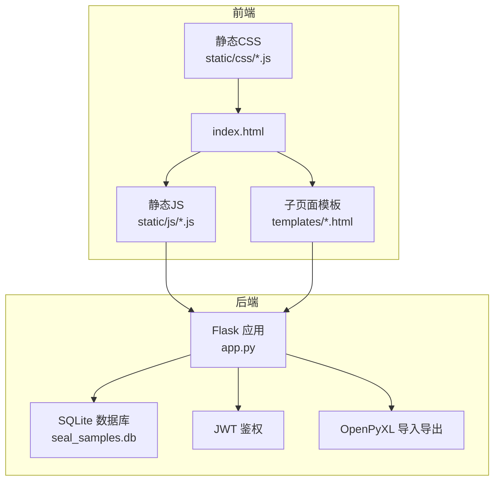
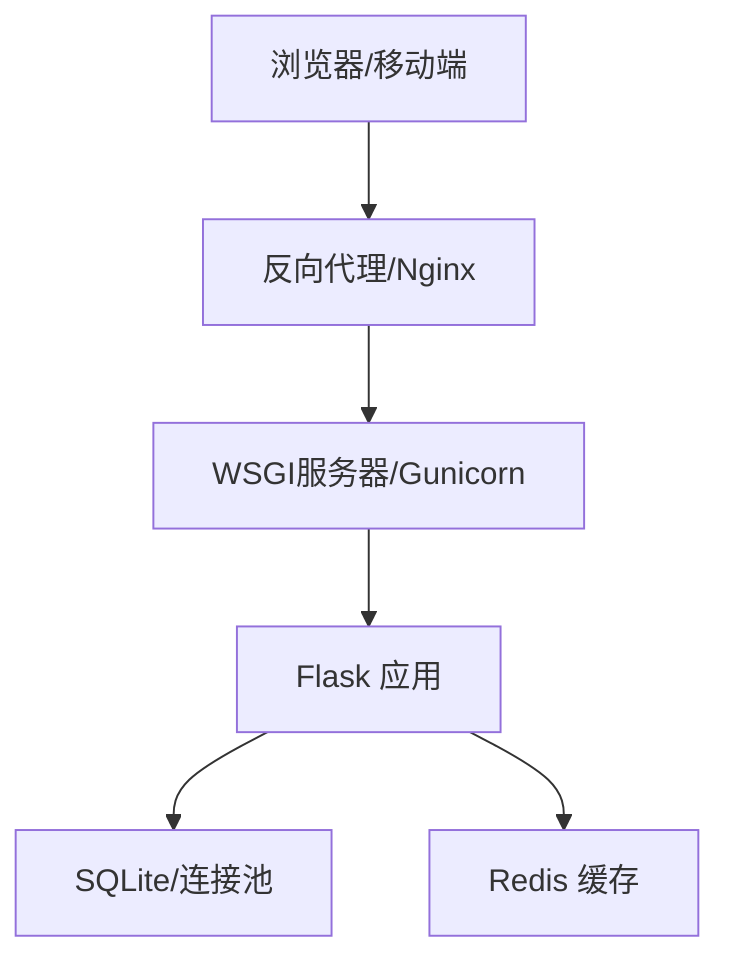

# 性能优化

<cite>
**本文引用的文件**
- [app.py](file://app.py)
- [requirements.txt](file://requirements.txt)
- [start_server.bat](file://start_server.bat)
- [common.js](file://static/js/common.js)
- [api.js](file://static/js/api.js)
- [index.html](file://templates/index.html)
</cite>

## 目录
1. [简介](#简介)
2. [项目结构](#项目结构)
3. [核心组件](#核心组件)
4. [架构总览](#架构总览)
5. [详细组件分析](#详细组件分析)
6. [依赖分析](#依赖分析)
7. [性能考量](#性能考量)
8. [故障排查指南](#故障排查指南)
9. [结论](#结论)
10. [附录](#附录)

## 简介
本文件面向“封样件及色板接收登记管理系统”的Flask后端，聚焦性能优化策略，涵盖请求处理、内存管理、数据库查询优化、缓存策略、静态资源与CDN、并发与异步任务、代码级性能分析、负载与压力测试方法、性能监控与指标解读，以及系统调优最佳实践。文档基于仓库现有代码进行分析与建议，避免臆造未在代码中出现的功能。

## 项目结构
- 后端：Python Flask 应用，SQLite 作为本地数据库，JWT 令牌鉴权，OpenPyXL 处理 Excel 导入导出。
- 前端：静态资源位于 static/css 与 static/js；页面模板位于 templates；单页应用通过 AJAX 动态加载子页面模板。
- 启动：Windows 批处理脚本自动安装依赖并启动开发服务器。

图表来源
- [app.py](file://app.py)
- [index.html](file://templates/index.html)

章节来源
- [app.py](file://app.py)
- [requirements.txt](file://requirements.txt)
- [start_server.bat](file://start_server.bat)
- [index.html](file://templates/index.html)

## 核心组件
- 数据库连接与生命周期管理：全局上下文 g 中维护数据库连接，请求结束时关闭，避免连接泄漏。
- 认证与权限：基于 JWT 的 token_required 装饰器，支持 Header 与 Query 两种携带方式；管理员权限装饰器。
- 动态筛选与分页：统一的 apply_dynamic_filters 与 paginate，支持多表查询与复杂筛选。
- 导入导出：基于 OpenPyXL 的 Excel 导入导出，涉及大文件时的内存与序列化开销。
- 仪表盘与预警：统计与预警接口，涉及多表扫描与日期计算。
- 前端 API 封装：统一 fetch 请求、401 自动跳转、文件上传。

章节来源
- [app.py](file://app.py)
- [common.js](file://static/js/common.js)
- [api.js](file://static/js/api.js)

## 架构总览
后端采用单进程开发模式（debug=True），生产环境建议使用 WSGI 服务器（如 Gunicorn/uWSGI）与反向代理（Nginx），并启用 Redis 缓存与数据库连接池。

图表来源
- [app.py](file://app.py)

## 详细组件分析

### 数据库连接与事务管理
- 连接生命周期：每次请求通过 get_db 获取连接，teardown 关闭连接，避免长连接导致的资源占用。
- 事务边界：多数写操作在单次请求内完成，建议在批量导入/导出场景中显式 commit，减少锁竞争。
- 建议：
  - 生产环境启用连接池（SQLite 本身不支持连接池，建议迁移至 PostgreSQL/MySQL 或使用连接池中间件）。
  - 对高频查询建立合适索引（见后续数据库优化章节）。

章节来源
- [app.py](file://app.py)

### 认证与权限
- Token 解析与校验：token_required 在每次受保护接口前解析并验证，失败直接返回 401。
- 在线状态：登录/心跳接口更新 last_active，便于前端展示在线状态。
- 建议：
  - 将用户信息缓存到 Redis，减少频繁查询 users 表。
  - 对频繁访问的用户信息设置短 TTL，降低数据库压力。

章节来源
- [app.py](file://app.py)

### 动态筛选与分页
- apply_dynamic_filters：支持 f_field_i/f_op_i/f_val_i 多组筛选，安全拼接 SQL，防止注入。
- paginate：客户端分页，page_size<=0 返回全量，存在潜在内存风险。
- 建议：
  - 限制 page_size 上限，避免全量导出。
  - 对常用筛选字段建立索引，提升 WHERE/LIKE 条件性能。
  - 对复杂 JOIN 查询（如寄出记录、处置记录）考虑物化视图或预聚合表。

章节来源
- [app.py](file://app.py)

### 导入导出（OpenPyXL）
- 导入：逐行解析 Excel，字段映射与类型转换，异常捕获与错误汇总。
- 导出：构建工作簿并流式输出，适合中小规模数据。
- 建议：
  - 大文件导入：分批读取（openpyxl 逐行迭代）、批量插入（executemany）、事务分片提交。
  - 导出：使用流式生成器，避免一次性构建超大对象；或采用临时文件 + 流式传输。
  - 前端：对大文件上传增加进度反馈与断点续传（需后端配合）。

章节来源
- [app.py](file://app.py)

### 仪表盘与预警
- 统计：扫描封样件/色板总数、报废数、待评定数。
- 预警：遍历有效期并计算剩余天数，筛选≤30天的记录。
- 建议：
  - 将统计结果缓存到 Redis，定时刷新（如每小时）。
  - 预警列表按剩余天数排序，建议分页与缓存。

章节来源
- [app.py](file://app.py)

### 前端交互与 API 封装
- API 封装：统一请求头、401 自动跳转、文件上传。
- 工具函数：日期格式化、ΔE 计算、状态标签、分页生成、防抖等。
- 建议：
  - 前端缓存常用列表与字典（如状态映射、阈值），减少重复请求。
  - 对高频接口开启浏览器缓存（ETag/Cache-Control）。

章节来源
- [api.js](file://static/js/api.js)
- [common.js](file://static/js/common.js)
- [index.html](file://templates/index.html)

## 依赖分析
- Flask 3.x：现代 WSGI 框架，支持异步扩展（需额外配置）。
- Flask-CORS：跨域支持。
- PyJWT：JWT 加解密。
- openpyxl：Excel 导入导出。
- 建议：
  - 生产环境升级为更健壮的数据库（PostgreSQL/MySQL）与连接池。
  - 引入性能监控库（如 Prometheus/Blackbox Exporter）与 APM（如 New Relic/DataDog）。

章节来源
- [requirements.txt](file://requirements.txt)

## 性能考量

### 请求处理优化
- 减少不必要的计算：前端已实现 ΔE 计算与状态标签，后端可缓存阈值设置。
- 控制响应体大小：对列表接口限制 page_size，避免全量导出。
- 压缩与缓存：启用 gzip 压缩（Nginx/WSGI 层），静态资源版本化与强缓存。
- 并发模型：开发阶段 debug=True，生产建议使用多进程/多线程 WSGI 服务器。

章节来源
- [app.py](file://app.py)
- [index.html](file://templates/index.html)

### 内存管理
- 导入导出：使用 BytesIO 流式写入，避免大对象驻留内存。
- 分页：客户端分页在小数据量可行，大数据量建议服务端分页（LIMIT/OFFSET）。
- 临时对象：及时释放大对象引用，避免循环引用。

章节来源
- [app.py](file://app.py)

### 数据库查询优化
- 现状问题：
  - 多处使用 LIKE 模糊匹配，未见索引，易造成全表扫描。
  - 复杂 JOIN 查询（寄出记录、处置记录）未见 EXPLAIN 分析。
  - 仪表盘统计与预警涉及多次扫描与日期计算。
- 优化建议：
  - 为常用筛选字段建立索引（如 users.username、seal_samples.项目/封样件名称、seal_color_samples.客户/颜色名称、有效期等）。
  - 对模糊查询使用前缀匹配或全文检索（如 SQLiteFTS5）。
  - 将统计与预警结果缓存到 Redis，定期刷新。
  - 使用 LIMIT/OFFSET 服务端分页，避免全量返回。

章节来源
- [app.py](file://app.py)

### 缓存策略
- Redis（推荐）：
  - 用户信息与权限：短期 TTL（如 5-10 分钟）。
  - 系统设置与阈值：长 TTL（如 1 小时），变更时失效。
  - 列表缓存：按筛选条件构造键，命中率高时显著降低数据库压力。
- 内存缓存（Flask）：
  - 仅限单进程有效，不适合多实例部署。
  - 适合小规模、低并发场景。

章节来源
- [app.py](file://app.py)

### 静态资源优化与 CDN
- 前端资源：CSS/JS 文件建议压缩与合并，开启 gzip/br 压缩。
- 版本化：文件名包含哈希，便于长期缓存。
- CDN：静态资源走 CDN，后端 API 保留在内网。
- 图标与图片：SVG/Favicon 已内嵌/轻量，可进一步压缩。

章节来源
- [index.html](file://templates/index.html)

### 并发处理与异步任务
- 现状：单进程开发服务器，无异步任务。
- 建议：
  - 生产：Gunicorn 多进程 + Nginx 反代。
  - 异步：对耗时任务（如大文件导入、报表生成）使用消息队列（RabbitMQ/Redis Streams）与 worker。
  - 事件驱动：结合 Celery 或自定义队列，将导入导出放入后台任务。

章节来源
- [app.py](file://app.py)

### 代码级性能分析与瓶颈识别
- 热点接口：
  - 列表接口（apply_dynamic_filters + paginate）：筛选条件过多时 SQL 与 Python 分页成本上升。
  - 导入导出：大文件时 IO 与内存峰值较高。
  - 仪表盘/预警：多表扫描与日期计算。
- 分析方法：
  - 使用 cProfile/line_profiler 定位热点函数。
  - 使用 Flask 的 before_request/after_request 记录请求耗时。
  - 使用 Py-Spy/FlameGraph 生成火焰图。

章节来源
- [app.py](file://app.py)

### 负载测试与压力测试
- 工具：Locust/JMeter/Artillery。
- 场景：
  - 登录/鉴权：并发用户登录与心跳。
  - 列表查询：不同筛选组合与分页大小。
  - 导入导出：不同文件大小与并发导入。
- 指标：RPS、P95/P99 响应时间、错误率、CPU/内存/IO。
- 结果：定位瓶颈（数据库、IO、内存），指导优化。

章节来源
- [app.py](file://app.py)

### 性能监控与指标解读
- 指标：
  - 后端：请求延迟、错误率、吞吐量、连接数、队列长度。
  - 数据库：慢查询、锁等待、连接数、缓冲命中率。
  - 前端：首屏时间、交互延迟、错误上报。
- 工具：Prometheus + Grafana、APM（New Relic/DataDog）。
- 建议：为关键路径埋点，设置告警阈值。

章节来源
- [app.py](file://app.py)

### 系统调优最佳实践
- 数据库：
  - 建立索引、分区（如按日期）、只读副本。
  - 使用连接池与连接复用。
- 应用：
  - 启用 gzip、静态资源缓存、CDN。
  - 缓存热点数据与查询结果。
  - 限制并发与请求大小，避免雪崩。
- 前端：
  - 懒加载、骨架屏、分页与虚拟滚动。
  - 减少重绘重排，使用防抖节流。

章节来源
- [app.py](file://app.py)

## 故障排查指南
- 401 未授权：
  - 检查 Authorization 头或 token 参数。
  - 确认 JWT 未过期，用户未被停用。
- 导入失败：
  - 校验 Excel 列数与字段映射，捕获异常并返回具体行号。
- 导出卡顿：
  - 检查数据量与内存峰值，改用流式生成。
- 列表查询慢：
  - 添加索引，减少 LIKE 模糊匹配，使用服务端分页。

章节来源
- [app.py](file://app.py)
- [api.js](file://static/js/api.js)

## 结论
本系统以 Flask + SQLite 实现，具备良好的可维护性与快速迭代能力。针对性能优化，建议优先从数据库索引、缓存策略、静态资源与 CDN、并发模型与异步任务入手，辅以完善的监控与压测体系，逐步过渡到生产级架构。

## 附录
- 开发启动：双击 start_server.bat 安装依赖并启动开发服务器。
- 生产建议：WSGI + 反向代理 + Redis + 更健壮数据库 + CDN + APM。

章节来源
- [start_server.bat](file://start_server.bat)