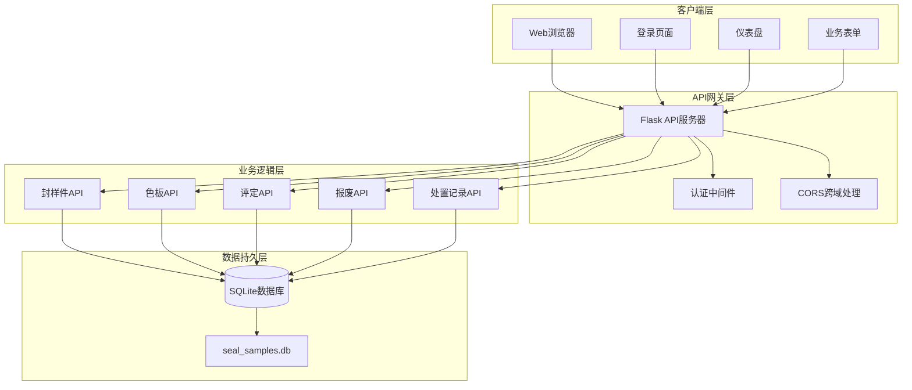
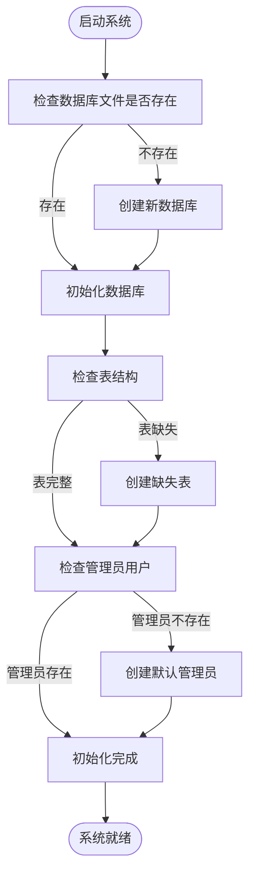
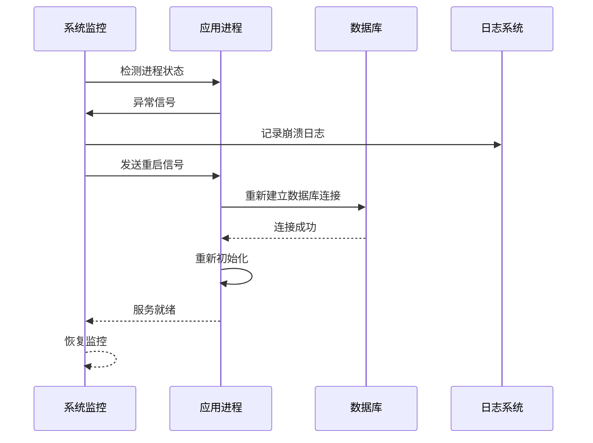
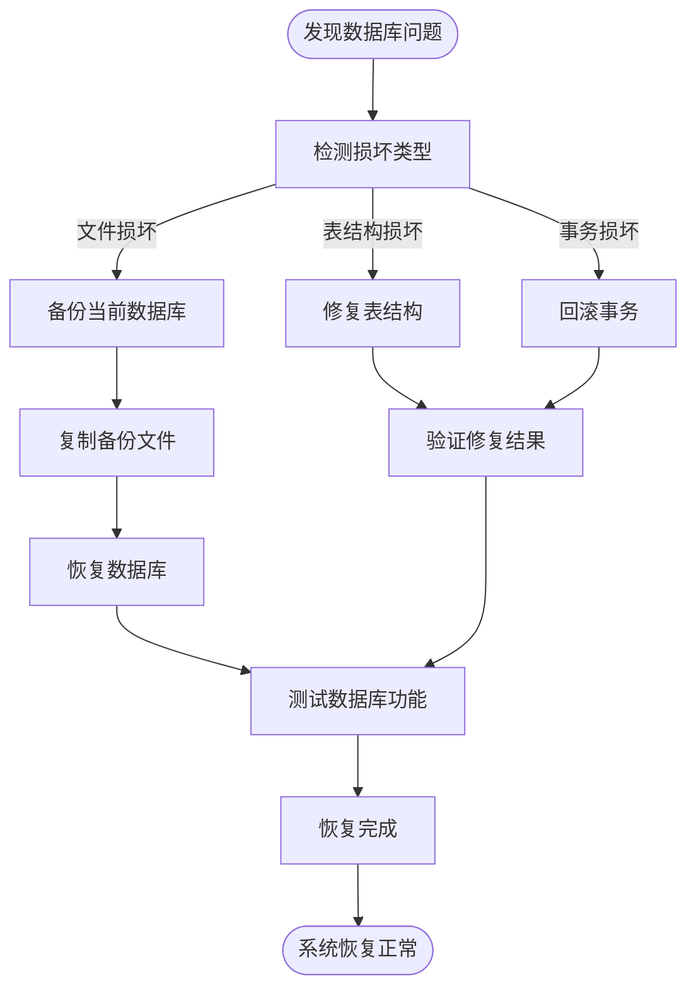
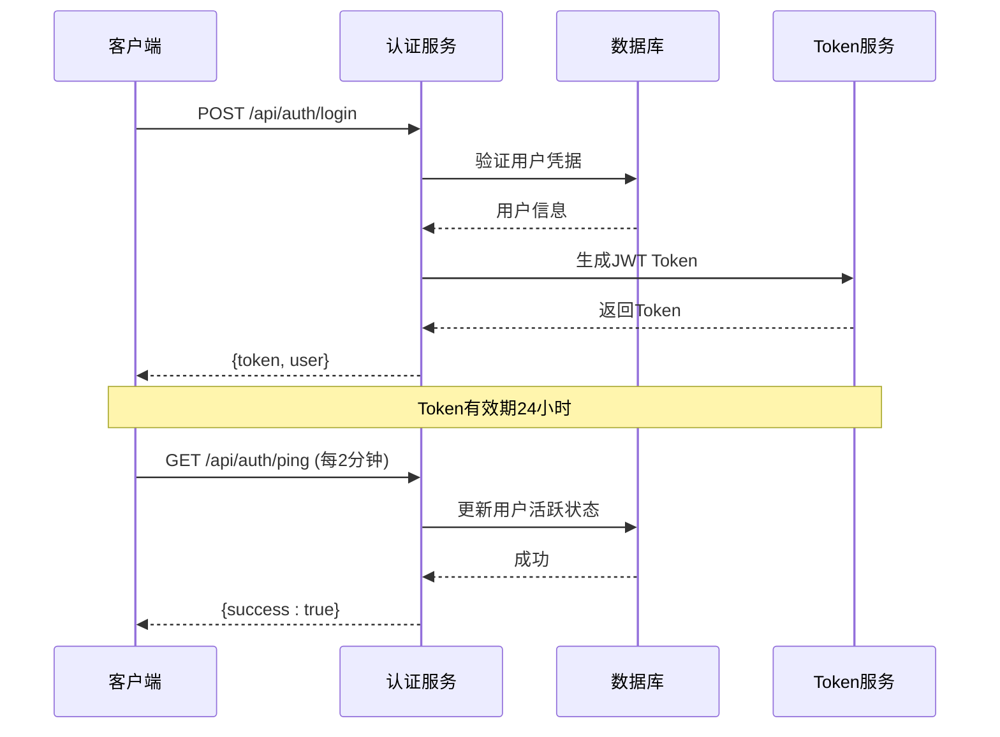
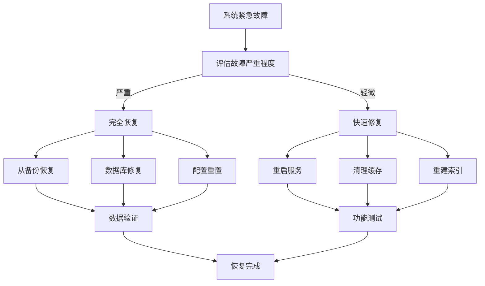

# 故障排除与FAQ

<cite>
**本文档引用的文件**
- [app.py](file://app.py)
- [requirements.txt](file://requirements.txt)
- [start_server.bat](file://start_server.bat)
- [api.js](file://static/js/api.js)
- [common.js](file://static/js/common.js)
- [login.html](file://templates/login.html)
- [index.html](file://templates/index.html)
</cite>

## 目录
1. [简介](#简介)
2. [系统架构概览](#系统架构概览)
3. [常见问题与解决方案](#常见问题与解决方案)
4. [依赖安装故障排除](#依赖安装故障排除)
5. [端口占用问题](#端口占用问题)
6. [数据库连接错误](#数据库连接错误)
7. [系统崩溃与重启恢复](#系统崩溃与重启恢复)
8. [错误日志分析](#错误日志分析)
9. [网络连接与防火墙配置](#网络连接与防火墙配置)
10. [数据库损坏与数据恢复](#数据库损坏与数据恢复)
11. [性能问题诊断](#性能问题诊断)
12. [权限与认证故障排查](#权限与认证故障排查)
13. [第三方服务集成问题](#第三方服务集成问题)
14. [紧急情况快速恢复程序](#紧急情况快速恢复程序)
15. [结论](#结论)

## 简介

封样件及色板接收登记管理系统是一个基于Python Flask框架开发的企业级管理系统，主要用于管理封样件和色板的接收、登记、评定和处置记录。系统采用SQLite作为数据存储，支持JWT认证机制，提供完整的前后端分离架构。

## 系统架构概览



**图表来源**
- [app.py:21-25](file://app.py#L21-L25)
- [app.py:48-84](file://app.py#L48-L84)
- [app.py:88-335](file://app.py#L88-L335)

## 常见问题与解决方案

### 1. 系统启动失败

**症状表现：**
- 服务器无法启动
- 控制台显示错误信息
- 浏览器无法访问

**可能原因：**
- Python环境问题
- 依赖包安装失败
- 端口被占用
- 权限不足

**解决方案：**
1. 检查Python版本兼容性
2. 运行依赖安装脚本
3. 更改端口号
4. 以管理员权限运行

### 2. 登录认证失败

**症状表现：**
- 登录页面循环跳转
- 显示"账户被停用"提示
- Token验证失败

**可能原因：**
- 用户名或密码错误
- 账户被管理员停用
- Token过期
- 网络连接异常

**解决方案：**
1. 确认用户名密码正确性
2. 联系管理员检查账户状态
3. 重新登录获取新Token
4. 检查网络连接稳定性

### 3. 数据导入导出异常

**症状表现：**
- Excel文件导入失败
- 导出文件格式错误
- 数据丢失或重复

**可能原因：**
- Excel文件格式不兼容
- 字段映射错误
- 数据类型转换异常
- 文件路径权限问题

**解决方案：**
1. 使用系统提供的标准模板
2. 检查Excel文件格式
3. 验证字段对应关系
4. 确保文件路径可写

## 依赖安装故障排除

### 依赖安装失败

**常见错误：**
```
ERROR: Could not find a version that satisfies the requirement flask>=3.0.0
ERROR: No matching distribution found for flask>=3.0.0
```

**解决方案：**

1. **检查Python版本**
   ```bash
   python --version
   pip --version
   ```

2. **升级pip版本**
   ```bash
   python -m pip install --upgrade pip
   ```

3. **使用国内镜像源**
   ```bash
   pip install -r requirements.txt -i https://pypi.tuna.tsinghua.edu.cn/simple/
   ```

4. **离线安装依赖包**
   ```bash
   pip install flask flask-cors PyJWT openpyxl
   ```

**依赖包说明：**
- `flask>=3.0.0`: Web框架核心
- `flask-cors>=4.0.0`: 跨域资源共享支持
- `PyJWT>=2.8.0`: JSON Web Token认证
- `openpyxl>=3.1.0`: Excel文件处理

**章节来源**
- [requirements.txt:1-5](file://requirements.txt#L1-L5)
- [start_server.bat:8](file://start_server.bat#L8)

## 端口占用问题

### 端口被占用

**症状表现：**
```
OSError: [Errno 98] Address already in use
```

**解决方案：**

1. **查找占用端口的进程**
   ```bash
   netstat -ano | findstr :5000
   ```

2. **终止占用进程**
   ```bash
   taskkill /PID <进程ID> /F
   ```

3. **更改端口号**
   在 `app.py` 中修改：
   ```python
   app.run(host='0.0.0.0', port=5001, debug=True)
   ```

4. **使用防火墙规则**
   ```bash
   netsh advfirewall firewall add rule name="Python Flask" dir=in action=allow protocol=TCP localport=5000
   ```

**章节来源**
- [app.py:2187-2197](file://app.py#L2187-L2197)

## 数据库连接错误

### 数据库连接失败

**常见错误：**
```
sqlite3.OperationalError: unable to open database file
```

**解决方案：**

1. **检查数据库文件权限**
   ```bash
   # 确保数据库文件具有读写权限
   attrib -R seal_samples.db
   ```

2. **验证数据库文件完整性**
   ```python
   import sqlite3
   
   try:
       conn = sqlite3.connect('seal_samples.db')
       cursor = conn.cursor()
       cursor.execute("PRAGMA integrity_check")
       result = cursor.fetchall()
       print(result)
       conn.close()
   except Exception as e:
       print(f"数据库损坏: {e}")
   ```

3. **重建数据库结构**
   ```python
   # 运行数据库初始化函数
   init_db()
   ```

4. **检查磁盘空间**
   ```bash
   # 确保有足够的磁盘空间
   import shutil
   total, used, free = shutil.disk_usage(".")
   print(f"可用空间: {free // (2**20)} MB")
   ```

**数据库初始化流程：**



**图表来源**
- [app.py:88-335](file://app.py#L88-L335)

**章节来源**
- [app.py:29-39](file://app.py#L29-L39)
- [app.py:88-335](file://app.py#L88-L335)

## 系统崩溃与重启恢复

### 系统崩溃检测

**崩溃类型识别：**

1. **数据库连接异常**
   - 检查数据库连接池状态
   - 验证事务完整性
   - 监控连接超时

2. **内存泄漏检测**
   - 监控内存使用率
   - 检查未释放的资源
   - 分析垃圾回收频率

3. **文件句柄泄露**
   - 监控打开的文件数量
   - 检查Excel文件处理
   - 验证数据库连接关闭

### 自动重启机制

**重启流程：**



**图表来源**
- [app.py:2187-2197](file://app.py#L2187-L2197)

### 手动重启步骤

1. **停止现有进程**
   ```bash
   # 查找进程
   ps aux | grep python
   # 终止进程
   kill -9 <进程ID>
   ```

2. **清理临时文件**
   ```bash
   # 删除临时文件
   del *.tmp
   del *.log
   ```

3. **重新启动服务**
   ```bash
   python app.py
   ```

**章节来源**
- [start_server.bat:1-17](file://start_server.bat#L1-L17)

## 错误日志分析

### 日志级别定义

**错误分类：**

1. **认证错误 (AUTH_ERROR)**
   - 用户名密码错误
   - Token过期
   - 账户被停用

2. **数据库错误 (DB_ERROR)**
   - 连接失败
   - SQL语法错误
   - 数据完整性约束

3. **文件操作错误 (FILE_ERROR)**
   - Excel文件读取失败
   - 权限不足
   - 磁盘空间不足

4. **业务逻辑错误 (BUSINESS_ERROR)**
   - 数据验证失败
   - 业务规则冲突
   - 并发操作冲突

### 日志分析方法

**前端日志分析：**
```javascript
// API请求错误处理
API.request(url, options).catch(error => {
    console.error('API请求失败:', {
        url: url,
        error: error.message,
        timestamp: new Date(),
        stack: error.stack
    });
});
```

**后端日志分析：**
```python
# Flask应用错误处理
@app.errorhandler(Exception)
def handle_exception(e):
    app.logger.error({
        'error_type': type(e).__name__,
        'error_message': str(e),
        'timestamp': datetime.now(),
        'request_url': request.url,
        'user_agent': request.headers.get('User-Agent')
    })
    return jsonify({'success': False, 'message': '系统内部错误'}), 500
```

### 常见错误代码含义

| 错误代码 | 含义 | 解决方案 |
|---------|------|----------|
| 400 | 请求参数错误 | 检查API参数格式 |
| 401 | 未授权访问 | 重新登录获取Token |
| 403 | 权限不足 | 检查用户角色权限 |
| 404 | 资源不存在 | 验证URL路径正确性 |
| 500 | 服务器内部错误 | 检查服务器日志 |
| 503 | 服务不可用 | 等待系统恢复 |

**章节来源**
- [api.js:20-42](file://static/js/api.js#L20-L42)
- [app.py:470-493](file://app.py#L470-L493)

## 网络连接与防火墙配置

### 网络连接问题

**常见网络问题：**

1. **跨域请求失败**
   ```
   Access to fetch at 'http://localhost:5000/api/auth/login' from origin 'http://localhost:3000' has been blocked by CORS policy
   ```

2. **代理服务器连接问题**
   ```
   Proxy connection failed
   ```

3. **SSL证书验证失败**
   ```
   SSL certificate verification failed
   ```

### 防火墙配置

**Windows防火墙规则：**

1. **允许HTTP端口**
   ```cmd
   netsh advfirewall firewall add rule name="Python Flask HTTP" dir=in action=allow protocol=TCP localport=5000
   ```

2. **允许HTTPS端口**
   ```cmd
   netsh advfirewall firewall add rule name="Python Flask HTTPS" dir=in action=allow protocol=TCP localport=443
   ```

3. **允许特定IP访问**
   ```cmd
   netsh advfirewall firewall add rule name="Allow Specific IP" dir=in action=allow remoteip=192.168.1.100
   ```

### 网络诊断工具

**连接测试：**
```bash
# 测试端口连通性
telnet localhost 5000

# 测试HTTP响应
curl -I http://localhost:5000/

# 测试API响应
curl -H "Content-Type: application/json" -X POST http://localhost:5000/api/auth/login -d '{"username":"admin","password":"admin"}'
```

**章节来源**
- [app.py:21-22](file://app.py#L21-L22)
- [api.js:14-42](file://static/js/api.js#L14-L42)

## 数据库损坏与数据恢复

### 数据库损坏检测

**损坏类型识别：**

1. **文件损坏**
   - 数据库文件无法读取
   - PRAGMA integrity_check失败

2. **表结构损坏**
   - 缺失表或字段
   - 索引损坏

3. **事务日志损坏**
   - 事务无法回滚
   - 数据不一致

### 数据恢复策略

**恢复流程：**



**图表来源**
- [app.py:88-335](file://app.py#L88-L335)

### 手动恢复步骤

1. **备份当前数据库**
   ```bash
   # 复制数据库文件
   copy seal_samples.db seal_samples_backup.db
   ```

2. **检查数据库完整性**
   ```python
   import sqlite3
   
   conn = sqlite3.connect('seal_samples.db')
   cursor = conn.cursor()
   
   # 检查完整性
   cursor.execute("PRAGMA integrity_check")
   result = cursor.fetchall()
   print("完整性检查:", result)
   
   # 检查表结构
   cursor.execute("PRAGMA table_info(seal_samples)")
   tables = cursor.fetchall()
   print("表结构:", tables)
   
   conn.close()
   ```

3. **修复数据库**
   ```python
   # 修复损坏的数据库
   conn = sqlite3.connect('seal_samples.db')
   cursor = conn.cursor()
   
   # 执行VACUUM优化
   cursor.execute("VACUUM")
   
   # 重新创建索引
   cursor.execute("REINDEX")
   
   conn.commit()
   conn.close()
   ```

4. **验证恢复结果**
   ```python
   # 验证数据库功能
   conn = sqlite3.connect('seal_samples.db')
   cursor = conn.cursor()
   
   # 测试基本查询
   cursor.execute("SELECT COUNT(*) FROM seal_samples")
   count = cursor.fetchone()[0]
   print(f"记录总数: {count}")
   
   conn.close()
   ```

**章节来源**
- [app.py:88-335](file://app.py#L88-L335)

## 性能问题诊断

### 性能瓶颈识别

**常见性能问题：**

1. **数据库查询慢**
   - 大量数据查询
   - 缺少索引
   - 复杂JOIN操作

2. **内存使用过高**
   - Excel文件处理
   - 大对象缓存
   - 内存泄漏

3. **并发访问阻塞**
   - 数据库锁竞争
   - 文件I/O阻塞
   - 网络请求等待

### 性能优化策略

**数据库优化：**
```python
# 添加必要的索引
CREATE INDEX idx_seal_samples_expiry ON seal_samples(有效期);
CREATE INDEX idx_seal_color_samples_customer ON seal_color_samples(客户);
CREATE INDEX idx_seal_send_records_date ON seal_send_records(寄出日期);

# 优化查询语句
SELECT * FROM seal_samples 
WHERE 状态!='scrapped' 
AND 有效期 IS NOT NULL 
ORDER BY 有效期 ASC 
LIMIT 100;
```

**内存优化：**
```python
# 分批处理大量数据
def process_large_dataset(batch_size=1000):
    offset = 0
    while True:
        batch = get_batch(offset, batch_size)
        if not batch:
            break
        
        # 处理批次数据
        process_batch(batch)
        
        # 释放内存
        del batch
        gc.collect()
        
        offset += batch_size
```

**并发优化：**
```python
# 使用连接池
from sqlalchemy import create_engine
engine = create_engine('sqlite:///seal_samples.db', pool_size=10, max_overflow=20)

# 限制并发请求
from flask_limiter import Limiter
limiter = Limiter(app, key_func=get_remote_address, default_limits=["200 per hour"])
```

### 性能监控指标

| 指标类型 | 正常范围 | 警告阈值 | 错误阈值 |
|---------|---------|---------|---------|
| 响应时间(ms) | < 1000 | 1000-3000 | > 3000 |
| 内存使用(MB) | < 100 | 100-200 | > 200 |
| 数据库连接数 | < 10 | 10-20 | > 20 |
| CPU使用率(%) | < 50 | 50-80 | > 80 |
| 磁盘I/O等待(ms) | < 50 | 50-100 | > 100 |

**章节来源**
- [app.py:377-396](file://app.py#L377-L396)
- [app.py:403-449](file://app.py#L403-L449)

## 权限与认证故障排查

### 认证机制分析

**JWT Token结构：**
```json
{
  "user_id": 1,
  "username": "admin",
  "is_admin": true,
  "must_change_password": 0,
  "exp": 1700000000
}
```

**认证流程：**



**图表来源**
- [app.py:454-493](file://app.py#L454-L493)
- [app.py:572-589](file://app.py#L572-L589)

### 权限控制机制

**权限分级：**
- **普通用户**: 读取和基本操作权限
- **管理员**: 系统管理权限
- **超级管理员**: 完全控制权限

**权限验证流程：**
```python
def admin_required(f):
    @wraps(f)
    def decorated(*args, **kwargs):
        if not g.current_user.get('is_admin'):
            return jsonify({'success': False, 'message': '需要管理员权限'}), 403
        return f(*args, **kwargs)
    return decorated
```

### 常见认证问题

**问题1: Token过期**
- **症状**: 401未授权错误
- **解决方案**: 重新登录获取新Token

**问题2: 账户被停用**
- **症状**: 显示"账户已被停用"提示
- **解决方案**: 联系管理员恢复账户

**问题3: 并发登录冲突**
- **症状**: Token被撤销
- **解决方案**: 等待当前会话结束

**章节来源**
- [app.py:49-84](file://app.py#L49-L84)
- [app.py:1426-1495](file://app.py#L1426-L1495)

## 第三方服务集成问题

### Excel文件处理问题

**常见Excel处理错误：**

1. **文件格式不兼容**
   ```
   Unsupported format, or unrecognised file-contents
   ```

2. **内存溢出**
   ```
   MemoryError: Unable to allocate array with shape (1000000, 1000)
   ```

3. **编码问题**
   ```
   UnicodeDecodeError: 'utf-8' codec can't decode byte 0xff
   ```

### 解决方案

**Excel文件处理优化：**
```python
# 分批读取大文件
def read_excel_in_batches(file_path, batch_size=1000):
    workbook = openpyxl.load_workbook(file_path, read_only=True, keep_vba=False)
    worksheet = workbook.active
    
    batch = []
    for row in worksheet.iter_rows():
        batch.append(row)
        
        if len(batch) >= batch_size:
            yield batch
            batch = []
    
    if batch:
        yield batch

# 安全的文件处理
def safe_excel_import(file):
    try:
        # 验证文件类型
        if not file.filename.endswith(('.xlsx', '.xls')):
            return jsonify({'success': False, 'message': '不支持的文件格式'}), 400
        
        # 限制文件大小
        if len(file.read()) > 10 * 1024 * 1024:  # 10MB
            return jsonify({'success': False, 'message': '文件过大'}), 400
        
        # 重新定位文件指针
        file.seek(0)
        
        # 处理文件
        workbook = openpyxl.load_workbook(file, data_only=True)
        # ... 处理逻辑
        return success_response
        
    except Exception as e:
        return jsonify({'success': False, 'message': f'文件处理失败: {str(e)}'}), 500
```

**章节来源**
- [app.py:720-795](file://app.py#L720-L795)
- [app.py:953-1041](file://app.py#L953-L1041)

## 紧急情况快速恢复程序

### 系统紧急恢复流程

**恢复优先级：**
1. **数据完整性** → 2. **系统可用性** → 3. **功能完整性**

**恢复步骤：**



**图表来源**
- [app.py:2187-2197](file://app.py#L2187-L2197)

### 快速恢复工具

**一键恢复脚本：**
```batch
@echo off
echo 正在执行紧急恢复程序...
echo.

REM 停止服务
taskkill /F /IM python.exe
echo 服务已停止

REM 备份当前数据库
copy seal_samples.db seal_samples.db.backup
echo 数据库已备份

REM 重新初始化数据库
python app.py --init-db
echo 数据库已重新初始化

REM 启动服务
start python app.py
echo 服务已启动

echo.
echo 紧急恢复完成！
pause
```

**恢复验证清单：**
- [ ] 数据库连接正常
- [ ] 用户认证功能正常
- [ ] 基础业务功能正常
- [ ] Excel导入导出功能正常
- [ ] 日志记录功能正常

### 应急预案

**人员分工：**
- **系统管理员**: 负责系统维护和恢复
- **数据库管理员**: 负责数据库修复
- **安全管理员**: 负责安全事件处理
- **技术支持**: 负责用户支持和培训

**联系方式：**
- 系统管理员: 138-0000-0000
- 数据库管理员: 138-0000-0001  
- 安全管理员: 138-0000-0002
- 技术支持: 138-0000-0003

**章节来源**
- [start_server.bat:1-17](file://start_server.bat#L1-L17)
- [app.py:2187-2197](file://app.py#L2187-L2197)

## 结论

封样件及色板接收登记管理系统提供了完整的故障排除和恢复机制。通过理解系统架构、掌握常见问题的解决方案、建立完善的监控体系，可以有效保障系统的稳定运行。

**关键要点：**
1. **预防为主**: 建立定期维护和监控机制
2. **快速响应**: 制定详细的应急预案和恢复流程
3. **持续改进**: 根据故障统计分析优化系统设计
4. **团队协作**: 明确职责分工，提高应急处理效率

**建议措施：**
- 建立24/7监控系统
- 定期进行压力测试
- 建立数据备份策略
- 培训运维人员技能
- 完善文档和知识库

通过实施这些措施，可以显著提高系统的可靠性和可维护性，确保业务连续性。