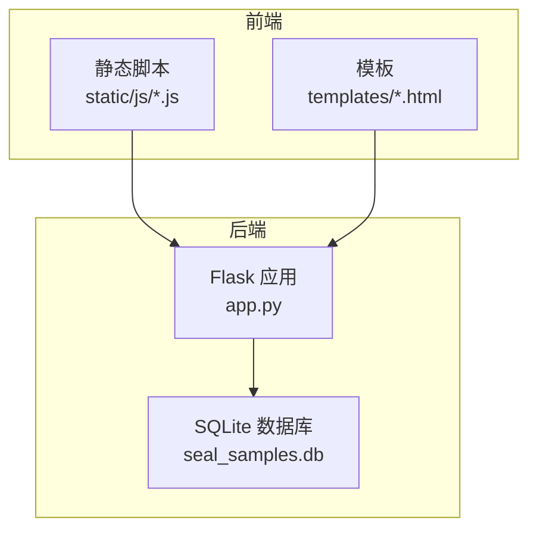
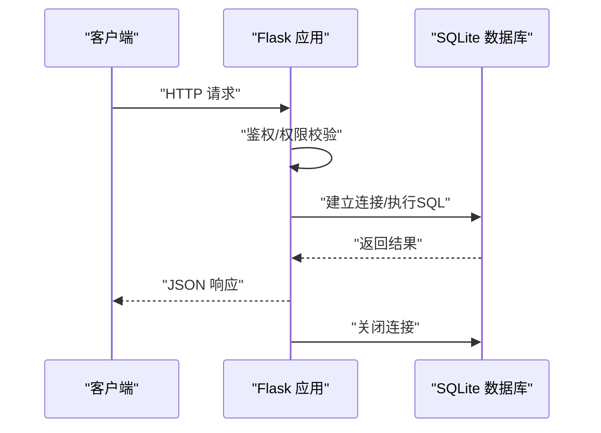
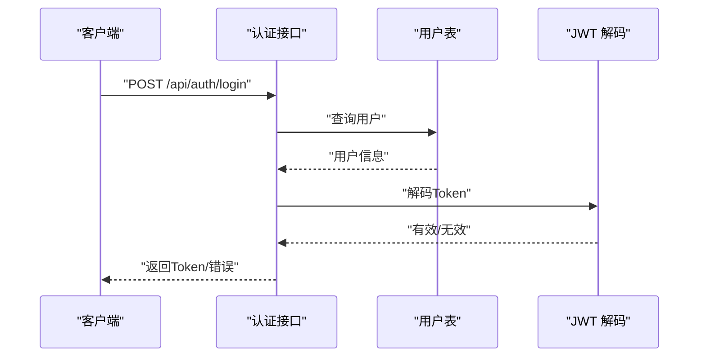
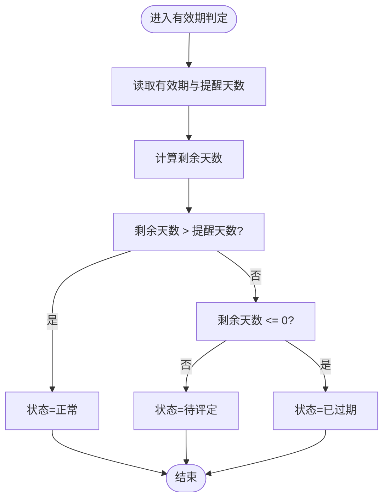
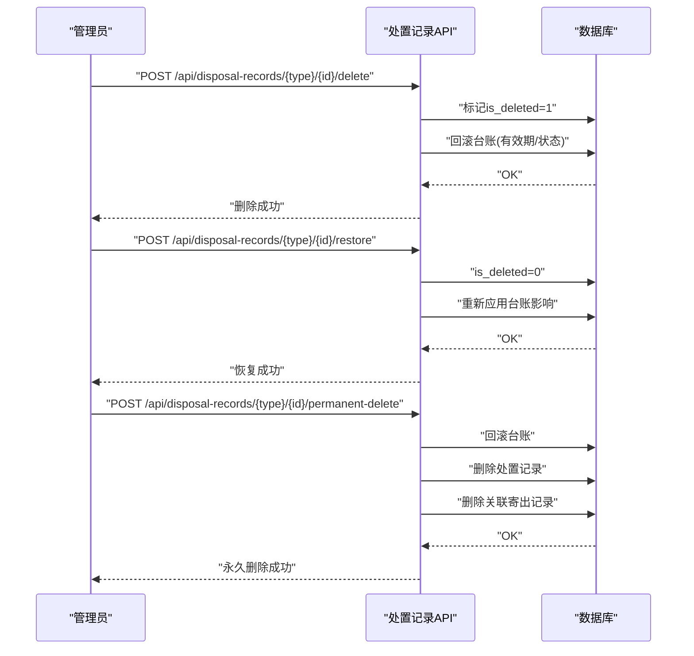
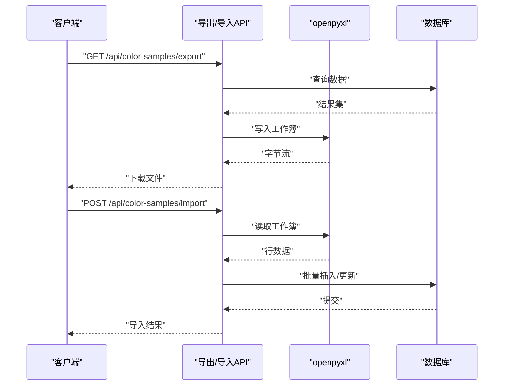
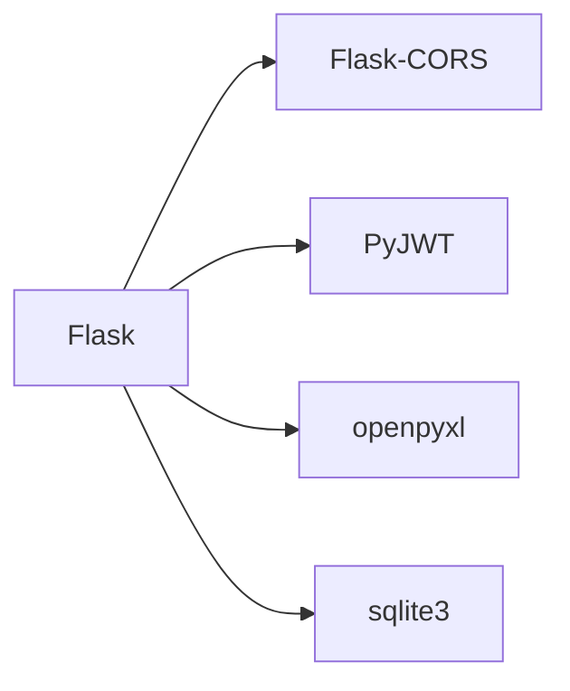

# 数据库维护

<cite>
**本文引用的文件**
- [app.py](file://app.py)
- [requirements.txt](file://requirements.txt)
- [templates/dashboard.html](file://templates/dashboard.html)
- [static/js/common.js](file://static/js/common.js)
- [static/js/seal-sample.js](file://static/js/seal-sample.js)
- [static/js/table-config.js](file://static/js/table-config.js)
- [static/js/disposal-records.js](file://static/js/disposal-records.js)
</cite>

## 目录
1. [简介](#简介)
2. [项目结构](#项目结构)
3. [核心组件](#核心组件)
4. [架构总览](#架构总览)
5. [详细组件分析](#详细组件分析)
6. [依赖分析](#依赖分析)
7. [性能考虑](#性能考虑)
8. [故障排查指南](#故障排查指南)
9. [结论](#结论)
10. [附录](#附录)

## 简介
本文件面向“封样件及色板接收登记管理系统”的数据库维护工作，聚焦SQLite数据库的备份与恢复策略、性能监控与优化、迁移与版本升级、数据完整性检查与修复、并发与锁定机制、日志与错误诊断、批量导出与导入、安全配置与访问控制，以及灾难恢复与备份策略。系统采用Flask + SQLite架构，所有业务逻辑均围绕10张核心业务表展开。

## 项目结构
系统后端以单文件应用为核心，数据库路径在配置中集中定义；前端模板与静态资源位于独立目录，通过API与数据库交互。



图表来源
- [app.py:21-25](file://app.py#L21-L25)
- [app.py:29-39](file://app.py#L29-L39)

章节来源
- [app.py:21-25](file://app.py#L21-L25)
- [app.py:29-39](file://app.py#L29-L39)

## 核心组件
- 数据库连接与上下文管理：全局获取连接、请求结束关闭连接，确保每个请求拥有独立连接。
- 初始化与兼容性：初始化10张业务表，包含字段兼容性增强（如新增提醒天数、软删除字段等）。
- 认证与权限：基于JWT的认证与管理员权限校验，限制敏感操作。
- 业务API：封样件、色板、寄出、有效期、评定、报废、处置记录、系统设置、用户配置等。
- 批量导出/导入：基于openpyxl的Excel导入导出，支持全量导出与增量导入。
- 仪表盘与预警：统计与到期预警展示，辅助运维与业务监控。

章节来源
- [app.py:29-39](file://app.py#L29-L39)
- [app.py:88-335](file://app.py#L88-L335)
- [app.py:454-588](file://app.py#L454-L588)
- [app.py:692-795](file://app.py#L692-L795)
- [app.py:917-1041](file://app.py#L917-L1041)
- [app.py:1045-1156](file://app.py#L1045-L1156)
- [app.py:1175-1208](file://app.py#L1175-L1208)
- [app.py:1212-1287](file://app.py#L1212-L1287)
- [app.py:1289-1355](file://app.py#L1289-L1355)
- [app.py:1628-2080](file://app.py#L1628-L2080)
- [app.py:2084-2155](file://app.py#L2084-L2155)

## 架构总览
系统采用轻量级单机部署，数据库与应用在同一主机运行，通过HTTP API进行交互。数据库初始化在应用启动时执行，确保表结构与基础数据就绪。



图表来源
- [app.py:29-39](file://app.py#L29-L39)
- [app.py:454-588](file://app.py#L454-L588)

## 详细组件分析

### 数据库初始化与表结构
- 初始化流程：创建10张核心表，预置管理员账户与ΔE阈值设置，兼容历史字段扩展。
- 关键表：
  - 用户表：users
  - 邀请码表：seal_invitation_codes
  - 封样件台账：seal_samples
  - 色板台账：seal_color_samples
  - 寄出台账：seal_send_records
  - 有效期管理：seal_expiry_management
  - 评定记录：seal_evaluation_records
  - 报废记录：seal_scrapped_samples
  - 系统设置：seal_system_settings
  - 用户表格配置：seal_user_table_configs

```mermaid
erDiagram
USERS {
integer id PK
text username UK
text password_hash
text real_name
integer is_admin
integer is_active
integer must_change_password
integer invitation_code_id FK
timestamp created_at
}
SEAL_INVITATION_CODES {
integer id PK
text code UK
text note
integer max_uses
integer used_count
date expires_at
integer is_active
integer created_by FK
timestamp created_at
}
SEAL_SAMPLES {
integer id PK
integer 序号 UK
text 项目
text 封样件名称
text 签署人
date 签署人日期
date 有效期
text 状态
text 备注
integer 提醒天数
timestamp created_at
timestamp updated_at
}
SEAL_COLOR_SAMPLES {
integer id PK
integer 序号
text 客户
text 适用车型
text 颜色名称
text 样板供应商
text 颜色色值转化码
text 纹理代码
text 光泽度
text 供应商代码
text 制作信息
integer 接收数量
integer 当前持有数量
date 接收日期
text 使用的光源角度
float L值
float a值
float b值
float c值
float h值
float ΔL值
float Δa值
float Δb值
float Δc值
float Δh值
float ΔE值
text 备注
date 有效期
text 状态
integer 提醒天数
timestamp created_at
timestamp updated_at
}
SEAL_SEND_RECORDS {
integer id PK
integer sample_id FK
text 客户
text 颜色名称
text 对方单位
integer 寄出数量
date 寄出日期
text 经手人
text 备注
timestamp created_at
}
SEAL_EXPIRY_MANAGEMENT {
integer id PK
text item_type
integer item_id
text 有效期类型
integer 有效期时长
text 有效期单位
date 有效期截止日期
integer 提醒天数
text 备注
integer created_by FK
timestamp created_at
timestamp updated_at
}
SEAL_EVALUATION_RECORDS {
integer id PK
text item_type
integer item_id
text 评定结果
text 评定人
date 评定日期
float 当前L值
float 当前a值
float 当前b值
float 计算ΔE值
text 评定说明
date 新有效期截止日
date 旧有效期
integer created_by FK
timestamp created_at
integer is_deleted
}
SEAL_SCRAPPED_SAMPLES {
integer id PK
text item_type
integer item_id
text 报废原因
text 报废类型
date 报废日期
text 报废审批人
integer created_by FK
timestamp created_at
text 备注
integer is_deleted
text 旧状态
}
SEAL_SYSTEM_SETTINGS {
integer id PK
text key UK
text value
text description
integer updated_by FK
timestamp updated_at
}
SEAL_USER_TABLE_CONFIGS {
integer id PK
integer user_id FK
text page_key
text config_type
text config_data
timestamp updated_at
unique(user_id, page_key, config_type)
}
USERS ||--o{ SEAL_INVITATION_CODES : "创建"
USERS ||--o{ SEAL_EVALUATION_RECORDS : "创建"
USERS ||--o{ SEAL_SCRAPPED_SAMPLES : "创建"
SEAL_COLOR_SAMPLES ||--o{ SEAL_SEND_RECORDS : "被寄出"
```

图表来源
- [app.py:94-321](file://app.py#L94-L321)

章节来源
- [app.py:88-335](file://app.py#L88-L335)

### 认证与权限控制
- Token校验：支持Header与Query两种方式传递，过期与无效均返回明确错误。
- 管理员权限：对用户管理、邀请码管理、系统设置、处置记录软删/恢复/永久删等敏感操作进行限制。



图表来源
- [app.py:454-494](file://app.py#L454-L494)
- [app.py:49-76](file://app.py#L49-L76)
- [app.py:78-84](file://app.py#L78-L84)

章节来源
- [app.py:49-76](file://app.py#L49-L76)
- [app.py:78-84](file://app.py#L78-L84)
- [app.py:454-494](file://app.py#L454-L494)

### 有效期与状态管理
- 有效期状态：基于剩余天数与提醒天数判定“正常/待评定/已过期”，并支持动态计算。
- 仪表盘预警：展示即将到期与已过期项目，便于及时处理。



图表来源
- [app.py:350-371](file://app.py#L350-L371)
- [app.py:2084-2155](file://app.py#L2084-L2155)

章节来源
- [app.py:350-371](file://app.py#L350-L371)
- [app.py:2084-2155](file://app.py#L2084-L2155)
- [templates/dashboard.html:1-33](file://templates/dashboard.html#L1-L33)
- [static/js/common.js:52-61](file://static/js/common.js#L52-L61)

### 处置记录与软删除
- 软删除：处置记录表增加is_deleted字段，删除时仅标记并回滚台账影响。
- 恢复与永久删除：支持恢复已删除记录并重新应用影响，或永久删除并清理关联寄出记录。



图表来源
- [app.py:1895-2037](file://app.py#L1895-L2037)
- [static/js/disposal-records.js:243-343](file://static/js/disposal-records.js#L243-L343)

章节来源
- [app.py:1895-2037](file://app.py#L1895-L2037)
- [static/js/disposal-records.js:243-343](file://static/js/disposal-records.js#L243-L343)

### 批量导出与导入
- 导出：支持封样件、色板、寄出、处置记录的Excel导出，包含状态映射与字段对齐。
- 导入：支持Excel导入，自动跳过ID列，进行字段映射与校验，失败行记录错误信息。



图表来源
- [app.py:692-795](file://app.py#L692-L795)
- [app.py:917-1041](file://app.py#L917-L1041)
- [app.py:1808-1890](file://app.py#L1808-L1890)

章节来源
- [app.py:692-795](file://app.py#L692-L795)
- [app.py:917-1041](file://app.py#L917-L1041)
- [app.py:1808-1890](file://app.py#L1808-L1890)

### 数据库维护与备份策略
- 自动备份脚本建议
  - 建议在非高峰时段执行数据库复制备份，使用系统自带的文件复制命令或跨平台工具，确保原子性。
  - 建议保留多个历史版本（如每日、每周、每月），并校验备份文件完整性。
- 手动备份流程
  - 停止服务或确保无写入操作，直接复制数据库文件到安全位置。
  - 复制完成后重启服务，验证数据库可读写。
- 恢复流程
  - 停止服务，用备份文件替换当前数据库文件，校验文件权限与完整性。
  - 启动服务，执行一致性检查与功能验证。

说明：本节为通用运维建议，未直接引用具体源码。

### 数据库性能监控与优化
- 监控指标
  - 查询响应时间、并发连接数、磁盘空间与I/O、锁等待情况。
- 优化建议
  - 合理使用索引：对高频过滤字段（如有效期、状态、创建时间）建立索引，避免全表扫描。
  - 分页与LIMIT：列表接口已内置分页，避免一次性加载大量数据。
  - SQL优化：避免SELECT *，仅选择必要字段；对复杂JOIN查询评估是否可拆分或物化。
  - 缓存：对静态配置与只读数据进行缓存，减少数据库压力。
  - 定期维护：定期VACUUM（SQLite适用场景有限）、分析统计信息、检查碎片。

说明：本节为通用性能指导，未直接引用具体源码。

### 数据库迁移与版本升级
- 迁移策略
  - 采用“向后兼容”策略：新增字段使用ALTER TABLE，尽量避免破坏性变更。
  - 在初始化函数中统一处理字段补齐与默认值设置。
- 升级流程
  - 升级前备份数据库。
  - 应用新版本代码，执行初始化逻辑，自动补齐缺失字段。
  - 验证关键查询与导入导出功能。

章节来源
- [app.py:88-335](file://app.py#L88-L335)

### 数据完整性检查与修复
- 检查方法
  - 校验唯一约束：如封样件序号唯一性。
  - 校验外键一致性：如寄出记录与色板台账的关联。
  - 校验业务规则：如寄出数量不超过持有数量、有效期状态计算一致性。
- 修复建议
  - 对唯一冲突进行去重或改写。
  - 对外键缺失的数据进行清理或补全。
  - 对业务规则异常的数据进行修正或提示。

说明：本节为通用完整性指导，未直接引用具体源码。

### 并发与锁定机制
- 锁定模型
  - SQLite默认使用文件级锁，写操作会阻塞其他写操作。
- 并发控制
  - 控制写入频率，避免长时间事务。
  - 使用批量提交减少锁持有时间。
  - 对高并发场景建议引入连接池或读写分离（需评估SQLite适用性）。

说明：本节为通用并发指导，未直接引用具体源码。

### 日志与错误诊断
- 日志采集
  - 记录关键API调用、认证失败、导入导出错误、数据库异常等。
- 诊断步骤
  - 查看应用日志定位异常堆栈。
  - 检查数据库文件是否存在、权限是否正确。
  - 验证Token有效性与权限级别。
  - 对批量导入失败的行记录进行逐条排查。

章节来源
- [app.py:368-370](file://app.py#L368-L370)

### 数据安全与访问控制
- 认证与授权
  - 使用JWT进行认证，管理员权限限制敏感操作。
- 存储安全
  - 密码采用哈希存储，避免明文保存。
- 网络安全
  - 建议通过HTTPS传输，限制暴露端口与来源IP。
- 文件安全
  - 严格控制数据库文件权限，仅允许服务进程访问。

章节来源
- [app.py:454-494](file://app.py#L454-L494)
- [app.py:49-76](file://app.py#L49-L76)
- [app.py:78-84](file://app.py#L78-L84)

### 灾难恢复与备份策略
- 策略要点
  - 定期自动备份与手动备份结合。
  - 多地异步复制与快照策略。
  - 恢复演练与RTO/RPO目标明确。
- 恢复流程
  - 快速定位最近可用备份。
  - 停止服务，替换数据库文件，校验完整性。
  - 启动服务并进行功能回归测试。

说明：本节为通用灾备指导，未直接引用具体源码。

## 依赖分析
- 运行时依赖：Flask、Flask-CORS、PyJWT、openpyxl。
- 数据库驱动：Python标准库sqlite3。



图表来源
- [requirements.txt:1-5](file://requirements.txt#L1-L5)

章节来源
- [requirements.txt:1-5](file://requirements.txt#L1-L5)

## 性能考虑
- 查询优化：利用WHERE条件与LIMIT，避免不必要的字段与JOIN。
- 导入优化：批量插入与事务提交，减少往返开销。
- 前端分页：列表接口支持分页，降低单次响应负载。
- 状态计算：后端动态计算有效期状态，避免冗余存储。

章节来源
- [app.py:377-396](file://app.py#L377-L396)
- [app.py:692-795](file://app.py#L692-L795)
- [app.py:917-1041](file://app.py#L917-L1041)

## 故障排查指南
- 认证失败
  - 检查Token格式与有效期，确认用户状态。
- 权限不足
  - 确认管理员身份，核对操作范围。
- 导入失败
  - 查看错误行号与字段映射，修正Excel格式。
- 导出异常
  - 检查工作簿写入与MIME类型，确认浏览器兼容性。
- 数据不一致
  - 核对有效期状态计算逻辑与提醒天数配置。

章节来源
- [app.py:49-76](file://app.py#L49-L76)
- [app.py:78-84](file://app.py#L78-L84)
- [app.py:720-795](file://app.py#L720-L795)
- [app.py:953-1041](file://app.py#L953-L1041)
- [app.py:350-371](file://app.py#L350-L371)

## 结论
本系统以SQLite为基础，通过完善的初始化与兼容性处理、严格的认证与权限控制、丰富的导出导入能力以及可扩展的软删除机制，构建了稳定可靠的数据库维护体系。建议在现有基础上完善自动化备份与恢复流程、建立性能监控与优化机制，并持续进行数据完整性检查与灾备演练，以保障业务连续性与数据安全。

## 附录
- 前端交互参考
  - 封样件列表与筛选：[static/js/seal-sample.js:8-24](file://static/js/seal-sample.js#L8-L24)
  - 表格配置与过滤：[static/js/table-config.js:303-330](file://static/js/table-config.js#L303-L330)
  - 仪表盘统计与预警：[templates/dashboard.html:1-33](file://templates/dashboard.html#L1-L33)，[static/js/common.js:52-61](file://static/js/common.js#L52-L61)