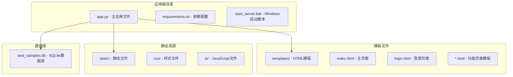
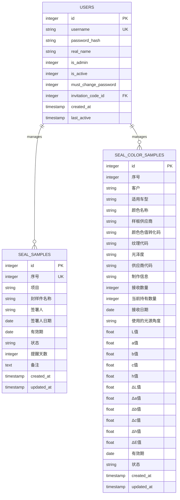
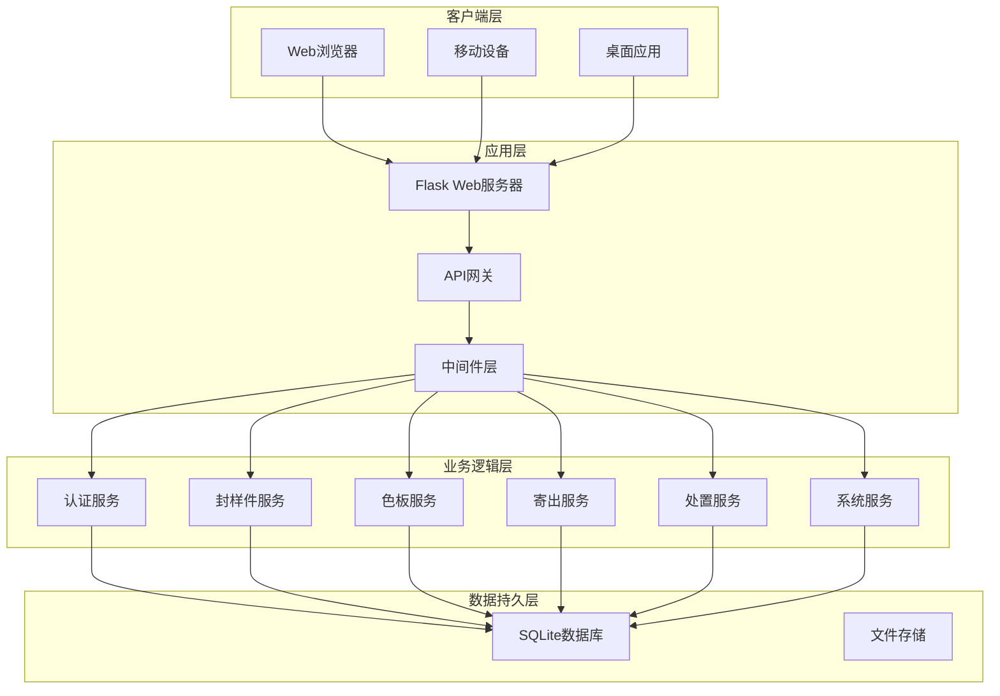
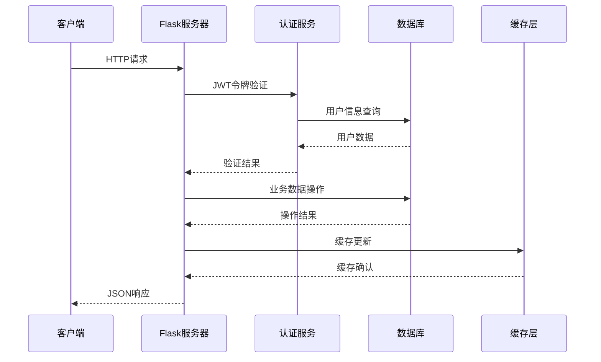
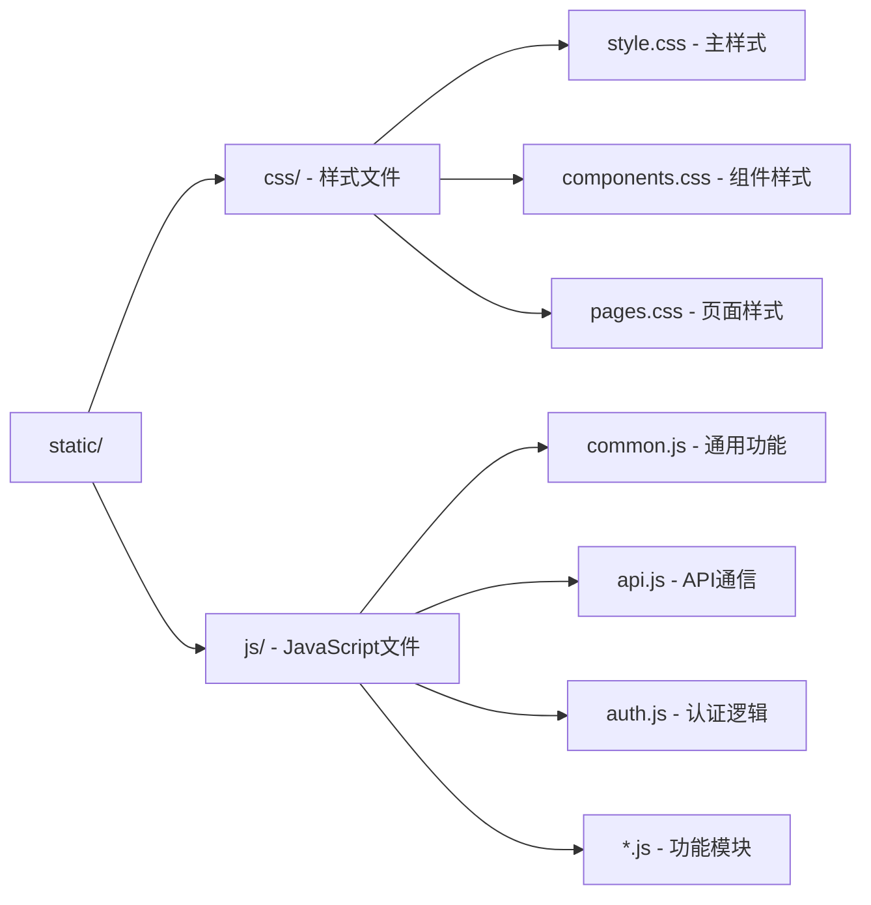
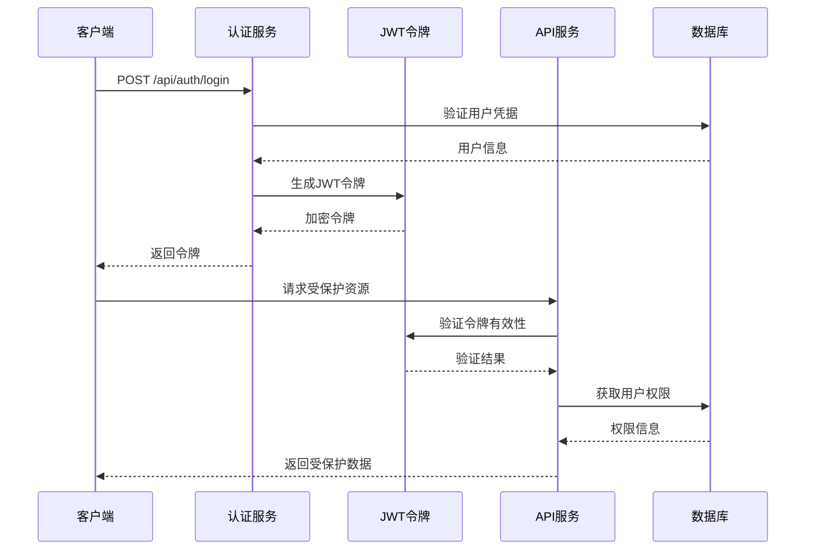
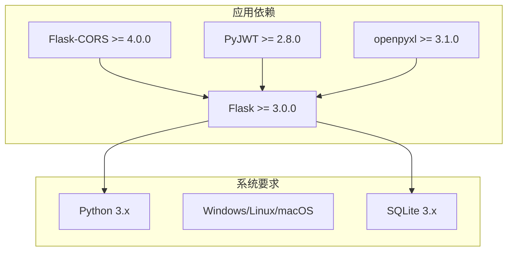
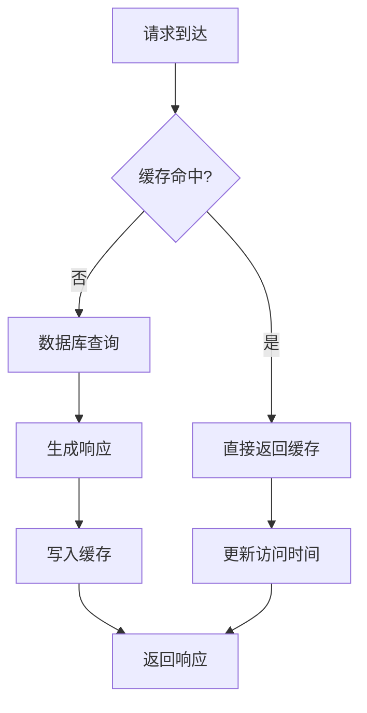

# 服务器部署

<cite>
**本文档引用的文件**
- [app.py](file://app.py)
- [requirements.txt](file://requirements.txt)
- [start_server.bat](file://start_server.bat)
- [index.html](file://templates/index.html)
- [login.html](file://templates/login.html)
- [style.css](file://static/css/style.css)
- [components.css](file://static/css/components.css)
- [pages.css](file://static/css/pages.css)
</cite>

## 目录
1. [简介](#简介)
2. [项目结构](#项目结构)
3. [核心组件](#核心组件)
4. [架构概览](#架构概览)
5. [详细组件分析](#详细组件分析)
6. [依赖关系分析](#依赖关系分析)
7. [性能考虑](#性能考虑)
8. [故障排除指南](#故障排除指南)
9. [结论](#结论)

## 简介

封样件及色板接收登记管理系统是一个基于Python Flask框架开发的企业级资产管理应用。该系统专门用于管理汽车零部件行业的封样件和色板资产，提供完整的生命周期管理功能，包括资产登记、有效期管理、评定流程、报废处理等核心业务功能。

系统采用SQLite作为数据存储引擎，支持JWT令牌认证，具备完整的前后端分离架构，提供现代化的Web界面和丰富的API接口。

## 项目结构

该项目采用标准的Flask应用目录结构，主要包含以下核心组件：



**图表来源**
- [app.py:1-50](file://app.py#L1-L50)
- [requirements.txt:1-5](file://requirements.txt#L1-L5)

**章节来源**
- [app.py:1-50](file://app.py#L1-L50)
- [requirements.txt:1-5](file://requirements.txt#L1-L5)

## 核心组件

### Flask应用核心配置

应用的核心配置集中在主应用文件中，包含以下关键配置：

- **应用配置**：密钥设置、数据库路径、JWT过期时间
- **CORS配置**：跨域资源共享支持
- **数据库连接**：SQLite连接池管理
- **认证机制**：JWT令牌验证和用户权限控制

### 数据库设计

系统采用10张核心数据表，涵盖完整的业务逻辑：



**图表来源**
- [app.py:88-335](file://app.py#L88-L335)

### API接口架构

系统提供RESTful API接口，涵盖以下主要功能模块：

- **认证模块**：用户登录、注册、密码管理
- **封样件管理**：CRUD操作、导入导出、有效期管理
- **色板管理**：颜色资产管理、色差计算、库存管理
- **寄出管理**：色板寄出流程、库存扣减
- **处置管理**：评定记录、报废处理、软删除
- **系统管理**：用户管理、邀请码管理、系统设置

**章节来源**
- [app.py:454-2197](file://app.py#L454-L2197)

## 架构概览

### 系统架构图



### 数据流架构



**图表来源**
- [app.py:49-84](file://app.py#L49-L84)
- [app.py:29-40](file://app.py#L29-L40)

## 详细组件分析

### Windows启动脚本分析

#### 启动脚本执行流程

```mermaid
flowchart TD
A[启动脚本执行] --> B[设置字符编码]
B --> C[显示欢迎信息]
C --> D[切换到应用目录]
D --> E[安装Python依赖]
E --> F[显示安装完成信息]
F --> G[启动Flask服务器]
G --> H[显示访问地址]
H --> I[等待用户输入]
I --> J[停止服务器]
E --> K[pip install -r requirements.txt]
G --> L[python app.py]
L --> M[app.run(host='0.0.0.0', port=5000)]
```

**图表来源**
- [start_server.bat:1-17](file://start_server.bat#L1-L17)

#### 启动参数配置

启动脚本提供了完整的Windows环境部署解决方案：

- **依赖安装**：自动安装所有Python依赖包
- **编码设置**：确保UTF-8字符编码支持
- **端口配置**：默认监听0.0.0.0:5000
- **友好提示**：提供清晰的启动信息和访问地址

**章节来源**
- [start_server.bat:1-17](file://start_server.bat#L1-L17)

### 静态文件服务配置

#### 静态资源组织结构

系统采用标准的Flask静态文件组织方式：



**图表来源**
- [style.css:1-50](file://static/css/style.css#L1-L50)
- [components.css:1-50](file://static/css/components.css#L1-L50)
- [pages.css:1-50](file://static/css/pages.css#L1-L50)

#### 模板渲染配置

应用使用Jinja2模板引擎进行页面渲染：

- **模板目录**：`templates/`目录下的HTML文件
- **页面路由**：`/` 和 `/login` 等路由对应不同页面
- **子页面加载**：通过AJAX动态加载模板内容
- **Favicon服务**：提供SVG格式的网站图标

**章节来源**
- [app.py:2159-2183](file://app.py#L2159-L2183)

### 认证与安全机制

#### JWT令牌认证流程



**图表来源**
- [app.py:49-84](file://app.py#L49-L84)
- [app.py:454-493](file://app.py#L454-L493)

#### 安全配置要点

- **令牌过期**：默认24小时过期时间
- **密码哈希**：使用SHA-256算法
- **CORS配置**：支持跨域资源共享
- **SQL注入防护**：参数化查询和字段白名单
- **XSS防护**：模板自动转义

**章节来源**
- [app.py:21-26](file://app.py#L21-L26)
- [app.py:49-84](file://app.py#L49-L84)

## 依赖关系分析

### Python依赖关系



**图表来源**
- [requirements.txt:1-5](file://requirements.txt#L1-L5)

### 外部服务依赖

系统对外部服务的依赖相对简单：

- **数据库**：SQLite本地文件存储
- **文件处理**：openpyxl用于Excel文件操作
- **网络通信**：标准HTTP/HTTPS协议
- **系统调用**：操作系统文件系统访问

**章节来源**
- [requirements.txt:1-5](file://requirements.txt#L1-L5)

## 性能考虑

### 数据库性能优化

系统采用SQLite作为数据存储，具有以下性能特点：

- **内存映射**：SQLite支持内存映射文件
- **索引优化**：关键字段建立适当索引
- **查询优化**：使用参数化查询减少解析开销
- **连接池**：Flask内置连接管理

### 缓存策略



### 并发处理

- **单进程模型**：Flask开发模式为单进程
- **线程安全**：SQLite在单写入场景下线程安全
- **连接管理**：自动连接关闭和清理

## 故障排除指南

### 常见启动问题

#### 依赖安装失败

**问题症状**：
- pip安装过程中出现错误
- 依赖版本冲突

**解决方法**：
1. 检查Python版本兼容性
2. 更新pip到最新版本
3. 使用虚拟环境隔离依赖
4. 检查网络连接和代理设置

#### 端口占用问题

**问题症状**：
- 启动时提示端口被占用
- 服务器无法绑定到5000端口

**解决方法**：
1. 检查是否有其他程序占用5000端口
2. 修改应用配置中的端口号
3. 使用netstat命令查看端口占用情况

#### 数据库连接问题

**问题症状**：
- 应用启动但数据库操作失败
- 权限不足错误

**解决方法**：
1. 检查数据库文件权限
2. 确认数据库文件路径正确
3. 验证SQLite版本兼容性

### 运行时错误诊断

#### 认证相关错误

**常见错误类型**：
- Token过期或无效
- 用户权限不足
- 密码验证失败

**诊断步骤**：
1. 检查JWT密钥配置
2. 验证用户状态和权限
3. 查看服务器日志输出

#### API接口错误

**排查方法**：
1. 使用浏览器开发者工具查看网络请求
2. 检查API响应状态码
3. 验证请求参数格式
4. 查看服务器错误日志

**章节来源**
- [app.py:49-84](file://app.py#L49-L84)
- [app.py:2187-2197](file://app.py#L2187-L2197)

## 结论

封样件及色板接收登记管理系统是一个功能完整、架构清晰的企业级应用。系统采用现代的技术栈和最佳实践，提供了稳定可靠的资产管理解决方案。

### 主要优势

- **技术栈成熟**：Flask + SQLite组合适合中小型应用
- **安全性良好**：完善的认证授权机制
- **部署简单**：Windows批处理脚本一键部署
- **扩展性强**：模块化设计便于功能扩展

### 发展建议

1. **生产环境优化**：考虑使用更强大的Web服务器如Gunicorn
2. **监控完善**：添加应用性能监控和错误追踪
3. **备份策略**：建立定期数据库备份机制
4. **安全加固**：增加更多安全防护措施

该系统为汽车零部件行业的资产管理提供了完整的数字化解决方案，具有良好的实用价值和推广前景。