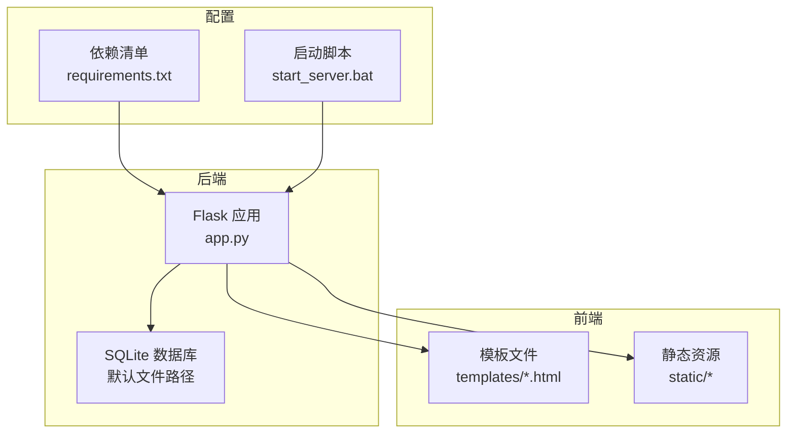
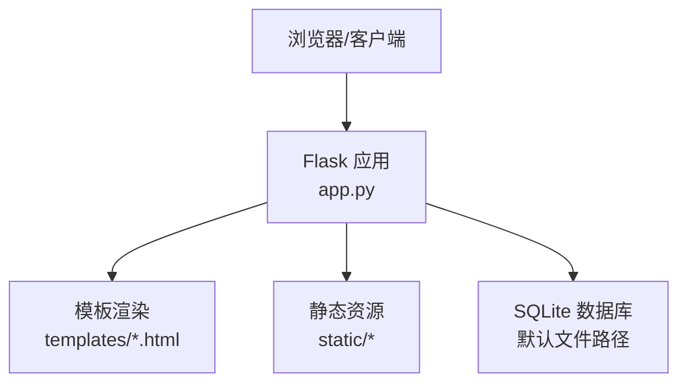
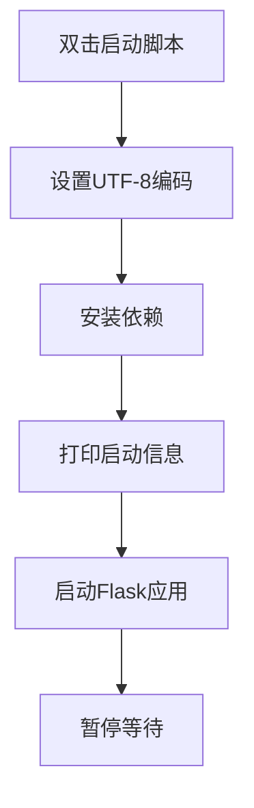
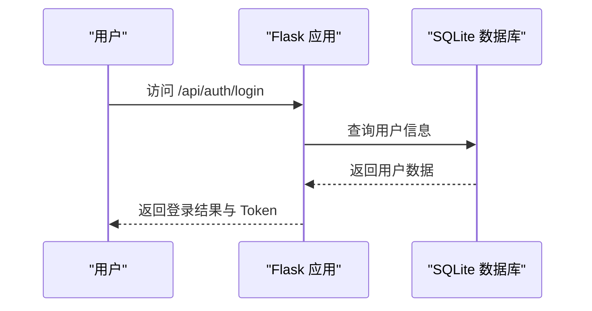
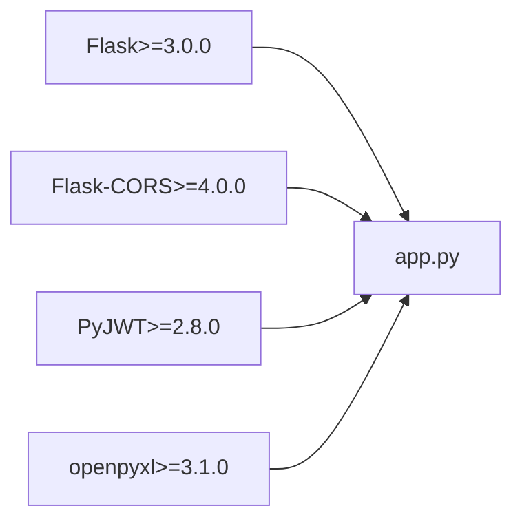

# 环境配置

<cite>
**本文引用的文件**
- [app.py](file://app.py)
- [requirements.txt](file://requirements.txt)
- [start_server.bat](file://start_server.bat)
</cite>

## 目录
1. [简介](#简介)
2. [项目结构](#项目结构)
3. [核心组件](#核心组件)
4. [架构总览](#架构总览)
5. [详细组件分析](#详细组件分析)
6. [依赖分析](#依赖分析)
7. [性能考虑](#性能考虑)
8. [故障排查指南](#故障排查指南)
9. [结论](#结论)
10. [附录](#附录)

## 简介
本文件面向“封样件及色板接收登记管理系统”的生产环境部署与运行，提供系统要求、依赖安装、启动方式、虚拟环境配置、环境变量与路径设置、以及环境验证与测试方法。内容基于仓库中的实际代码与配置文件进行梳理，确保读者能够快速、准确地完成环境搭建与验证。

## 项目结构
项目采用前后端分离的静态资源与后端API结合的结构：
- 后端：基于 Flask 的 Python 应用，负责业务逻辑、数据库访问与 API 提供
- 前端：HTML 模板与静态资源（CSS/JS），由后端模板渲染与静态文件服务提供
- 配置：依赖清单与 Windows 启动脚本

图表来源
- [app.py:21-25](file://app.py#L21-L25)
- [app.py:2159-2176](file://app.py#L2159-L2176)
- [requirements.txt:1-5](file://requirements.txt#L1-L5)
- [start_server.bat:1-17](file://start_server.bat#L1-L17)

章节来源
- [app.py:21-25](file://app.py#L21-L25)
- [app.py:2159-2176](file://app.py#L2159-L2176)
- [requirements.txt:1-5](file://requirements.txt#L1-L5)
- [start_server.bat:1-17](file://start_server.bat#L1-L17)

## 核心组件
- Flask 应用与配置
  - 应用实例、CORS、密钥、数据库路径、JWT 过期时间等配置均在应用启动时加载
- 数据库初始化
  - 首次启动时自动创建 10 张业务表，并预置管理员账户与系统阈值设置
- API 与页面路由
  - 提供认证、封样件/色板台账、寄出记录、有效期管理、评定与报废、处置记录、仪表盘等接口
  - 提供模板渲染与静态资源服务
- 启动与依赖
  - Windows 启动脚本自动安装依赖并启动服务
  - Linux/Unix 可直接使用 Python 启动

章节来源
- [app.py:21-25](file://app.py#L21-L25)
- [app.py:88-335](file://app.py#L88-L335)
- [app.py:454-589](file://app.py#L454-L589)
- [app.py:593-795](file://app.py#L593-L795)
- [app.py:799-1041](file://app.py#L799-L1041)
- [app.py:1045-1171](file://app.py#L1045-L1171)
- [app.py:1175-1209](file://app.py#L1175-L1209)
- [app.py:1226-1287](file://app.py#L1226-L1287)
- [app.py:1291-1355](file://app.py#L1291-L1355)
- [app.py:1630-1891](file://app.py#L1630-L1891)
- [app.py:2084-2154](file://app.py#L2084-L2154)
- [app.py:2159-2176](file://app.py#L2159-L2176)
- [app.py:2187-2197](file://app.py#L2187-L2197)
- [start_server.bat:1-17](file://start_server.bat#L1-L17)

## 架构总览
系统采用单机部署模式，后端服务监听本地网络接口，前端通过模板与静态资源提供交互界面；数据库为本地 SQLite 文件。

图表来源
- [app.py:21-25](file://app.py#L21-L25)
- [app.py:2159-2176](file://app.py#L2159-L2176)

## 详细组件分析

### 系统要求与兼容性
- Python 版本
  - 依赖清单要求 Flask≥3.0.0，建议使用 Python 3.8 及以上版本以获得最佳兼容性
- 操作系统
  - Windows：提供批处理脚本一键安装与启动
  - Linux/Unix：可直接使用 Python 启动，无需额外脚本
- 硬件配置
  - 本项目为轻量级应用，推荐最小内存 1GB，CPU 单核即可满足日常使用
  - SQLite 适合小规模数据，若并发较高或数据量增长，建议评估迁移至更强大的数据库

章节来源
- [requirements.txt:1](file://requirements.txt#L1)
- [start_server.bat:1-17](file://start_server.bat#L1-L17)
- [app.py:2187-2197](file://app.py#L2187-L2197)

### 依赖包安装与作用
- 依赖清单
  - Flask>=3.0.0：Web 框架，提供路由、请求处理与模板渲染
  - Flask-CORS>=4.0.0：跨域支持，便于前后端分离开发与部署
  - PyJWT>=2.8.0：JWT 认证与解码，用于用户登录与接口鉴权
  - openpyxl>=3.1.0：Excel 导入导出，用于台账与处置记录的批量处理
- 安装方式
  - Windows：启动脚本会自动安装依赖
  - Linux/Unix：可直接 pip 安装 requirements.txt 中的依赖

章节来源
- [requirements.txt:1-5](file://requirements.txt#L1-L5)
- [start_server.bat:8](file://start_server.bat#L8)

### Windows 环境启动脚本
- 工作原理
  - 设置字符集为 UTF-8
  - 安装依赖（静默）
  - 输出服务启动提示与访问地址
  - 启动 Flask 应用
  - 暂停等待，便于查看输出
- 参数与行为
  - 无命令行参数，自动安装依赖并启动
  - 默认监听 127.0.0.1:5000
- 注意事项
  - 若网络受限，建议提前离线下载依赖或配置代理
  - 如需自定义端口，可在启动后手动调整（见后续章节）

图表来源
- [start_server.bat:1-17](file://start_server.bat#L1-L17)

章节来源
- [start_server.bat:1-17](file://start_server.bat#L1-L17)

### Linux/Unix 环境部署与启动
- 安装依赖
  - 使用 pip 安装 requirements.txt 中的依赖
- 启动方式
  - 直接运行 Python 应用文件启动服务
  - 默认监听 0.0.0.0:5000，可通过环境变量或命令行参数调整
- 替代方案
  - 可使用 WSGI 服务器（如 Gunicorn）部署生产环境
  - 可配合反向代理（Nginx/Apache）提供 HTTPS 与静态资源加速

章节来源
- [requirements.txt:1-5](file://requirements.txt#L1-L5)
- [app.py:2187-2197](file://app.py#L2187-L2197)

### 虚拟环境创建与激活
- 创建虚拟环境
  - 使用 Python 内置 venv 或第三方工具（如 virtualenv）
- 激活虚拟环境
  - Windows：调用 activate 脚本
  - Linux/Unix：source 激活脚本
- 安装依赖
  - 在激活的环境中安装 requirements.txt 中的依赖
- 退出虚拟环境
  - 使用 deactivate 命令退出

章节来源
- [requirements.txt:1-5](file://requirements.txt#L1-L5)

### 环境变量与路径设置
- 应用配置
  - SECRET_KEY：JWT 密钥
  - DB_PATH：SQLite 数据库文件路径
  - JWT_EXPIRATION_HOURS：JWT 过期小时数
- 默认行为
  - 数据库文件默认位于应用根目录
  - 若需持久化或迁移数据库，建议在启动前设置合适的路径
- 建议
  - 生产环境建议将数据库文件置于独立的数据目录，并赋予适当权限
  - 如需自定义监听地址与端口，可在启动时通过命令行参数或环境变量覆盖（参考 Flask 文档）

章节来源
- [app.py:21-25](file://app.py#L21-L25)
- [app.py:2187-2197](file://app.py#L2187-L2197)

### 环境验证与测试
- 依赖验证
  - 确认依赖已安装且版本满足要求
- 服务启动验证
  - 访问默认地址 http://127.0.0.1:5000
  - 登录管理员账户（初始账户已在数据库初始化时创建）
- 功能验证
  - 登录后进入首页，检查页面加载与模板渲染
  - 尝试访问任意 API（如认证接口）确认服务可用
- 数据库初始化验证
  - 首次启动会自动创建数据库表并初始化管理员账户
  - 可通过数据库客户端查看表结构与初始数据

图表来源
- [app.py:454-493](file://app.py#L454-L493)

章节来源
- [app.py:454-493](file://app.py#L454-L493)
- [app.py:88-335](file://app.py#L88-L335)
- [app.py:2187-2197](file://app.py#L2187-L2197)

## 依赖分析
- 直接依赖
  - Flask：Web 框架核心
  - Flask-CORS：跨域支持
  - PyJWT：认证
  - openpyxl：Excel 导入导出
- 运行时依赖
  - Python 标准库（如 datetime、json、os 等）
  - SQLite（内置）
- 版本要求
  - Flask≥3.0.0
  - Flask-CORS≥4.0.0
  - PyJWT≥2.8.0
  - openpyxl≥3.1.0

图表来源
- [requirements.txt:1-5](file://requirements.txt#L1-L5)
- [app.py:14-18](file://app.py#L14-L18)

章节来源
- [requirements.txt:1-5](file://requirements.txt#L1-L5)
- [app.py:14-18](file://app.py#L14-L18)

## 性能考虑
- 数据库性能
  - SQLite 适合小规模数据与单机部署；若并发高或数据量大，建议迁移到更强大的数据库
- 导入导出性能
  - Excel 导入导出涉及大量行处理，建议在后台任务中异步执行，避免阻塞主线程
- 缓存策略
  - 可引入缓存（如 Redis）提升热点数据访问速度
- 监控与日志
  - 建议开启应用日志与错误追踪，便于定位性能瓶颈

## 故障排查指南
- 依赖安装失败
  - 检查网络与代理设置
  - 确认 Python 与 pip 版本
- 启动失败
  - 查看启动脚本输出与终端日志
  - 确认端口未被占用
- 数据库问题
  - 检查数据库文件是否存在与权限
  - 首次启动会自动初始化，如异常可清理数据库文件后重启
- 权限问题
  - 确保运行用户对数据库文件与静态资源目录具有读写权限

章节来源
- [start_server.bat:1-17](file://start_server.bat#L1-L17)
- [app.py:29-39](file://app.py#L29-L39)
- [app.py:88-335](file://app.py#L88-L335)

## 结论
本环境配置文档基于仓库中的实际代码与配置文件整理而成，明确了系统要求、依赖安装、启动方式、虚拟环境配置、环境变量与路径设置，以及环境验证与测试方法。按照本文步骤，可在 Windows 与 Linux/Unix 环境中快速完成部署与验证。

## 附录
- 快速检查清单
  - Python 3.8+ 已安装
  - pip 可用
  - 已创建并激活虚拟环境（可选）
  - 已安装 requirements.txt 中的依赖
  - 已通过启动脚本或 Python 启动服务
  - 已访问 http://127.0.0.1:5000 并登录管理员账户
  - 数据库文件存在且可读写