# 监控与日志

<cite>
**本文档引用的文件**
- [app.py](file://app.py)
- [requirements.txt](file://requirements.txt)
- [start_server.bat](file://start_server.bat)
- [common.js](file://static/js/common.js)
- [system-settings.js](file://static/js/system-settings.js)
- [dashboard.js](file://static/js/dashboard.js)
</cite>

## 目录
1. [简介](#简介)
2. [项目结构](#项目结构)
3. [核心组件](#核心组件)
4. [架构概览](#架构概览)
5. [详细组件分析](#详细组件分析)
6. [依赖分析](#依赖分析)
7. [性能考虑](#性能考虑)
8. [故障排除指南](#故障排除指南)
9. [结论](#结论)
10. [附录](#附录)

## 简介

封样件及色板接收登记管理系统是一个基于Python Flask框架开发的企业级应用，专门用于管理封样件和色板的接收、评估、处置等业务流程。该系统采用SQLite作为数据存储，支持JWT认证，具备完整的业务功能模块，包括用户管理、封样件管理、色板管理、寄出管理、有效期管理、评定管理、报废管理等。

本监控与日志文档旨在为该系统提供全面的监控解决方案，涵盖应用日志配置、错误追踪、性能监控、健康检查、告警机制、日志分析工具等多个方面，确保系统的稳定运行和高效维护。

## 项目结构

系统采用前后端分离的架构设计，主要分为以下层次：

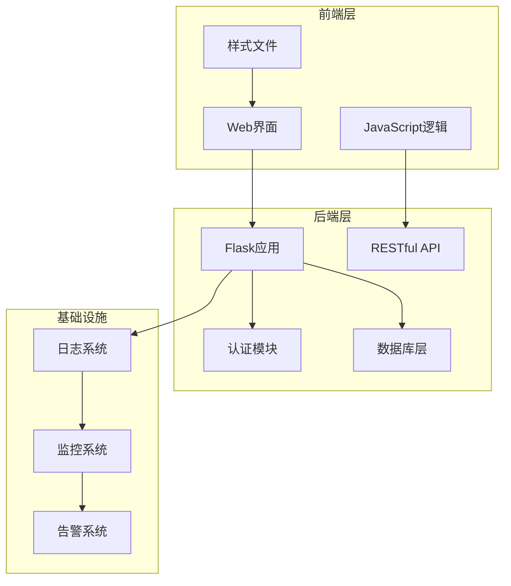
```mermaid
graph TB
subgraph "前端层"
FE[Web界面]
JS[JavaScript逻辑]
CSS[样式文件]
end
subgraph "后端层"
APP[Flask应用]
API[RESTful API]
AUTH[认证模块]
DB[数据库层]
end
subgraph "基础设施"
LOG[日志系统]
MON[监控系统]
ALERT[告警系统]
end
FE --> APP
JS --> API
CSS --> FE
APP --> AUTH
APP --> DB
APP --> LOG
LOG --> MON
MON --> ALERT
```

**图表来源**
- [app.py:1-50](file://app.py#L1-L50)
- [requirements.txt:1-5](file://requirements.txt#L1-L5)

系统的核心特点：
- **Flask框架**：轻量级Web框架，支持快速开发和部署
- **JWT认证**：基于令牌的认证机制，支持Token过期和刷新
- **SQLite数据库**：内置数据库，无需额外配置
- **前后端分离**：HTML模板 + JavaScript + RESTful API
- **响应式设计**：支持多种设备访问

**章节来源**
- [app.py:1-50](file://app.py#L1-L50)
- [requirements.txt:1-5](file://requirements.txt#L1-L5)

## 核心组件

### 日志系统现状分析

目前系统中存在基础的日志记录机制：

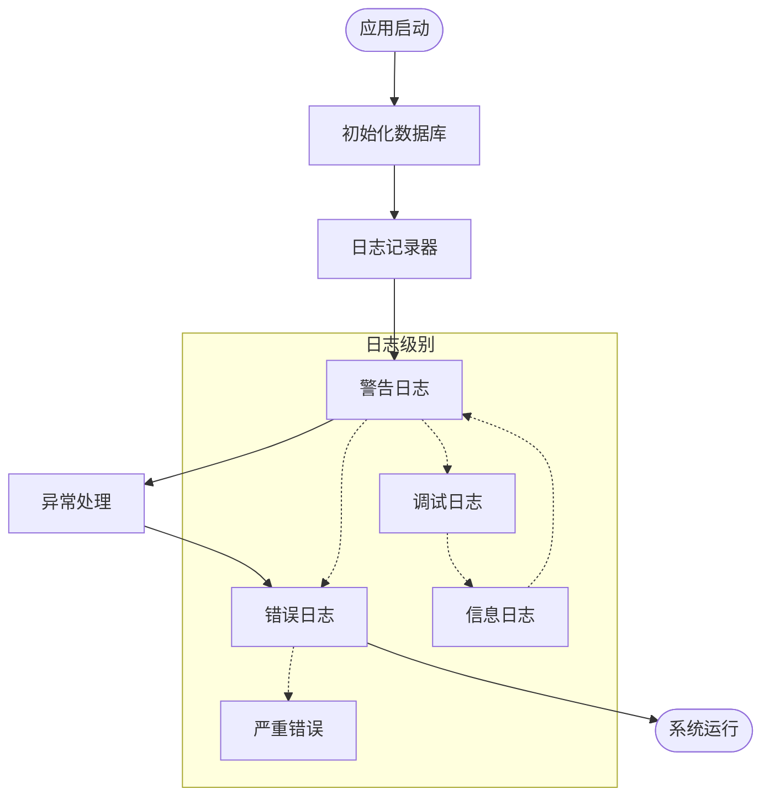
```mermaid
flowchart TD
Start([应用启动]) --> InitDB[初始化数据库]
InitDB --> Logger[日志记录器]
Logger --> Warning[警告日志]
Warning --> Exception[异常处理]
Exception --> Error[错误日志]
Error --> End([系统运行])
subgraph "日志级别"
Warning -.-> Debug[调试日志]
Debug -.-> Info[信息日志]
Info -.-> Warning
Warning -.-> Error
Error -.-> Critical[严重错误]
end
```

**图表来源**
- [app.py:368-370](file://app.py#L368-L370)

### 错误处理机制

系统采用多层次的错误处理策略：

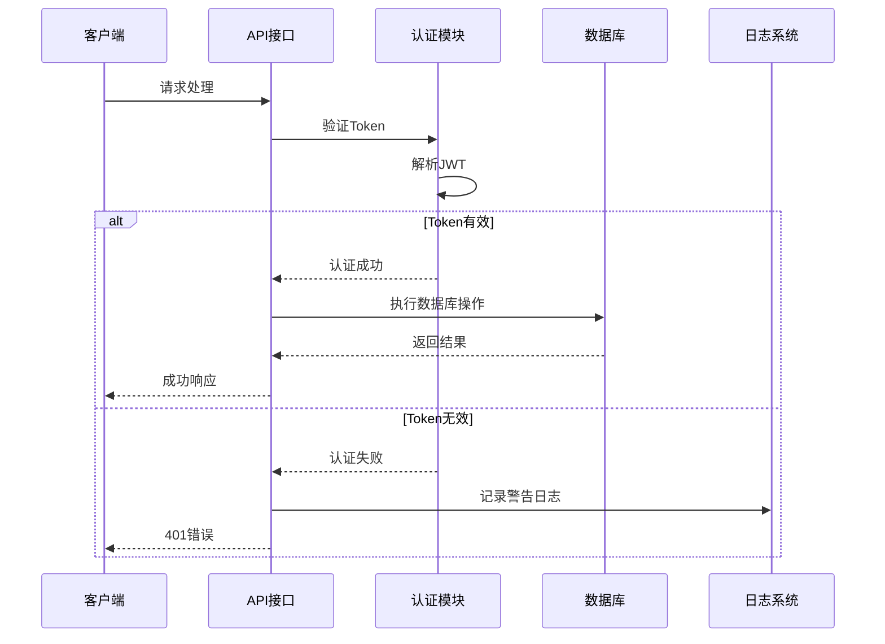
```mermaid
sequenceDiagram
participant Client as 客户端
participant API as API接口
participant Auth as 认证模块
participant DB as 数据库
participant Logger as 日志系统
Client->>API : 请求处理
API->>Auth : 验证Token
Auth->>Auth : 解析JWT
alt Token有效
Auth-->>API : 认证成功
API->>DB : 执行数据库操作
DB-->>API : 返回结果
API-->>Client : 成功响应
else Token无效
Auth-->>API : 认证失败
API->>Logger : 记录警告日志
API-->>Client : 401错误
end
```

**图表来源**
- [app.py:49-76](file://app.py#L49-L76)
- [app.py:368-370](file://app.py#L368-L370)

**章节来源**
- [app.py:368-370](file://app.py#L368-L370)
- [app.py:49-76](file://app.py#L49-L76)

## 架构概览

系统监控架构采用分层设计，确保各个组件之间的松耦合和高内聚：

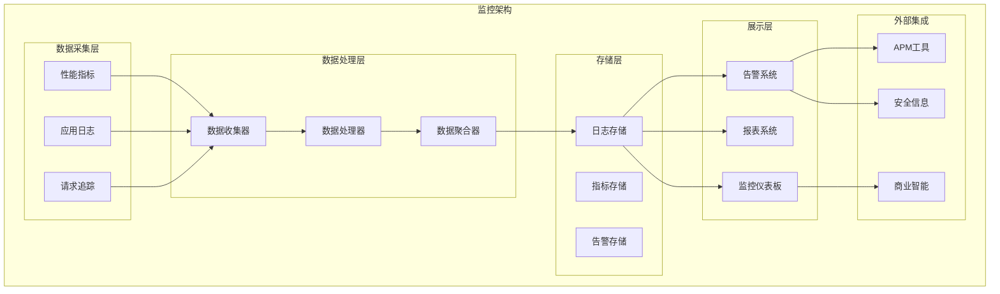
```mermaid
graph TB
subgraph "监控架构"
subgraph "数据采集层"
Metrics[性能指标]
Logs[应用日志]
Traces[请求追踪]
end
subgraph "数据处理层"
Collector[数据收集器]
Processor[数据处理器]
Aggregator[数据聚合器]
end
subgraph "存储层"
Storage[日志存储]
DB[指标存储]
AlertDB[告警存储]
end
subgraph "展示层"
Dashboard[监控仪表板]
Reports[报表系统]
Alerts[告警系统]
end
subgraph "外部集成"
APM[APM工具]
SIEM[安全信息]
BI[商业智能]
end
end
Metrics --> Collector
Logs --> Collector
Traces --> Collector
Collector --> Processor
Processor --> Aggregator
Aggregator --> Storage
Storage --> Dashboard
Storage --> Reports
Storage --> Alerts
Alerts --> APM
Alerts --> SIEM
Dashboard --> BI
```

**图表来源**
- [app.py:2187-2197](file://app.py#L2187-L2197)

## 详细组件分析

### 应用日志配置与管理

#### 当前日志实现

系统目前使用Flask内置的日志记录器，主要在以下场景使用：

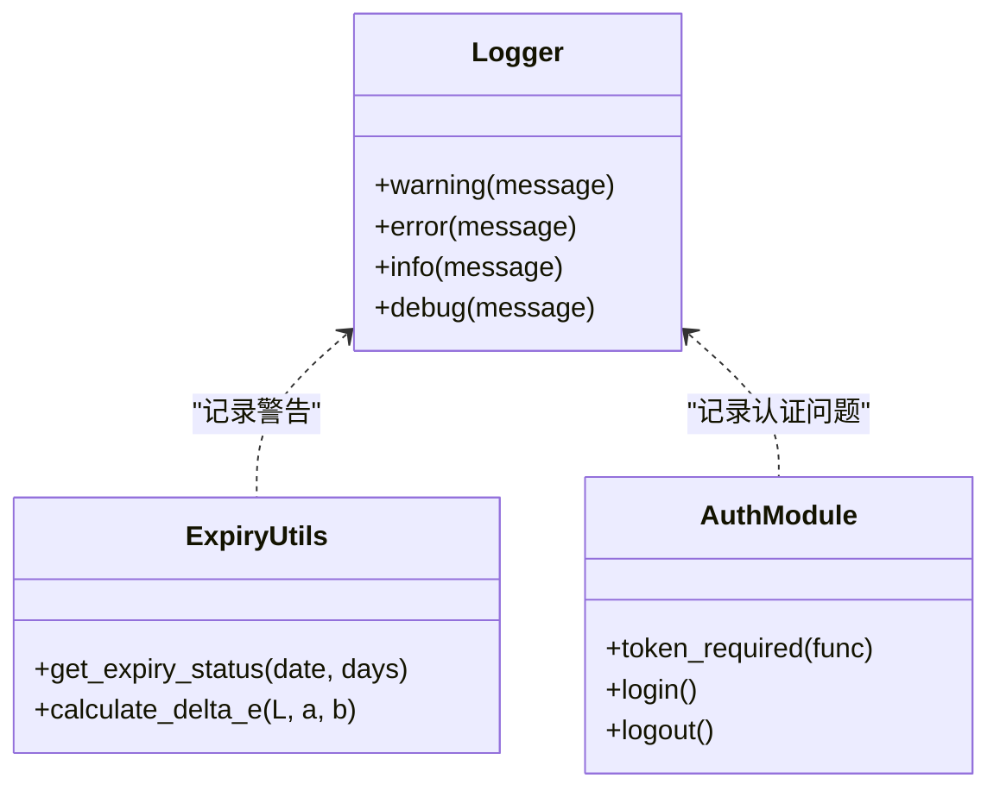
```mermaid
classDiagram
class Logger {
+warning(message)
+error(message)
+info(message)
+debug(message)
}
class ExpiryUtils {
+get_expiry_status(date, days)
+calculate_delta_e(L, a, b)
}
class AuthModule {
+token_required(func)
+login()
+logout()
}
Logger <.. ExpiryUtils : "记录警告"
Logger <.. AuthModule : "记录认证问题"
```

**图表来源**
- [app.py:368-370](file://app.py#L368-L370)
- [app.py:49-76](file://app.py#L49-L76)

#### 日志级别设置建议

基于系统需求，建议采用以下日志级别配置：

| 日志级别 | 使用场景 | 建议频率 |
|---------|---------|---------|
| DEBUG | 开发调试、详细流程跟踪 | 低频 |
| INFO | 正常业务操作、状态变化 | 中频 |
| WARNING | 可能的问题、边界情况 | 高频 |
| ERROR | 业务错误、异常处理 | 高频 |
| CRITICAL | 系统级错误、服务中断 | 极低频 |

#### 输出格式标准化

建议采用统一的JSON格式输出：

```json
{
  "timestamp": "2024-01-15T10:30:45.123Z",
  "level": "INFO",
  "service": "seal-color-system",
  "module": "auth",
  "request_id": "abc123",
  "user_id": 1,
  "endpoint": "/api/auth/login",
  "message": "用户登录成功",
  "duration_ms": 45,
  "ip": "192.168.1.100",
  "user_agent": "Mozilla/5.0..."
}
```

**章节来源**
- [app.py:368-370](file://app.py#L368-L370)

### 错误追踪与异常处理机制

#### 异常处理策略

系统采用分层异常处理机制：

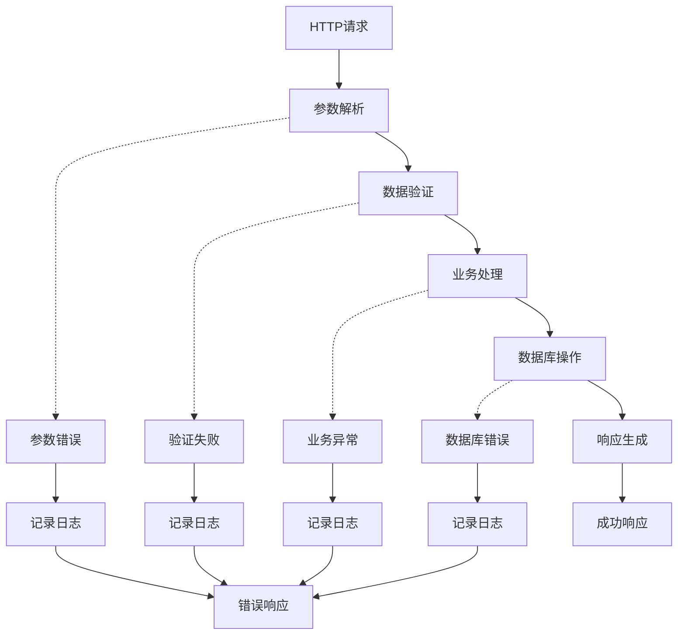
```mermaid
flowchart TD
Request[HTTP请求] --> Parse[参数解析]
Parse --> Validate[数据验证]
Validate --> Process[业务处理]
Process --> DB[数据库操作]
DB --> Response[响应生成]
Parse -.-> ParseError[参数错误] --> LogParse[记录日志] --> ErrorResponse[错误响应]
Validate -.-> ValidateError[验证失败] --> LogValidate[记录日志] --> ErrorResponse
Process -.-> ProcessError[业务异常] --> LogProcess[记录日志] --> ErrorResponse
DB -.-> DBError[数据库错误] --> LogDB[记录日志] --> ErrorResponse
Response --> SuccessResponse[成功响应]
```

#### 关键异常处理点

1. **认证异常处理**：JWT解码异常、Token过期、用户不存在等情况
2. **业务逻辑异常**：数据完整性约束、业务规则违反、并发冲突
3. **数据库异常**：连接超时、死锁、SQL语法错误
4. **文件操作异常**：Excel导入导出、文件权限、磁盘空间不足

**章节来源**
- [app.py:49-76](file://app.py#L49-L76)
- [app.py:725-794](file://app.py#L725-L794)

### 性能监控指标收集

#### 核心性能指标

基于系统特性，建议收集以下关键指标：

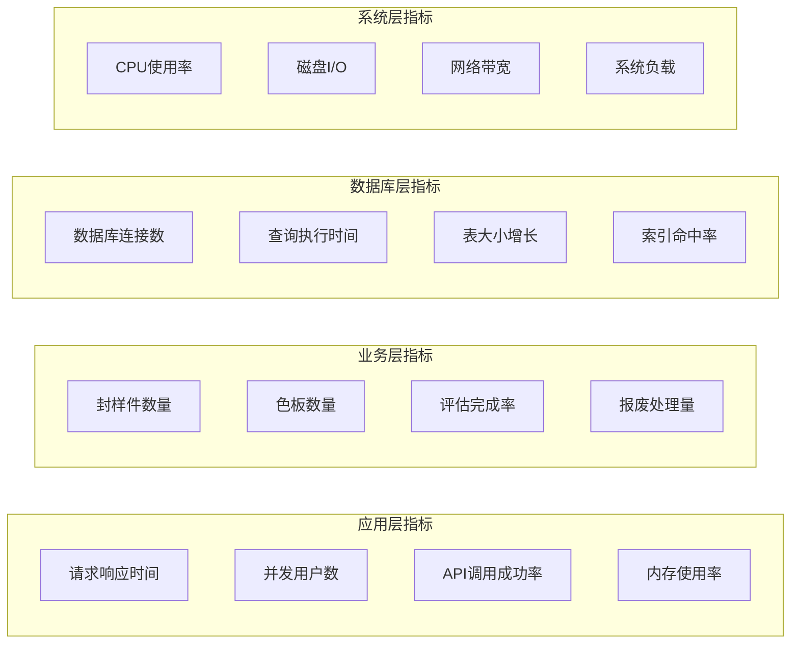
```mermaid
graph LR
subgraph "应用层指标"
A1[请求响应时间]
A2[并发用户数]
A3[API调用成功率]
A4[内存使用率]
end
subgraph "业务层指标"
B1[封样件数量]
B2[色板数量]
B3[评估完成率]
B4[报废处理量]
end
subgraph "数据库层指标"
C1[数据库连接数]
C2[查询执行时间]
C3[表大小增长]
C4[索引命中率]
end
subgraph "系统层指标"
D1[CPU使用率]
D2[磁盘I/O]
D3[网络带宽]
D4[系统负载]
end
```

#### 指标收集实现

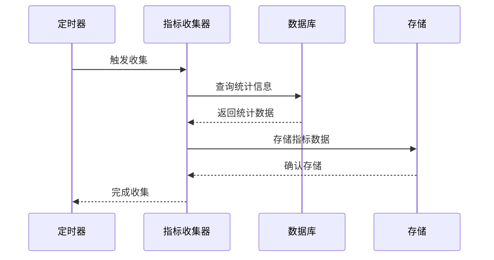
```mermaid
sequenceDiagram
participant Timer as 定时器
participant Metrics as 指标收集器
participant DB as 数据库
participant Storage as 存储
Timer->>Metrics : 触发收集
Metrics->>DB : 查询统计信息
DB-->>Metrics : 返回统计数据
Metrics->>Storage : 存储指标数据
Storage-->>Metrics : 确认存储
Metrics-->>Timer : 完成收集
```

**图表来源**
- [app.py:2084-2154](file://app.py#L2084-L2154)

**章节来源**
- [app.py:2084-2154](file://app.py#L2084-L2154)

### 系统健康检查与可用性监控

#### 健康检查接口

建议实现多层级健康检查：

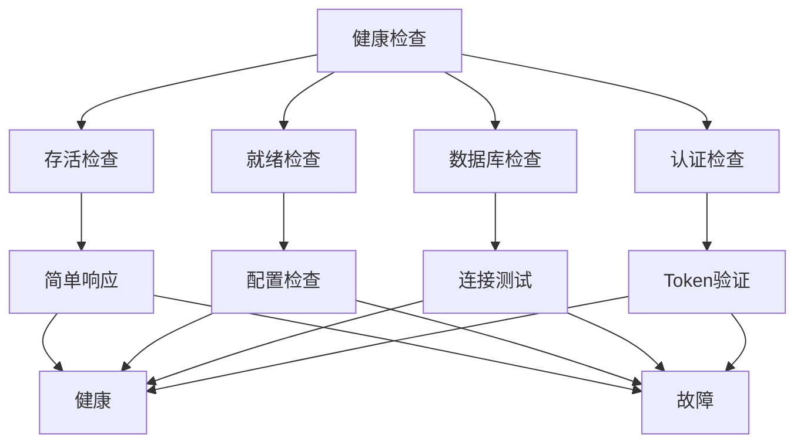
```mermaid
flowchart TD
Health[健康检查] --> Live[存活检查]
Health --> Ready[就绪检查]
Health --> DB[数据库检查]
Health --> Auth[认证检查]
Live --> Ping[简单响应]
Ready --> Config[配置检查]
DB --> Conn[连接测试]
Auth --> Token[Token验证]
Ping --> OK[健康]
Config --> OK
Conn --> OK
Token --> OK
Ping --> Fail[故障]
Config --> Fail
Conn --> Fail
Token --> Fail
```

#### 可用性监控配置

| 监控项 | 阈值 | 告警级别 | 检查频率 |
|-------|------|---------|---------|
| API响应时间 | < 500ms | 信息 | 1分钟 |
| 95分位响应时间 | < 2000ms | 信息 | 5分钟 |
| 错误率 | < 1% | 信息 | 1分钟 |
| 数据库连接数 | < 80% | 信息 | 1分钟 |
| 磁盘空间 | > 10% | 信息 | 1小时 |
| 内存使用率 | < 80% | 信息 | 1分钟 |

**章节来源**
- [app.py:572-588](file://app.py#L572-L588)

### 告警机制与通知系统

#### 告警级别定义

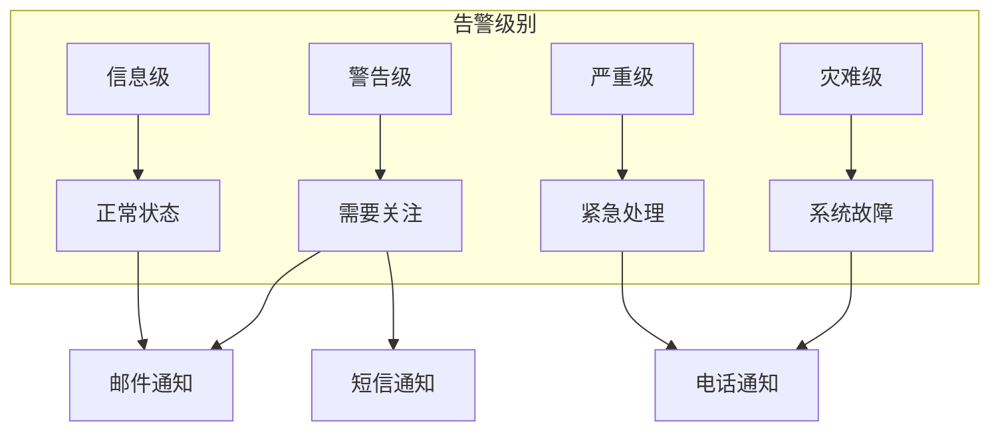
```mermaid
graph TD
subgraph "告警级别"
Level1[信息级] --> Normal[正常状态]
Level2[警告级] --> Warning[需要关注]
Level3[严重级] --> Critical[紧急处理]
Level4[灾难级] --> Disaster[系统故障]
end
Normal --> Email[邮件通知]
Warning --> Email
Warning --> SMS[短信通知]
Critical --> Phone[电话通知]
Disaster --> Phone
```

#### 告警触发条件

| 告警类型 | 触发条件 | 恢复条件 |
|---------|---------|---------|
| 性能告警 | 响应时间>2s | 响应时间<1s持续5分钟 |
| 业务告警 | 评估失败率>5% | 失败率<1%持续10分钟 |
| 系统告警 | 错误率>10% | 错误率<1%持续15分钟 |
| 资源告警 | CPU>90% | CPU<70%持续10分钟 |
| 数据告警 | 数据库连接池耗尽 | 连接数恢复正常 |

**章节来源**
- [app.py:1226-1286](file://app.py#L1226-L1286)

### 日志分析工具与可视化报告

#### 日志分析架构

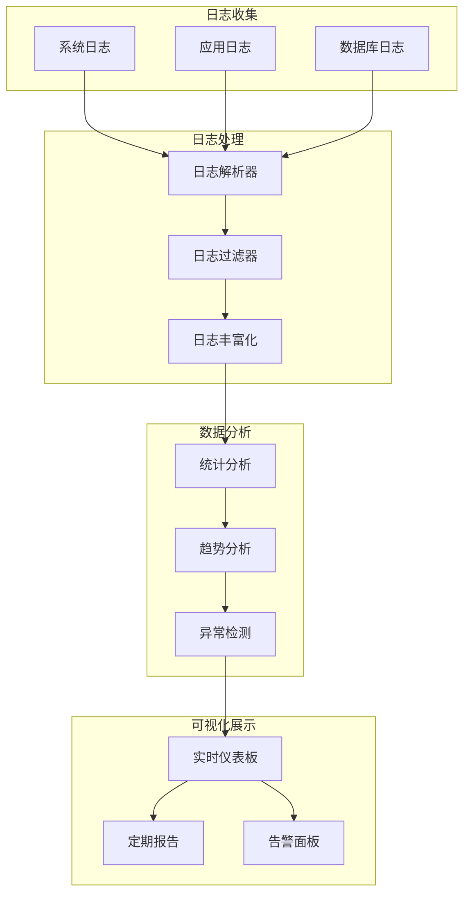
```mermaid
graph TB
subgraph "日志收集"
Syslog[系统日志]
AppLog[应用日志]
DBLog[数据库日志]
end
subgraph "日志处理"
Parser[日志解析器]
Filter[日志过滤器]
Enrich[日志丰富化]
end
subgraph "数据分析"
Analytics[统计分析]
Trend[趋势分析]
Anomaly[异常检测]
end
subgraph "可视化展示"
Dashboard[实时仪表板]
Reports[定期报告]
Alerts[告警面板]
end
Syslog --> Parser
AppLog --> Parser
DBLog --> Parser
Parser --> Filter
Filter --> Enrich
Enrich --> Analytics
Analytics --> Trend
Trend --> Anomaly
Anomaly --> Dashboard
Dashboard --> Reports
Dashboard --> Alerts
```

#### 关键业务指标可视化

基于系统特性，建议重点关注以下业务指标：

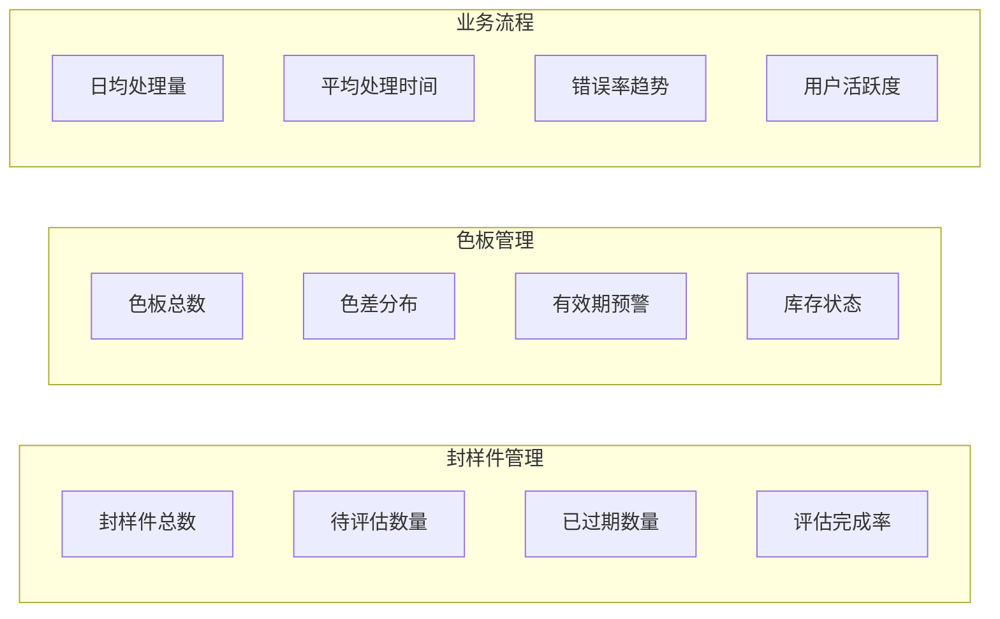
```mermaid
graph LR
subgraph "封样件管理"
S1[封样件总数]
S2[待评估数量]
S3[已过期数量]
S4[评估完成率]
end
subgraph "色板管理"
C1[色板总数]
C2[色差分布]
C3[有效期预警]
C4[库存状态]
end
subgraph "业务流程"
B1[日均处理量]
B2[平均处理时间]
B3[错误率趋势]
B4[用户活跃度]
end
```

**章节来源**
- [app.py:2084-2154](file://app.py#L2084-L2154)

### APM（应用性能管理）工具集成

#### 推荐APM工具

基于系统特点，推荐以下APM工具：

| 工具 | 适用场景 | 优势 | 成本 |
|------|---------|------|------|
| New Relic | 生产环境监控 | 功能全面，支持多种语言 | 中等 |
| DataDog | 云原生监控 | APM + 日志 + 告警一体化 | 较高 |
| AppDynamics | 企业级监控 | 详细的业务事务分析 | 高 |
| Prometheus + Grafana | 开源方案 | 自定义程度高，成本低 | 低 |

#### 集成实施步骤

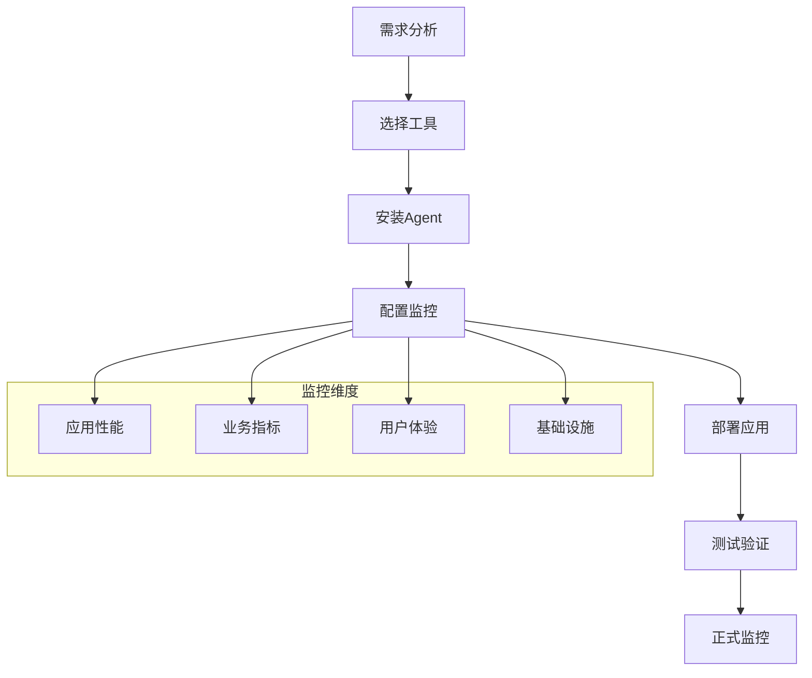
```mermaid
flowchart TD
Plan[需求分析] --> Choose[选择工具]
Choose --> Install[安装Agent]
Install --> Configure[配置监控]
Configure --> Deploy[部署应用]
Deploy --> Test[测试验证]
Test --> Monitor[正式监控]
subgraph "监控维度"
A[应用性能]
B[业务指标]
C[用户体验]
D[基础设施]
end
Configure --> A
Configure --> B
Configure --> C
Configure --> D
```

**章节来源**
- [app.py:2187-2197](file://app.py#L2187-L2197)

### 监控仪表板设计与配置

#### 仪表板布局设计

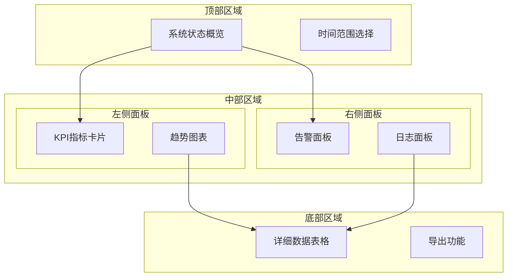
```mermaid
graph TB
subgraph "顶部区域"
Header[系统状态概览]
TimeRange[时间范围选择]
end
subgraph "中部区域"
subgraph "左侧面板"
KPI[KPI指标卡片]
Trend[趋势图表]
end
subgraph "右侧面板"
Alert[告警面板]
Log[日志面板]
end
end
subgraph "底部区域"
Detail[详细数据表格]
Export[导出功能]
end
Header --> KPI
Header --> Alert
Trend --> Detail
Log --> Detail
```

#### 关键指标配置

| 指标名称 | 类型 | 计算公式 | 阈值设置 |
|---------|------|---------|---------|
| 系统可用性 | 百分比 | (总时间-故障时间)/总时间×100% | >99.9% |
| 平均响应时间 | 毫秒 | 所有请求的平均响应时间 | < 500ms |
| 错误率 | 百分比 | 错误请求/总请求数×100% | < 1% |
| 并发用户数 | 人数 | 同时在线用户数 | 根据业务设定 |
| 数据库连接数 | 数量 | 当前连接数 | < 80% |

**章节来源**
- [app.py:2084-2154](file://app.py#L2084-L2154)

### 日志轮转与存储管理策略

#### 日志轮转策略

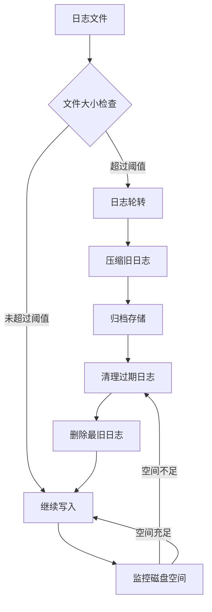
```mermaid
flowchart TD
LogFile[日志文件] --> SizeCheck{文件大小检查}
SizeCheck --> |超过阈值| Rotate[日志轮转]
SizeCheck --> |未超过阈值| Write[继续写入]
Rotate --> Compress[压缩旧日志]
Compress --> Archive[归档存储]
Archive --> Cleanup[清理过期日志]
Write --> Monitor[监控磁盘空间]
Monitor --> |空间不足| Cleanup
Monitor --> |空间充足| Write
Cleanup --> Delete[删除最旧日志]
Delete --> Write
```

#### 存储管理配置

| 存储类型 | 留存期限 | 存储位置 | 备份策略 |
|---------|---------|---------|---------|
| 应用日志 | 7天 | 本地磁盘 | 每周备份 |
| 错误日志 | 30天 | 本地磁盘 | 每月备份 |
| 性能指标 | 90天 | 时间序列数据库 | 每季度备份 |
| 告警历史 | 180天 | 关系型数据库 | 每半年备份 |
| 系统审计 | 永久 | 离线存储 | 年度归档 |

**章节来源**
- [app.py:368-370](file://app.py#L368-L370)

## 依赖分析

系统的技术栈相对简洁，主要依赖关系如下：

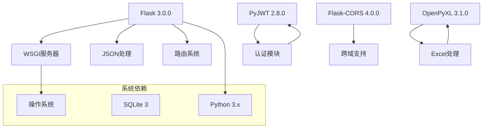
```mermaid
graph TB
Flask[Flask 3.0.0] --> WSGI[WSGI服务器]
Flask --> JSON[JSON处理]
Flask --> Routing[路由系统]
PyJWT[PyJWT 2.8.0] --> Auth[认证模块]
Flask-CORS[Flask-CORS 4.0.0] --> Cross[跨域支持]
OpenPyXL[OpenPyXL 3.1.0] --> Excel[Excel处理]
subgraph "系统依赖"
Python[Python 3.x]
SQLite[SQLite 3]
OS[操作系统]
end
Flask --> Python
Auth --> PyJWT
Excel --> OpenPyXL
WSGI --> OS
```

**图表来源**
- [requirements.txt:1-5](file://requirements.txt#L1-L5)

**章节来源**
- [requirements.txt:1-5](file://requirements.txt#L1-L5)

## 性能考虑

### 当前性能特征

基于代码分析，系统具有以下性能特征：

1. **轻量级架构**：Flask微框架，启动速度快，资源占用低
2. **单机部署**：SQLite内置数据库，无需额外配置
3. **内存友好**：Python原生支持，适合中小规模应用
4. **扩展限制**：单实例部署，不适合高并发场景

### 性能优化建议

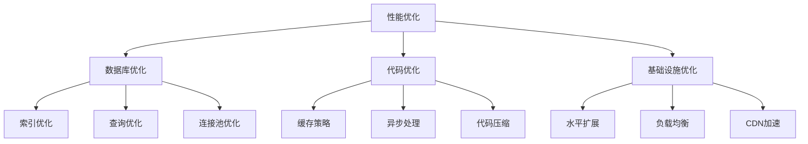
```mermaid
flowchart TD
Perf[性能优化] --> DB[数据库优化]
Perf --> Code[代码优化]
Perf --> Infra[基础设施优化]
DB --> Index[索引优化]
DB --> Query[查询优化]
DB --> Pool[连接池优化]
Code --> Cache[缓存策略]
Code --> Async[异步处理]
Code --> Minify[代码压缩]
Infra --> Scale[水平扩展]
Infra --> Load[负载均衡]
Infra --> CDN[CDN加速]
```

## 故障排除指南

### 常见问题诊断

#### 启动问题

| 问题症状 | 可能原因 | 解决方案 |
|---------|---------|---------|
| 服务器无法启动 | 依赖包缺失 | 运行安装脚本重新安装 |
| 端口被占用 | 端口冲突 | 修改端口号或停止占用进程 |
| 数据库连接失败 | SQLite文件损坏 | 重建数据库或恢复备份 |
| 权限不足 | 文件权限问题 | 设置正确的文件权限 |

#### 运行时问题

| 问题症状 | 可能原因 | 解决方案 |
|---------|---------|---------|
| API响应慢 | 查询性能问题 | 优化SQL查询或添加索引 |
| 认证失败 | Token过期或格式错误 | 检查Token生成和验证逻辑 |
| Excel导入失败 | 文件格式不兼容 | 验证Excel文件格式和内容 |
| 数据库锁冲突 | 并发访问问题 | 实现重试机制或优化事务 |

#### 日志分析技巧

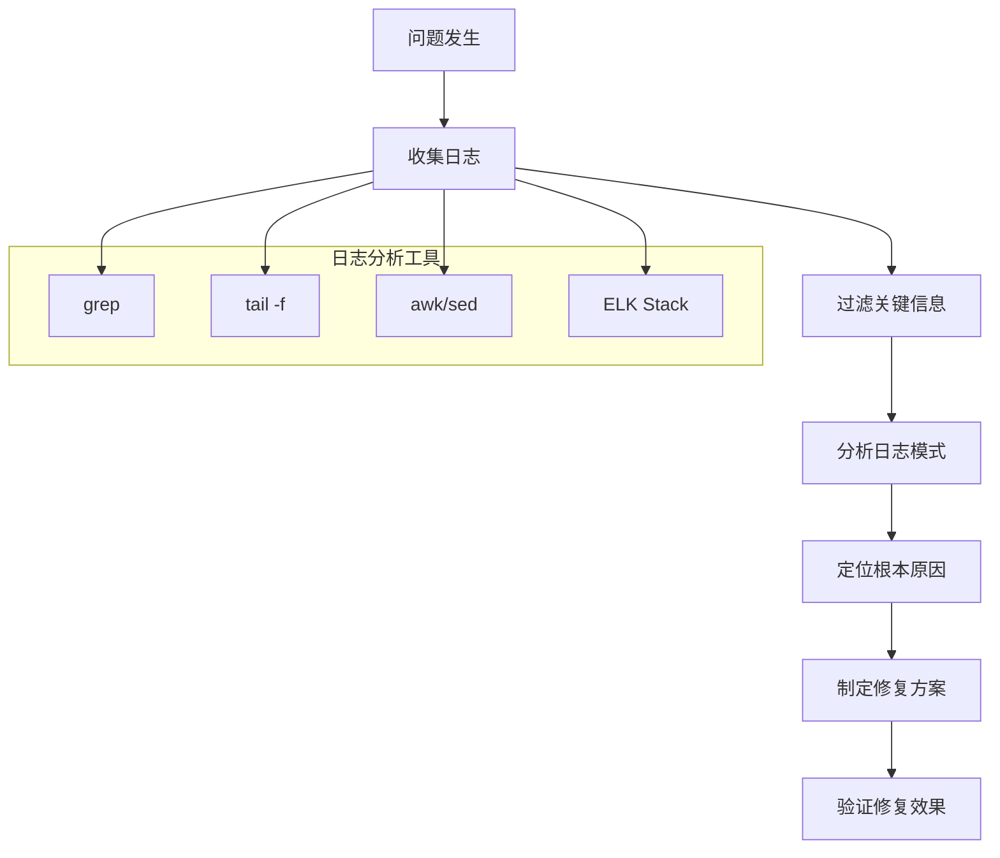
```mermaid
flowchart TD
Issue[问题发生] --> Collect[收集日志]
Collect --> Filter[过滤关键信息]
Filter --> Analyze[分析日志模式]
Analyze --> RootCause[定位根本原因]
RootCause --> Fix[制定修复方案]
Fix --> Verify[验证修复效果]
subgraph "日志分析工具"
Grep[grep]
Tail[tail -f]
AWK[awk/sed]
ELK[ELK Stack]
end
Collect --> Grep
Collect --> Tail
Collect --> AWK
Collect --> ELK
```

**章节来源**
- [app.py:725-794](file://app.py#L725-L794)

## 结论

封样件及色板接收登记管理系统作为一个中小型企业管理应用，具有架构简洁、部署方便的特点。然而，随着业务规模的增长和监控需求的提升，现有的基础日志记录机制已经不能满足现代运维的要求。

建议按照以下优先级实施监控改进：

1. **短期目标（1-2个月）**
   - 实现标准化的日志格式和输出
   - 建立基础的性能指标收集
   - 配置简单的告警机制

2. **中期目标（3-6个月）**
   - 集成专业的APM工具
   - 建立完善的日志分析平台
   - 实现自动化监控和告警

3. **长期目标（6-12个月）**
   - 实现智能化的异常检测
   - 建立预测性维护机制
   - 完善的监控仪表板和报告系统

通过系统化的监控体系建设，可以显著提升系统的稳定性、可维护性和用户体验，为业务的持续发展提供坚实的技术保障。

## 附录

### 快速参考清单

#### 监控实施检查表
- [ ] 日志格式标准化完成
- [ ] 性能指标收集配置
- [ ] 基础告警规则建立
- [ ] 监控仪表板部署
- [ ] 告警通知系统配置
- [ ] 日志轮转策略实施
- [ ] 健康检查接口完善

#### 常用命令
```bash
# 启动服务器
python app.py

# 安装依赖
pip install -r requirements.txt

# 查看日志
tail -f app.log

# 监控性能
htop

# 测试API
curl http://localhost:5000/api/auth/ping
```

#### 联系信息
- **技术支持**：系统管理员
- **紧急联系方式**：电话/邮箱
- **维护窗口**：工作日 9:00-18:00