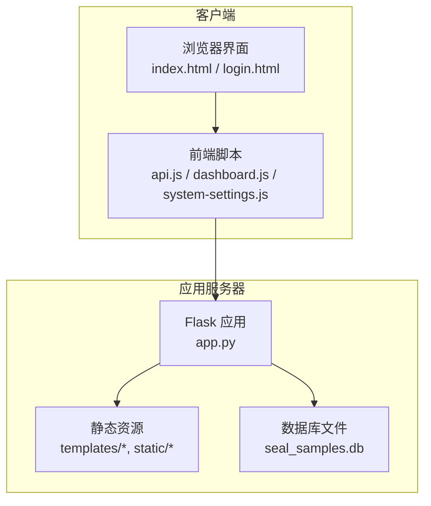
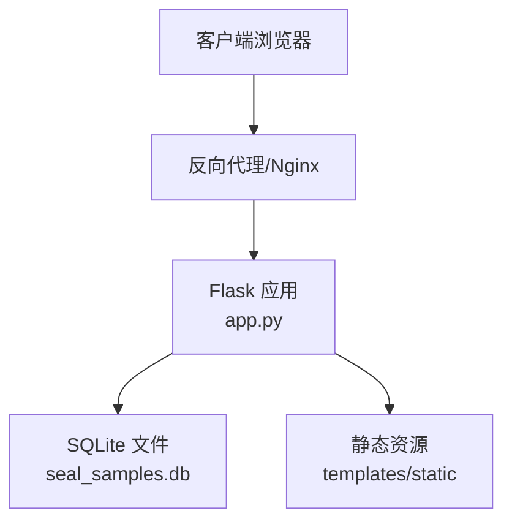
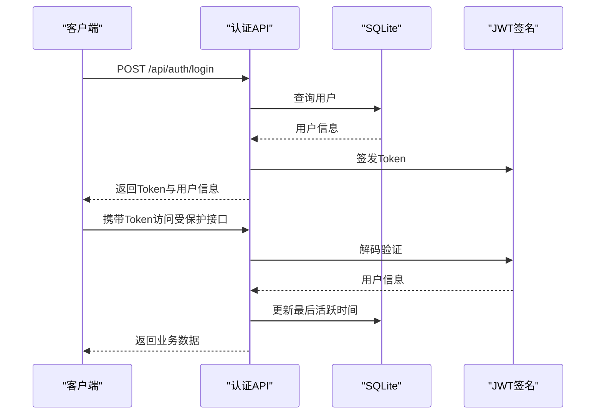
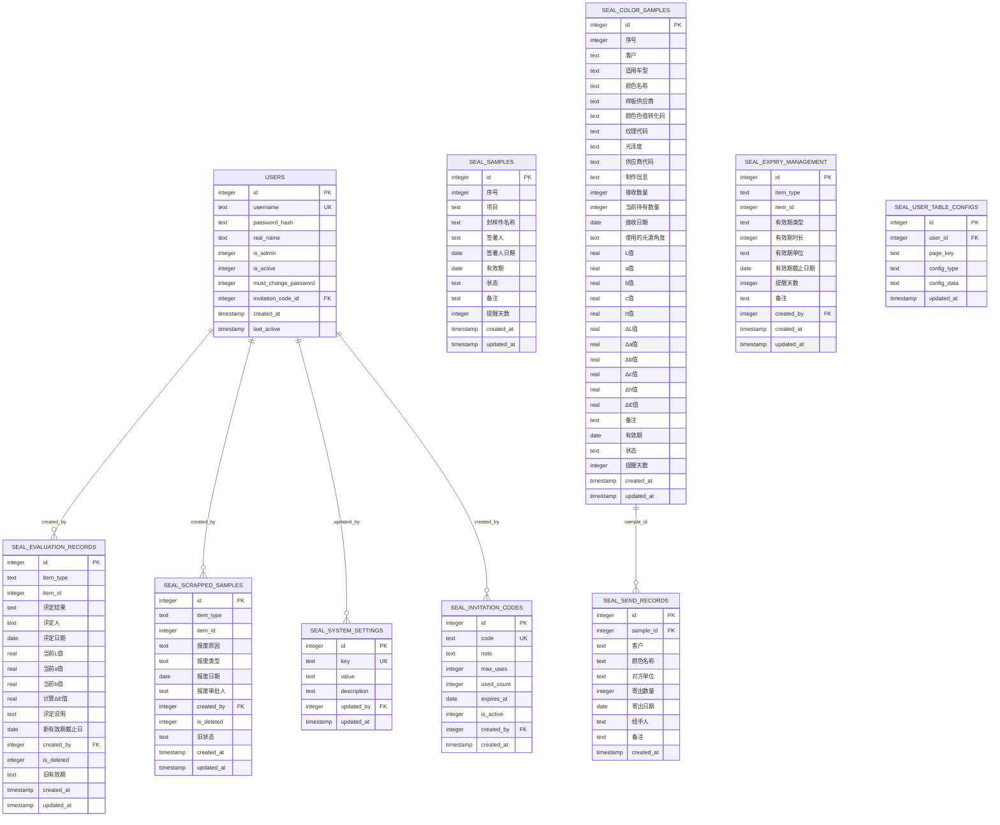
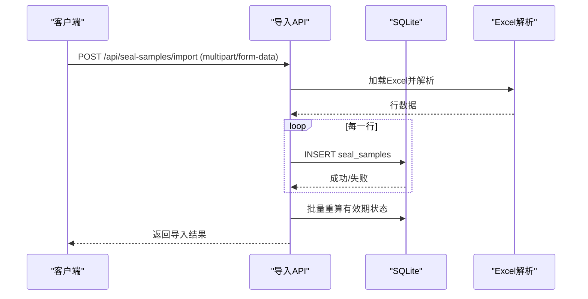

# 部署与运维

<cite>
**本文引用的文件**
- [app.py](file://app.py)
- [requirements.txt](file://requirements.txt)
- [start_server.bat](file://start_server.bat)
- [templates/index.html](file://templates/index.html)
- [templates/login.html](file://templates/login.html)
- [static/js/api.js](file://static/js/api.js)
- [static/js/dashboard.js](file://static/js/dashboard.js)
- [static/js/system-settings.js](file://static/js/system-settings.js)
</cite>

## 目录
1. [简介](#简介)
2. [项目结构](#项目结构)
3. [核心组件](#核心组件)
4. [架构总览](#架构总览)
5. [详细组件分析](#详细组件分析)
6. [依赖分析](#依赖分析)
7. [性能考虑](#性能考虑)
8. [故障排除指南](#故障排除指南)
9. [结论](#结论)
10. [附录](#附录)

## 简介
本文件面向生产环境部署与运维，围绕“封样件及色板接收登记管理系统”提供从服务器环境准备、依赖安装、配置与启动、数据库备份与恢复、日志与监控、性能优化、升级与版本管理、故障排除、高可用与负载均衡、运维自动化与安全加固等全链路指导。系统采用Python Flask + SQLite + JWT + openpyxl的技术栈，提供封样件与色板的台账、寄出、有效期管理、评定与报废、处置记录等核心业务能力。

## 项目结构
系统采用前后端同源部署模式：
- 后端：Flask应用，提供REST API与静态资源服务
- 前端：HTML模板与JS脚本，通过AJAX调用后端API
- 数据库：SQLite文件（默认路径见配置）

图表来源
- [app.py](file://app.py)
- [templates/index.html](file://templates/index.html)
- [templates/login.html](file://templates/login.html)
- [static/js/api.js](file://static/js/api.js)

章节来源
- [app.py](file://app.py)
- [requirements.txt](file://requirements.txt)
- [start_server.bat](file://start_server.bat)

## 核心组件
- Web框架与路由：Flask应用，提供认证、封样件、色板、寄出、有效期、评定、报废、处置记录、仪表盘等API
- 数据访问：SQLite连接池封装（每个请求建立连接，请求结束关闭），支持动态筛选、分页、导入导出
- 认证与授权：基于JWT的Token认证，支持Header与Query两种传递方式；管理员权限校验
- 工具函数：有效期状态计算、ΔE色差计算、动态筛选SQL拼接、分页、邀请码生成等
- 前端交互：API封装、401自动跳转登录、仪表盘动画与预警展示、系统阈值设置

章节来源
- [app.py](file://app.py)
- [static/js/api.js](file://static/js/api.js)
- [static/js/dashboard.js](file://static/js/dashboard.js)
- [static/js/system-settings.js](file://static/js/system-settings.js)

## 架构总览
系统采用单机部署模式，生产环境建议通过反向代理（如Nginx/IIS）对外暴露，结合Windows服务或任务计划实现开机自启与进程守护。

图表来源
- [app.py](file://app.py)
- [templates/index.html](file://templates/index.html)
- [templates/login.html](file://templates/login.html)

## 详细组件分析

### 启动与进程管理（Windows）
- 启动脚本：批处理脚本负责安装依赖并启动Flask开发服务器，输出访问地址与停止提示
- 生产建议：使用Windows服务或任务计划程序将脚本注册为服务，实现开机自启与异常重启；配合反向代理暴露端口

章节来源
- [start_server.bat](file://start_server.bat)
- [app.py](file://app.py)

### 认证与授权
- Token颁发与校验：登录成功返回JWT，后续请求携带Authorization头或查询参数token
- 账户状态检查：Token解码后检查用户是否存在、是否启用；更新最后活跃时间
- 管理员权限：特定管理接口要求管理员角色

图表来源
- [app.py](file://app.py)
- [static/js/api.js](file://static/js/api.js)

章节来源
- [app.py](file://app.py)
- [static/js/api.js](file://static/js/api.js)

### 数据模型与数据库初始化
- 初始化逻辑：首次运行自动创建10张核心表，预置admin用户与ΔE阈值设置
- 表结构要点：用户、邀请码、封样件台账、色板台账、寄出台账、有效期管理、评定记录、报废记录、系统设置、用户表格配置
- 兼容性：对旧数据库进行列补齐与软删除字段增强

图表来源
- [app.py](file://app.py)

章节来源
- [app.py](file://app.py)

### API工作流示例：封样件导入

图表来源
- [app.py](file://app.py)

章节来源
- [app.py](file://app.py)

### 有效期与预警
- 有效期状态：根据“有效期-提醒天数”计算，分为正常、待评定、已过期
- 预警接口：返回近30天内到期的封样件与色板清单，前端按天数排序展示

章节来源
- [app.py](file://app.py)
- [static/js/dashboard.js](file://static/js/dashboard.js)

## 依赖分析
- Python版本：Flask>=3.0.0
- 跨域：flask-cors>=4.0.0
- JWT：PyJWT>=2.8.0
- Excel：openpyxl>=3.1.0

章节来源
- [requirements.txt](file://requirements.txt)

## 性能考虑
- 数据库连接：每次请求建立连接，适合小规模并发；生产建议引入连接池或迁移至PostgreSQL/MySQL
- 查询优化：动态筛选与分页已在后端实现；建议对高频查询字段建立索引（如有效期、状态、创建时间）
- 导入导出：Excel读写在内存中进行，大文件建议拆分批次或异步处理
- 前端渲染：仪表盘动画与列表渲染在浏览器端完成，建议控制列表长度与分页大小

章节来源
- [app.py](file://app.py)

## 故障排除指南
- 启动失败
  - 检查Python与pip是否可用
  - 确认requirements.txt依赖安装完成
  - 查看脚本输出与端口占用
- 认证失败
  - 确认Token是否过期或格式正确
  - 检查用户状态是否启用
- 导入失败
  - 确认Excel列与模板一致
  - 检查日期格式与数值字段
- 权限不足
  - 管理员接口需管理员身份
- 数据库异常
  - 确认数据库文件可读写
  - 检查磁盘空间与权限

章节来源
- [app.py](file://app.py)
- [start_server.bat](file://start_server.bat)
- [static/js/api.js](file://static/js/api.js)

## 结论
本系统以Flask+SQLite实现轻量级业务闭环，具备完善的导入导出、有效期管理与处置记录能力。生产部署建议通过反向代理、Windows服务与任务计划实现稳定运行，并结合数据库备份与日志监控完善运维体系。

## 附录

### 生产环境部署配置清单
- 服务器环境
  - Windows Server 或桌面版Windows
  - Python 3.8+（推荐3.10以上）
  - pip
- 依赖安装
  - 在项目根目录执行依赖安装命令
- 启动与进程管理
  - 使用提供的批处理脚本启动开发服务器
  - 生产建议：注册为Windows服务或使用任务计划程序
- 反向代理
  - Nginx/IIS将外部请求转发至Flask服务端口
- 数据库位置
  - 默认数据库文件位于项目根目录，生产建议迁移到专用数据目录并配置权限

章节来源
- [requirements.txt](file://requirements.txt)
- [start_server.bat](file://start_server.bat)
- [app.py](file://app.py)

### 数据库备份与恢复策略（SQLite）
- 备份
  - 直接复制数据库文件（seal_samples.db）到安全位置
  - 建议定期增量备份（每日/每周）
- 恢复
  - 停止服务后替换数据库文件
  - 启动服务后验证关键接口与数据完整性
- 注意事项
  - 备份期间尽量避免写操作
  - 备份文件需妥善加密与异地存放

章节来源
- [app.py](file://app.py)

### 日志与监控
- 应用日志
  - Flask内置日志可通过反向代理与系统日志聚合
  - 建议开启访问日志与错误日志
- 错误追踪
  - 前端通过API封装捕获401并跳转登录
  - 建议集成错误上报（如Sentry）收集异常堆栈
- 监控指标
  - 响应时间、错误率、并发连接数
  - 业务指标：导入/导出成功率、有效期预警数量

章节来源
- [static/js/api.js](file://static/js/api.js)
- [app.py](file://app.py)

### 升级与版本管理
- 升级流程
  - 备份数据库与静态资源
  - 更新代码与依赖
  - 重启服务并验证
- 版本管理
  - 使用Git管理代码
  - 发布标签与变更日志

章节来源
- [requirements.txt](file://requirements.txt)
- [app.py](file://app.py)

### 负载均衡与高可用
- 单实例部署：适用于中小规模场景
- 多实例部署：建议使用反向代理分发请求，共享数据库文件需谨慎（SQLite不建议多实例写入）
- 替代方案：迁移至支持集群的数据库（如PostgreSQL/MySQL）以实现读写分离与高可用

章节来源
- [app.py](file://app.py)

### 运维自动化脚本与监控指标
- 自动化脚本
  - 备份脚本：定时复制数据库文件
  - 健康检查：轮询/health接口
- 监控指标
  - 业务指标：封样件/色板总数、待评定数、报废数
  - 运行指标：CPU、内存、磁盘、网络

章节来源
- [app.py](file://app.py)
- [static/js/dashboard.js](file://static/js/dashboard.js)

### 安全加固与合规
- 安全加固
  - 强制HTTPS与反向代理TLS终止
  - 限制跨域来源与CORS配置
  - 管理员操作审计（日志记录）
- 合规要求
  - 数据最小化与保留策略
  - 用户隐私保护与数据访问控制
  - 定期备份与灾难恢复演练

章节来源
- [app.py](file://app.py)
- [static/js/api.js](file://static/js/api.js)