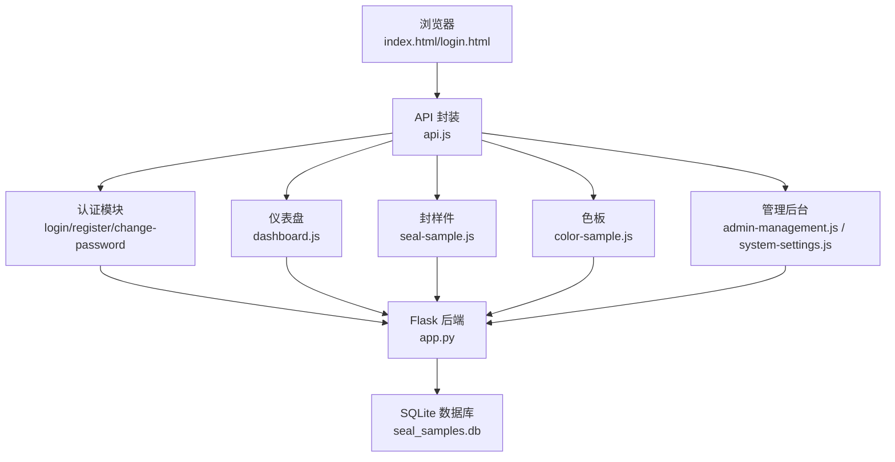

# 快速开始

<cite>
**本文引用的文件**
- [app.py](file://app.py)
- [requirements.txt](file://requirements.txt)
- [start_server.bat](file://start_server.bat)
- [templates/index.html](file://templates/index.html)
- [templates/login.html](file://templates/login.html)
- [templates/admin-panel.html](file://templates/admin-panel.html)
- [templates/dashboard.html](file://templates/dashboard.html)
- [static/js/api.js](file://static/js/api.js)
- [static/js/auth.js](file://static/js/auth.js)
- [static/js/common.js](file://static/js/common.js)
- [static/js/dashboard.js](file://static/js/dashboard.js)
- [static/js/seal-sample.js](file://static/js/seal-sample.js)
- [static/js/color-sample.js](file://static/js/color-sample.js)
- [static/js/admin-management.js](file://static/js/admin-management.js)
- [static/js/system-settings.js](file://static/js/system-settings.js)
</cite>

## 目录
1. [简介](#简介)
2. [环境准备](#环境准备)
3. [项目启动](#项目启动)
4. [初始登录与基本使用](#初始登录与基本使用)
5. [目录结构与文件作用](#目录结构与文件作用)
6. [第一次使用完整流程示例](#第一次使用完整流程示例)
7. [常见问题排查](#常见问题排查)
8. [架构概览](#架构概览)
9. [性能与扩展建议](#性能与扩展建议)
10. [故障排查指南](#故障排查指南)
11. [结语](#结语)

## 简介
本系统是一个基于 Python Flask 的“封样件及色板接收登记管理”应用，采用 SQLite 本地数据库、JWT 令牌鉴权、前后端分离的静态页面与 API 交互模式。系统提供封样件与色板的台账管理、有效期预警、评定与处置记录、寄出台账、系统设置（如 ΔE 阈值）以及管理后台（用户与邀请码管理）。默认内置管理员账号，支持首次登录强制修改密码。

## 环境准备
- Python 环境
  - 确保已安装 Python 3.8 或以上版本。
  - 建议使用虚拟环境隔离依赖（可选但推荐）。
- 依赖安装
  - 通过项目根目录下的依赖清单自动安装：Flask、Flask-CORS、PyJWT、openpyxl。
  - 依赖安装命令：pip install -r requirements.txt。
- 数据库初始化
  - 首次运行时，系统会自动创建数据库文件与全部业务表，并预置默认管理员用户与 ΔE 阈值设置。
  - 数据库文件路径在应用配置中定义，默认为项目根目录下的 seal_samples.db。

章节来源
- [requirements.txt:1-5](file://requirements.txt#L1-L5)
- [app.py:21-335](file://app.py#L21-L335)

## 项目启动
- 方式一：命令行启动
  - 在项目根目录执行：python app.py。
  - 默认监听地址为 http://127.0.0.1:5000。
- 方式二：批处理启动
  - 双击 start_server.bat，脚本会自动安装依赖并启动服务，随后提示访问地址。
- 端口配置
  - 如需更改端口，请在启动命令后追加 --host/--port 参数，例如：python app.py --host 0.0.0.0 --port 8080。
  - 注意：若端口被占用，将无法启动；请释放端口或更换端口。

章节来源
- [start_server.bat:1-17](file://start_server.bat#L1-L17)
- [app.py:21-26](file://app.py#L21-L26)

## 初始登录与基本使用
- 默认管理员账号
  - 用户名：admin；初始密码：admin。
  - 首次登录会提示修改密码，修改后方可正常使用。
- 登录与注册
  - 登录页支持登录与注册两个标签页；注册需提供有效邀请码。
- 系统配置
  - 管理后台可配置 ΔE 阈值，影响色板评定时的颜色标识与等级判断。
- 基础数据录入
  - 仪表盘展示封样件/色板统计、待评定与到期预警等信息。
  - 业务页面支持新增、编辑、删除、导入导出、寄出等操作。

章节来源
- [templates/login.html:1-144](file://templates/login.html#L1-L144)
- [templates/index.html:1-239](file://templates/index.html#L1-L239)
- [templates/admin-panel.html:1-107](file://templates/admin-panel.html#L1-L107)
- [templates/dashboard.html:1-34](file://templates/dashboard.html#L1-L34)
- [static/js/auth.js:1-204](file://static/js/auth.js#L1-L204)
- [static/js/api.js:1-88](file://static/js/api.js#L1-L88)

## 目录结构与文件作用
- 根目录
  - app.py：Flask 主应用、路由与业务逻辑。
  - requirements.txt：依赖清单。
  - start_server.bat：一键安装依赖并启动服务。
- templates/
  - index.html：系统主界面与导航布局。
  - login.html：登录/注册页面。
  - admin-panel.html：管理后台页面（用户、邀请码、系统设置）。
  - dashboard.html：仪表盘首页。
  - 其他页面：封样件台账、色板台账、寄出台账、评定、处置记录等（由 index.html 动态加载）。
- static/
  - css：样式资源。
  - js：
    - api.js：统一 API 封装与 JWT 拦截。
    - auth.js：登录/注册/强制改密逻辑。
    - common.js：通用工具函数（日期、ΔE、分页、复制等）。
    - dashboard.js：仪表盘数据加载与渲染。
    - seal-sample.js：封样件台账 CRUD 与筛选。
    - color-sample.js：色板台账 CRUD、展开行、寄出、ΔE 计算。
    - admin-management.js：管理后台用户与邀请码管理。
    - system-settings.js：系统设置（ΔE 阈值）。

章节来源
- [app.py:1-2197](file://app.py#L1-L2197)
- [templates/index.html:1-239](file://templates/index.html#L1-L239)
- [templates/login.html:1-144](file://templates/login.html#L1-L144)
- [templates/admin-panel.html:1-107](file://templates/admin-panel.html#L1-L107)
- [templates/dashboard.html:1-34](file://templates/dashboard.html#L1-L34)
- [static/js/api.js:1-88](file://static/js/api.js#L1-L88)
- [static/js/auth.js:1-204](file://static/js/auth.js#L1-L204)
- [static/js/common.js:1-135](file://static/js/common.js#L1-L135)
- [static/js/dashboard.js:1-117](file://static/js/dashboard.js#L1-L117)
- [static/js/seal-sample.js:1-181](file://static/js/seal-sample.js#L1-L181)
- [static/js/color-sample.js:1-267](file://static/js/color-sample.js#L1-L267)
- [static/js/admin-management.js:1-153](file://static/js/admin-management.js#L1-L153)
- [static/js/system-settings.js:1-65](file://static/js/system-settings.js#L1-L65)

## 第一次使用完整流程示例
- 步骤一：启动服务
  - 在项目根目录双击 start_server.bat，等待依赖安装并启动。
  - 浏览器打开 http://127.0.0.1:5000。
- 步骤二：登录系统
  - 使用默认管理员账号 admin/admin 登录。
  - 系统提示修改密码，输入新密码并确认。
- 步骤三：配置系统设置（可选）
  - 进入管理后台 → 系统设置，调整 ΔE 阈值并保存。
- 步骤四：录入封样件
  - 点击左侧导航“封样件台账”，点击“新增”，填写项目、名称、签署人、签署日期、有效期、提醒天数等，提交保存。
  - 可使用导入功能批量导入 Excel。
- 步骤五：录入色板
  - 点击“色板台账”，点击“新增”，填写基础信息、数量与日期、基准 Lab 值与色差参数，提交保存。
  - 可使用导入功能批量导入 Excel。
- 步骤六：寄出与处置
  - 在色板台账中选择“寄出”，填写对方单位、数量、日期等，提交后库存自动扣减。
  - 对于需要报废的记录，在处置记录中进行登记。
- 步骤七：查看仪表盘
  - 查看封样件/色板总数、待评定数、已报废数与近期到期预警。

章节来源
- [start_server.bat:1-17](file://start_server.bat#L1-L17)
- [templates/index.html:1-239](file://templates/index.html#L1-L239)
- [templates/admin-panel.html:1-107](file://templates/admin-panel.html#L1-L107)
- [static/js/seal-sample.js:1-181](file://static/js/seal-sample.js#L1-L181)
- [static/js/color-sample.js:1-267](file://static/js/color-sample.js#L1-L267)
- [static/js/dashboard.js:1-117](file://static/js/dashboard.js#L1-L117)

## 常见问题排查
- 端口占用
  - 现象：启动时报端口被占用。
  - 解决：更换端口或结束占用进程；启动时追加 --port 参数。
- 依赖冲突
  - 现象：pip 安装失败或版本冲突。
  - 解决：使用虚拟环境隔离；确保 requirements.txt 中版本满足最低要求。
- 数据库连接异常
  - 现象：数据库文件无法创建或访问失败。
  - 解决：检查项目目录写权限；确认 DB_PATH 配置正确（默认在项目根目录）。
- 登录失败/401
  - 现象：登录后立即被重定向至登录页。
  - 解决：检查 Token 是否过期或被后端强制失效；确认用户状态正常。
- 导入/导出失败
  - 现象：导入报错或导出为空。
  - 解决：确认 Excel 模板字段与系统一致；检查文件编码与格式。

章节来源
- [app.py:21-26](file://app.py#L21-L26)
- [app.py:454-588](file://app.py#L454-L588)
- [static/js/api.js:1-88](file://static/js/api.js#L1-L88)
- [static/js/seal-sample.js:165-174](file://static/js/seal-sample.js#L165-L174)
- [static/js/color-sample.js:258-262](file://static/js/color-sample.js#L258-L262)

## 架构概览
系统采用前后端分离架构：前端为纯静态页面与 JS 模块，通过统一 API 封装与后端交互；后端使用 Flask 提供 REST 风格接口，SQLite 存储业务数据，JWT 保障会话安全。

图表来源
- [templates/index.html:1-239](file://templates/index.html#L1-L239)
- [templates/login.html:1-144](file://templates/login.html#L1-L144)
- [static/js/api.js:1-88](file://static/js/api.js#L1-L88)
- [static/js/auth.js:1-204](file://static/js/auth.js#L1-L204)
- [static/js/dashboard.js:1-117](file://static/js/dashboard.js#L1-L117)
- [static/js/seal-sample.js:1-181](file://static/js/seal-sample.js#L1-L181)
- [static/js/color-sample.js:1-267](file://static/js/color-sample.js#L1-L267)
- [static/js/admin-management.js:1-153](file://static/js/admin-management.js#L1-L153)
- [static/js/system-settings.js:1-65](file://static/js/system-settings.js#L1-L65)
- [app.py:1-2197](file://app.py#L1-L2197)

## 性能与扩展建议
- 前端性能
  - 使用分页与动态筛选降低一次性渲染压力；合理使用防抖与节流。
- 后端性能
  - SQLite 适合小规模数据；如并发与数据量增长，建议迁移到 PostgreSQL/MySQL 并增加索引。
- 安全加固
  - 生产环境建议启用 HTTPS、限制跨域来源、定期轮换 SECRET_KEY。
- 可靠性
  - 增加数据库连接池与事务回滚策略；对导入/导出任务异步化处理。

[本节为通用建议，无需特定文件引用]

## 故障排查指南
- 登录相关
  - 检查用户名/密码是否正确；确认用户未被停用；首次登录是否已完成强制改密。
- 权限相关
  - 管理后台仅管理员可见；确认当前用户 is_admin 标记。
- 数据一致性
  - 导入后自动重算有效期状态；若状态异常，检查有效期与提醒天数字段。
- 网络与代理
  - 若通过代理访问，确保代理未拦截 /api 路由或修改响应头。

章节来源
- [app.py:454-588](file://app.py#L454-L588)
- [templates/index.html:127-131](file://templates/index.html#L127-L131)
- [static/js/auth.js:1-204](file://static/js/auth.js#L1-L204)
- [static/js/api.js:1-88](file://static/js/api.js#L1-L88)

## 结语
本快速开始指南覆盖了环境准备、启动流程、初始登录、基本使用、目录结构与第一次使用全流程。建议在开发/测试环境中先熟悉功能，再结合实际业务逐步完善数据与流程。如需进一步定制，可从 app.py 的路由与模板入手，或扩展 JS 模块以满足更复杂的交互需求。