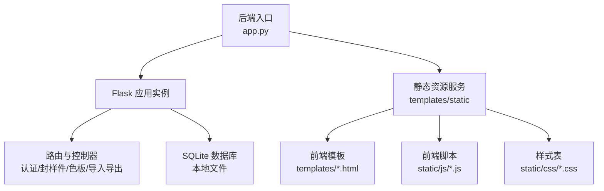
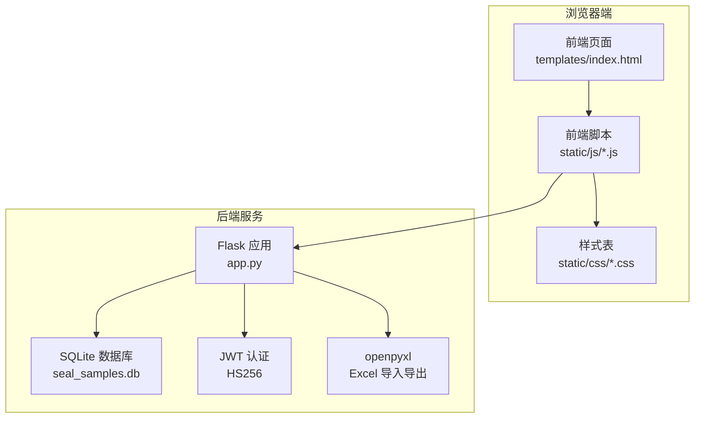
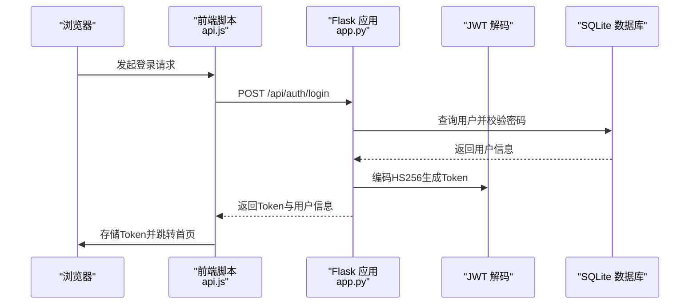
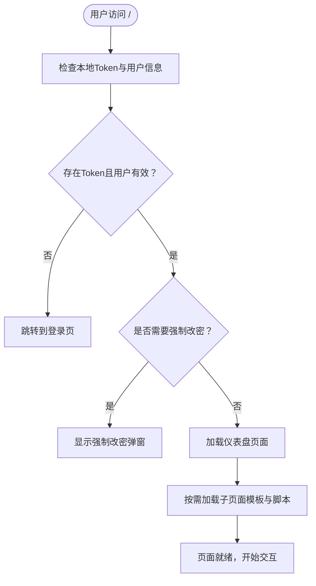
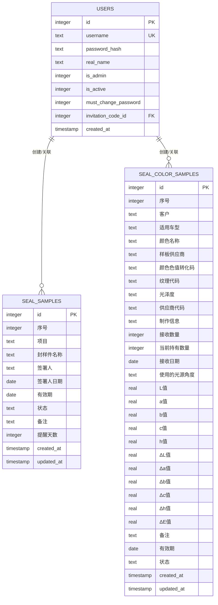
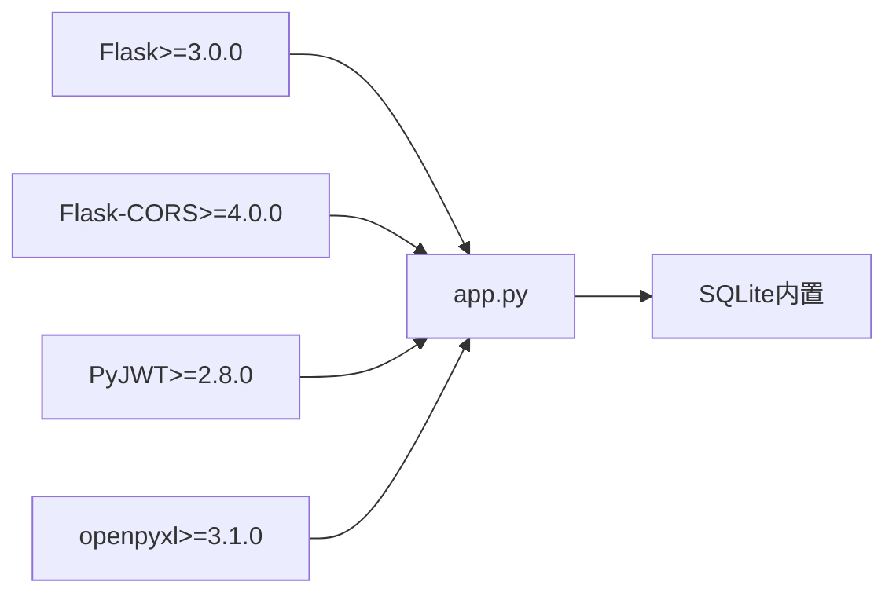

# 技术栈

<cite>
**本文引用的文件**
- [app.py](file://app.py)
- [requirements.txt](file://requirements.txt)
- [start_server.bat](file://start_server.bat)
- [api.js](file://static/js/api.js)
- [auth.js](file://static/js/auth.js)
- [common.js](file://static/js/common.js)
- [ui.js](file://static/js/ui.js)
- [index.html](file://templates/index.html)
- [style.css](file://static/css/style.css)
- [pages.css](file://static/css/pages.css)
</cite>

## 目录
1. [简介](#简介)
2. [项目结构](#项目结构)
3. [核心组件](#核心组件)
4. [架构总览](#架构总览)
5. [详细组件分析](#详细组件分析)
6. [依赖分析](#依赖分析)
7. [性能考量](#性能考量)
8. [故障排查指南](#故障排查指南)
9. [结论](#结论)
10. [附录](#附录)

## 简介
本项目采用“后端：Flask + SQLite + JWT + openpyxl；前端：JavaScript ES6+ + HTML5 + CSS3”的技术栈，构建一个轻量级的封样件及色板接收登记管理系统。后端以Flask为核心，提供REST风格API与静态资源服务；数据库采用SQLite，具备零配置、部署简单、适合中小规模数据场景的优势；认证采用JWT，便于前后端分离与跨域访问；openpyxl负责Excel导入导出，满足业务数据批量处理需求。前端使用现代JavaScript（ES6+）、HTML5语义化标签与CSS3响应式布局，确保良好的用户体验与可维护性。

## 项目结构
项目采用“后端Python + 前端静态资源”分离的组织方式：
- 后端入口与路由：app.py
- 依赖声明：requirements.txt
- 启动脚本：start_server.bat
- 前端静态资源：templates（页面模板）、static（css、js）

图表来源
- [app.py:1-26](file://app.py#L1-L26)
- [index.html:1-20](file://templates/index.html#L1-L20)

章节来源
- [app.py:1-26](file://app.py#L1-L26)
- [requirements.txt:1-5](file://requirements.txt#L1-L5)
- [start_server.bat:1-17](file://start_server.bat#L1-L17)

## 核心组件
- 后端框架与配置
  - Flask：提供WSGI应用、路由、请求上下文、CORS支持与静态文件服务。
  - SQLite：本地数据库，零配置，适合小中型项目。
  - JWT：基于HS256算法的令牌认证，支持Header与Query两种传递方式。
  - openpyxl：Excel读写，支持导入/导出功能。
- 前端技术与交互
  - JavaScript ES6+：模块化封装、异步请求、事件处理、DOM操作。
  - HTML5/CSS3：语义化结构、响应式布局、动画与主题变量。
  - UI组件：Toast、Modal、Confirm、TabSwitch、Drawer、Loading等。

章节来源
- [app.py:14-26](file://app.py#L14-L26)
- [requirements.txt:1-5](file://requirements.txt#L1-L5)
- [api.js:1-88](file://static/js/api.js#L1-L88)
- [ui.js:1-224](file://static/js/ui.js#L1-L224)

## 架构总览
系统采用前后端分离架构：前端通过fetch向后端API发起请求，后端通过Flask路由处理业务逻辑并访问SQLite数据库；认证通过JWT实现，前端在每次请求中携带Token；导入导出通过openpyxl进行Excel处理。

图表来源
- [index.html:1-20](file://templates/index.html#L1-L20)
- [api.js:1-88](file://static/js/api.js#L1-L88)
- [app.py:14-26](file://app.py#L14-L26)

## 详细组件分析

### 后端技术栈与实现要点
- Flask框架
  - 应用实例与CORS配置，支持跨域访问。
  - 请求上下文管理与数据库连接池复用。
  - 路由装饰器：token_required/admin_required实现鉴权与权限控制。
- SQLite数据库
  - 初始化10张核心业务表，包含用户、封样件、色板、寄出、有效期管理、评定记录、报废记录、系统设置、用户表格配置等。
  - 预置admin用户与ΔE阈值设置，保证系统初始可用性。
  - 兼容性迁移：动态添加缺失列，保障升级平滑。
- JWT认证机制
  - 登录签发Token，支持Header与Query两种传递方式。
  - Token解码校验、过期处理、账户状态检查与在线状态更新。
  - 401统一处理：自动清理本地Token并跳转登录。
- openpyxl Excel处理
  - 导出：生成工作簿，写入表头与数据，返回下载流。
  - 导入：解析上传文件，逐行清洗与校验，批量入库并自动重算状态。

图表来源
- [api.js:1-88](file://static/js/api.js#L1-L88)
- [app.py:454-494](file://app.py#L454-L494)

章节来源
- [app.py:29-76](file://app.py#L29-L76)
- [app.py:88-335](file://app.py#L88-L335)
- [app.py:454-589](file://app.py#L454-L589)
- [app.py:719-795](file://app.py#L719-L795)
- [app.py:953-1010](file://app.py#L953-L1010)

### 前端技术栈与交互流程
- JavaScript ES6+与模块化
  - API封装：统一请求、自动附加Token、401自动跳转登录、文件上传支持。
  - 认证模块：登录/注册表单校验、强制改密弹窗、密码强度检测。
  - 通用工具：日期格式化、ΔE计算、状态标签、分页、防抖、剪贴板、相对时间等。
  - UI组件：Toast、Modal、Confirm、TabSwitch、Drawer、Loading等。
- HTML5与CSS3
  - 语义化结构与可访问性；侧边栏布局、导航、用户面板、面包屑导航。
  - CSS变量主题系统、响应式断点、动画与过渡效果。
- 页面加载与子页面切换
  - 主页index.html加载模板并按顺序执行外部脚本，模拟子页面初始化事件。

图表来源
- [index.html:114-141](file://templates/index.html#L114-L141)
- [auth.js:123-182](file://static/js/auth.js#L123-L182)

章节来源
- [api.js:1-88](file://static/js/api.js#L1-L88)
- [auth.js:1-204](file://static/js/auth.js#L1-L204)
- [common.js:1-135](file://static/js/common.js#L1-L135)
- [ui.js:1-224](file://static/js/ui.js#L1-L224)
- [index.html:114-236](file://templates/index.html#L114-L236)

### 数据模型与业务流程
- 数据模型（核心表）
  - 用户表、封样件台账、色板台账、寄出台账、有效期管理、评定记录、报废记录、系统设置、用户表格配置等。
- 业务流程
  - 登录/注册：校验凭据与邀请码，签发Token。
  - 封样件/色板：增删改查、有效期状态计算、导入导出。
  - 处置记录：软删除、回滚有效期/状态等。

图表来源
- [app.py:93-187](file://app.py#L93-L187)

章节来源
- [app.py:93-187](file://app.py#L93-L187)

## 依赖分析
- 后端依赖
  - Flask：Web框架与路由。
  - Flask-CORS：跨域支持。
  - PyJWT：JWT编解码。
  - openpyxl：Excel读写。
- 前端依赖
  - 通过静态资源引入，无包管理器，直接使用浏览器原生fetch与ES6语法。

图表来源
- [requirements.txt:1-5](file://requirements.txt#L1-L5)

章节来源
- [requirements.txt:1-5](file://requirements.txt#L1-L5)

## 性能考量
- 后端
  - SQLite适合中小规模数据与低并发场景，避免复杂事务与高并发写入。
  - 分页查询与动态筛选参数，减少一次性传输大量数据。
  - 导入时逐行处理并批量提交，降低内存占用。
- 前端
  - 使用防抖与分页组件，提升交互流畅度。
  - CSS变量主题减少重复样式，提高渲染效率。
- 安全
  - JWT HS256签名，配合短时Token与心跳保活。
  - 401统一拦截与Token清理，防止误用。

[本节为通用指导，无需列出具体文件来源]

## 故障排查指南
- 启动问题
  - 确认Python环境与依赖安装：运行启动批处理脚本自动安装requirements.txt。
- 认证问题
  - 检查Token是否存在、是否过期、账户是否启用；查看401错误提示与本地存储Token状态。
- Excel导入/导出
  - 导入文件格式需符合导出模板；检查表头与字段顺序；查看错误汇总信息。
- 数据库兼容
  - 若升级后出现字段缺失，系统会尝试自动添加；若仍异常，检查数据库文件权限与路径。

章节来源
- [start_server.bat:1-17](file://start_server.bat#L1-L17)
- [api.js:20-33](file://static/js/api.js#L20-L33)
- [app.py:720-795](file://app.py#L720-L795)
- [app.py:953-1010](file://app.py#L953-L1010)

## 结论
本项目以Flask + SQLite + JWT + openpyxl为核心技术栈，结合现代前端技术，实现了轻量、易部署、易扩展的封样件及色板管理系统。后端专注业务逻辑与数据处理，前端提供良好的交互体验与响应式布局。整体技术选型兼顾性能、易用性与学习成本，适合中小型团队快速落地与迭代。

[本节为总结性内容，无需列出具体文件来源]

## 附录

### 开发工具与环境要求
- Python版本：建议使用Python 3.x（项目未指定最低版本，但Flask 3+通常要求较新的Python版本）。
- IDE推荐：VS Code（支持Python/JavaScript调试与语法高亮）、PyCharm（专业版更佳）。
- 调试工具：浏览器开发者工具（Network/Console）、Postman（API测试）。
- 依赖安装：双击启动脚本自动安装requirements.txt。

章节来源
- [requirements.txt:1-5](file://requirements.txt#L1-L5)
- [start_server.bat:1-17](file://start_server.bat#L1-L17)

### 技术选型考虑因素
- 性能：SQLite适合中小规模数据；Flask轻量高效；前端组件按需加载。
- 易用性：JWT简化认证；openpyxl处理Excel；模板化页面便于维护。
- 学习成本：Flask生态成熟；ES6+语法现代；CSS变量主题统一风格。
- 社区支持：Flask、JWT、openpyxl均有良好社区与文档。

[本节为通用指导，无需列出具体文件来源]

### 学习路径与前置知识
- 后端
  - Python基础与面向对象、Flask入门、SQLite基本操作、JWT原理与实践。
- 前端
  - HTML5语义化、CSS3选择器与Flex/Grid、JavaScript ES6+语法、DOM与事件、Fetch API。
- 实践建议
  - 从最小可用系统入手：先实现登录/注册与一条业务数据的增删改查。
  - 逐步集成Excel导入导出、权限控制与UI组件。
  - 关注安全性：Token过期策略、输入校验、SQL注入防护（已有参数化查询与字段白名单）。

[本节为通用指导，无需列出具体文件来源]