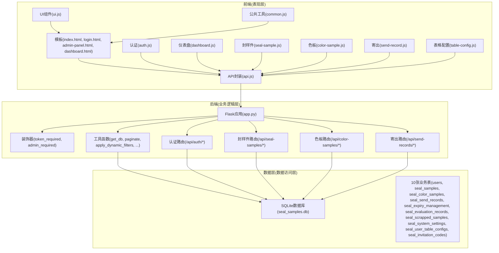
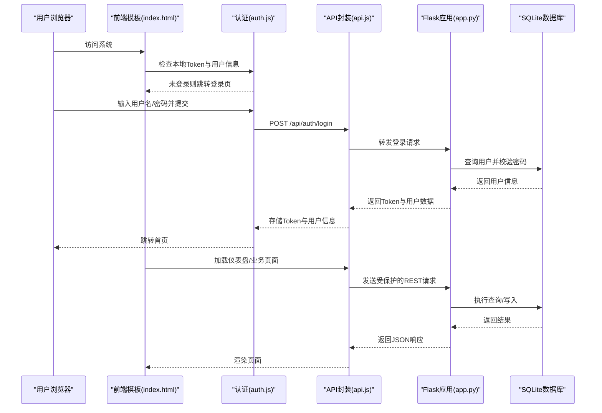
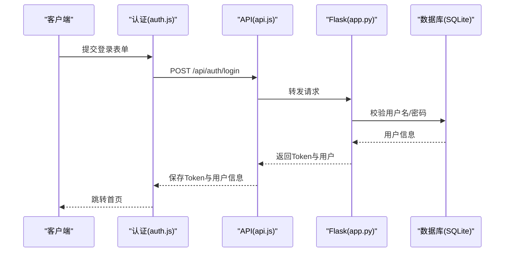
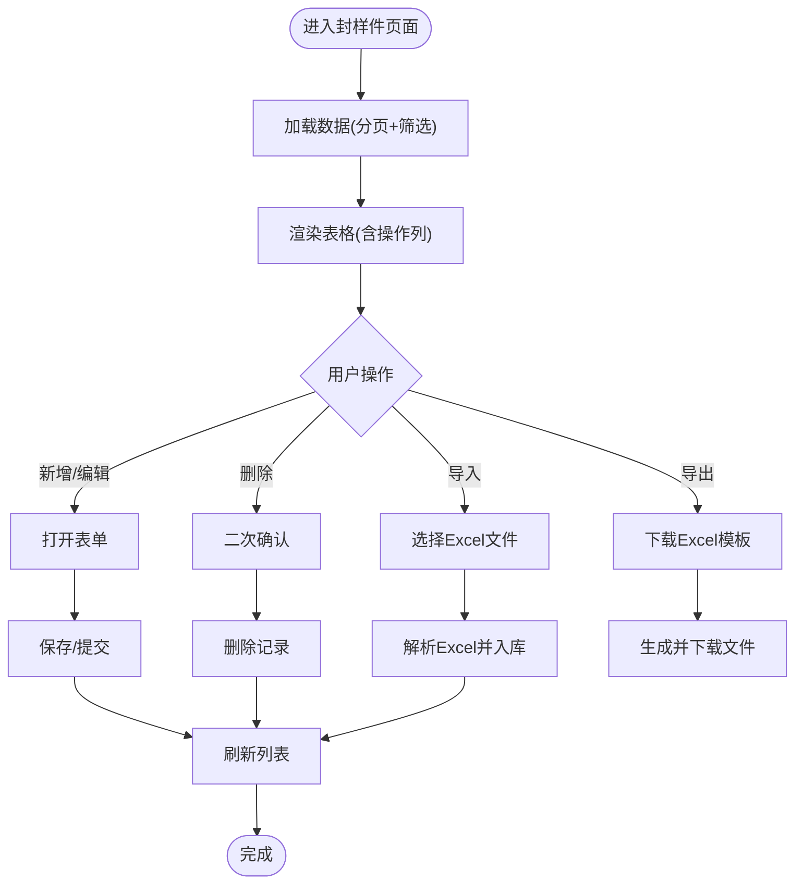
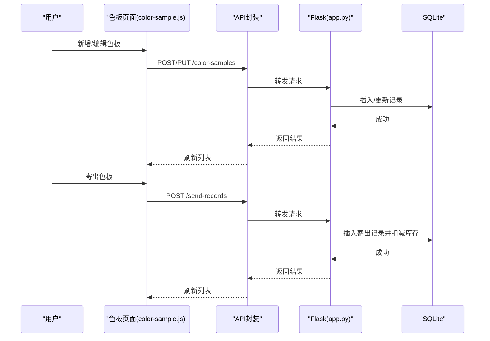
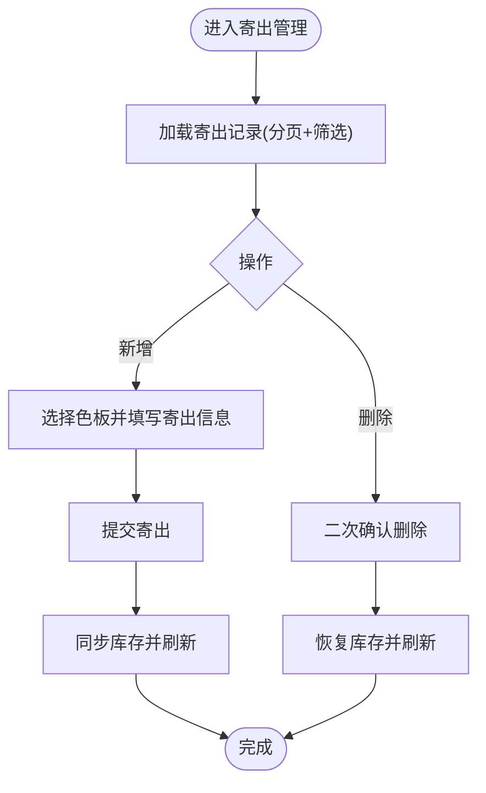
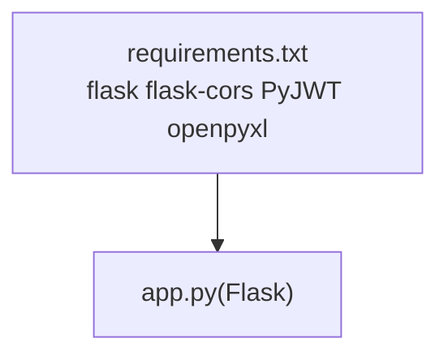

# 架构概览

<cite>
**本文引用的文件**
- [app.py](file://app.py)
- [requirements.txt](file://requirements.txt)
- [index.html](file://templates/index.html)
- [login.html](file://templates/login.html)
- [api.js](file://static/js/api.js)
- [auth.js](file://static/js/auth.js)
- [dashboard.js](file://static/js/dashboard.js)
- [seal-sample.js](file://static/js/seal-sample.js)
- [color-sample.js](file://static/js/color-sample.js)
- [send-record.js](file://static/js/send-record.js)
- [table-config.js](file://static/js/table-config.js)
- [ui.js](file://static/js/ui.js)
- [common.js](file://static/js/common.js)
- [admin-panel.html](file://templates/admin-panel.html)
- [dashboard.html](file://templates/dashboard.html)
</cite>

## 目录
1. [引言](#引言)
2. [项目结构](#项目结构)
3. [核心组件](#核心组件)
4. [架构总览](#架构总览)
5. [详细组件分析](#详细组件分析)
6. [依赖分析](#依赖分析)
7. [性能考虑](#性能考虑)
8. [故障排查指南](#故障排查指南)
9. [结论](#结论)
10. [附录](#附录)

## 引言
本系统为“封样件及色板接收登记管理系统”，采用前后端分离的单页应用（SPA）架构，后端基于 Python Flask 提供 RESTful API，前端通过模板与静态资源实现页面级路由与交互。系统围绕认证、封样件管理、色板管理、寄出管理等模块进行组织，具备良好的模块化与扩展性。

## 项目结构
系统采用典型的 MVC 分层与 SPA 设计：
- 表现层（前端）：HTML 模板 + 静态 JS/CSS，负责页面渲染与用户交互
- 业务逻辑层（后端 API）：Flask 路由与装饰器，统一处理鉴权、参数校验与业务逻辑
- 数据访问层（数据库）：SQLite，配合 SQLAlchemy 风格的原生 SQL 与工具函数

图表来源
- [app.py](file://app.py)
- [index.html](file://templates/index.html)
- [login.html](file://templates/login.html)
- [api.js](file://static/js/api.js)
- [auth.js](file://static/js/auth.js)
- [dashboard.js](file://static/js/dashboard.js)
- [seal-sample.js](file://static/js/seal-sample.js)
- [color-sample.js](file://static/js/color-sample.js)
- [send-record.js](file://static/js/send-record.js)
- [table-config.js](file://static/js/table-config.js)
- [ui.js](file://static/js/ui.js)
- [common.js](file://static/js/common.js)

章节来源
- [app.py](file://app.py)
- [index.html](file://templates/index.html)
- [login.html](file://templates/login.html)
- [api.js](file://static/js/api.js)
- [auth.js](file://static/js/auth.js)
- [dashboard.js](file://static/js/dashboard.js)
- [seal-sample.js](file://static/js/seal-sample.js)
- [color-sample.js](file://static/js/color-sample.js)
- [send-record.js](file://static/js/send-record.js)
- [table-config.js](file://static/js/table-config.js)
- [ui.js](file://static/js/ui.js)
- [common.js](file://static/js/common.js)

## 核心组件
- 认证模块：登录/注册/修改密码/心跳/退出，支持 Header 与 Query 两种 Token 传递方式
- 封样件管理模块：CRUD、动态筛选、分页、导入导出、有效期状态计算
- 色板管理模块：CRUD、动态筛选、分页、导入导出、库存联动、寄出、ΔE 色差计算
- 寄出管理模块：寄出记录、库存联动、删除（恢复）
- 系统管理模块：用户管理、邀请码管理、系统设置（ΔE 阈值）
- 前端通用模块：API 封装、表格配置、UI 组件、公共工具

章节来源
- [app.py](file://app.py)
- [auth.js](file://static/js/auth.js)
- [seal-sample.js](file://static/js/seal-sample.js)
- [color-sample.js](file://static/js/color-sample.js)
- [send-record.js](file://static/js/send-record.js)
- [table-config.js](file://static/js/table-config.js)
- [ui.js](file://static/js/ui.js)
- [common.js](file://static/js/common.js)

## 架构总览
系统采用前后端分离的 SPA 架构：
- 前端通过模板 index.html 提供页面级路由与子页面加载机制，按需动态加载模板与脚本
- API 通过 Flask 提供 RESTful 接口，统一使用 JWT Token 鉴权
- 数据层使用 SQLite，配合工具函数完成分页、动态筛选、导入导出等操作

图表来源
- [index.html](file://templates/index.html)
- [auth.js](file://static/js/auth.js)
- [api.js](file://static/js/api.js)
- [app.py](file://app.py)

章节来源
- [index.html](file://templates/index.html)
- [auth.js](file://static/js/auth.js)
- [api.js](file://static/js/api.js)
- [app.py](file://app.py)

## 详细组件分析

### 认证模块
- 登录/注册：校验必填项、密码强度、邀请码有效性；登录成功返回 JWT Token
- 修改密码：校验原密码与新密码一致性
- 心跳/退出：定期心跳保持在线状态，退出时清理在线状态
- 鉴权装饰器：统一处理 Token 解析、用户存在性与状态检查、401/403 处理

图表来源
- [auth.js](file://static/js/auth.js)
- [api.js](file://static/js/api.js)
- [app.py](file://app.py)

章节来源
- [auth.js](file://static/js/auth.js)
- [api.js](file://static/js/api.js)
- [app.py](file://app.py)

### 封样件管理模块
- CRUD：新增/查询/更新/删除，支持动态筛选与分页
- 导入导出：Excel 模板导入/导出，自动重算状态
- 有效期状态：根据有效期与提醒天数动态计算状态

图表来源
- [seal-sample.js](file://static/js/seal-sample.js)
- [app.py](file://app.py)

章节来源
- [seal-sample.js](file://static/js/seal-sample.js)
- [app.py](file://app.py)

### 色板管理模块
- CRUD：包含 29 个字段，支持动态筛选与分页
- 库存联动：寄出即扣减当前持有数量
- ΔE 色差：支持基准 Lab 值与 ΔE 参数，自动计算 ΔE 值
- 导入导出：Excel 模板导入/导出

图表来源
- [color-sample.js](file://static/js/color-sample.js)
- [send-record.js](file://static/js/send-record.js)
- [app.py](file://app.py)

章节来源
- [color-sample.js](file://static/js/color-sample.js)
- [send-record.js](file://static/js/send-record.js)
- [app.py](file://app.py)

### 寄出管理模块
- 寄出记录：支持按色板、单位、数量等筛选
- 删除（恢复）：删除寄出记录可恢复库存
- 库存联动：寄出自动扣减持有数量，删除恢复

图表来源
- [send-record.js](file://static/js/send-record.js)
- [app.py](file://app.py)

章节来源
- [send-record.js](file://static/js/send-record.js)
- [app.py](file://app.py)

### 系统管理模块
- 用户管理：管理员可查看与管理用户
- 邀请码管理：生成、启用/停用、查看使用情况
- 系统设置：ΔE 阈值配置，实时预览效果

章节来源
- [admin-panel.html](file://templates/admin-panel.html)
- [app.py](file://app.py)

### 前端通用模块
- API 封装：统一处理 Authorization 头、401 自动跳转、上传
- 表格配置：动态筛选、列设置、渲染器、分页
- UI 组件：Toast、Modal、Confirm、Tabs、Loading、Drawer
- 公共工具：日期格式化、ΔE 计算、状态标签、相对时间、分页等

章节来源
- [api.js](file://static/js/api.js)
- [table-config.js](file://static/js/table-config.js)
- [ui.js](file://static/js/ui.js)
- [common.js](file://static/js/common.js)

## 依赖分析
- 后端依赖：Flask、Flask-CORS、PyJWT、openpyxl
- 前端依赖：通过静态资源引入，无包管理器，模块化通过全局命名空间实现

图表来源
- [requirements.txt](file://requirements.txt)
- [app.py](file://app.py)

章节来源
- [requirements.txt](file://requirements.txt)
- [app.py](file://app.py)

## 性能考虑
- 前端：SPA 页面按需加载，避免一次性加载过多脚本；表格分页与筛选减少一次性渲染压力
- 后端：分页查询与动态筛选参数拼接，避免全表扫描；导入导出使用 Excel 流式处理
- 缓存：前端本地存储 Token 与用户信息，减少重复登录；表格配置本地缓存与后端同步

## 故障排查指南
- 401 未授权：检查 Token 是否存在、是否过期、用户是否被停用
- 导入失败：确认 Excel 模板字段与系统要求一致，检查日期格式与数值类型
- 库存异常：核对寄出记录与当前持有数量，必要时通过删除寄出记录恢复库存
- 表格筛选无效：确认筛选字段与操作符匹配，检查过滤条件是否为空

章节来源
- [api.js](file://static/js/api.js)
- [seal-sample.js](file://static/js/seal-sample.js)
- [color-sample.js](file://static/js/color-sample.js)
- [send-record.js](file://static/js/send-record.js)

## 结论
系统采用前后端分离的 SPA 架构，结合 Flask 的 RESTful API 与 SQLite 数据库，实现了封样件与色板的全生命周期管理。模块化设计清晰，扩展性强，便于后续新增功能模块与业务逻辑演进。通过统一的认证与表格配置机制，提升了用户体验与开发效率。

## 附录
- 数据模型（简述）
  - 用户表：用户基本信息与权限
  - 邀请码表：邀请码与使用限制
  - 封样件台账表：封样件基本信息与有效期
  - 色板台账表：色板详细信息与 ΔE 参数
  - 寄出台账表：寄出记录与库存联动
  - 有效期管理表：有效期策略与提醒
  - 评定记录表：封样件/色板评定历史
  - 报废记录表：报废申请与审批
  - 系统设置表：ΔE 阈值等系统参数
  - 用户表格配置表：页面筛选与列显示配置

章节来源
- [app.py](file://app.py)