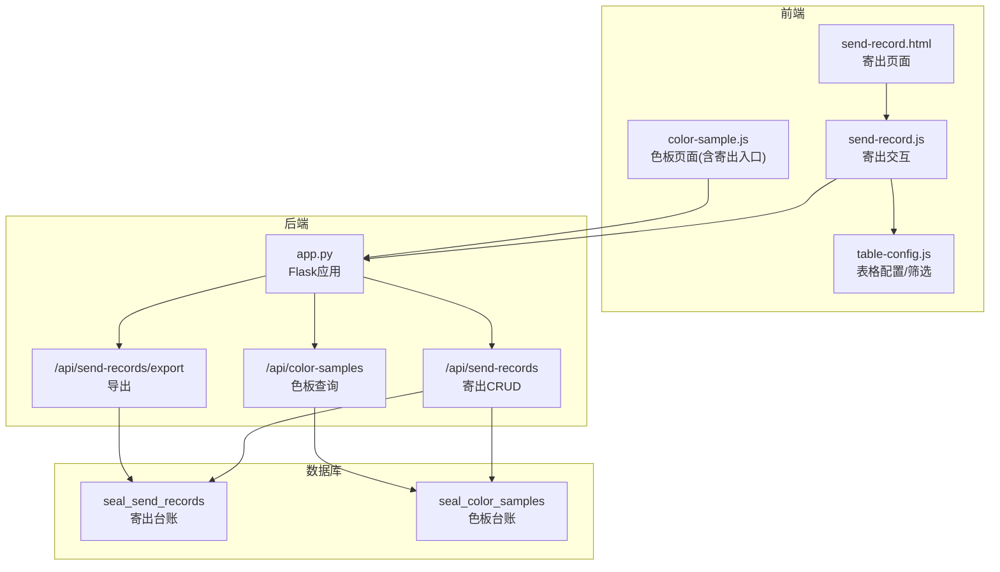
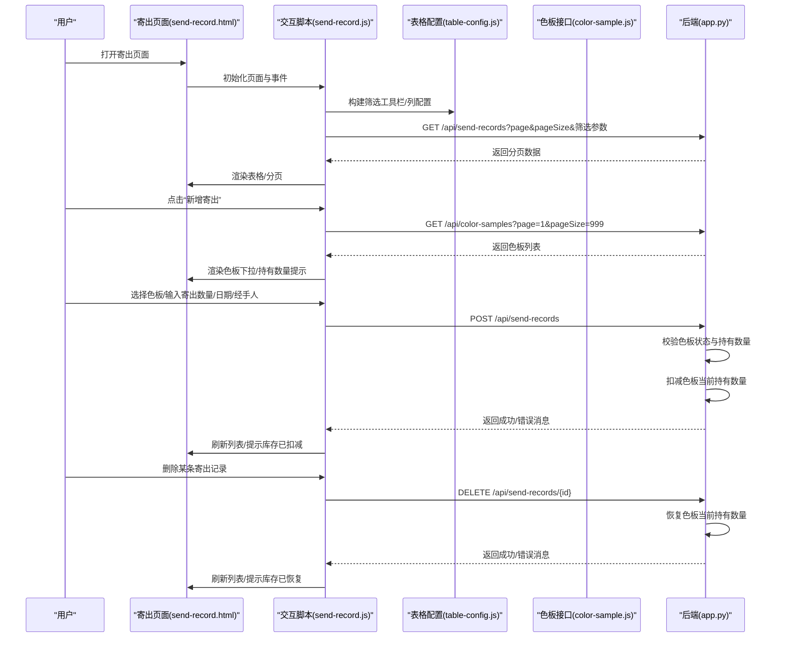
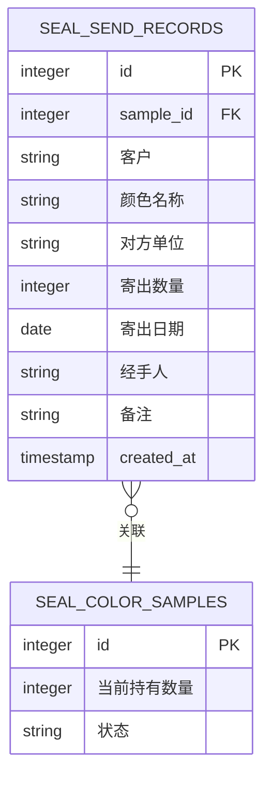
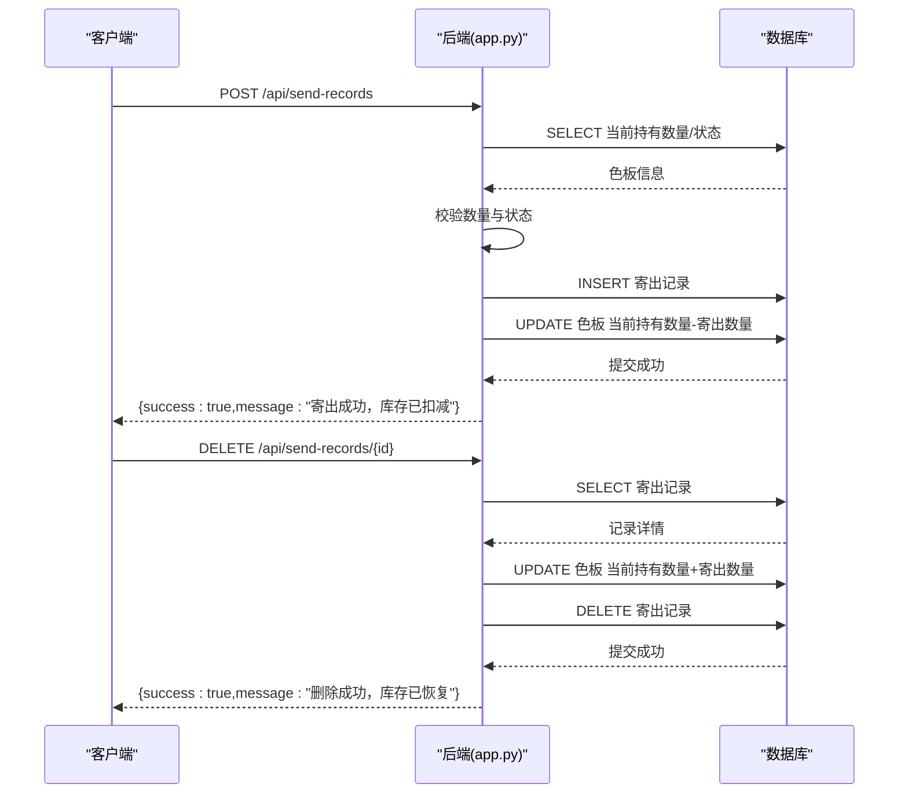
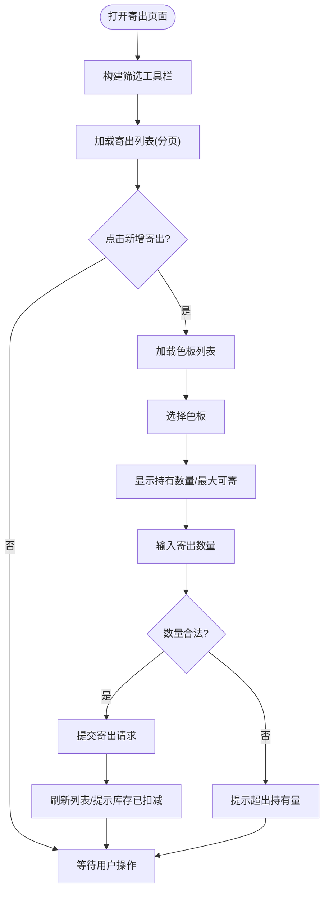
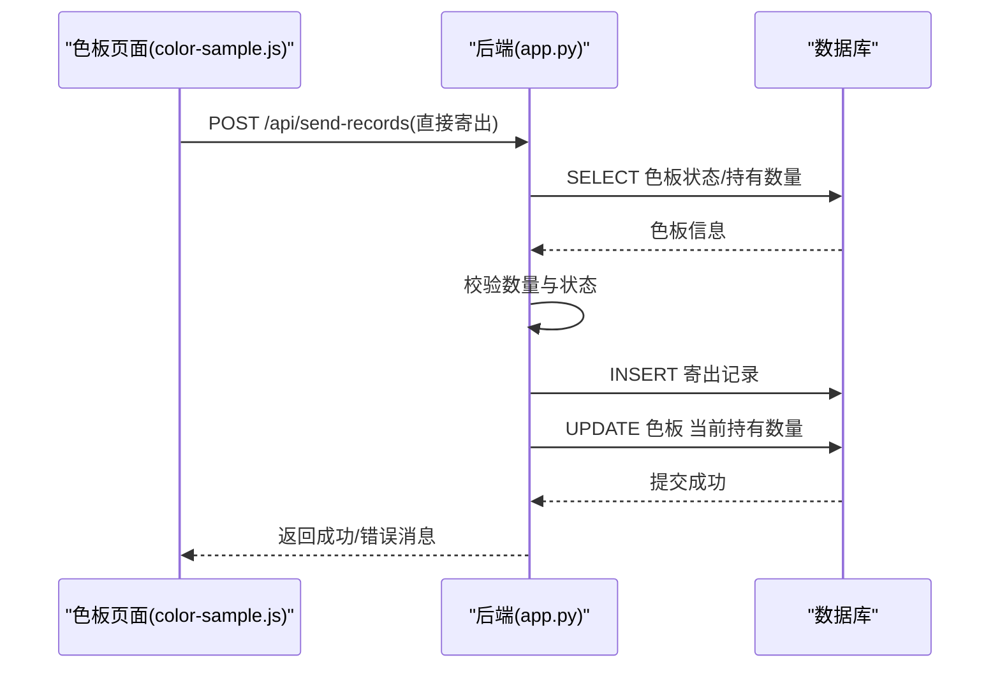
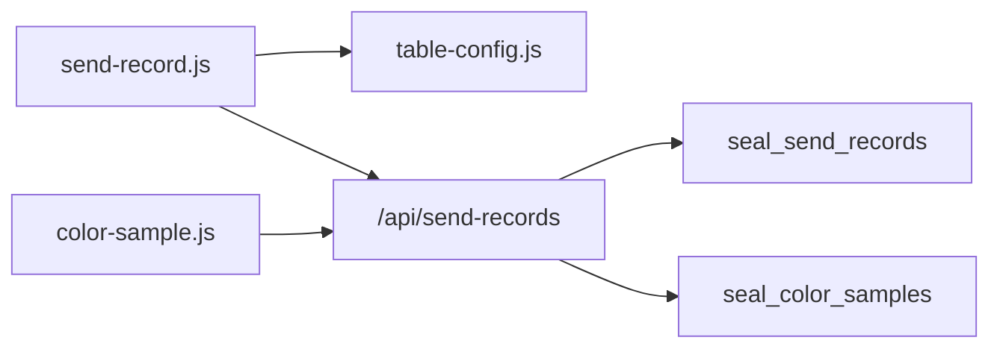

# 寄出管理模块

<cite>
**本文档引用的文件**
- [app.py](file://app.py)
- [send-record.html](file://templates/send-record.html)
- [send-record.js](file://static/js/send-record.js)
- [table-config.js](file://static/js/table-config.js)
- [color-sample.js](file://static/js/color-sample.js)
</cite>

## 目录
1. [简介](#简介)
2. [项目结构](#项目结构)
3. [核心组件](#核心组件)
4. [架构总览](#架构总览)
5. [详细组件分析](#详细组件分析)
6. [依赖关系分析](#依赖关系分析)
7. [性能考虑](#性能考虑)
8. [故障排查指南](#故障排查指南)
9. [结论](#结论)
10. [附录](#附录)

## 简介
本模块实现色板寄出全流程管理，涵盖寄出记录的创建、数量控制、库存实时扣减、状态跟踪、Excel导入导出以及前端交互。系统通过“寄出台账”与“色板台账”的联动，确保寄出数量不超过当前持有数量，并在删除寄出记录时自动恢复库存，保障库存数据的准确性与时效性。

## 项目结构
- 后端：Flask 应用，提供 REST API，负责业务逻辑与数据库操作。
- 前端：HTML 页面 + JavaScript 模块化脚本，负责用户交互、表格配置、筛选与分页。
- 数据库：SQLite，包含色板台账、寄出台账、用户、有效期管理、评定记录、报废记录、系统设置、用户表格配置等表。

图表来源
- [send-record.html:1-31](file://templates/send-record.html#L1-L31)
- [send-record.js:1-156](file://static/js/send-record.js#L1-L156)
- [table-config.js:85-105](file://static/js/table-config.js#L85-L105)
- [color-sample.js:208-245](file://static/js/color-sample.js#L208-L245)
- [app.py:1043-1171](file://app.py#L1043-L1171)

章节来源
- [send-record.html:1-31](file://templates/send-record.html#L1-L31)
- [send-record.js:1-156](file://static/js/send-record.js#L1-L156)
- [table-config.js:85-105](file://static/js/table-config.js#L85-L105)
- [color-sample.js:208-245](file://static/js/color-sample.js#L208-L245)
- [app.py:1043-1171](file://app.py#L1043-L1171)

## 核心组件
- 寄出记录 API：提供列表查询、创建、删除（含库存恢复）与导出功能。
- 前端寄出页面：支持动态筛选、列配置、新增寄出、删除恢复、导出 Excel。
- 色板联动：创建寄出时校验色板状态与持有数量；删除寄出时恢复库存。
- Excel 导入导出：支持寄出记录导出，色板支持导入/导出（与寄出相关）。

章节来源
- [app.py:1043-1171](file://app.py#L1043-L1171)
- [send-record.js:8-130](file://static/js/send-record.js#L8-L130)
- [table-config.js:85-105](file://static/js/table-config.js#L85-L105)

## 架构总览
后端通过 Flask 路由暴露 REST API，前端通过 AJAX 调用接口，完成数据的增删改查与导出。寄出流程的关键在于库存一致性：创建寄出时扣减库存，删除寄出时恢复库存。

图表来源
- [send-record.html:1-31](file://templates/send-record.html#L1-L31)
- [send-record.js:8-130](file://static/js/send-record.js#L8-L130)
- [table-config.js:85-105](file://static/js/table-config.js#L85-L105)
- [color-sample.js:208-245](file://static/js/color-sample.js#L208-L245)
- [app.py:1043-1171](file://app.py#L1043-L1171)

## 详细组件分析

### 寄出记录数据模型
寄出记录表包含以下关键字段：
- 关联色板 ID：sample_id
- 客户：客户
- 颜色名称：颜色名称
- 对方单位：对方单位
- 寄出数量：寄出数量
- 寄出日期：寄出日期
- 经手人：经手人
- 备注：备注
- 创建时间：created_at

图表来源
- [app.py:202-217](file://app.py#L202-L217)

章节来源
- [app.py:202-217](file://app.py#L202-L217)

### 寄出管理 API 说明
- 列表查询
  - 方法：GET /api/send-records
  - 查询参数：page、pageSize、动态筛选 f_field_i、f_op_i、f_val_i，兼容 customer、recipient
  - 返回：分页数据（包含 JOIN 色板客户与序号）
- 新增寄出
  - 方法：POST /api/send-records
  - 请求体：sample_id、客户、颜色名称、对方单位、寄出数量、寄出日期、经手人、备注
  - 校验：色板存在且状态正常；寄出数量 ≤ 当前持有数量
  - 事务：插入寄出记录并扣减色板当前持有数量
- 删除寄出
  - 方法：DELETE /api/send-records/{id}
  - 事务：恢复色板当前持有数量并删除寄出记录
- 导出寄出
  - 方法：GET /api/send-records/export
  - 返回：Excel 文件（寄出台账）

图表来源
- [app.py:1043-1171](file://app.py#L1043-L1171)

章节来源
- [app.py:1043-1171](file://app.py#L1043-L1171)

### 前端交互逻辑
- 页面布局与工具栏
  - 页面包含筛选工具栏、列配置按钮、新增寄出按钮、导出按钮、数据表格与分页控件。
- 寄出表单
  - 色板选择：下拉框加载色板列表，显示序号、颜色名称、客户、持有数量。
  - 数量输入：最大值限制为当前持有数量，输入超限时高亮提示。
  - 日期/经手人/备注：基础表单字段。
- 列配置与筛选
  - 支持动态筛选（文本/日期/数值）、列显隐设置、搜索与重置。
- 导出
  - 点击导出按钮触发下载 Excel 文件。

图表来源
- [send-record.html:1-31](file://templates/send-record.html#L1-L31)
- [send-record.js:8-130](file://static/js/send-record.js#L8-L130)
- [table-config.js:85-105](file://static/js/table-config.js#L85-L105)

章节来源
- [send-record.html:1-31](file://templates/send-record.html#L1-L31)
- [send-record.js:8-130](file://static/js/send-record.js#L8-L130)
- [table-config.js:85-105](file://static/js/table-config.js#L85-L105)

### Excel 导入导出
- 寄出记录导出
  - 接口：GET /api/send-records/export
  - 输出：Excel 文件，包含 ID、色板ID、客户、颜色名称、对方单位、寄出数量、寄出日期、经手人、备注、创建时间。
- 色板导入/导出（与寄出相关）
  - 色板导出：包含序号、客户、颜色名称、当前持有数量、有效期、状态等字段。
  - 色板导入：支持从 Excel 导入色板数据，自动映射状态与补算 ΔE 值、重算有效期状态。

章节来源
- [app.py:1157-1171](file://app.py#L1157-L1171)
- [app.py:930-951](file://app.py#L930-L951)
- [app.py:953-1041](file://app.py#L953-L1041)

### 色板与寄出的联动机制
- 创建寄出时：
  - 校验色板存在且状态正常；
  - 校验寄出数量不超过当前持有数量；
  - 成功后扣减色板当前持有数量。
- 删除寄出时：
  - 恢复色板当前持有数量，保证库存一致性。
- 色板页面的直接寄出入口：
  - 从色板页面可直接发起寄出流程，减少跳转成本。

图表来源
- [color-sample.js:208-245](file://static/js/color-sample.js#L208-L245)
- [app.py:1110-1140](file://app.py#L1110-L1140)

章节来源
- [color-sample.js:208-245](file://static/js/color-sample.js#L208-L245)
- [app.py:1110-1140](file://app.py#L1110-L1140)

## 依赖关系分析
- 前端依赖
  - send-record.js 依赖 table-config.js 实现筛选与列配置；
  - send-record.js 依赖 API 接口进行数据加载与操作；
  - color-sample.js 提供色板页面的寄出入口，与寄出流程共享同一后端接口。
- 后端依赖
  - 寄出 API 依赖色板表进行状态与数量校验；
  - 导出 API 依赖 openpyxl 生成 Excel 文件；
  - 认证装饰器 token_required 保护所有受保护接口。

图表来源
- [send-record.js:1-156](file://static/js/send-record.js#L1-L156)
- [table-config.js:85-105](file://static/js/table-config.js#L85-L105)
- [color-sample.js:208-245](file://static/js/color-sample.js#L208-L245)
- [app.py:1043-1171](file://app.py#L1043-L1171)

章节来源
- [send-record.js:1-156](file://static/js/send-record.js#L1-L156)
- [table-config.js:85-105](file://static/js/table-config.js#L85-L105)
- [color-sample.js:208-245](file://static/js/color-sample.js#L208-L245)
- [app.py:1043-1171](file://app.py#L1043-L1171)

## 性能考虑
- 分页与筛选：后端提供分页与动态筛选，前端按需加载，避免一次性传输大量数据。
- 列配置缓存：table-config.js 支持本地缓存与后端配置同步，提升页面响应速度。
- 导出：导出接口按需生成 Excel，避免预生成造成资源浪费。
- 数据库：寄出与库存更新在同一事务中完成，保证一致性。

## 故障排查指南
- 寄出数量超出现有持有量
  - 现象：提交寄出时报错“寄出数量超出当前持有数量”。
  - 处理：检查色板持有数量，确认输入数量不超过当前持有量。
- 色板状态异常
  - 现象：提交寄出时报错“关联的色板不存在或已过期，不可操作”。
  - 处理：确认色板状态为正常，有效期未过期。
- 删除寄出未恢复库存
  - 现象：删除寄出记录后库存未恢复。
  - 处理：确认删除接口调用成功，检查数据库中色板当前持有数量是否更新。
- 导出文件内容不符预期
  - 现象：导出的 Excel 与期望字段不一致。
  - 处理：核对导出接口字段清单，确保后端字段与前端期望一致。

章节来源
- [app.py:1110-1140](file://app.py#L1110-L1140)
- [send-record.js:118-130](file://static/js/send-record.js#L118-L130)

## 结论
寄出管理模块通过前后端协同，实现了色板寄出的完整闭环：从色板选择、数量校验、库存扣减到记录删除后的库存恢复，确保了库存数据的准确性与一致性。结合动态筛选、列配置与 Excel 导出能力，提升了用户的操作效率与数据可追溯性。

## 附录
- 常用操作建议
  - 新增寄出前先查看色板持有数量，避免超量输入。
  - 删除寄出记录时谨慎操作，确保库存恢复。
  - 定期导出寄出记录以便审计与统计。
- 注意事项
  - 寄出数量必须为正整数，且不超过当前持有数量。
  - 色板状态为“正常”方可寄出。
  - 导出功能需在登录状态下使用，确保 Token 有效。