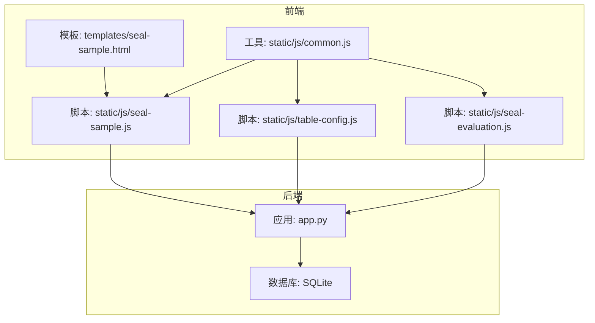
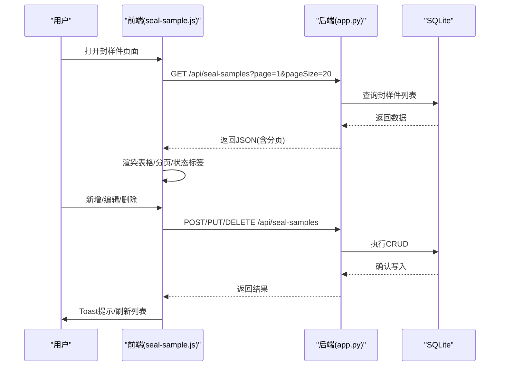
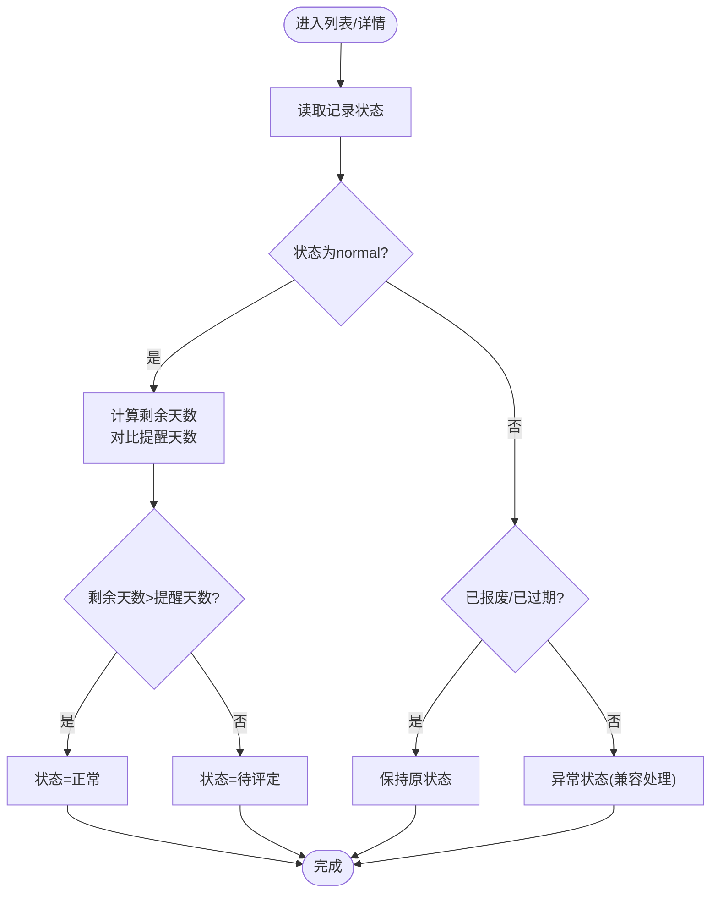
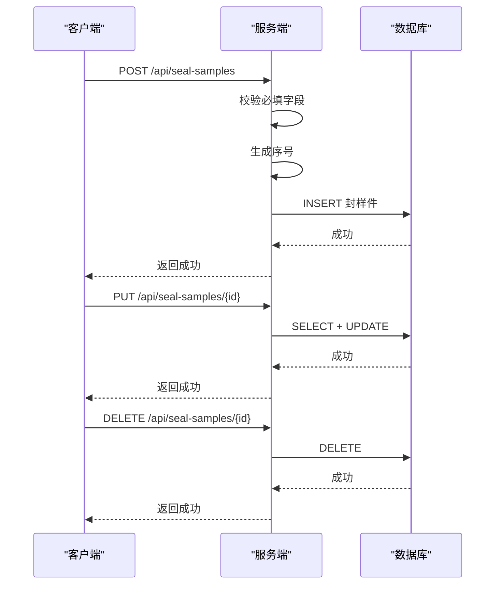
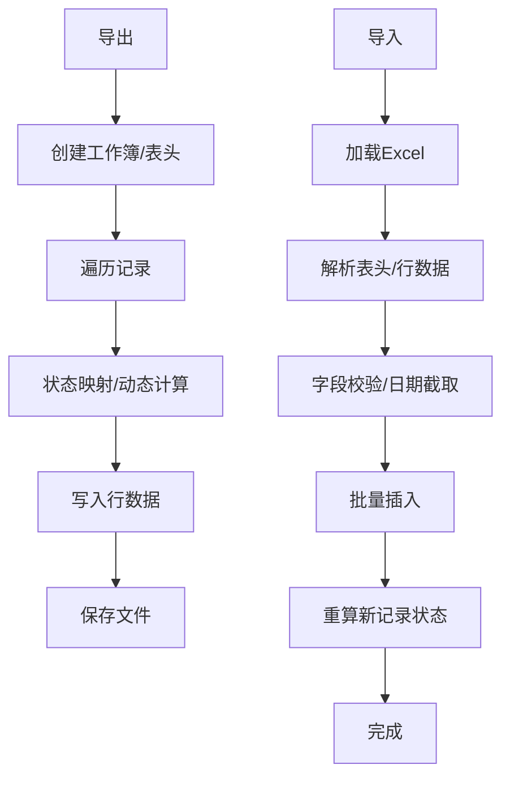
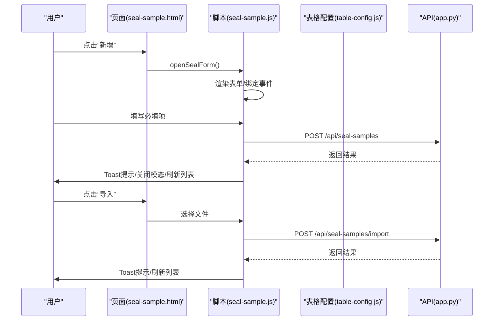
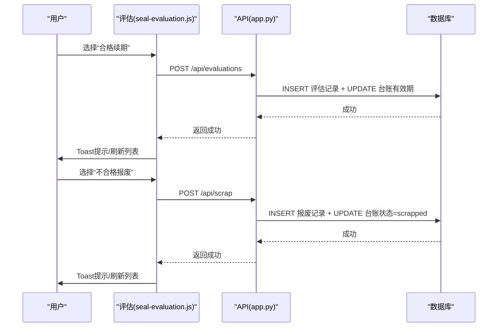
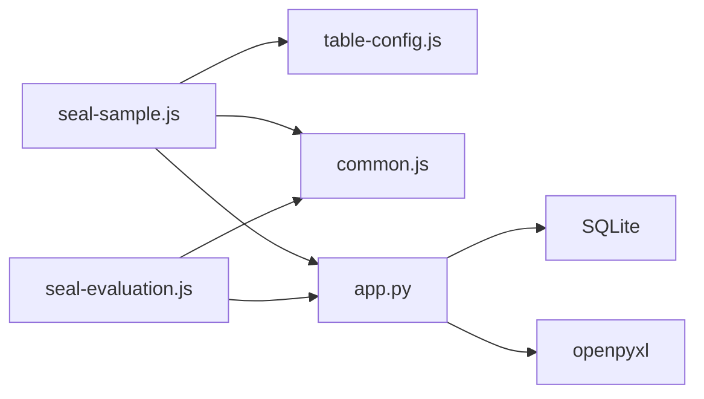

# 封样件管理模块

<cite>
**本文档引用的文件**
- [app.py](file://app.py)
- [seal-sample.html](file://templates/seal-sample.html)
- [seal-sample.js](file://static/js/seal-sample.js)
- [table-config.js](file://static/js/table-config.js)
- [seal-evaluation.js](file://static/js/seal-evaluation.js)
- [common.js](file://static/js/common.js)
</cite>

## 目录
1. [简介](#简介)
2. [项目结构](#项目结构)
3. [核心组件](#核心组件)
4. [架构总览](#架构总览)
5. [详细组件分析](#详细组件分析)
6. [依赖关系分析](#依赖关系分析)
7. [性能考量](#性能考量)
8. [故障排查指南](#故障排查指南)
9. [结论](#结论)
10. [附录](#附录)

## 简介
本模块负责封样件台账的全生命周期管理，涵盖新增、编辑、删除、状态跟踪、有效期管理、Excel导入导出以及前端交互体验。系统通过后端Flask API提供REST接口，前端采用JavaScript模块化实现动态表格、筛选、列配置、导入导出与交互提示。

## 项目结构
后端以Flask为核心，SQLite作为数据存储；前端采用静态资源与模块化JS，配合通用工具库与表格配置模块，实现统一的交互体验。

**图表来源**
- [app.py:1-2197](file://app.py#L1-L2197)
- [seal-sample.html:1-45](file://templates/seal-sample.html#L1-L45)
- [seal-sample.js:1-181](file://static/js/seal-sample.js#L1-L181)
- [table-config.js:1-552](file://static/js/table-config.js#L1-L552)
- [seal-evaluation.js:1-214](file://static/js/seal-evaluation.js#L1-L214)
- [common.js:1-135](file://static/js/common.js#L1-L135)

**章节来源**
- [app.py:88-335](file://app.py#L88-L335)
- [seal-sample.html:1-45](file://templates/seal-sample.html#L1-L45)

## 核心组件
- 封样件台账表：存储封样件的基本信息、有效期、状态与提醒天数等。
- 状态管理：正常、待评定、已过期、已报废四态，支持动态计算与人工干预。
- 有效期管理：基于有效期截止日期与提醒天数自动判定状态。
- CRUD接口：提供查询、创建、更新、删除与导出/导入能力。
- 前端交互：动态筛选、列配置、导入导出、模态对话框与Toast提示。
- 评估与报废：支持封样件的内部评定与报废流程，并维护处置记录。

**章节来源**
- [app.py:129-144](file://app.py#L129-L144)
- [app.py:350-371](file://app.py#L350-L371)
- [seal-sample.js:1-181](file://static/js/seal-sample.js#L1-L181)
- [table-config.js:15-552](file://static/js/table-config.js#L15-L552)

## 架构总览
后端采用Flask路由定义REST API，SQLite负责持久化；前端通过AJAX调用API，结合通用工具与表格配置模块实现动态渲染与交互。

**图表来源**
- [app.py:593-691](file://app.py#L593-L691)
- [seal-sample.js:8-61](file://static/js/seal-sample.js#L8-L61)

**章节来源**
- [app.py:454-589](file://app.py#L454-L589)
- [app.py:593-691](file://app.py#L593-L691)

## 详细组件分析

### 数据模型与状态管理
- 数据表：seal_samples包含序号、项目、封样件名称、签署人、签署人日期、有效期、提醒天数、状态、备注等字段。
- 状态计算：get_expiry_status根据有效期与提醒天数动态计算状态，区分正常、待评定、已过期；已报废状态由人工操作或评估/报废流程设定。
- 状态映射：后端导出/导入时使用中文状态映射，前端渲染使用状态标签样式。

**图表来源**
- [app.py:350-371](file://app.py#L350-L371)
- [common.js:42-61](file://static/js/common.js#L42-L61)

**章节来源**
- [app.py:129-144](file://app.py#L129-L144)
- [app.py:350-371](file://app.py#L350-L371)
- [common.js:42-61](file://static/js/common.js#L42-L61)

### CRUD接口与业务逻辑
- 列表查询：支持分页、动态筛选、兼容旧参数；列表端动态计算状态。
- 新增封样件：自动生成序号，必填字段校验，初始状态按有效期与提醒天数计算。
- 查看详情：动态计算状态，避免陈旧状态显示。
- 更新封样件：禁止更新已报废记录；有效期与提醒天数变更后重新计算状态。
- 删除封样件：物理删除记录。
- 导出/导入：导出中文状态与动态计算；导入时解析模板字段，自动重算状态。

**图表来源**
- [app.py:625-691](file://app.py#L625-L691)

**章节来源**
- [app.py:593-691](file://app.py#L593-L691)

### Excel导入导出
- 导出：生成Excel工作簿，表头包含ID、序号、项目、封样件名称、签署人、签署人日期、有效期、提醒天数、状态、备注、创建时间；状态映射为中文，动态计算“正常”状态。
- 导入：支持从导出文件重新导入（跳过ID列），逐行解析，日期字段截取YYYY-MM-DD，自动插入并重算新导入记录的真实状态。

**图表来源**
- [app.py:692-795](file://app.py#L692-L795)

**章节来源**
- [app.py:692-795](file://app.py#L692-L795)

### 前端界面与交互
- 页面布局：模板包含工具栏（新增、导入、导出）、动态筛选面板、表格与分页。
- 动态表格：TableConfig定义字段、渲染器、默认列与列设置；renderCell按列别名与渲染器输出。
- 表单交互：新增/编辑表单包含必填字段校验、序号自动生成、签署人日期变更联动有效期计算。
- 操作按钮：根据状态显示“查看/编辑/评定/删除”，已报废记录隐藏编辑与评定入口。
- 导入导出：绑定事件触发API上传与下载，导入后刷新列表并提示结果。

**图表来源**
- [seal-sample.html:1-45](file://templates/seal-sample.html#L1-L45)
- [seal-sample.js:65-107](file://static/js/seal-sample.js#L65-L107)
- [table-config.js:15-552](file://static/js/table-config.js#L15-L552)

**章节来源**
- [seal-sample.html:1-45](file://templates/seal-sample.html#L1-L45)
- [seal-sample.js:1-181](file://static/js/seal-sample.js#L1-L181)
- [table-config.js:15-552](file://static/js/table-config.js#L15-L552)

### 评估与报废流程
- 评估页面：加载全量封样件，按“全部/待评定/已过期/已报废”标签筛选；支持发起评定（合格续期或不合格报废）。
- 合格续期：提交新有效期，更新台账有效期与状态为正常。
- 不合格报废：提交报废原因与类型，写入报废记录并锁定台账状态为已报废。
- 处置记录：评估与报废均产生对应的处置记录，支持管理员软删除、恢复与永久删除。

**图表来源**
- [seal-evaluation.js:95-199](file://static/js/seal-evaluation.js#L95-L199)
- [app.py:1226-1327](file://app.py#L1226-L1327)

**章节来源**
- [seal-evaluation.js:1-214](file://static/js/seal-evaluation.js#L1-L214)
- [app.py:1226-1327](file://app.py#L1226-L1327)

## 依赖关系分析
- 前端模块间依赖：seal-sample.js依赖table-config.js与common.js；seal-evaluation.js独立调用API。
- 后端模块间依赖：app.py集中定义路由、工具函数与数据库初始化；评估与报废接口共享状态更新逻辑。
- 外部依赖：openpyxl用于Excel导入导出；SQLite用于本地存储；Flask+CORS提供Web服务。

**图表来源**
- [seal-sample.js:1-181](file://static/js/seal-sample.js#L1-L181)
- [table-config.js:1-552](file://static/js/table-config.js#L1-L552)
- [seal-evaluation.js:1-214](file://static/js/seal-evaluation.js#L1-L214)
- [app.py:1-20](file://app.py#L1-L20)

**章节来源**
- [app.py:1-20](file://app.py#L1-L20)

## 性能考量
- 分页与筛选：后端支持分页与动态筛选，避免一次性加载全量数据；前端使用防抖与本地缓存优化交互。
- 状态计算：列表端与详情端均进行动态状态计算，确保状态实时准确。
- 导入性能：导入时批量插入并一次性重算新记录状态，减少多次往返。
- 建议：在高并发场景下可考虑引入连接池与索引优化；对大表增加有效期与状态字段索引以提升查询效率。

[本节为通用性能建议，无需特定文件引用]

## 故障排查指南
- 登录/鉴权失败：检查Token是否过期或无效，确认用户状态是否被禁用。
- 新增失败：确认必填字段是否完整，序号是否冲突。
- 更新失败：若提示记录已报废，需先恢复或走报废流程。
- 导入失败：检查Excel模板字段顺序与格式，确保日期字段为YYYY-MM-DD。
- 状态异常：确认有效期与提醒天数配置是否合理，必要时手动调整。

**章节来源**
- [app.py:49-76](file://app.py#L49-L76)
- [app.py:629-632](file://app.py#L629-L632)
- [app.py:665-667](file://app.py#L665-L667)
- [app.py:722-794](file://app.py#L722-L794)

## 结论
封样件管理模块通过清晰的前后端分工与完善的业务流程，实现了从台账维护到状态流转的闭环管理。模块具备良好的扩展性与可维护性，适合在中小规模团队中稳定运行，并可根据实际需求进一步增强审计追踪与报表能力。

[本节为总结性内容，无需特定文件引用]

## 附录

### API接口清单（封样件）
- GET /api/seal-samples
  - 查询封样件列表，支持分页与动态筛选
  - 参数：page、pageSize、动态筛选条件f_field_i/f_op_i/f_val_i、search、project
  - 响应：分页数据，每项包含状态动态计算
- POST /api/seal-samples
  - 新增封样件
  - 请求体：项目、封样件名称、签署人、签署人日期、有效期、提醒天数、备注
  - 响应：成功消息与新增ID
- GET /api/seal-samples/{id}
  - 获取封样件详情，状态动态计算
  - 响应：单条记录
- PUT /api/seal-samples/{id}
  - 更新封样件，禁止更新已报废记录
  - 请求体：同新增（部分字段可选）
  - 响应：成功消息
- DELETE /api/seal-samples/{id}
  - 删除封样件
  - 响应：成功消息
- GET /api/seal-samples/export
  - 导出封样件Excel（含中文状态与动态计算）
  - 响应：Excel文件
- POST /api/seal-samples/import
  - 导入封样件Excel（支持跳过ID列）
  - 请求：multipart/form-data，file字段
  - 响应：导入统计与错误提示

**章节来源**
- [app.py:593-691](file://app.py#L593-L691)
- [app.py:692-795](file://app.py#L692-L795)

### 状态定义与转换
- 正常：剩余天数大于提醒天数
- 待评定：剩余天数在0到提醒天数之间
- 已过期：剩余天数小于等于0
- 已报废：人工操作或评估/报废流程锁定

**章节来源**
- [app.py:350-371](file://app.py#L350-L371)
- [common.js:42-61](file://static/js/common.js#L42-L61)

### Excel模板字段
- 导出模板：ID、序号、项目、封样件名称、签署人、签署人日期、有效期、提醒天数、状态、备注、创建时间
- 导入模板：与导出模板一致，支持从导出文件重新导入（跳过ID列）

**章节来源**
- [app.py:698-718](file://app.py#L698-L718)
- [app.py:756-776](file://app.py#L756-L776)