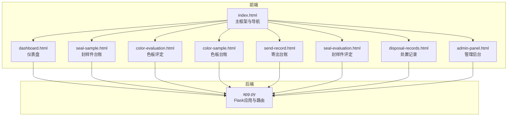
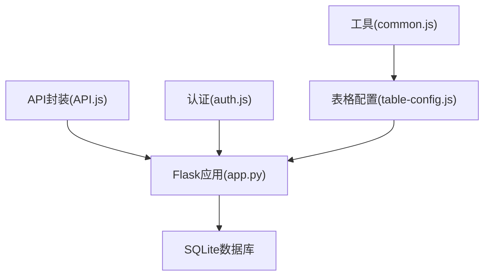
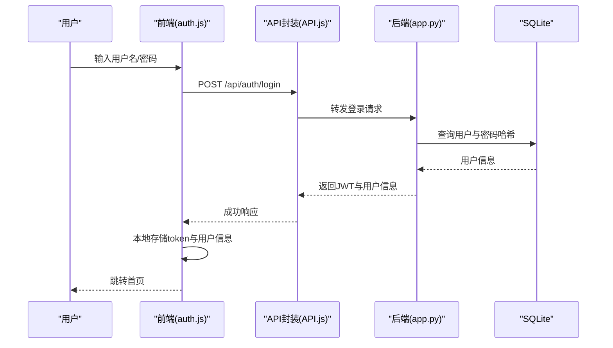
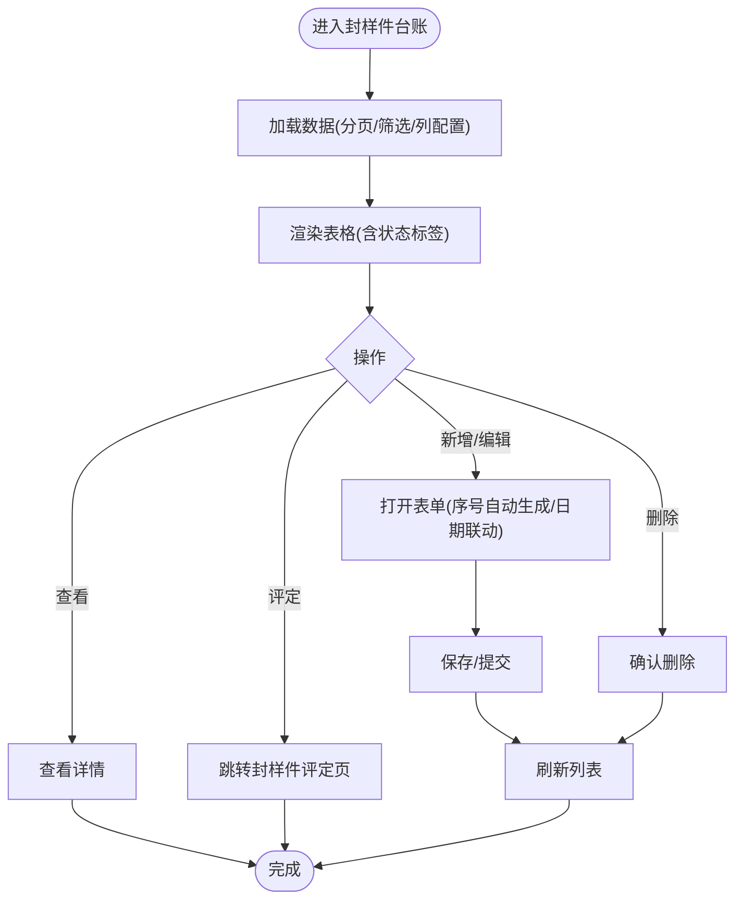
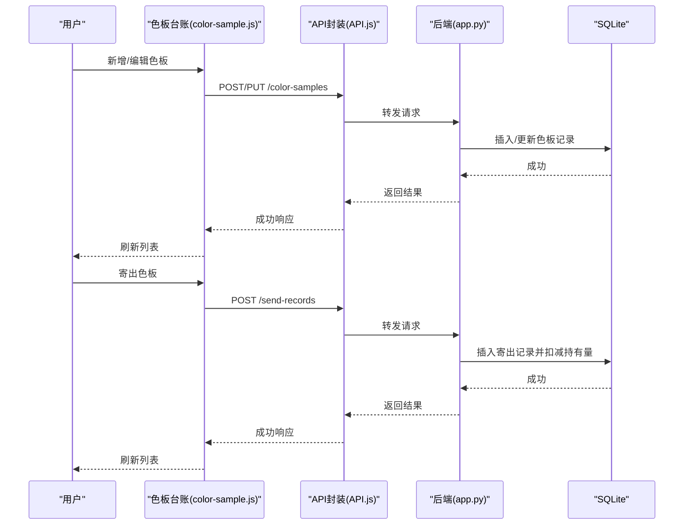
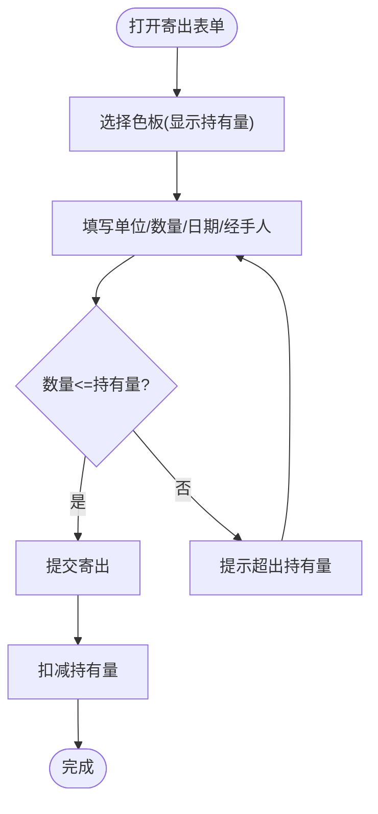
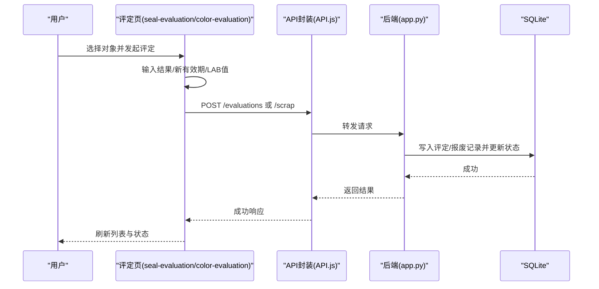
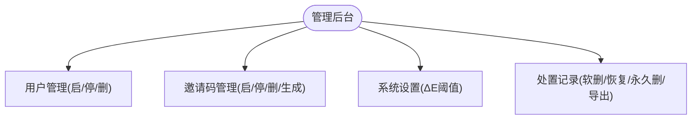
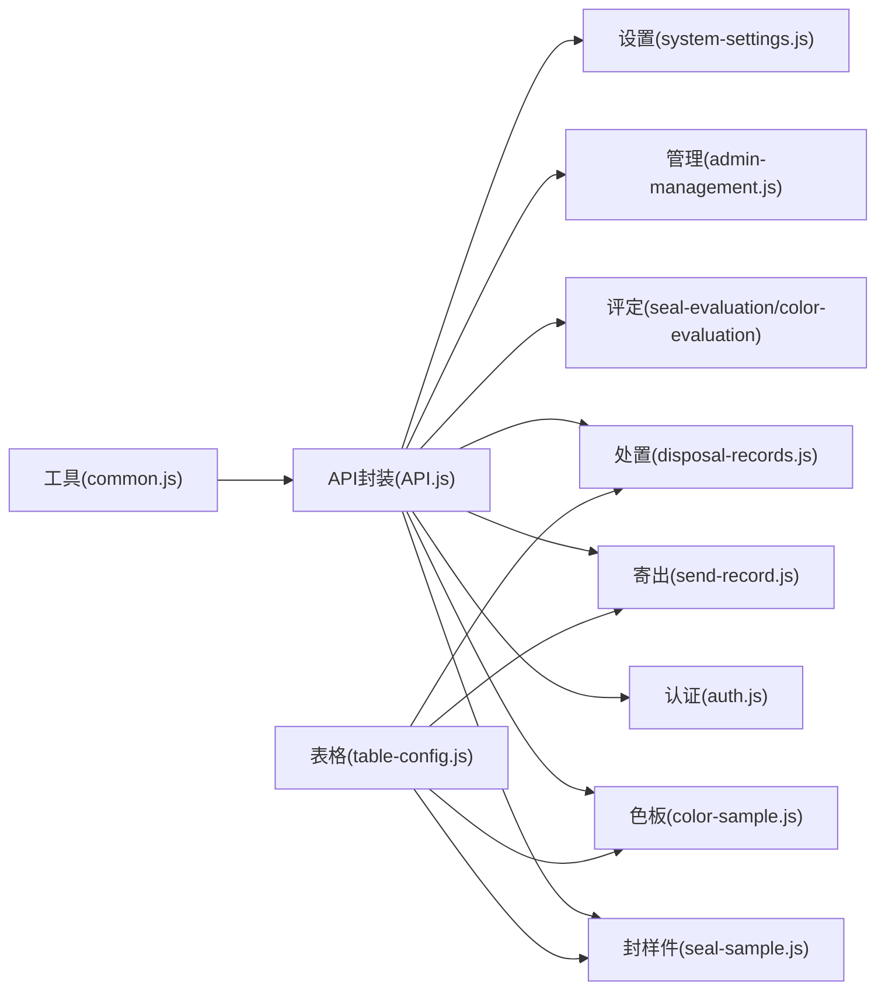

# 核心模块

<cite>
**本文引用的文件**
- [app.py](file://app.py)
- [index.html](file://templates/index.html)
- [dashboard.html](file://templates/dashboard.html)
- [api.js](file://static/js/api.js)
- [auth.js](file://static/js/auth.js)
- [common.js](file://static/js/common.js)
- [table-config.js](file://static/js/table-config.js)
- [seal-sample.js](file://static/js/seal-sample.js)
- [color-sample.js](file://static/js/color-sample.js)
- [send-record.js](file://static/js/send-record.js)
- [seal-evaluation.js](file://static/js/seal-evaluation.js)
- [color-evaluation.js](file://static/js/color-evaluation.js)
- [disposal-records.js](file://static/js/disposal-records.js)
- [admin-management.js](file://static/js/admin-management.js)
- [system-settings.js](file://static/js/system-settings.js)
</cite>

## 目录
1. [简介](#简介)
2. [项目结构](#项目结构)
3. [核心组件](#核心组件)
4. [架构总览](#架构总览)
5. [详细组件分析](#详细组件分析)
6. [依赖分析](#依赖分析)
7. [性能考虑](#性能考虑)
8. [故障排查指南](#故障排查指南)
9. [结论](#结论)
10. [附录](#附录)

## 简介
本系统为“封样件及色板接收登记管理系统”，采用前后端分离架构：后端基于 Flask + SQLite，前端采用纯静态 HTML/CSS/JS，通过 JWT 实现认证与权限控制，支持多模块业务闭环，覆盖用户管理、封样件管理、色板管理、寄出管理、评定管理、处置记录与系统管理等核心功能。系统强调数据一致性、有效期自动判定、ΔE 色差评估、库存联动与审计追踪。

## 项目结构
- 后端入口与路由：app.py
- 前端模板：templates 下的页面模板
- 前端脚本：static/js 下按模块划分的 JS 文件
- 样式资源：static/css 下样式文件

图表来源
- [index.html](file://templates/index.html)
- [app.py](file://app.py)

章节来源
- [index.html](file://templates/index.html)
- [app.py](file://app.py)

## 核心组件
- 认证与权限控制：基于 JWT 的登录、心跳、退出；装饰器实现 Token 校验与管理员权限校验
- 数据模型与业务表：用户、封样件、色板、寄出、有效期管理、评定记录、报废记录、系统设置、用户表格配置
- 前端模块化：通用 API 封装、工具函数、表格配置与筛选、各业务页面逻辑
- 有效期与状态：统一的到期判定逻辑与状态枚举，支持自动转为“待评定”
- ΔE 色差评估：CIE76 公式计算，阈值可配置，颜色标识与实时预览
- 库存联动：寄出即扣减持有数量，删除寄出记录可恢复库存
- 处置审计：评定与报废统一视图，支持软删除、恢复与永久删除

章节来源
- [app.py](file://app.py)
- [api.js](file://static/js/api.js)
- [common.js](file://static/js/common.js)

## 架构总览
系统采用前后端分离，前端通过 API.js 统一封装请求与 401 自动跳转，后端通过装饰器统一鉴权与权限控制，数据库为 SQLite，表结构覆盖业务全链路。

图表来源
- [api.js](file://static/js/api.js)
- [auth.js](file://static/js/auth.js)
- [common.js](file://static/js/common.js)
- [table-config.js](file://static/js/table-config.js)
- [app.py](file://app.py)

## 详细组件分析

### 用户管理模块（认证、权限控制）
- 登录/注册/改密/退出/心跳：统一由后端 /api/auth/* 提供，前端通过 API.js 发起请求
- 权限控制：token_required 装饰器校验 Token 并更新在线状态；admin_required 限制管理员操作
- 邀请码机制：注册时校验邀请码有效性与使用次数，支持生成与管理
- 管理后台：用户启/停、删除；邀请码启/停、删除、生成新码

图表来源
- [auth.js](file://static/js/auth.js)
- [api.js](file://static/js/api.js)
- [app.py](file://app.py)

章节来源
- [auth.js](file://static/js/auth.js)
- [api.js](file://static/js/api.js)
- [app.py](file://app.py)

### 封样件管理模块（台账维护、状态跟踪）
- 主要能力：新增/编辑/删除/查看、分页、动态筛选、列配置、导入/导出
- 状态与有效期：根据有效期与提醒天数动态计算状态（正常/待评定/已过期/已报废）
- 评定入口：待评定/已过期状态下提供“发起评定”按钮
- 交互：表单自动生成序号，签署人日期与有效期联动

图表来源
- [seal-sample.js](file://static/js/seal-sample.js)
- [table-config.js](file://static/js/table-config.js)
- [app.py](file://app.py)

章节来源
- [seal-sample.js](file://static/js/seal-sample.js)
- [table-config.js](file://static/js/table-config.js)
- [app.py](file://app.py)

### 色板管理模块（接收登记、色差评估）
- 接收登记：客户/车型/颜色名称/供应商/数量/日期/有效期/基准 Lab 值/ΔE 参数
- 库存联动：寄出即扣减“当前持有数量”，删除寄出记录恢复库存
- 色差评估：ΔE 实时计算与颜色标识，阈值可配置，支持“合格续期/不合格报废”
- 展开行：支持查看基准 Lab 与 Δ 参数明细

图表来源
- [color-sample.js](file://static/js/color-sample.js)
- [send-record.js](file://static/js/send-record.js)
- [api.js](file://static/js/api.js)
- [app.py](file://app.py)

章节来源
- [color-sample.js](file://static/js/color-sample.js)
- [send-record.js](file://static/js/send-record.js)
- [api.js](file://static/js/api.js)
- [app.py](file://app.py)

### 寄出管理模块（寄出流程、库存联动）
- 寄出流程：选择色板、输入对方单位/数量/日期/经手人，提交后自动扣减持有量
- 删除寄出记录：恢复对应数量的持有库存
- 筛选与导出：支持按客户/单位等筛选，支持导出 Excel

图表来源
- [send-record.js](file://static/js/send-record.js)
- [app.py](file://app.py)

章节来源
- [send-record.js](file://static/js/send-record.js)
- [app.py](file://app.py)

### 评定管理模块（定期评估、有效期延长）
- 封样件评定：合格续期（填写新有效期）或不合格报废（填写原因与类型）
- 色板评定：输入当前 LAB 值，实时计算 ΔE，按阈值分级，合格续期或不合格报废
- 统一视图：处置记录页展示评定与报废记录，支持查看详情、软删除/恢复/永久删除

图表来源
- [seal-evaluation.js](file://static/js/seal-evaluation.js)
- [color-evaluation.js](file://static/js/color-evaluation.js)
- [api.js](file://static/js/api.js)
- [app.py](file://app.py)

章节来源
- [seal-evaluation.js](file://static/js/seal-evaluation.js)
- [color-evaluation.js](file://static/js/color-evaluation.js)
- [app.py](file://app.py)

### 系统管理模块（用户配置、数据导入导出）
- 管理后台：用户启/停、删除；邀请码启/停、删除、生成新码
- 系统设置：ΔE 阈值配置（优秀/合格/关注），实时预览与保存
- 处置记录：统一查看评定与报废记录，支持软删除、恢复、永久删除与导出

图表来源
- [admin-management.js](file://static/js/admin-management.js)
- [system-settings.js](file://static/js/system-settings.js)
- [disposal-records.js](file://static/js/disposal-records.js)
- [app.py](file://app.py)

章节来源
- [admin-management.js](file://static/js/admin-management.js)
- [system-settings.js](file://static/js/system-settings.js)
- [disposal-records.js](file://static/js/disposal-records.js)
- [app.py](file://app.py)

## 依赖分析
- 前端模块耦合：各页面 JS 依赖 API.js、common.js、table-config.js；页面模板由 index.html 动态加载
- 后端模块耦合：app.py 统一提供认证、业务 CRUD、导入导出、有效期计算、状态判定等
- 数据依赖：各业务表通过外键与状态/有效期字段形成闭环，寄出记录影响色板持有量

图表来源
- [api.js](file://static/js/api.js)
- [auth.js](file://static/js/auth.js)
- [seal-sample.js](file://static/js/seal-sample.js)
- [color-sample.js](file://static/js/color-sample.js)
- [send-record.js](file://static/js/send-record.js)
- [seal-evaluation.js](file://static/js/seal-evaluation.js)
- [color-evaluation.js](file://static/js/color-evaluation.js)
- [disposal-records.js](file://static/js/disposal-records.js)
- [admin-management.js](file://static/js/admin-management.js)
- [system-settings.js](file://static/js/system-settings.js)
- [table-config.js](file://static/js/table-config.js)
- [common.js](file://static/js/common.js)

章节来源
- [api.js](file://static/js/api.js)
- [table-config.js](file://static/js/table-config.js)
- [common.js](file://static/js/common.js)
- [app.py](file://app.py)

## 性能考虑
- 分页与筛选：后端支持分页与动态筛选参数，前端通过 TableConfig 统一构建查询参数，避免一次性加载全量数据
- 本地缓存：表格列配置与筛选条件本地缓存，减少重复请求
- ΔE 实时计算：前端实时计算 ΔE 并预览，降低后端压力
- 导入导出：Excel 导出/导入批量处理，注意大文件分批与错误提示

## 故障排查指南
- 401 未授权：API.js 捕获 401 自动跳转登录并清理本地状态
- 账户被停用：后端返回特定 code，前端提示并跳转登录
- 密码强度：注册与改密前端校验长度与一致性
- 寄出超量：前端校验持有量，防止非法提交
- 有效期状态异常：后端按到期前 N 天自动转为“待评定”，前端展示与交互同步

章节来源
- [api.js](file://static/js/api.js)
- [auth.js](file://static/js/auth.js)
- [send-record.js](file://static/js/send-record.js)
- [app.py](file://app.py)

## 结论
本系统围绕封样件与色板两条主线，构建了从接收登记、库存联动、有效期管理到评定报废的完整闭环，配合灵活的表格配置与阈值可配的 ΔE 评估，满足实际业务对质量追溯与效率提升的需求。前后端职责清晰、模块解耦良好，具备良好的扩展性与可维护性。

## 附录
- 仪表盘：展示近期到期预警与最近操作记录
- 页面布局：左侧导航、顶部面包屑与右侧内容区，动态加载子页面
- 交互方式：Modal/Drawer/Toast/Confirm 等 UI 组件统一管理
- 数据展示：表格列可配置、筛选条件可保存、分页与排序友好

章节来源
- [dashboard.html](file://templates/dashboard.html)
- [index.html](file://templates/index.html)
- [disposal-records.js](file://static/js/disposal-records.js)