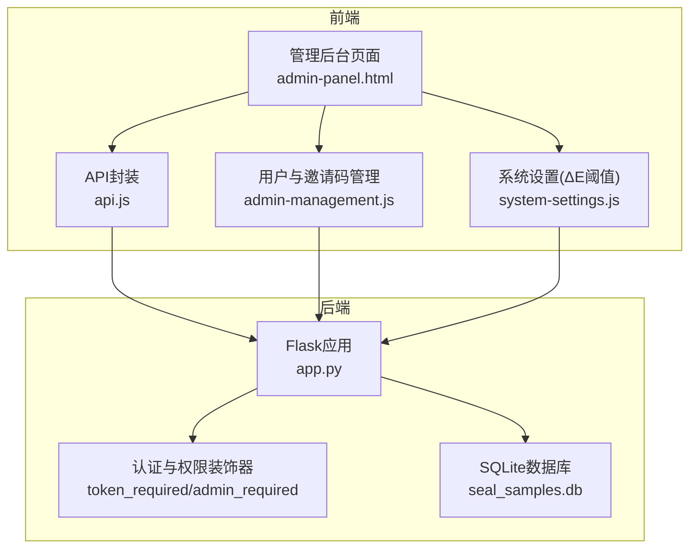
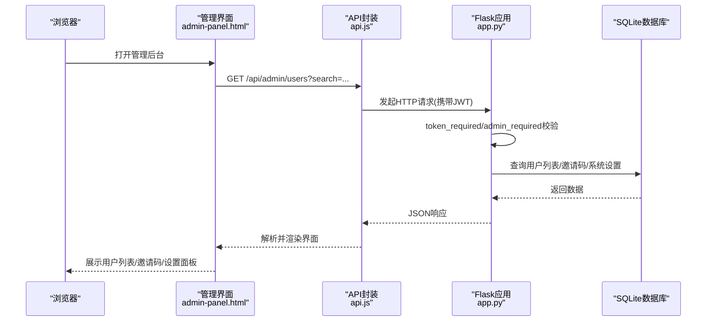
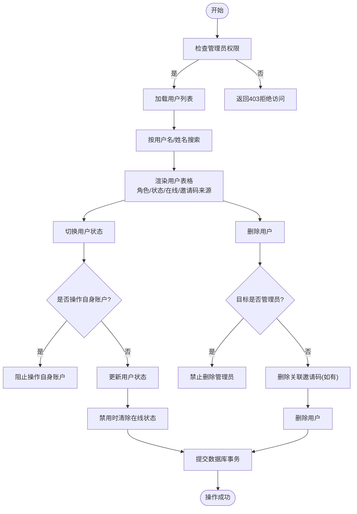
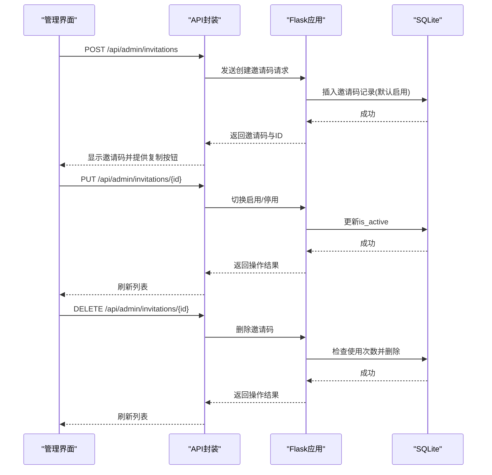
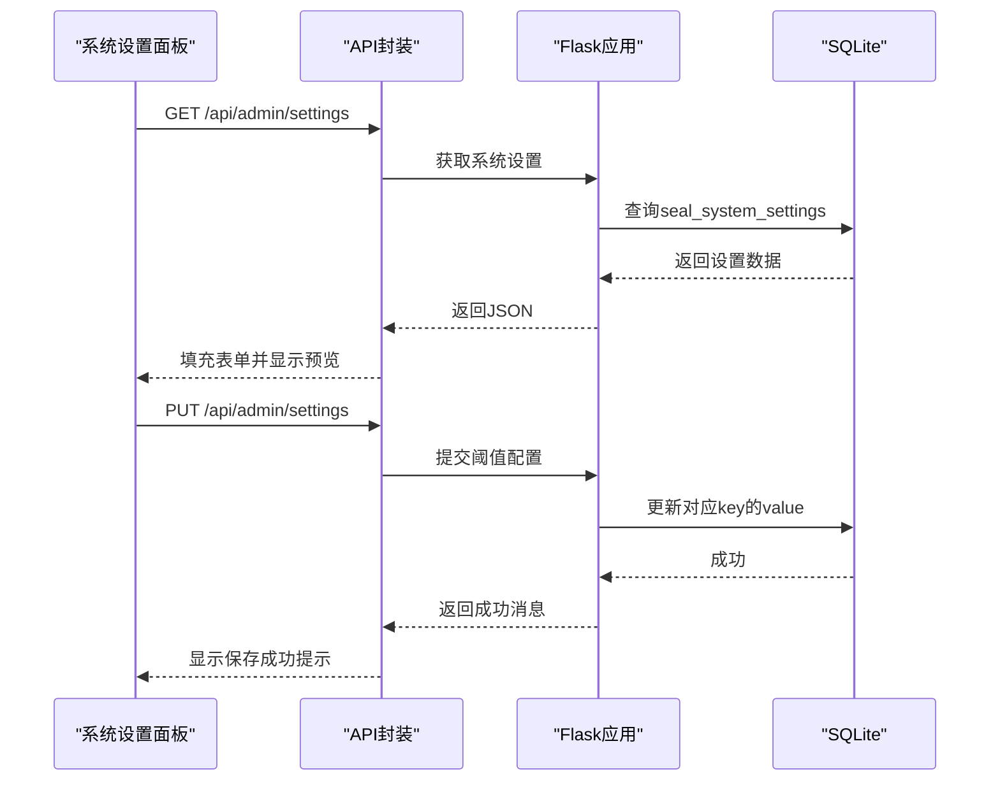
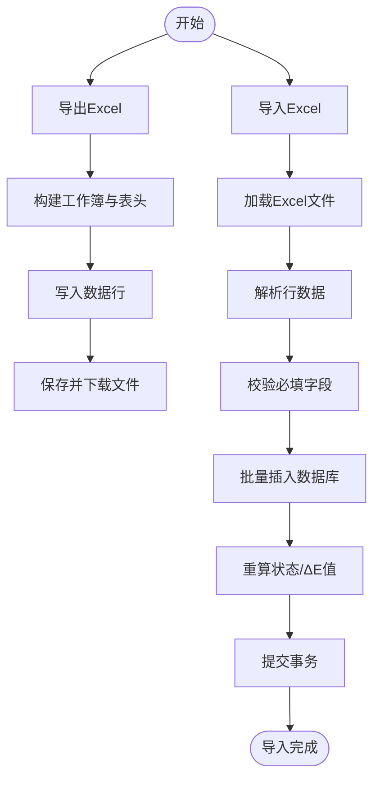
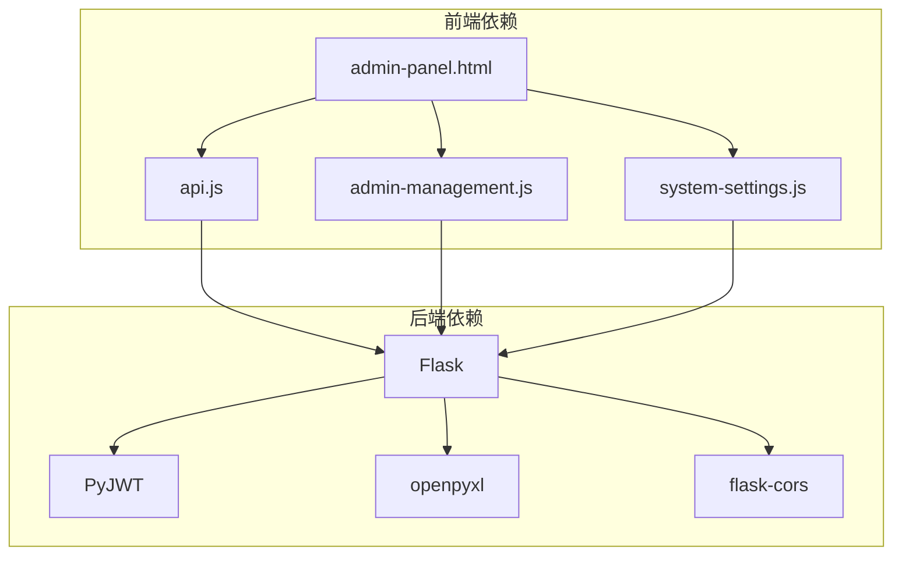

# 系统管理模块

<cite>
**本文档引用的文件**
- [app.py](file://app.py)
- [admin-management.js](file://static/js/admin-management.js)
- [system-settings.js](file://static/js/system-settings.js)
- [admin-panel.html](file://templates/admin-panel.html)
- [api.js](file://static/js/api.js)
- [requirements.txt](file://requirements.txt)
</cite>

## 目录
1. [简介](#简介)
2. [项目结构](#项目结构)
3. [核心组件](#核心组件)
4. [架构总览](#架构总览)
5. [详细组件分析](#详细组件分析)
6. [依赖关系分析](#依赖关系分析)
7. [性能考虑](#性能考虑)
8. [故障排除指南](#故障排除指南)
9. [结论](#结论)
10. [附录](#附录)

## 简介
本系统管理模块面向管理员，提供完善的用户权限管理、邀请码管理以及系统配置管理能力。系统采用Flask后端与前端JavaScript交互，结合SQLite数据库实现数据持久化。管理员可通过管理后台完成用户创建、权限分配、状态管理、邀请码生成与维护，以及ΔE阈值等系统参数的实时调整。同时，系统支持数据导入导出、备份恢复、数据清理等运维操作，并通过JWT进行认证授权，确保敏感操作的安全性。

## 项目结构
系统采用前后端分离架构：
- 后端：Flask应用，提供RESTful API接口，负责业务逻辑、数据访问与安全控制
- 前端：静态HTML模板与JavaScript脚本，负责用户界面渲染与交互
- 数据库：SQLite，存储用户、邀请码、系统设置等核心数据

**图表来源**
- [admin-panel.html:1-107](file://templates/admin-panel.html#L1-L107)
- [api.js:1-88](file://static/js/api.js#L1-L88)
- [admin-management.js:1-153](file://static/js/admin-management.js#L1-L153)
- [system-settings.js:1-65](file://static/js/system-settings.js#L1-L65)
- [app.py:1-26](file://app.py#L1-L26)

**章节来源**
- [admin-panel.html:1-107](file://templates/admin-panel.html#L1-L107)
- [requirements.txt:1-5](file://requirements.txt#L1-L5)

## 核心组件
- 认证与权限控制：基于JWT的token_required装饰器与admin_required装饰器，确保只有已认证且具备管理员权限的用户才能访问管理接口
- 用户管理：提供用户列表查询、状态切换、删除等操作，支持按用户名/姓名搜索
- 邀请码管理：支持生成、启用/停用、删除邀请码，限制已使用邀请码的删除
- 系统设置：提供ΔE阈值配置的读取与更新，支持实时预览效果
- 数据管理：提供封样件与色板的导入导出功能，支持Excel格式
- 在线状态：通过last_active字段跟踪用户在线状态，5分钟内活跃即视为在线

**章节来源**
- [app.py:49-84](file://app.py#L49-L84)
- [app.py:1426-1495](file://app.py#L1426-L1495)
- [app.py:1499-1548](file://app.py#L1499-L1548)
- [app.py:1552-1577](file://app.py#L1552-L1577)
- [app.py:692-794](file://app.py#L692-L794)
- [app.py:917-1040](file://app.py#L917-L1040)
- [admin-management.js:1-153](file://static/js/admin-management.js#L1-L153)

## 架构总览
系统管理模块的架构围绕“认证授权 + 管理接口 + 前端交互”展开。后端通过装饰器实现统一的权限校验，前端通过API封装统一处理请求与响应，数据库采用SQLite以简化部署与维护。

**图表来源**
- [api.js:7-42](file://static/js/api.js#L7-L42)
- [app.py:1426-1495](file://app.py#L1426-L1495)
- [app.py:1499-1548](file://app.py#L1499-L1548)
- [app.py:1552-1577](file://app.py#L1552-L1577)

## 详细组件分析

### 用户权限管理
- 用户创建与注册
  - 注册流程：通过邀请码注册，后端验证邀请码有效性、使用次数与过期时间，成功后创建用户并更新邀请码使用计数
  - 用户列表：支持按用户名/姓名搜索，展示角色、状态、在线状态、注册时间与邀请码来源
  - 在线状态：基于last_active字段，5分钟内活跃即视为在线
- 权限分配与状态管理
  - 管理员可切换用户状态（启用/禁用），禁用时自动清除在线状态
  - 禁止管理员操作自身账户与删除管理员账户
  - 删除用户时，若用户关联邀请码则一并删除
- 安全控制
  - 所有管理接口均受admin_required装饰器保护
  - token_required确保JWT有效且未过期，账户未被禁用

**图表来源**
- [app.py:1426-1495](file://app.py#L1426-L1495)
- [admin-management.js:51-64](file://static/js/admin-management.js#L51-L64)

**章节来源**
- [app.py:49-84](file://app.py#L49-L84)
- [app.py:1426-1495](file://app.py#L1426-L1495)
- [admin-management.js:1-153](file://static/js/admin-management.js#L1-L153)

### 邀请码管理
- 生成邀请码：支持设置备注、最大使用次数与过期时间，默认启用
- 管理邀请码：支持启用/停用与删除，已使用的邀请码禁止删除
- 展示与复制：邀请码部分隐藏显示，支持一键复制到剪贴板

**图表来源**
- [app.py:1499-1548](file://app.py#L1499-L1548)
- [admin-management.js:110-142](file://static/js/admin-management.js#L110-L142)

**章节来源**
- [app.py:1499-1548](file://app.py#L1499-L1548)
- [admin-management.js:66-142](file://static/js/admin-management.js#L66-L142)

### 系统配置管理（ΔE阈值）
- 配置读取：管理员可获取当前系统设置，包含ΔE优秀、合格、需关注阈值
- 配置更新：支持批量更新多个设置项，立即生效
- 实时预览：前端根据输入值模拟不同ΔE值的等级与颜色标识，便于直观验证

**图表来源**
- [app.py:1552-1577](file://app.py#L1552-L1577)
- [system-settings.js:6-61](file://static/js/system-settings.js#L6-L61)

**章节来源**
- [app.py:1552-1577](file://app.py#L1552-L1577)
- [system-settings.js:1-65](file://static/js/system-settings.js#L1-L65)

### 数据管理（导入导出）
- 封样件导入导出
  - 导出：生成Excel文件，包含封样件台账数据，状态字段按有效期与提醒天数动态计算
  - 导入：支持从Excel导入，自动跳过空行与错误行，批量插入并重算状态
- 色板导入导出
  - 导出：生成Excel文件，包含色板台账数据，状态字段按有效期与提醒天数动态计算
  - 导入：支持从Excel导入，自动补算ΔE值与重算状态，批量插入并处理异常

**图表来源**
- [app.py:692-794](file://app.py#L692-L794)
- [app.py:917-1040](file://app.py#L917-L1040)

**章节来源**
- [app.py:692-794](file://app.py#L692-L794)
- [app.py:917-1040](file://app.py#L917-L1040)

### 管理员界面设计
- 页面布局：采用标签页组织三大功能区域
  - 用户管理：用户列表、搜索、状态切换、删除
  - 邀请码管理：邀请码列表、生成、启用/停用、删除
  - 系统设置：ΔE阈值配置、实时预览、保存与重置
- 交互细节：支持键盘回车触发搜索、在线状态脉冲动画、邀请码一键复制、表单输入联动预览

**章节来源**
- [admin-panel.html:1-107](file://templates/admin-panel.html#L1-L107)
- [admin-management.js:144-153](file://static/js/admin-management.js#L144-L153)
- [system-settings.js:49-65](file://static/js/system-settings.js#L49-L65)

## 依赖关系分析
- 后端依赖
  - Flask：Web框架与路由
  - PyJWT：JWT签名与解码
  - openpyxl：Excel导入导出
  - flask-cors：跨域支持
- 前端依赖
  - api.js：统一API封装，处理JWT与401重定向
  - admin-management.js：用户与邀请码管理逻辑
  - system-settings.js：系统设置与阈值配置
  - admin-panel.html：管理后台页面模板

**图表来源**
- [requirements.txt:1-5](file://requirements.txt#L1-L5)
- [api.js:1-88](file://static/js/api.js#L1-L88)
- [admin-management.js:1-153](file://static/js/admin-management.js#L1-L153)
- [system-settings.js:1-65](file://static/js/system-settings.js#L1-L65)
- [admin-panel.html:1-107](file://templates/admin-panel.html#L1-L107)

**章节来源**
- [requirements.txt:1-5](file://requirements.txt#L1-L5)

## 性能考虑
- 分页与筛选：列表接口支持分页与动态筛选，避免一次性加载大量数据
- 在线状态计算：基于last_active字段与本地时间对比，减少复杂计算
- 导入优化：批量插入与事务提交，降低I/O开销；导入后重算仅针对新增记录
- 前端缓存：localStorage存储token与用户信息，减少重复请求

[本节为通用指导，无需特定文件来源]

## 故障排除指南
- 认证失败
  - 现象：401未提供Token或Token无效
  - 处理：检查Authorization头或URL参数token，确认JWT未过期
- 账户被停用
  - 现象：401账户已被停用
  - 处理：联系管理员恢复账户
- 权限不足
  - 现象：403需要管理员权限
  - 处理：确认当前用户为管理员
- 导入异常
  - 现象：导入失败或部分跳过
  - 处理：检查Excel格式与必填字段，查看返回的错误行信息
- 在线状态异常
  - 现象：在线状态显示不准确
  - 处理：确认服务器时区与last_active字段更新逻辑

**章节来源**
- [api.js:20-33](file://static/js/api.js#L20-L33)
- [app.py:572-588](file://app.py#L572-L588)
- [app.py:793-794](file://app.py#L793-L794)

## 结论
系统管理模块通过清晰的权限控制、完善的用户与邀请码管理、灵活的系统配置以及便捷的数据导入导出能力，为管理员提供了高效、安全的运维工具。前端与后端的职责划分明确，配合JWT认证与装饰器权限控制，确保了系统的安全性与稳定性。

[本节为总结性内容，无需特定文件来源]

## 附录

### 管理后台API接口清单
- 用户管理
  - GET /api/admin/users：获取用户列表（支持搜索）
  - PUT /api/admin/users/{user_id}/status：切换用户状态
  - DELETE /api/admin/users/{user_id}：删除用户
- 邀请码管理
  - GET /api/admin/invitations：获取邀请码列表
  - POST /api/admin/invitations：生成邀请码
  - PUT /api/admin/invitations/{code_id}：启用/停用邀请码
  - DELETE /api/admin/invitations/{code_id}：删除邀请码
- 系统设置
  - GET /api/admin/settings：获取系统设置
  - PUT /api/admin/settings：更新系统设置
- 数据管理
  - GET /api/seal-samples/export：导出封样件台账
  - POST /api/seal-samples/import：导入封样件台账
  - GET /api/color-samples/export：导出色板台账
  - POST /api/color-samples/import：导入色板台账

**章节来源**
- [app.py:1426-1495](file://app.py#L1426-L1495)
- [app.py:1499-1548](file://app.py#L1499-L1548)
- [app.py:1552-1577](file://app.py#L1552-L1577)
- [app.py:692-794](file://app.py#L692-L794)
- [app.py:917-1040](file://app.py#L917-L1040)

### 权限控制机制
- 认证装饰器：token_required
  - 验证JWT有效性与过期时间
  - 检查用户是否存在且未被禁用
  - 更新用户最后活跃时间
- 管理员装饰器：admin_required
  - 仅管理员可访问管理接口
  - 防止管理员操作自身账户
  - 禁止删除管理员账户

**章节来源**
- [app.py:49-84](file://app.py#L49-L84)
- [app.py:1454-1495](file://app.py#L1454-L1495)

### 操作指南与安全注意事项
- 操作指南
  - 登录后进入管理后台，使用标签页切换功能
  - 用户管理：通过搜索框快速定位用户，使用开关切换状态，谨慎删除用户
  - 邀请码管理：生成新邀请码后妥善保存，定期检查使用情况
  - 系统设置：在预览区确认阈值效果后再保存
- 安全注意事项
  - 严格控制管理员账户权限，避免误删管理员
  - 定期轮换管理员密码，避免弱口令
  - 导入数据前备份数据库，防止误操作导致数据丢失
  - 确保服务器时区与last_active字段一致，保证在线状态准确性

[本节为通用指导，无需特定文件来源]