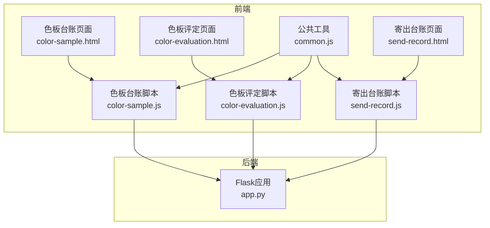
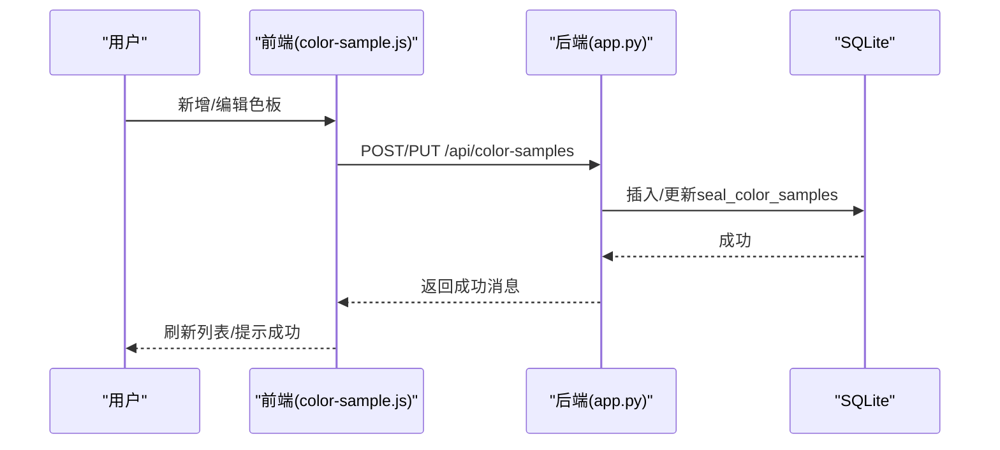
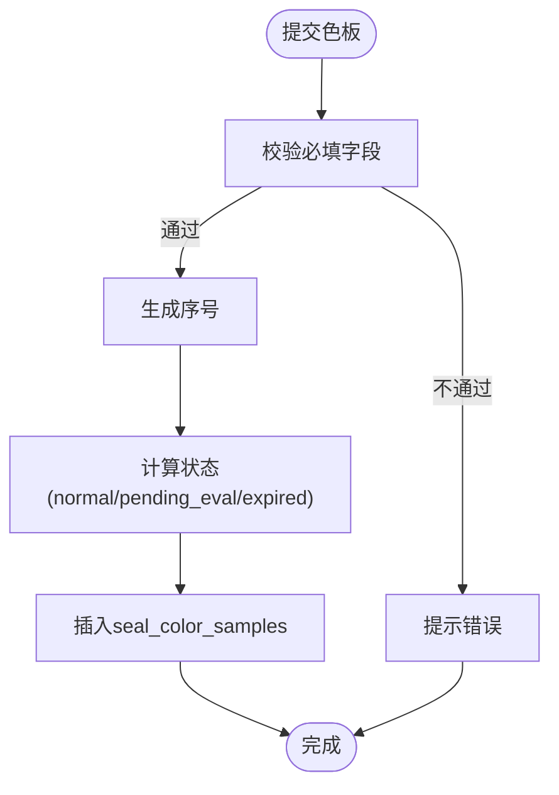
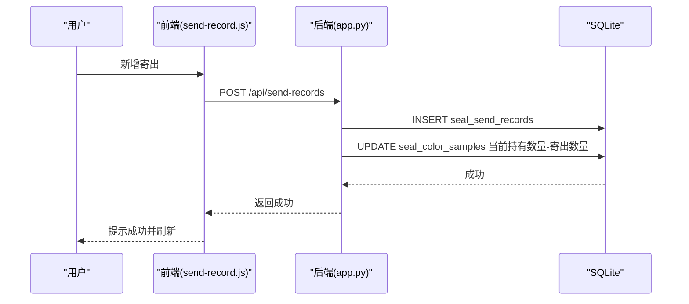
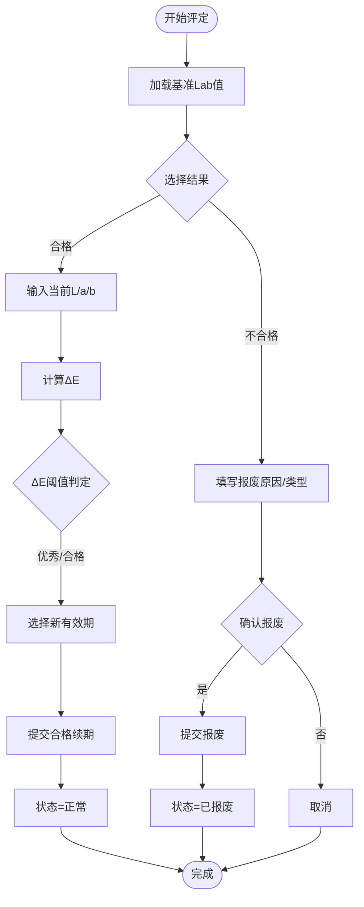
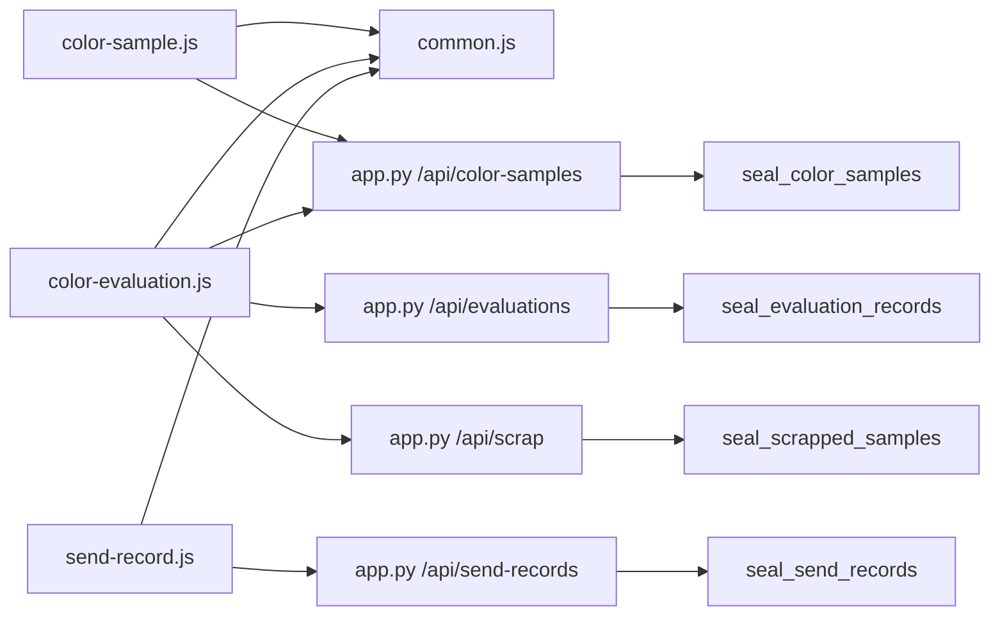

# 色板管理模块

<cite>
**本文引用的文件**
- [app.py](file://app.py)
- [color-sample.html](file://templates/color-sample.html)
- [color-sample.js](file://static/js/color-sample.js)
- [color-evaluation.html](file://templates/color-evaluation.html)
- [color-evaluation.js](file://static/js/color-evaluation.js)
- [common.js](file://static/js/common.js)
- [send-record.html](file://templates/send-record.html)
- [send-record.js](file://static/js/send-record.js)
</cite>

## 目录
1. [简介](#简介)
2. [项目结构](#项目结构)
3. [核心组件](#核心组件)
4. [架构总览](#架构总览)
5. [详细组件分析](#详细组件分析)
6. [依赖关系分析](#依赖关系分析)
7. [性能考量](#性能考量)
8. [故障排查指南](#故障排查指南)
9. [结论](#结论)
10. [附录](#附录)

## 简介
本模块围绕“色板管理”构建，覆盖色板接收登记、颜色参数记录（Lab值）、接收数量与当前持有数量管理、有效期与状态自动计算、ΔE色差评估与阈值判定、Excel导入导出、前端交互与库存联动等完整业务闭环。系统采用Flask后端 + SQLite持久化 + 前端纯JavaScript（无框架）实现，支持管理员配置ΔE阈值、动态筛选、列配置、分页与导出。

## 项目结构
- 后端入口与路由：app.py
- 前端页面与脚本：
  - 色板台账页面：templates/color-sample.html
  - 色板台账脚本：static/js/color-sample.js
  - 色板评定页面：templates/color-evaluation.html
  - 色板评定脚本：static/js/color-evaluation.js
  - 公共工具：static/js/common.js
  - 寄出台账页面：templates/send-record.html
  - 寄出台账脚本：static/js/send-record.js

图表来源
- [app.py](file://app.py)
- [color-sample.html](file://templates/color-sample.html)
- [color-sample.js](file://static/js/color-sample.js)
- [color-evaluation.html](file://templates/color-evaluation.html)
- [color-evaluation.js](file://static/js/color-evaluation.js)
- [common.js](file://static/js/common.js)
- [send-record.html](file://templates/send-record.html)
- [send-record.js](file://static/js/send-record.js)

章节来源
- [app.py](file://app.py)
- [color-sample.html](file://templates/color-sample.html)
- [color-sample.js](file://static/js/color-sample.js)
- [color-evaluation.html](file://templates/color-evaluation.html)
- [color-evaluation.js](file://static/js/color-evaluation.js)
- [common.js](file://static/js/common.js)
- [send-record.html](file://templates/send-record.html)
- [send-record.js](file://static/js/send-record.js)

## 核心组件
- 色板台账（CRUD + 导入导出 + 状态计算）
- 色板评定（ΔE实时计算 + 阈值配置 + 合格续期/不合格报废）
- 寄出管理（库存联动扣减/恢复）
- Excel导入导出（模板字段与校验）
- 前端交互（动态筛选、列配置、分页、模态框）

章节来源
- [app.py](file://app.py)
- [color-sample.js](file://static/js/color-sample.js)
- [color-evaluation.js](file://static/js/color-evaluation.js)
- [send-record.js](file://static/js/send-record.js)
- [common.js](file://static/js/common.js)

## 架构总览
后端基于Flask，使用SQLite作为数据存储；前端通过AJAX调用后端REST接口，完成数据增删改查、状态计算、阈值配置与报表导出。核心数据表为seal_color_samples，关联seal_send_records实现库存联动。

图表来源
- [app.py](file://app.py)
- [color-sample.js](file://static/js/color-sample.js)

章节来源
- [app.py](file://app.py)
- [color-sample.js](file://static/js/color-sample.js)

## 详细组件分析

### 色板接收登记与信息录入
- 必填字段：客户、适用车型、颜色名称、接收数量、有效期
- 自动生成序号：GKSB-年月日时分秒
- 接收日期与有效期：接收日期变化时，有效期自动推算一年后
- 当前持有数量：默认等于接收数量，编辑时不允许减少接收数量
- 状态：根据有效期+提醒天数自动计算（正常/待评定/已过期/已报废）

图表来源
- [app.py](file://app.py)
- [color-sample.js](file://static/js/color-sample.js)

章节来源
- [app.py](file://app.py)
- [color-sample.js](file://static/js/color-sample.js)

### 颜色参数记录（Lab值）
- 基准Lab值：L值、a值、b值
- 色差参数：ΔL值、Δa值、Δb值、Δc值、Δh值、ΔE值
- ΔE值：CIE76公式自动计算，前端实时预览，后台入库时可补算
- 光源角度：使用的光源角度（如 D65/10°）

章节来源
- [app.py](file://app.py)
- [color-sample.js](file://static/js/color-sample.js)
- [common.js](file://static/js/common.js)

### 接收数量与当前持有数量管理
- 接收数量：新增时必填，编辑时不可减少
- 当前持有数量：初始等于接收数量，仅允许系统自动调整
- 寄出管理：寄出时从当前持有数量中扣减，删除寄出记录时恢复库存
- 寄出校验：寄出数量不得大于当前持有数量

图表来源
- [app.py](file://app.py)
- [send-record.js](file://static/js/send-record.js)

章节来源
- [app.py](file://app.py)
- [send-record.js](file://static/js/send-record.js)

### 有效期与状态管理
- 状态计算：根据有效期与提醒天数自动判断
  - 正常：剩余天数>提醒天数
  - 待评定：0<剩余天数≤提醒天数
  - 已过期：剩余天数≤0
  - 已报废：状态固定为已报废
- 导入时：若ΔE值为空且ΔL/Δa/Δb存在，后台补算ΔE值并重算状态

章节来源
- [app.py](file://app.py)
- [color-sample.js](file://static/js/color-sample.js)
- [common.js](file://static/js/common.js)

### ΔE色差评估与阈值判定
- ΔE计算：CIE76公式，前端实时预览，后台入库时补算
- 阈值配置：管理员可在系统设置中维护“优秀/合格/关注”的阈值
- 颜色等级：优秀（绿色）、合格（黄色）、需关注（红色）
- 评定流程：
  - 合格：输入当前L/a/b，系统计算ΔE，选择新有效期截止日，提交后状态回到正常
  - 不合格：进入报废流程，状态变为已报废

图表来源
- [app.py](file://app.py)
- [color-evaluation.js](file://static/js/color-evaluation.js)
- [common.js](file://static/js/common.js)

章节来源
- [app.py](file://app.py)
- [color-evaluation.js](file://static/js/color-evaluation.js)
- [common.js](file://static/js/common.js)

### Excel导入导出
- 导出字段：包含全部29个字段（含序号、客户、适用车型、颜色名称、样板供应商、颜色色值转化码、纹理代码、光泽度、供应商代码、制作信息、接收数量、当前持有数量、接收日期、使用的光源角度、L/a/b/c/h、ΔL/Δa/Δb/Δc/Δh/ΔE、有效期、提醒天数、状态、备注）
- 导入规则：
  - 支持从导出文件重新导入（自动跳过ID列）
  - 状态字段支持中文映射为内部编码
  - 导入后自动重算：状态按有效期+提醒天数计算；若ΔE为空且ΔL/Δa/Δb存在则补算ΔE
- 模板设计：与导出字段严格一致，便于批量操作

章节来源
- [app.py](file://app.py)
- [color-sample.js](file://static/js/color-sample.js)

### 前端界面交互
- 色板台账：
  - 动态筛选与列配置
  - 展开行查看基准Lab值与ΔE参数
  - 寄出按钮联动当前持有数量
- 色板评定：
  - 实时ΔE计算与阈值提示
  - 合格/不合格双路径
  - 待评定/已过期/已报废标签页
- 寄出台账：
  - 下拉选择关联色板，自动显示当前持有数量
  - 寄出数量上限=当前持有数量
  - 删除寄出记录可恢复库存

章节来源
- [color-sample.html](file://templates/color-sample.html)
- [color-sample.js](file://static/js/color-sample.js)
- [color-evaluation.html](file://templates/color-evaluation.html)
- [color-evaluation.js](file://static/js/color-evaluation.js)
- [send-record.html](file://templates/send-record.html)
- [send-record.js](file://static/js/send-record.js)
- [common.js](file://static/js/common.js)

### 与封样件的关系与库存联动
- 色板与封样件同属“样品”范畴，共享有效期管理与处置记录（评定/报废）的统一视图
- 寄出管理仅针对色板，封样件另有独立的封样件台账与有效期管理
- 库存联动：寄出即扣减，删除寄出记录即恢复

章节来源
- [app.py](file://app.py)
- [send-record.js](file://static/js/send-record.js)

## 依赖关系分析

图表来源
- [app.py](file://app.py)
- [color-sample.js](file://static/js/color-sample.js)
- [color-evaluation.js](file://static/js/color-evaluation.js)
- [send-record.js](file://static/js/send-record.js)
- [common.js](file://static/js/common.js)

章节来源
- [app.py](file://app.py)
- [color-sample.js](file://static/js/color-sample.js)
- [color-evaluation.js](file://static/js/color-evaluation.js)
- [send-record.js](file://static/js/send-record.js)
- [common.js](file://static/js/common.js)

## 性能考量
- 分页：列表接口支持分页，避免一次性加载大量数据
- 动态筛选：服务端过滤，减少前端渲染压力
- 导入优化：批量插入，导入后一次性重算状态与ΔE
- 前端缓存：评定页面缓存全量色板列表，按标签页前端筛选，避免重复请求

[本节为通用建议，无需特定文件引用]

## 故障排查指南
- 登录/鉴权问题：检查Token是否过期或无效，确认用户状态是否启用
- 新增色板失败：检查必填字段是否完整，接收数量与有效期是否有效
- 寄出失败：确认色板状态为正常，寄出数量不超过当前持有数量
- ΔE计算异常：确认基准L/a/b与当前L/a/b均有效，阈值配置是否正确
- 导入失败：检查Excel列顺序与字段类型，确保状态字段为中文或空值

章节来源
- [app.py](file://app.py)
- [color-sample.js](file://static/js/color-sample.js)
- [send-record.js](file://static/js/send-record.js)
- [color-evaluation.js](file://static/js/color-evaluation.js)
- [common.js](file://static/js/common.js)

## 结论
色板管理模块实现了从接收登记、颜色参数记录、库存管理到有效期与状态自动计算、ΔE评估与处置的完整闭环。前后端分离清晰，数据一致性通过后端校验与事务保障，管理员可通过系统设置灵活调整阈值，满足不同业务场景下的质量控制需求。

[本节为总结性内容，无需特定文件引用]

## 附录

### 操作指南与最佳实践
- 新增色板
  - 填写必填字段，接收数量与有效期自动生成
  - 建议在接收时录入基准Lab值，便于后续ΔE评估
- 编辑色板
  - 不允许减少接收数量；如需调整，应通过寄出/报废流程处理
- 寄出色板
  - 选择关联色板，系统自动显示当前持有数量
  - 寄出数量不得超过当前持有数量
- 评定色板
  - 合格：输入当前L/a/b，系统自动计算ΔE，选择新有效期
  - 不合格：填写报废原因与类型，确认后状态变为已报废
- 导入导出
  - 使用导出模板进行导入，确保字段顺序与类型一致
  - 导入后系统自动重算状态与ΔE

[本节为操作性建议，无需特定文件引用]