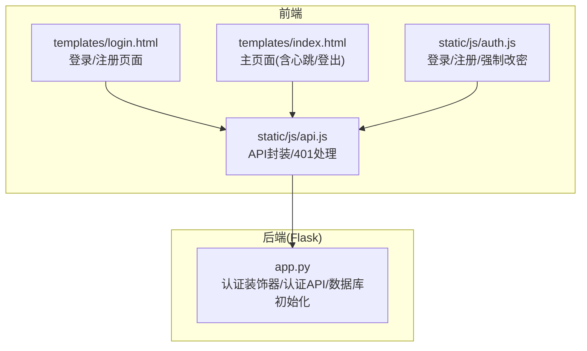
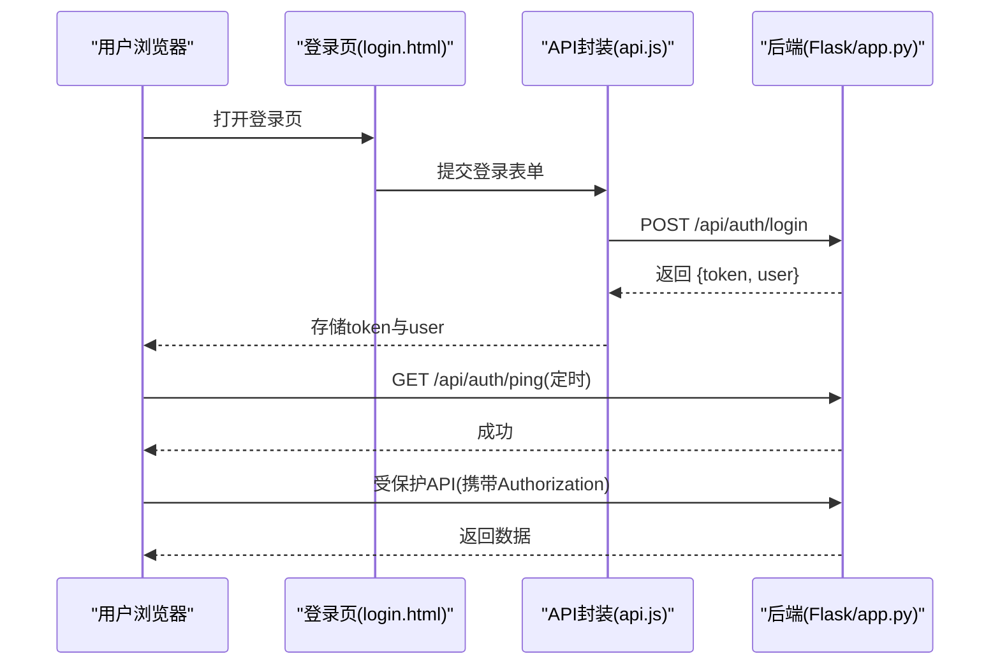
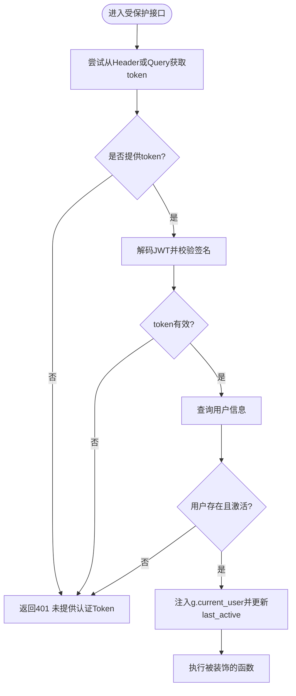
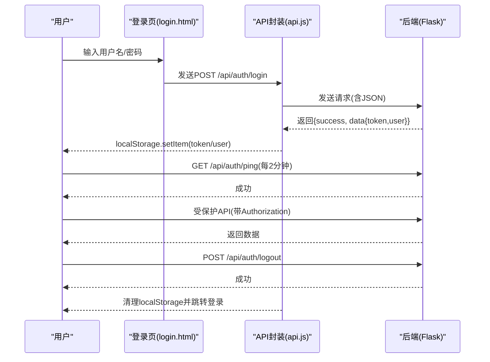
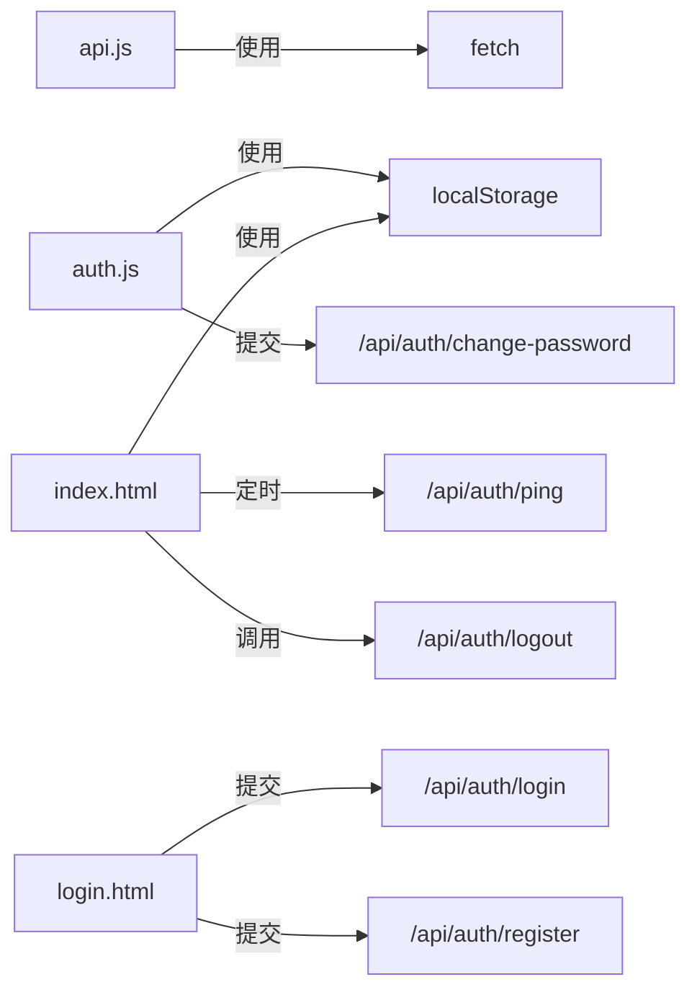

# 认证模块

<cite>
**本文引用的文件**
- [app.py](file://app.py)
- [auth.js](file://static/js/auth.js)
- [api.js](file://static/js/api.js)
- [login.html](file://templates/login.html)
- [index.html](file://templates/index.html)
</cite>

## 目录
1. [简介](#简介)
2. [项目结构](#项目结构)
3. [核心组件](#核心组件)
4. [架构总览](#架构总览)
5. [详细组件分析](#详细组件分析)
6. [依赖分析](#依赖分析)
7. [性能考量](#性能考量)
8. [故障排查指南](#故障排查指南)
9. [结论](#结论)

## 简介
本文件面向“封样件及色板接收登记管理系统”的认证模块，系统采用Flask后端与前端JavaScript交互，基于JWT进行用户认证与授权，提供登录、注册、密码修改、心跳保活、退出登录等能力，并通过装饰器实现统一的权限控制。本文将从架构、组件、数据流、错误处理、前端集成与排障等方面进行全面说明，帮助开发者与运维人员快速理解与维护认证体系。

## 项目结构
认证相关的核心位置如下：
- 后端：Flask应用与认证装饰器、认证API端点
- 前端：登录/注册页面、API封装与认证逻辑、心跳与登出

图表来源
- [app.py](file://app.py)
- [login.html](file://templates/login.html)
- [index.html](file://templates/index.html)
- [api.js](file://static/js/api.js)
- [auth.js](file://static/js/auth.js)

章节来源
- [app.py](file://app.py)
- [login.html](file://templates/login.html)
- [index.html](file://templates/index.html)
- [api.js](file://static/js/api.js)
- [auth.js](file://static/js/auth.js)

## 核心组件
- 认证装饰器
  - token_required：校验JWT，注入当前用户，更新在线状态
  - admin_required：校验管理员权限
- 认证API
  - 登录、注册、密码修改、心跳、退出登录
- 前端认证模块
  - 登录/注册UI与表单校验
  - API封装与401自动跳转
  - 强制改密弹窗
  - 心跳保活与登出

章节来源
- [app.py](file://app.py)
- [api.js](file://static/js/api.js)
- [auth.js](file://static/js/auth.js)
- [login.html](file://templates/login.html)
- [index.html](file://templates/index.html)

## 架构总览
认证整体流程：
- 用户在登录页输入凭据，前端通过API封装发送登录请求
- 后端验证用户名/密码，签发JWT并返回token与用户信息
- 前端将token存入localStorage，并跳转到主页面
- 主页面定时向后端发起心跳以维持在线状态
- 所有受保护接口均需携带token，后端通过装饰器校验并注入用户上下文
- 管理员接口额外要求admin_required装饰器

图表来源
- [login.html](file://templates/login.html)
- [api.js](file://static/js/api.js)
- [app.py](file://app.py)

## 详细组件分析

### 后端认证装饰器
- token_required
  - 支持Header与Query两种方式传递token
  - 解析JWT，获取user_id并查询用户信息
  - 校验用户是否存在、是否激活；若通过则注入g.current_user并更新last_active
  - Token过期或无效时返回401
- admin_required
  - 在token_required基础上进一步校验is_admin字段
  - 非管理员直接返回403

图表来源
- [app.py](file://app.py)

章节来源
- [app.py](file://app.py)

### 认证API定义
- 登录
  - 方法与路径：POST /api/auth/login
  - 请求体字段：username, password
  - 成功响应：token, user基础信息
  - 错误：用户名或密码错误(401)，账户被停用(403)
- 注册
  - 方法与路径：POST /api/auth/register
  - 请求体字段：username, real_name, password, confirmPassword, invitationCode
  - 校验：密码一致性、长度、邀请码有效性与可用次数
  - 成功响应：注册成功提示
- 密码修改
  - 方法与路径：PUT /api/auth/change-password
  - 请求体字段：oldPassword, newPassword, confirmPassword
  - 校验：原密码正确、新密码一致性与长度
  - 成功响应：提示重新登录
- 心跳
  - 方法与路径：GET/POST /api/auth/ping
  - 作用：更新用户last_active
- 退出登录
  - 方法与路径：POST /api/auth/logout
  - 作用：清空用户last_active

章节来源
- [app.py](file://app.py)

### 前端认证模块
- 登录/注册页面(login.html)
  - 包含登录与注册两个表单，支持密码显示/隐藏
  - 表单提交通过API封装发送请求
- API封装(api.js)
  - 默认在请求头添加Authorization: Bearer token
  - 401时自动清理localStorage并跳转登录，含账户停用特殊处理
  - 支持上传场景的Authorization透传
- 强制改密(auth.js)
  - 登录成功后若must_change_password为真，弹出强制改密对话框
  - 校验新密码强度与一致性，提交后提示并跳转首页
- 主页面(index.html)
  - 登录态检查：若无token或用户信息则跳转登录
  - 侧边栏显示用户信息与角色，管理员菜单可见
  - 定时心跳：每2分钟调用/ping保持在线
  - 退出登录：调用/logout并清理本地存储

图表来源
- [login.html](file://templates/login.html)
- [api.js](file://static/js/api.js)
- [auth.js](file://static/js/auth.js)
- [index.html](file://templates/index.html)
- [app.py](file://app.py)

章节来源
- [login.html](file://templates/login.html)
- [api.js](file://static/js/api.js)
- [auth.js](file://static/js/auth.js)
- [index.html](file://templates/index.html)
- [app.py](file://app.py)

### 权限体系
- 普通用户
  - 可访问登录、注册、密码修改、心跳、退出登录等基础认证接口
  - 可访问业务数据接口（受token_required保护）
- 管理员
  - 在普通用户权限基础上，可访问管理后台相关接口（受admin_required保护）
  - 管理员接口示例：用户管理、邀请码管理、系统设置、处置记录软/硬删除等

章节来源
- [app.py](file://app.py)

## 依赖分析
- 后端依赖
  - Flask：Web框架与路由
  - jwt：JWT生成与解析
  - sqlite3：本地数据库
  - openpyxl：Excel导入导出（与认证无直接关系，但影响API调用链）
- 前端依赖
  - fetch：HTTP请求
  - localStorage：token与用户信息持久化
  - 模块化脚本：api.js、auth.js、index.html中的内联脚本

图表来源
- [api.js](file://static/js/api.js)
- [auth.js](file://static/js/auth.js)
- [index.html](file://templates/index.html)
- [login.html](file://templates/login.html)
- [app.py](file://app.py)

章节来源
- [api.js](file://static/js/api.js)
- [auth.js](file://static/js/auth.js)
- [index.html](file://templates/index.html)
- [login.html](file://templates/login.html)
- [app.py](file://app.py)

## 性能考量
- Token有效期：后端配置JWT过期时间为24小时，建议结合前端心跳策略减少频繁登录
- 在线状态：后端在鉴权时更新last_active，前端每2分钟一次心跳，有助于统计在线用户
- 请求头携带：API封装统一注入Authorization，避免重复拼装
- 错误处理：401时前端自动清理本地存储并跳转登录，降低异常状态下的资源消耗

[本节为通用建议，无需特定文件来源]

## 故障排查指南
- 登录失败
  - 检查用户名/密码是否正确
  - 确认账户是否被停用
  - 查看后端返回的错误消息
- Token无效/过期
  - 前端会在401时自动跳转登录，检查网络与跨域设置
  - 若出现“Token无效”，确认SECRET_KEY一致且未被篡改
- 心跳失败
  - 确认前端定时任务是否运行
  - 检查/ping接口是否可达
- 退出登录后仍可访问
  - 确认前端是否调用了/logout并清理了localStorage
  - 检查后端是否正确更新last_active
- 管理员接口403
  - 确认当前用户是否为管理员
  - 检查admin_required装饰器是否正确应用

章节来源
- [app.py](file://app.py)
- [api.js](file://static/js/api.js)
- [index.html](file://templates/index.html)

## 结论
本认证模块以JWT为核心，配合装饰器实现统一的权限控制与会话管理，前后端协同完成登录、注册、密码修改、心跳保活与退出登录等关键流程。通过API封装与前端定时心跳，系统具备良好的用户体验与安全性。建议在生产环境中：
- 严格管理SECRET_KEY与HTTPS传输
- 结合业务需求调整JWT过期时间与心跳频率
- 对敏感接口增加更细粒度的权限校验