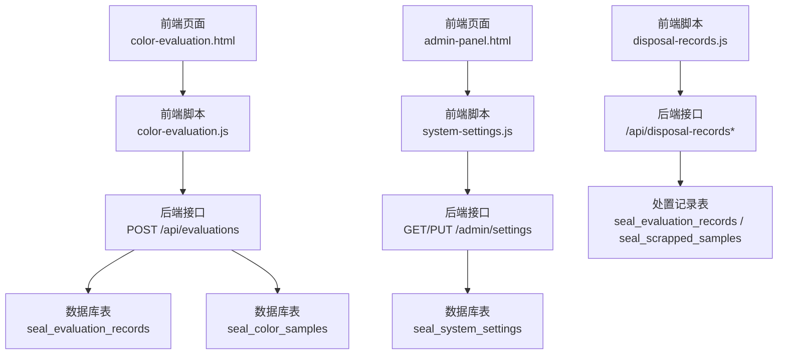
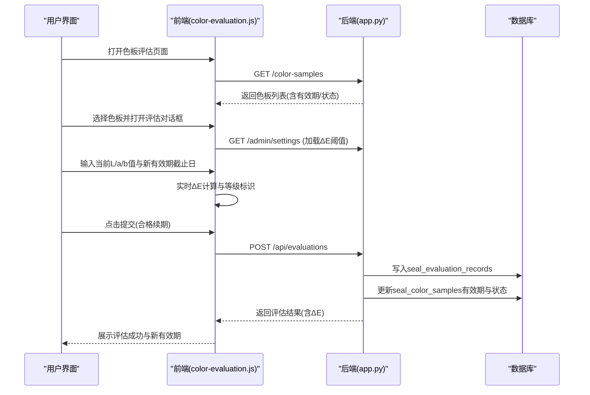
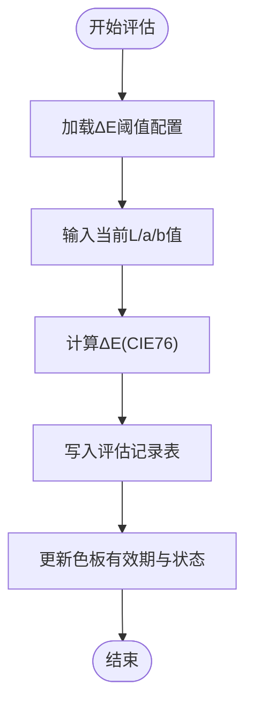
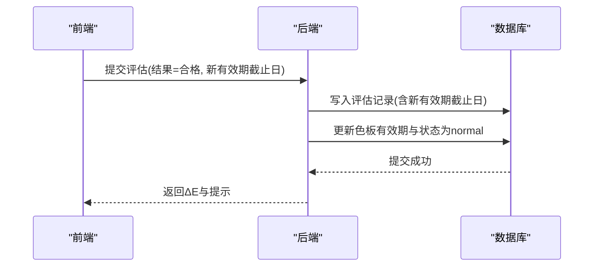
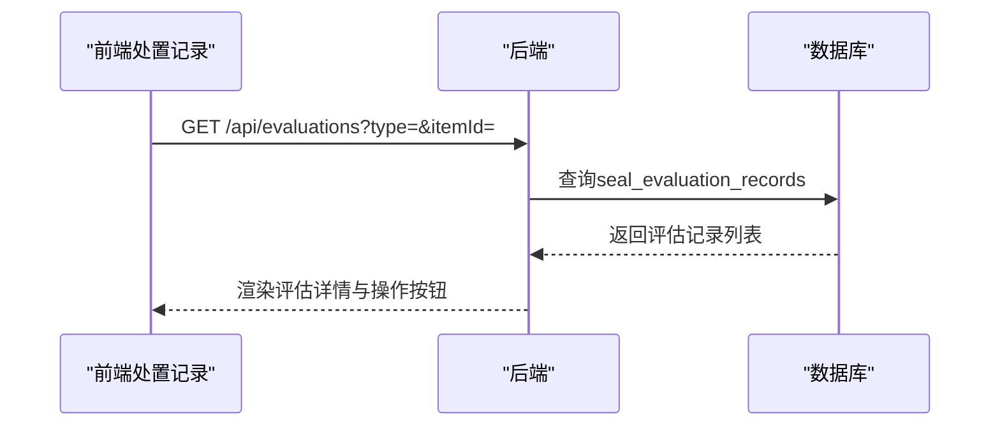
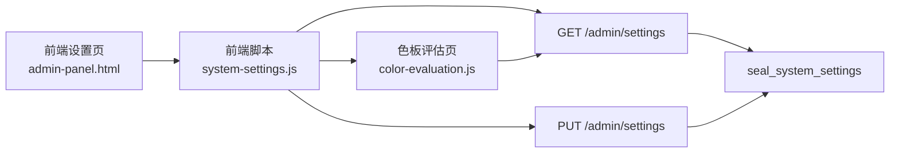
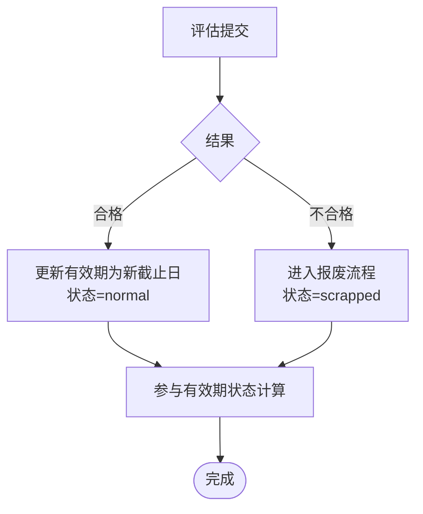
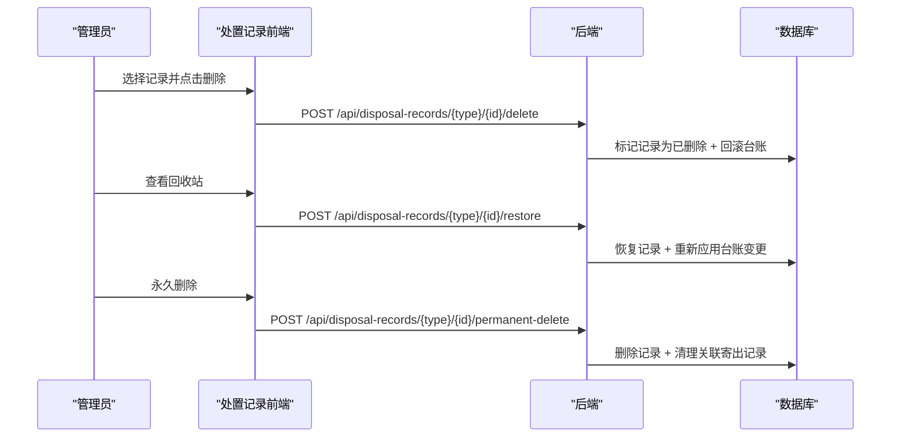
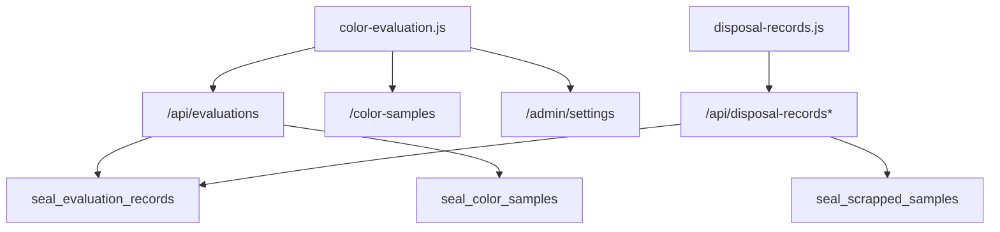

# 评定管理模块

<cite>
**本文档引用的文件**
- [app.py](file://app.py)
- [color-evaluation.js](file://static/js/color-evaluation.js)
- [color-evaluation.html](file://templates/color-evaluation.html)
- [system-settings.js](file://static/js/system-settings.js)
- [disposal-records.js](file://static/js/disposal-records.js)
- [admin-panel.html](file://templates/admin-panel.html)
</cite>

## 目录
1. [简介](#简介)
2. [项目结构](#项目结构)
3. [核心组件](#核心组件)
4. [架构总览](#架构总览)
5. [详细组件分析](#详细组件分析)
6. [依赖分析](#依赖分析)
7. [性能考虑](#性能考虑)
8. [故障排除指南](#故障排除指南)
9. [结论](#结论)
10. [附录](#附录)

## 简介
本模块围绕“定期色差评估”展开，覆盖从评估记录创建、色差重新计算、有效期延长、评估结果记录，到与色板状态联动、API接口设计、以及质量控制要点的完整流程。系统采用CIE76标准计算ΔE值，支持阈值配置与分级标识，并提供处置记录的软删除、恢复与永久删除能力，确保评估与报废流程可追溯、可回滚。

## 项目结构
后端以Flask为核心，SQLite为存储；前端通过静态JS模块驱动页面交互，调用后端API完成评估、报废、系统设置与处置记录管理。

**图表来源**
- [color-evaluation.html:1-28](file://templates/color-evaluation.html#L1-L28)
- [color-evaluation.js:1-289](file://static/js/color-evaluation.js#L1-L289)
- [system-settings.js:1-64](file://static/js/system-settings.js#L1-L64)
- [disposal-records.js:1-275](file://static/js/disposal-records.js#L1-L275)
- [app.py:237-255](file://app.py#L237-L255)
- [app.py:273-284](file://app.py#L273-L284)
- [app.py:1226-1287](file://app.py#L1226-L1287)
- [app.py:1943-2037](file://app.py#L1943-L2037)

**章节来源**
- [app.py:237-255](file://app.py#L237-L255)
- [app.py:273-284](file://app.py#L273-L284)
- [app.py:1226-1287](file://app.py#L1226-L1287)
- [app.py:1943-2037](file://app.py#L1943-L2037)
- [color-evaluation.html:1-28](file://templates/color-evaluation.html#L1-L28)
- [color-evaluation.js:1-289](file://static/js/color-evaluation.js#L1-L289)
- [system-settings.js:1-64](file://static/js/system-settings.js#L1-L64)
- [disposal-records.js:1-275](file://static/js/disposal-records.js#L1-L275)

## 核心组件
- 评估记录表（seal_evaluation_records）：存储每次评估的结果、当前Lab值、计算ΔE值、新有效期截止日、评定人、评定日期等。
- 色板表（seal_color_samples）：存储色板的基准Lab值、有效期、状态等，评估通过后更新有效期与状态。
- 系统设置表（seal_system_settings）：存储ΔE阈值配置，前端动态加载并影响ΔE等级标识。
- 处置记录（软删除）：评估记录与报废记录均可软删除，支持管理员恢复或永久删除，并回滚台账影响。

**章节来源**
- [app.py:237-255](file://app.py#L237-L255)
- [app.py:152-187](file://app.py#L152-L187)
- [app.py:273-284](file://app.py#L273-L284)
- [app.py:1943-2037](file://app.py#L1943-L2037)

## 架构总览
评估流程的关键交互如下：

**图表来源**
- [color-evaluation.js:90-188](file://static/js/color-evaluation.js#L90-L188)
- [color-evaluation.js:237-267](file://static/js/color-evaluation.js#L237-L267)
- [app.py:1226-1287](file://app.py#L1226-L1287)
- [app.py:343-348](file://app.py#L343-L348)

## 详细组件分析

### 1) 评估记录创建与ΔE计算
- 前端在对话框中输入当前L/a/b值，实时计算ΔE并按阈值分级展示。
- 后端接收评估请求，若为色板且结果为“合格”，自动计算ΔE并写入评估记录。
- 评估记录包含：对象类型、对象ID、评定结果、评定人、评定日期、当前L/a/b值、计算ΔE值、新有效期截止日、评定说明等。

**图表来源**
- [color-evaluation.js:205-235](file://static/js/color-evaluation.js#L205-L235)
- [app.py:1226-1287](file://app.py#L1226-L1287)
- [app.py:343-348](file://app.py#L343-L348)

**章节来源**
- [color-evaluation.js:205-235](file://static/js/color-evaluation.js#L205-L235)
- [app.py:1226-1287](file://app.py#L1226-L1287)
- [app.py:343-348](file://app.py#L343-L348)

### 2) 有效期延长机制
- 评估通过后，前端要求选择“新有效期截止日”，后端将其写入评估记录并更新色板有效期。
- 状态流转：评估通过后将色板状态置为“正常”，并以新有效期参与状态计算。

**图表来源**
- [color-evaluation.js:249-256](file://static/js/color-evaluation.js#L249-L256)
- [app.py:1273-1281](file://app.py#L1273-L1281)

**章节来源**
- [color-evaluation.js:249-256](file://static/js/color-evaluation.js#L249-L256)
- [app.py:1273-1281](file://app.py#L1273-L1281)

### 3) 评估结果记录与查询
- 后端提供评估记录查询接口，支持按对象类型与对象ID过滤。
- 前端处置记录页面统一展示评估与报废记录，支持查看详情、软删除、恢复、永久删除。

**图表来源**
- [app.py:1212-1224](file://app.py#L1212-L1224)
- [disposal-records.js:134-151](file://static/js/disposal-records.js#L134-L151)

**章节来源**
- [app.py:1212-1224](file://app.py#L1212-L1224)
- [disposal-records.js:134-151](file://static/js/disposal-records.js#L134-L151)

### 4) ΔE阈值配置与等级判定
- 系统设置表存储ΔE阈值（优秀、合格、需关注），前端加载后用于实时计算与展示。
- 前端与后端均提供阈值读取与更新接口，保证评估界面与系统设置一致。

**图表来源**
- [admin-panel.html:51-102](file://templates/admin-panel.html#L51-L102)
- [system-settings.js:6-64](file://static/js/system-settings.js#L6-L64)
- [app.py:295-307](file://app.py#L295-L307)
- [color-evaluation.js:8-18](file://static/js/color-evaluation.js#L8-L18)

**章节来源**
- [admin-panel.html:51-102](file://templates/admin-panel.html#L51-L102)
- [system-settings.js:6-64](file://static/js/system-settings.js#L6-L64)
- [app.py:295-307](file://app.py#L295-L307)
- [color-evaluation.js:8-18](file://static/js/color-evaluation.js#L8-L18)

### 5) 评估与色板状态关联
- 评估通过：更新有效期与状态为“正常”，参与有效期状态计算。
- 评估未通过：由报废流程处理，色板状态置为“已报废”。

**图表来源**
- [app.py:1273-1281](file://app.py#L1273-L1281)
- [app.py:1291-1327](file://app.py#L1291-L1327)

**章节来源**
- [app.py:1273-1281](file://app.py#L1273-L1281)
- [app.py:1291-1327](file://app.py#L1291-L1327)

### 6) 处置记录管理（软删除/恢复/永久删除）
- 评估记录与报废记录均可软删除，管理员可恢复或永久删除，并自动回滚台账影响（恢复旧有效期/旧状态）。

**图表来源**
- [disposal-records.js:224-266](file://static/js/disposal-records.js#L224-L266)
- [app.py:1943-2037](file://app.py#L1943-L2037)

**章节来源**
- [disposal-records.js:224-266](file://static/js/disposal-records.js#L224-L266)
- [app.py:1943-2037](file://app.py#L1943-L2037)

## 依赖分析
- 前端模块依赖后端API：
  - 色板评估：GET /color-samples、GET /admin/settings、POST /api/evaluations
  - 处置记录：GET /api/disposal-records*、POST /api/disposal-records*/delete、restore、permanent-delete
- 后端模块耦合：
  - 评估接口依赖色板表与评估记录表，同时维护有效期与状态一致性。
  - 处置记录接口依赖软删除与回滚逻辑，避免直接破坏业务数据。

**图表来源**
- [color-evaluation.js:20-28](file://static/js/color-evaluation.js#L20-L28)
- [color-evaluation.js:237-267](file://static/js/color-evaluation.js#L237-L267)
- [disposal-records.js:9-26](file://static/js/disposal-records.js#L9-L26)
- [app.py:1212-1287](file://app.py#L1212-L1287)
- [app.py:1943-2037](file://app.py#L1943-L2037)

**章节来源**
- [color-evaluation.js:20-28](file://static/js/color-evaluation.js#L20-L28)
- [color-evaluation.js:237-267](file://static/js/color-evaluation.js#L237-L267)
- [disposal-records.js:9-26](file://static/js/disposal-records.js#L9-L26)
- [app.py:1212-1287](file://app.py#L1212-L1287)
- [app.py:1943-2037](file://app.py#L1943-L2037)

## 性能考虑
- 前端评估页面一次性加载全量色板，便于筛选“待评定/已过期/已报废”，避免频繁分页请求。
- ΔE计算在前端实时进行，减少后端压力；阈值配置本地缓存，降低重复请求。
- 评估与报废接口均为轻量写操作，主要瓶颈在数据库事务与索引设计（建议对评估记录的item_type/item_id建立索引以提升查询性能）。

## 故障排除指南
- 评估提交失败
  - 检查参数完整性（对象类型、对象ID、结果）。
  - 确认对象状态非“已报废”，否则无法评估。
  - 若为色板评估，检查当前L/a/b值与新有效期截止日是否填写。
- ΔE阈值不生效
  - 确认系统设置已保存且前端已重新加载阈值。
  - 检查系统设置表中阈值顺序（优秀<合格<需关注）。
- 处置记录无法恢复/永久删除
  - 确认当前用户具备管理员权限。
  - 检查记录是否已被软删除（恢复仅针对已删除记录）。

**章节来源**
- [app.py:1234-1246](file://app.py#L1234-L1246)
- [system-settings.js:52-59](file://static/js/system-settings.js#L52-L59)
- [disposal-records.js:224-266](file://static/js/disposal-records.js#L224-L266)

## 结论
本模块通过清晰的评估流程、可靠的ΔE计算与阈值配置、以及完善的处置记录管理，实现了色板有效期与质量控制的闭环。前端交互直观，后端接口职责明确，配合软删除与回滚机制，满足审计与合规需求。

## 附录

### A. 评估记录数据结构（字段说明）
- 对象类型：seal 或 color
- 对象ID：关联封样件或色板的唯一标识
- 评定结果：pass（合格续期）或 fail（不合格）
- 评定人：当前登录用户的姓名
- 评定日期：评估提交日期
- 当前L/a/b值：实测Lab值
- 计算ΔE值：CIE76标准计算结果
- 新有效期截止日：评估通过后设定的有效期截止日期
- 旧有效期：用于软删除回滚（兼容字段）
- 评定说明：评估时的备注信息
- 创建时间：评估记录创建时间

**章节来源**
- [app.py:237-255](file://app.py#L237-L255)

### B. API接口清单
- GET /color-samples：获取色板列表（含有效期与状态）
- GET /admin/settings：获取系统设置（含ΔE阈值）
- PUT /admin/settings：更新系统设置
- POST /api/evaluations：提交评估（合格续期或不合格）
- GET /api/evaluations：查询评估记录（支持按类型与ID过滤）
- POST /api/scrap：提交报废申请（不合格时触发）
- POST /api/disposal-records/*：处置记录软删除/恢复/永久删除
- GET /api/disposal-records*：处置记录列表与回收站

**章节来源**
- [app.py:799-870](file://app.py#L799-L870)
- [app.py:1212-1287](file://app.py#L1212-L1287)
- [app.py:1291-1327](file://app.py#L1291-L1327)
- [app.py:1943-2037](file://app.py#L1943-L2037)

### C. 操作指南与质量控制要点
- 操作指南
  - 打开色板评估页面，选择“待评定/已过期/已报废”标签查看对应色板。
  - 输入当前L/a/b值，系统实时计算ΔE并展示等级。
  - 合格续期：选择新有效期截止日并提交；不合格：填写报废原因与类型并提交。
  - 管理员可通过处置记录页面管理评估/报废记录，支持软删除、恢复与永久删除。
- 质量控制要点
  - ΔE阈值应结合实际业务设定，避免过度宽松或严格导致误判。
  - 评估记录需保留完整的Lab测量数据与说明，便于追溯。
  - 有效期延长应遵循最小化原则，避免长期有效期掩盖质量问题。
  - 定期核对处置记录与台账一致性，确保回滚逻辑正确执行。