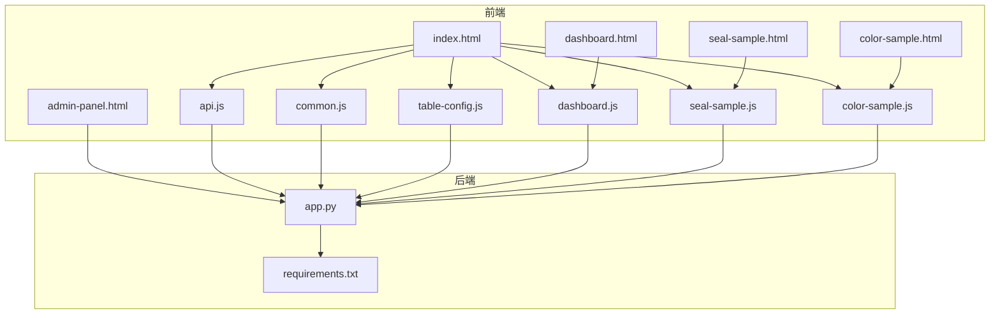
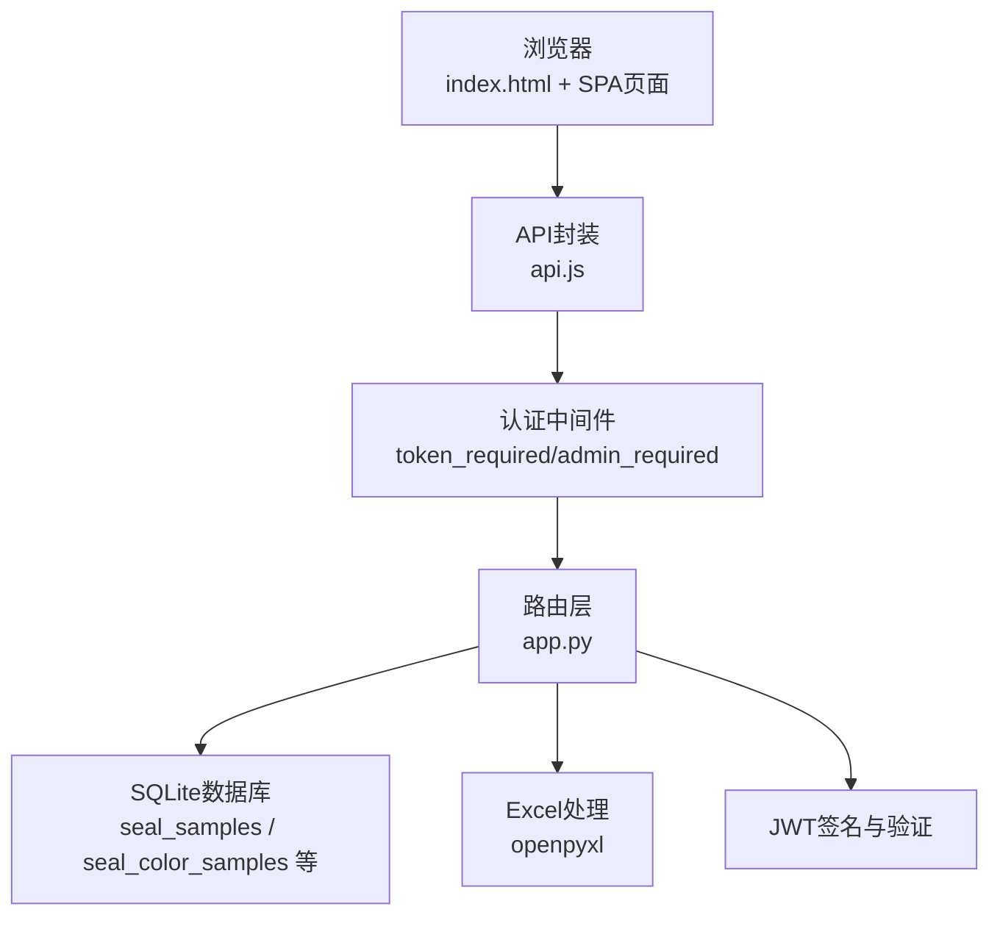
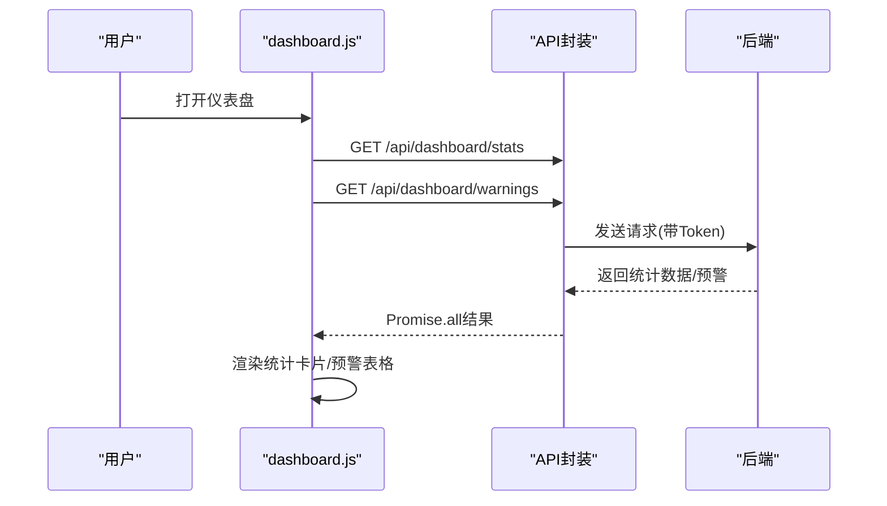
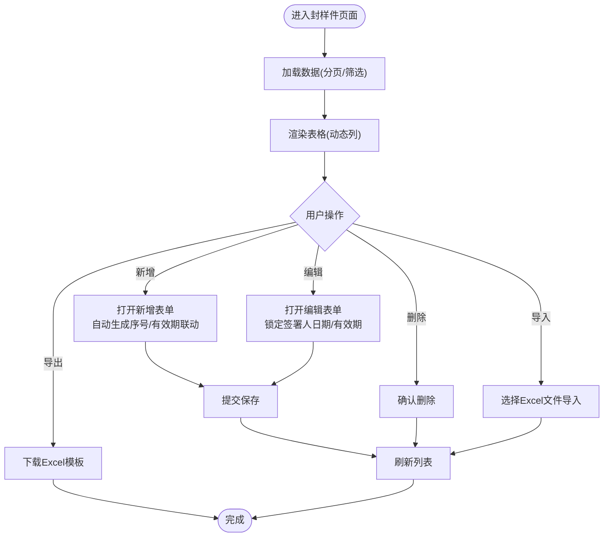
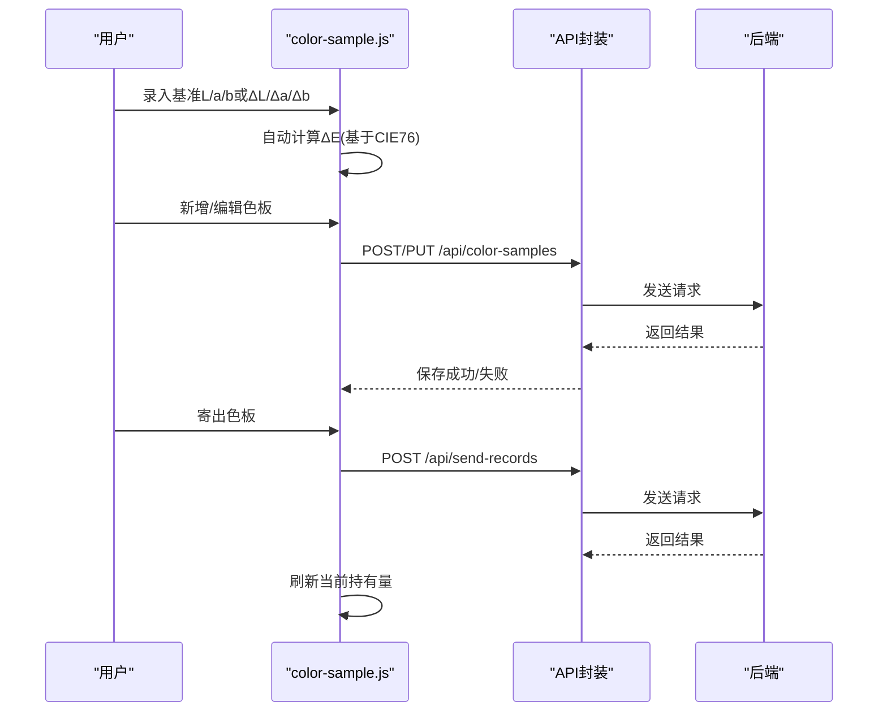
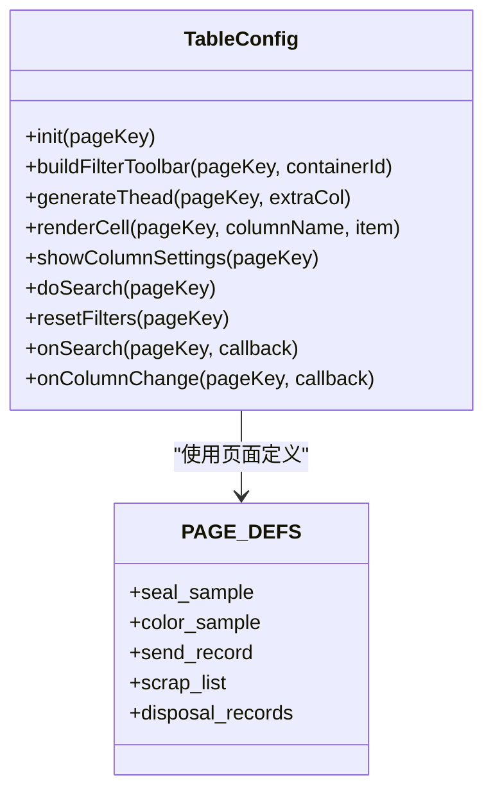
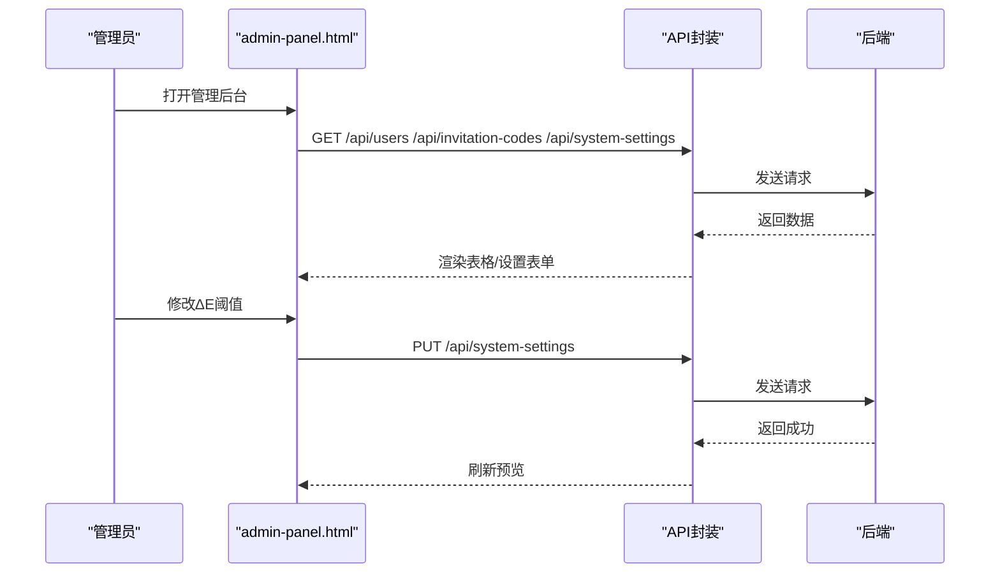
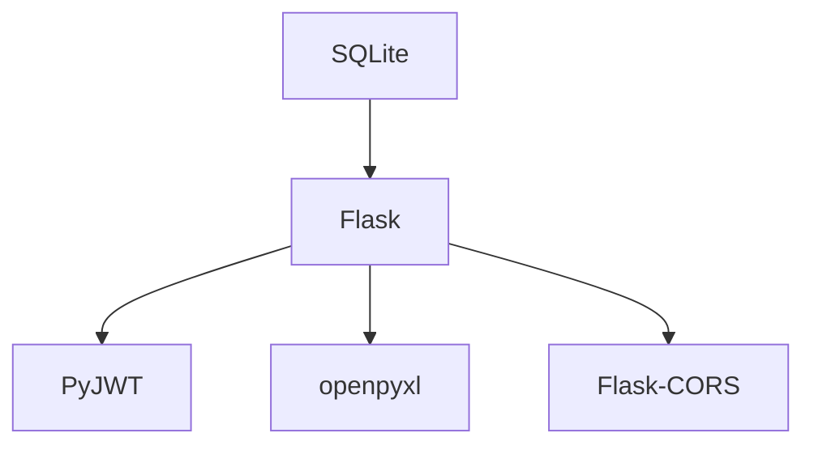

# 系统介绍

<cite>
**本文档引用的文件**
- [app.py](file://app.py)
- [requirements.txt](file://requirements.txt)
- [index.html](file://templates/index.html)
- [dashboard.html](file://templates/dashboard.html)
- [seal-sample.html](file://templates/seal-sample.html)
- [color-sample.html](file://templates/color-sample.html)
- [admin-panel.html](file://templates/admin-panel.html)
- [api.js](file://static/js/api.js)
- [common.js](file://static/js/common.js)
- [table-config.js](file://static/js/table-config.js)
- [dashboard.js](file://static/js/dashboard.js)
- [seal-sample.js](file://static/js/seal-sample.js)
- [color-sample.js](file://static/js/color-sample.js)
</cite>

## 目录
1. [引言](#引言)
2. [项目结构](#项目结构)
3. [核心组件](#核心组件)
4. [架构总览](#架构总览)
5. [详细组件分析](#详细组件分析)
6. [依赖分析](#依赖分析)
7. [性能考虑](#性能考虑)
8. [故障排查指南](#故障排查指南)
9. [结论](#结论)

## 引言
本系统是面向汽车/制造行业场景的“封样件及色板接收登记管理系统”。其核心价值在于通过数字化手段替代传统手工管理，解决封样件与色板在接收、存储、有效期管理、状态流转、评定与处置等环节中存在的效率低、易出错、难追溯等问题。系统提供从仪表盘概览、台账管理、寄出登记、评定流程到报废处置的全生命周期管理能力，并内置基于CIE76标准的ΔE色差计算、智能状态管理、Excel无缝导入导出、个性化列配置与筛选等创新特性，显著提升质量管理部门、颜色工程师、生产管理人员的工作效率与管理水平。

## 项目结构
系统采用前后端分离的轻量架构：后端使用Flask提供REST API，SQLite作为本地存储；前端采用纯HTML/CSS/JavaScript实现单页应用（SPA），通过AJAX与后端交互，支持多页面动态加载与统一路由。

**图表来源**
- [index.html](file://templates/index.html)
- [dashboard.html](file://templates/dashboard.html)
- [seal-sample.html](file://templates/seal-sample.html)
- [color-sample.html](file://templates/color-sample.html)
- [admin-panel.html](file://templates/admin-panel.html)
- [api.js](file://static/js/api.js)
- [common.js](file://static/js/common.js)
- [table-config.js](file://static/js/table-config.js)
- [dashboard.js](file://static/js/dashboard.js)
- [seal-sample.js](file://static/js/seal-sample.js)
- [color-sample.js](file://static/js/color-sample.js)
- [app.py](file://app.py)
- [requirements.txt](file://requirements.txt)

**章节来源**
- [index.html:1-239](file://templates/index.html#L1-L239)
- [app.py:1-800](file://app.py#L1-L800)
- [requirements.txt:1-5](file://requirements.txt#L1-L5)

## 核心组件
- 认证与权限控制：基于JWT的Token认证，支持Header与Query两种传递方式；提供管理员权限校验与账户状态检查。
- 数据模型与初始化：内置10张核心业务表，涵盖用户、封样件、色板、寄出、有效期管理、评定记录、报废记录、系统设置、用户表格配置等；启动时自动初始化admin用户与ΔE阈值设置。
- 通用表格配置：统一的动态筛选、列配置、渲染器与分页逻辑，支持多页面复用。
- 仪表盘：聚合统计卡片、近期到期预警与最近操作时间轴。
- 封样件管理：新增/编辑/删除、有效期状态智能计算、Excel导入导出。
- 色板管理：Lab基准值录入、ΔE自动计算、寄出登记、展开行查看详细参数。
- 管理后台：用户管理、邀请码管理、系统设置（ΔE阈值）。

**章节来源**
- [app.py:48-84](file://app.py#L48-L84)
- [app.py:88-335](file://app.py#L88-L335)
- [table-config.js:14-154](file://static/js/table-config.js#L14-L154)
- [dashboard.js:5-117](file://static/js/dashboard.js#L5-L117)
- [seal-sample.js:8-181](file://static/js/seal-sample.js#L8-L181)
- [color-sample.js:8-267](file://static/js/color-sample.js#L8-L267)
- [admin-panel.html:1-107](file://templates/admin-panel.html#L1-L107)

## 架构总览
系统采用“前端SPA + Flask后端API + SQLite本地存储”的轻量化架构。前端通过API模块统一发起HTTP请求，后端提供REST接口完成业务逻辑与数据持久化，支持跨域访问与Token鉴权。

**图表来源**
- [api.js:7-88](file://static/js/api.js#L7-L88)
- [app.py:48-84](file://app.py#L48-L84)
- [app.py:21-25](file://app.py#L21-L25)
- [requirements.txt:1-5](file://requirements.txt#L1-L5)

## 详细组件分析

### 仪表盘组件
- 功能要点：并发拉取统计数据与预警列表，渲染统计卡片与时间轴；支持“去评定”快捷跳转。
- 性能优化：Promise.all并发请求，动画数字滚动展示。

**图表来源**
- [dashboard.js:5-13](file://static/js/dashboard.js#L5-L13)
- [api.js:7-42](file://static/js/api.js#L7-L42)
- [app.py:2083-2115](file://app.py#L2083-L2115)

**章节来源**
- [dashboard.html:1-34](file://templates/dashboard.html#L1-L34)
- [dashboard.js:1-117](file://static/js/dashboard.js#L1-L117)

### 封样件台账组件
- 功能要点：动态筛选、列配置、分页、新增/编辑/删除、有效期状态智能计算、Excel导入导出。
- 创新点：自动生成序号、签署人日期变化联动有效期（+1年）、编辑时锁定关键字段、状态实时计算。

**图表来源**
- [seal-sample.js:8-61](file://static/js/seal-sample.js#L8-L61)
- [seal-sample.js:65-146](file://static/js/seal-sample.js#L65-L146)
- [seal-sample.js:164-181](file://static/js/seal-sample.js#L164-L181)
- [app.py:593-795](file://app.py#L593-L795)

**章节来源**
- [seal-sample.html:1-45](file://templates/seal-sample.html#L1-L45)
- [seal-sample.js:1-181](file://static/js/seal-sample.js#L1-L181)
- [app.py:593-795](file://app.py#L593-L795)

### 色板台账组件
- 功能要点：Lab基准值录入、ΔE自动计算、寄出登记、展开行查看详细参数、当前持有量自动计算。
- 创新点：ΔE阈值分级（优秀/合格/需关注）可视化展示、寄出数量校验、光源角度等扩展字段。

**图表来源**
- [color-sample.js:173-177](file://static/js/color-sample.js#L173-L177)
- [color-sample.js:207-245](file://static/js/color-sample.js#L207-L245)
- [app.py:797-1156](file://app.py#L797-L1156)

**章节来源**
- [color-sample.html:1-42](file://templates/color-sample.html#L1-L42)
- [color-sample.js:1-267](file://static/js/color-sample.js#L1-L267)
- [app.py:797-1156](file://app.py#L797-L1156)

### 通用表格配置模块
- 功能要点：统一的动态筛选面板、列设置弹窗、渲染器映射、分页与查询参数转换。
- 复用性：支持封样件、色板、寄出、报废、处置记录等多页面复用。

**图表来源**
- [table-config.js:11-552](file://static/js/table-config.js#L11-L552)

**章节来源**
- [table-config.js:1-552](file://static/js/table-config.js#L1-L552)

### 管理后台组件
- 功能要点：用户管理（搜索/禁用/删除）、邀请码管理（生成/编辑/停用）、系统设置（ΔE阈值配置与实时预览）。
- 安全性：管理员专用入口，支持强制修改密码与在线状态管理。

**图表来源**
- [admin-panel.html:1-107](file://templates/admin-panel.html#L1-L107)
- [api.js:7-88](file://static/js/api.js#L7-L88)
- [app.py:2116-2197](file://app.py#L2116-L2197)

**章节来源**
- [admin-panel.html:1-107](file://templates/admin-panel.html#L1-L107)
- [app.py:2116-2197](file://app.py#L2116-L2197)

## 依赖分析
- 技术栈：Python Flask、SQLite、JWT、openpyxl、Flask-CORS。
- 前端依赖：jQuery风格的原生JavaScript模块化（API封装、公共工具、表格配置、页面脚本）。

**图表来源**
- [requirements.txt:1-5](file://requirements.txt#L1-L5)

**章节来源**
- [requirements.txt:1-5](file://requirements.txt#L1-L5)
- [app.py:14-25](file://app.py#L14-L25)

## 性能考虑
- 并发优化：仪表盘统计与预警并行请求，减少等待时间。
- 分页与筛选：后端支持分页与动态筛选参数拼接，避免一次性传输大量数据。
- 前端缓存：表格列配置与筛选条件本地缓存，降低重复请求成本。
- Excel处理：服务端批量导入/导出，避免前端大文件解析压力。

[本节为通用指导，无需具体文件分析]

## 故障排查指南
- 登录失败/Token无效：检查Token是否过期或被停用账户；确认Header携带方式或Query参数传递。
- 401自动跳转：前端API封装检测到401会自动清理本地Token并跳转登录页。
- 导入失败：确认Excel列与模板一致，日期字段格式为YYYY-MM-DD，数值字段类型正确。
- ΔE显示异常：检查基准L/a/b或ΔL/Δa/Δb是否填写完整，系统会自动计算ΔE并按阈值分级显示。

**章节来源**
- [api.js:20-42](file://static/js/api.js#L20-L42)
- [app.py:454-589](file://app.py#L454-L589)
- [seal-sample.js:164-181](file://static/js/seal-sample.js#L164-L181)
- [color-sample.js:173-177](file://static/js/color-sample.js#L173-L177)

## 结论
本系统通过“数字化台账 + 智能状态管理 + Excel无缝集成 + ΔE标准计算”的组合拳，有效解决了传统手工管理在封样件与色板业务中的痛点，实现了从接收登记到有效期预警、从评定到处置的全流程闭环管理。对于质量管理部门、颜色工程师与生产管理人员而言，系统不仅提升了数据准确性与可追溯性，更显著降低了人工成本与管理风险，具备良好的推广与应用价值。