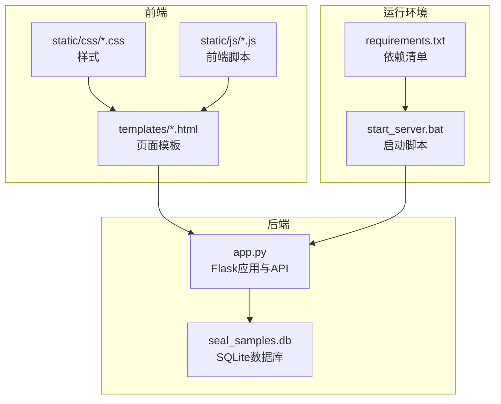
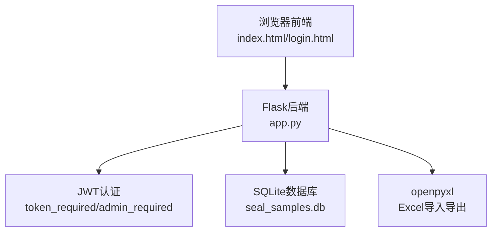
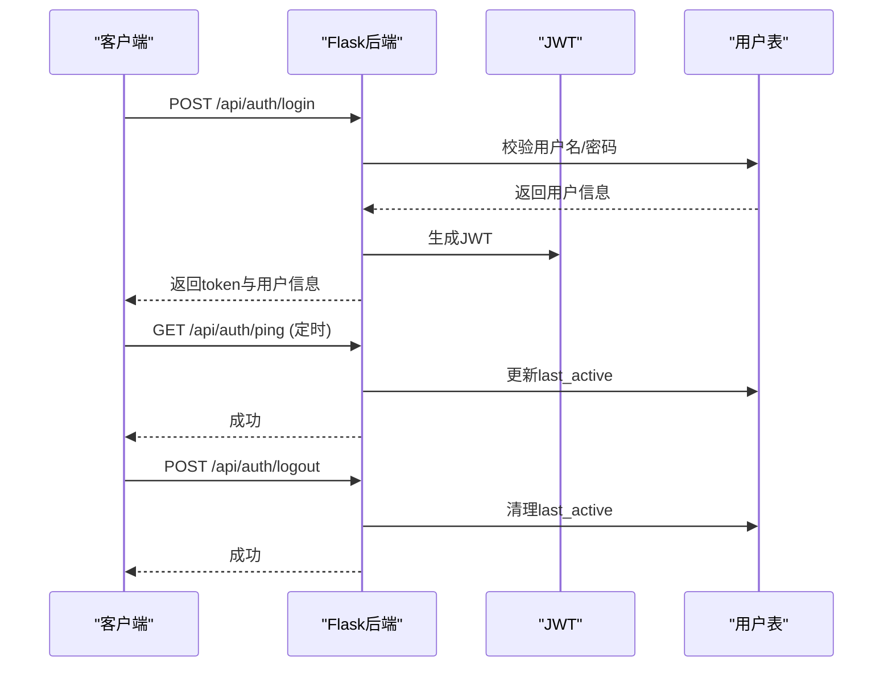
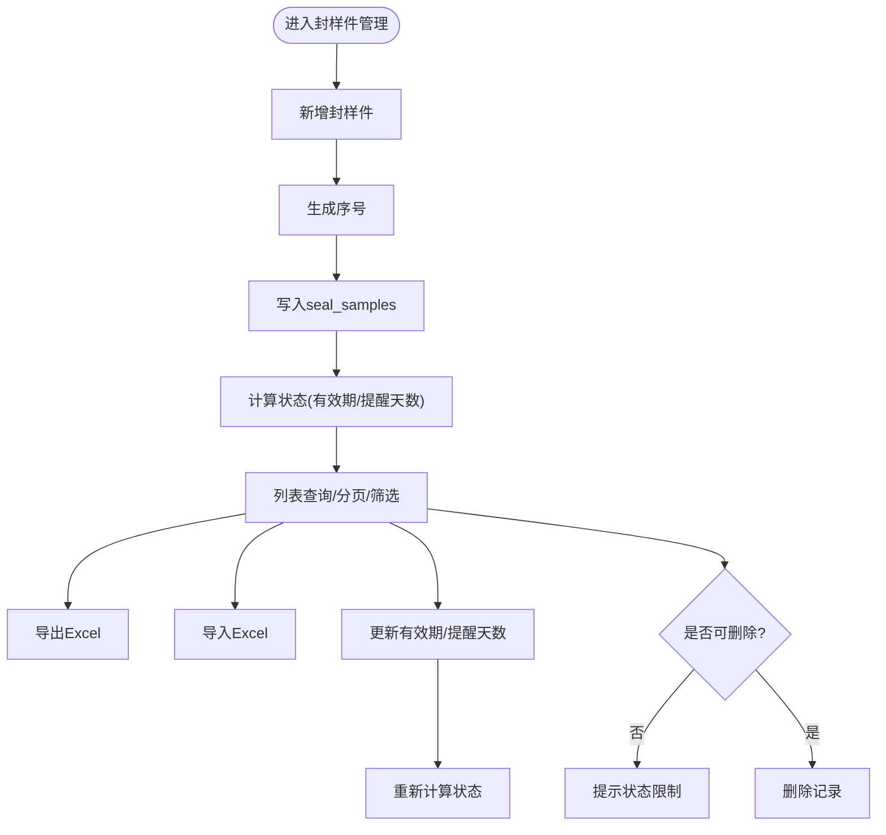
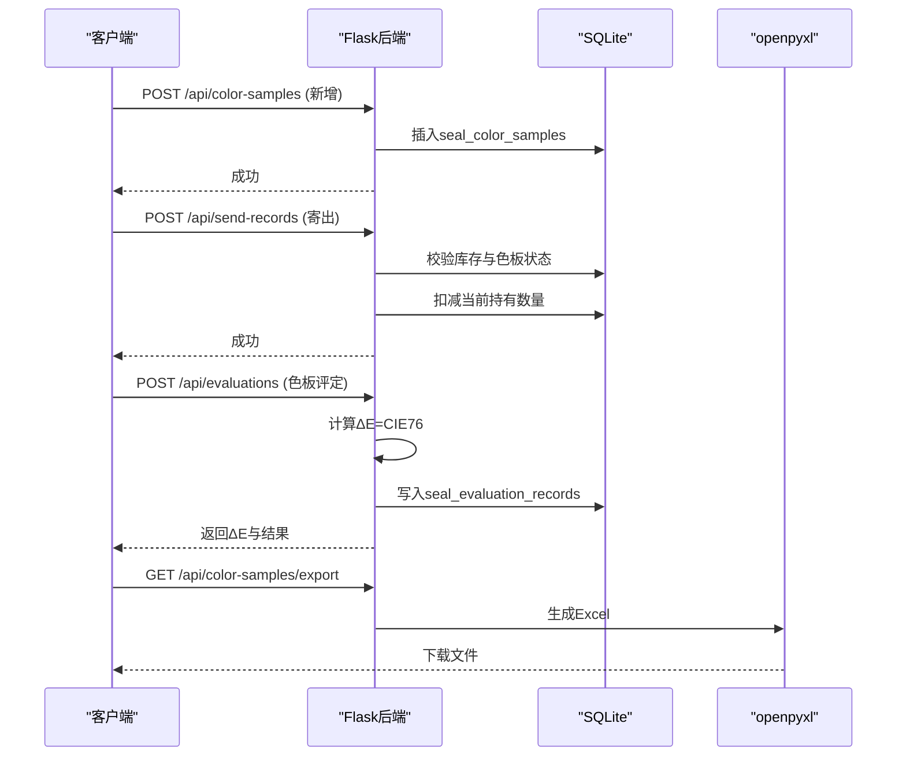
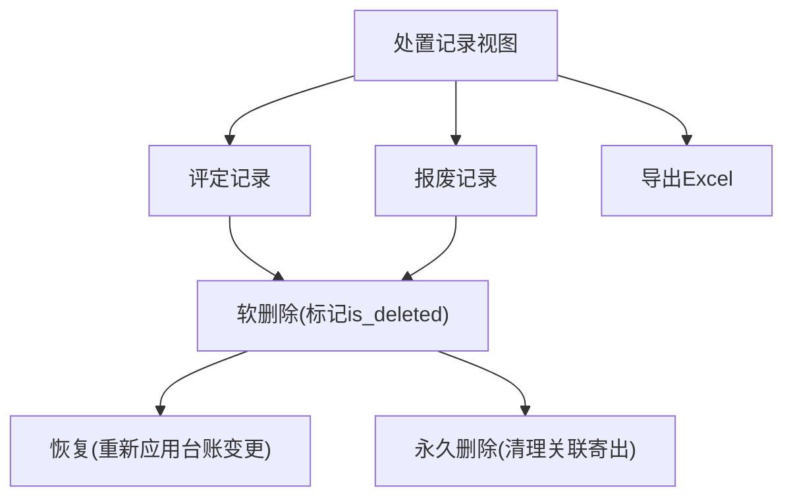
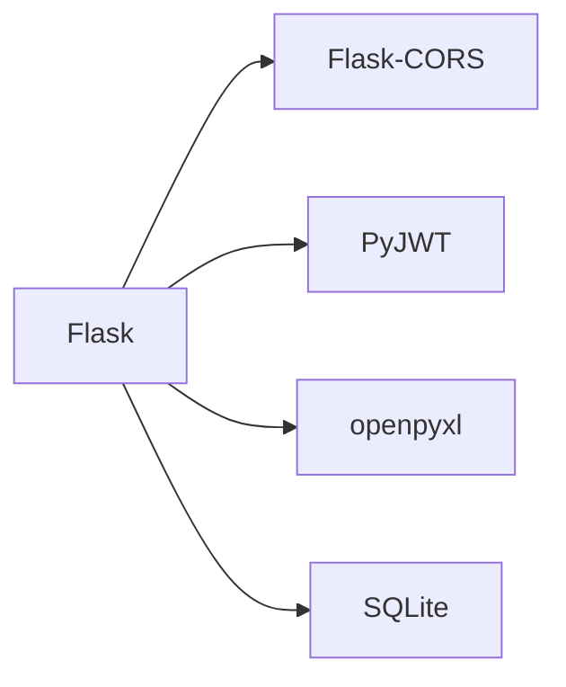

# Color-Sample-Management-System
主要由AI开发适用于个人的封样件、色板管理系统
# 项目概述

<cite>
**本文引用的文件**
- [app.py](file://app.py)
- [requirements.txt](file://requirements.txt)
- [start_server.bat](file://start_server.bat)
- [templates/index.html](file://templates/index.html)
- [templates/login.html](file://templates/login.html)
</cite>

## 目录
1. [简介](#简介)
2. [项目结构](#项目结构)
3. [核心组件](#核心组件)
4. [架构总览](#架构总览)
5. [详细组件分析](#详细组件分析)
6. [依赖分析](#依赖分析)
7. [性能考虑](#性能考虑)
8. [故障排查指南](#故障排查指南)
9. [结论](#结论)
10. [附录](#附录)

## 简介
本项目是一个“封样件及色板接收登记管理系统”，旨在解决企业内部封样件与色板的全生命周期管理痛点：
- 封样件管理：台账登记、有效期管理、到期预警、评定与报废流程
- 色板管理：接收登记、库存管理、寄出与回收、色差评估（ΔE）、有效期管理
- 系统管理：用户与权限、邀请码、系统设置、处置记录（含软删除与恢复）

系统采用前后端分离架构，后端基于Flask，数据库使用SQLite，前端通过模板与静态资源渲染，支持Excel导入导出，提供JWT认证与跨域支持，适合中小团队快速落地使用。

## 项目结构
项目采用“模板+静态资源+后端API”的组织方式：
- 后端：app.py定义Flask应用、路由、认证、业务逻辑与数据库初始化
- 前端：templates目录存放HTML页面；static目录存放CSS与JS
- 运行：requirements.txt声明依赖；start_server.bat一键安装并启动

图表来源
- [app.py](file://app.py)
- [requirements.txt](file://requirements.txt)
- [start_server.bat](file://start_server.bat)
- [templates/index.html](file://templates/index.html)
- [templates/login.html](file://templates/login.html)

章节来源
- [app.py](file://app.py)
- [requirements.txt](file://requirements.txt)
- [start_server.bat](file://start_server.bat)
- [templates/index.html](file://templates/index.html)
- [templates/login.html](file://templates/login.html)

## 核心组件
- 认证与权限
  - JWT令牌签发与校验，支持Header与Query两种携带方式
  - 装饰器实现token_required与admin_required
  - 在线状态维护与心跳接口
- 数据库与模型
  - 初始化10张核心表：用户、封样件、色板、寄出、有效期、评定、报废、系统设置、邀请码、用户表格配置
  - 兼容性迁移：自动补齐缺失列、软删除字段、状态计算
- 业务API
  - 封样件：CRUD、导入导出、有效期状态动态计算
  - 色板：CRUD、库存扣减/恢复、寄出管理、ΔE计算、导入导出
  - 评定与报废：统一处置记录视图、软删除与恢复、永久删除
  - 管理员：用户管理、邀请码管理、系统设置
  - 仪表盘：统计与预警
- 前端页面
  - 登录/注册、侧边导航、子页面按需加载、用户信息与操作区
  - 通过fetch调用后端API，支持Excel导入导出

章节来源
- [app.py](file://app.py)
- [templates/index.html](file://templates/index.html)
- [templates/login.html](file://templates/login.html)

## 架构总览
系统采用前后端分离：
- 前端：HTML模板 + 静态资源，通过AJAX请求后端API
- 后端：Flask提供REST风格API，使用SQLite持久化，openpyxl进行Excel导入导出
- 认证：JWT令牌，支持过期与无效校验
- 跨域：Flask-CORS开启跨域支持

图表来源
- [app.py](file://app.py)
- [templates/index.html](file://templates/index.html)
- [templates/login.html](file://templates/login.html)

## 详细组件分析

### 认证与权限模块
- 令牌签发：登录成功后生成JWT，包含用户标识、角色与是否强制改密
- 令牌校验：token_required装饰器解析Header或Query中的token，校验有效性与用户状态
- 管理员权限：admin_required限制管理员操作
- 在线状态：心跳接口定期更新last_active，用于在线状态展示
- 退出登录：清理在线状态

图表来源
- [app.py](file://app.py)

章节来源
- [app.py](file://app.py)

### 封样件管理模块
- 核心表：seal_samples（封样件台账）
- 主要能力：新增/查询/更新/删除、有效期状态动态计算、导入导出、分页与筛选
- 关键点：自动生成序号、状态根据有效期与提醒天数计算、删除前状态检查

图表来源
- [app.py](file://app.py)

章节来源
- [app.py](file://app.py)

### 色板管理模块
- 核心表：seal_color_samples（色板台账）
- 主要能力：接收登记、库存扣减/恢复、寄出管理、色差评估（ΔE）、导入导出
- 关键点：接收数量与当前持有数量联动、寄出数量不得超库存、ΔE自动计算

图表来源
- [app.py](file://app.py)

章节来源
- [app.py](file://app.py)

### 处置记录与报表模块
- 统一视图：合并评定记录与报废记录，支持按类型筛选与分页
- 软删除：支持管理员软删除、恢复、永久删除，回滚台账影响
- 报表导出：处置记录Excel导出

图表来源
- [app.py](file://app.py)

章节来源
- [app.py](file://app.py)

### 管理员与系统设置模块
- 用户管理：启用/禁用、删除用户（含邀请码）
- 邀请码管理：生成、启用/停用、删除（未使用）
- 系统设置：读取/更新（如ΔE阈值等）

章节来源
- [app.py](file://app.py)

### 前端页面与交互
- 登录/注册：支持Tab切换、表单校验、记住我
- 主页面：侧边导航、面包屑、子页面按需加载、用户信息与操作区
- 交互：通过fetch调用后端API，支持Excel导入导出

章节来源
- [templates/index.html](file://templates/index.html)
- [templates/login.html](file://templates/login.html)

## 依赖分析
- Flask：Web框架，提供路由与请求响应处理
- Flask-CORS：跨域支持
- PyJWT：JWT令牌生成与解析
- openpyxl：Excel导入导出
- SQLite：轻量级本地数据库，无需额外服务

图表来源
- [requirements.txt](file://requirements.txt)
- [app.py](file://app.py)

章节来源
- [requirements.txt](file://requirements.txt)
- [app.py](file://app.py)

## 性能考虑
- 数据库：SQLite适合小中型数据量，建议控制单表记录规模与索引策略
- 分页：后端统一分页，避免一次性返回大量数据
- Excel：导入导出使用内存缓冲，建议控制文件大小与并发
- 缓存：可考虑引入Redis缓存热点数据（如系统设置、用户配置）
- 并发：生产环境建议使用WSGI服务器（如Gunicorn）与反向代理

## 故障排查指南
- 登录失败
  - 检查用户名/密码是否正确
  - 确认账户未被禁用
- Token无效/过期
  - 重新登录获取新Token
  - 检查请求头或URL参数是否正确携带token
- 导入失败
  - 确认Excel列与模板一致
  - 检查必填字段与日期格式
- 寄出失败
  - 确认色板状态正常且库存充足
- 报废/恢复异常
  - 管理员权限不足
  - 软删除记录已恢复或永久删除后不可再恢复

章节来源
- [app.py](file://app.py)

## 结论
本项目以Flask+SQLite+JWT+openpyxl为核心技术栈，构建了覆盖封样件与色板全生命周期的管理系统。系统具备完善的认证授权、Excel导入导出、有效期管理与处置记录闭环，适合中小团队快速部署与迭代。建议在生产环境中结合WSGI服务器、反向代理与缓存策略进一步提升稳定性与性能。

## 附录
- 运行环境
  - Python 3.x
  - Windows批处理脚本一键安装依赖并启动
- 部署方式
  - 直接运行start_server.bat启动开发服务器
  - 生产环境建议使用WSGI服务器与Nginx/Apache
- 默认账号
  - 用户名：admin
  - 密码：admin（首次登录需修改）

章节来源
- [start_server.bat](file://start_server.bat)
- [app.py](file://app.py)